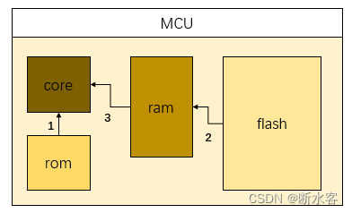
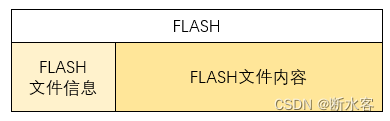
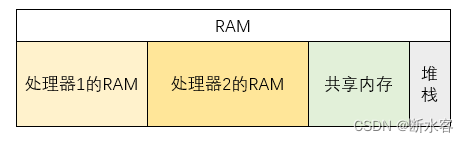
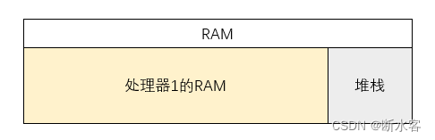
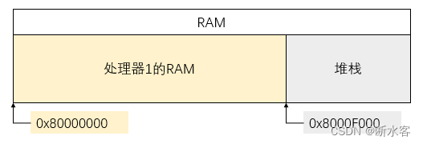
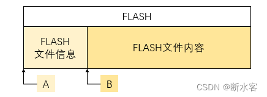

# Boot

[armv8 bootcode and ROM programming](https://blog.csdn.net/qq_33904382/article/details/127604903)


## Boot code 和 ROM 程序



MCU 包含 CORE（处理核）、ROM、RAM 和 FLASH 这几个组件。芯片上电以后，CORE 会从 ROM 固定地址读取程序，用以加载芯片使用者烧写到 FLASH 中的内容。这段存储在ROM中，芯片上电后首先执行的程序，就是我们说的 ROM 程序。



FLASH 的开头位置通常会放一些 FLASH 文件的信息，比如程序有多大，搬移到什么地方去，搬移完成后从哪里开始执行。这些问题都是我们在编写 ROM 程序时需要考虑的。

ROM 程序首先会读取 FLASH 的文件信息，确认搬移长度和目的地址，这个地址一般是RAM的起始地址。然后根据读取到的信息把 FLASH 文件搬移到 RAM 上。搬移完成后，芯片或者 MCU 的 RAM 中就有了我们烧写的应用程序。这时只要把 PC 修改到程序的起始地址，就可以让我们的应用程序在芯片上跑起来了。

所以芯片从 FLASH 启动的流程大致分步

1. 芯片上电，CORE 读取并执行 ROM 程序
2. 读取 FLASH 文件信息
3. 根据文件信息把 FLASH 文件中的应用程序搬移到 RAM 上
4. 跳转 PC 到 RAM 上应用程序的起始地址
5. 开始执行应用程序的第一条指令

## 如何设计ROM程序

### 1. 考虑片上资源使用方式

这里提到的片上资源主要指 RAM，它是我们搬移的目的地和执行程序的大本营。对于多核 SoC 而言，RAM 需要被划分成几个区域供给不同的处理器作 RAM 使用。同时还应当保留一些空间用作共享内存（用来做数据交换和核间通信）：



值得注意的是，咱们在RAM末尾预留了一部分空间用作堆栈，需要指定堆栈空间也是ROM程序和一般应用程序的不同之处。毕竟此时整片RAM都由我们规划，堆栈尽可能放到末尾能够方便我们划分其他空间的用途。

对于单核处理器而言，物理RAM的起始地址就可以是处理器的RAM空间起始地址，整片RAM的划分情况可以如下图所示，只有RAM和堆栈两个区域。为了方便叙述和读者理解，咱后面的设计都基于单核 SoC 这个前提。



比如假设某个MCU（比如STM32）有64K的RAM，就可以拿4K做堆栈，其余的60K用来放置应用程序。

有了大致的划分方案，就要开始做计算了：

```
假设RAM起始地址为 0x80000000,
64K = 0x10000, 60K = 0x0F000

所以，RAM的地址范围是 0x80000000 ~ 0x80010000,
其中，0x80000000 ~ 0x8000EFFF 用来存放程序，
0x8000F000 ~ 0x8000FFFF 用来当堆栈
```

做完计算就可以得到下面这个设计结果，指导我们明确三件事：
1. 应保证应用程序编译生成的大小不超过 60 KB
2. 上电复位后，应把堆栈指针寄存器初始值写为指向堆栈的最高地址 0x8000FFFC（四字节对齐）
3. ROM程序搬移 FLASH文件的目的地址和搬移完成后的跳转地址都是 0x80000000



### 2. 设计存储 FLASH 文件信息数据结构

要把一段代码从FLASH搬到RAM，至少得知道这段代码在FLASH的什么位置吧，所以代码存放的起始地址和结束地址就得记录在前一节提到的文件信息端里。

知道从哪里搬出来，还得知道搬到哪个地址去。不过因为这个地址通常是固定的（比如本文介绍的这个启动程序固定搬到RAM的起始地址 0x80000000去），所以就不用记录在FLASH文件信息段里了。

搬移完成后需要一个跳转地址，用于设置PC，所以这个地址也得记录在信息段里边。

综上所述，我们的FLASH文件信息数据结构可以设计成下面这样。

```C
typedef struct flash_info_seg{
	unsigned int program_file_offset;	//应用程序代码起始位置在flash里的偏移地址
	unsigned int ram_start_addr;		//搬移到ram时对应的起始地址
	unsigned int ram_end_addr;			//搬移到ram时对应的结束地址
	unsigned int pc_branch_addr;		//搬移完成后pc的跳转地址	
}flash_info_seg_def;
```

假如你这样设计FLASH文件信息数据结构的话，下图里【FLSAH文件信息】这个区域应该放着一个 `flash_info_seg_def`。相应的，由`flash_info_seg_def`的大小为 4*4Bytes = 16Bytes，所以【FLASH文件内容】这个区域的偏移地址B也就等于A+sizeof(flash_info_seg_def)，即 A + 16。



所以第一个参数 `program_file_offset` 应该赋值为 B。
`ram_start_addr` 和 `pc_branch_addr` 都应该赋值为 RAM 的起始地址 0x80000000。

第三个参数 `ram_end_addr` 的值跟你的应用程序的实际长度有关，假设你编译得到的二进制文件长度为 0x100,那么 `ram_end_addr` 就应该赋值为 `ram_end_addr` + 0x100。

### 3. 设计启动方式选择组件

这部分可能大伙感觉到很陌生，但是至少知道开发板上通常有那么几个用于选择启动方式的跳帽或者拨码开关。芯片上电以后我们需要首先用几句汇编读一下这些引脚的状态，选择启动方式。

比如假设只有两种启动方式 debug_boot 和 smcflash_boot，引脚的状态存储在 0x90000000 这个地址上，可以用下面的汇编程序实现启动模式的选择。

```
/* choose boot method option */
option_jump:
	/* read boot mode pins status */
	LDR r0, #0x90000000
	LDR r1, [r0]
	MOV r2, #0x1
	AND r2, r2, r0
	CMP	r2, #0
	BEQ	debug_boot
	B	smcflash_boot
```

首先把 0x90000000 这个地址上的值读到通用寄存器r1中，
```
LDR r0, #0x90000000
LDR r1, [r0]
```
然后把读出来的值和 0x1 做与运算，结果存到r2中，
```
MOV r2, #0x1
AND r2, r2, r0
```
如果值是0，就选择debug启动模式，否则选择smcflash启动模式
```
CMP r2, r0
BEQ debug_boot
B   smcflash_boot
```

### 4. 考虑核间通信

本文讨论的是单核处理器的启动程序，但设计方式也适用于多核处理器的启动。多核处理器启动时可能会遇到FLASH不能被多核读取的问题，也就要考虑多核的启动顺序。

参考 [多核异构](https://blog.csdn.net/qq_33904382/article/details/125826701?spm=1001.2014.3001.5501)

## 4 什么是 Boot Code

可能你已经发现，前面咱们一直在讨论如何启动，但没有涉及硬件初始化的内容。所以这里说的 Boot Code，特指芯片启动时堆芯片进行初始化的代码。

这部分代码要做的工作包括以下这些：

- 异常初始化
- 寄存器初始化
- 配置 MMU 和 Cache
- 是能 NEON和浮点加速器
- 切换异常处理级别

## 5 Boot Code for  AArch64 mode

### 5.1 Initializing exceptions

Exception initialization requires:

- Setting up the vector table
- Asynchronous exception routing and masking configuraions.

#### 5.1.1 Setting up a vector table

In AArch64, a reset vector is no longer part of the exception vector table. There are dedicated configure input pins and registers for reset vector. Other exception vectors are stored in the vector table.

##### Reset vector

In AArch64, the processor starts execution from an IMPLEMENTATION-DEFINED address, which is defined by the hardware input pins RVBARADDR and can be read by the RVBAR_EL3 register. You must place boot code at this address.

vector table

There are dedicated vector tables for each exception level:

- VBAR_EL3
- VBAR_EL2
- VBAR_EL1

The vector table in AArch64 is different from that in AArch32. The vector table in AArch64 mode contains 16 entries. Each entry is 128B in size and contains at most 32 instructions. Vector tables must be placed at a 2KB-aligned address. The addresses are specified by initializing VBAR_ELn registers.

For more datails about the vector table, see the section `Exception vectors`, in the ARM Architecture Reference Manual ARMv8, for ARMv8-A architecture profile.

The following figure shows you how the vector table is structured.

##### 5.2 Enabling asynchronous exceptions

Asynchronous exceptions including SError, IRQ and FIQ. They are default masked after reset. Therefore, if SError, IRQ and FIQ are to be taken, the routing rules must be set and mask must be cleared.

To enable interrupts, you must also initialize the external interrupt to deliver the interrupt to the processor, but it is not covered in this document.

Asynchronous exception routing determine which Exception level is used to handle an asynchronous exception.

To route an asynchronous exception EL3, you must set SCR_EL3.{EA,IRQ,FIQ}

To route an synchronous exception EL2 rather than EL3, you must set HCR_EL2.{AMO,FMO,IMO} and clear SCR_EL3.{EA,IRQ,FIQ}.

If an interrupt is not routed to EL3 or EL2, it is routed to EL1 by default.

Asynchronous exception mask

Whether an asynchronous exception is masked depends on the following factors:

- The target Exception level to which the interrupt is routed.
- The PSTATE.{A,I,F} value.

When a target Exception level is lower than the current Exception level, the asynchronous exception is masked implicitly, regardless of the PSTATE.{A,I,F} value.

When a target Exception level is same as the current Exception level, the asynchronous exception is masked if PSTATE.{A,I,F} is 1.

When a target Exception level is higher than the current Exception level and the target Exception level is EL2 or EL3, the asynchronous exception is taken, regardless of the PSTATE.{A,I,F} value.

When a target Exception level is higher than the current Exception level and the target Exception level is EL1, the asynchronous exception is masked if PSTATE.{A,I,F} is 1.

### 5.2 Initializing registers

Register initialization involves initializing the following registers:

- Gerneral-purpose registers.
- Stack pointer registers.
- System control registers.

#### Initializing general puerpose registers

ARM processors use some non-reset flip-flops. This can cause X-propagation issues in simulations. Register initialization helps reduce the possibility of the issue.

#### Initializing stack pointer registers

The stack pointer register is implicitly used in some instructions, for example, push and pop. You must initialize it with a proper value before using it.

In an MPCore system, different stack pointers must point to different memory addresses to avoid overwriting the stack area. If SPs in different Exception levels are used, you must initialize all of them.

#### Initializing system control registers

Some system control registers do not have architectural reset values. Therefore, you must initialize the registers based on your software requirements before using them.

### 5.3 Configuring the MMU and caches

The MMU and cache configuration involves the following operations:

- Cleaning and invalidating caches
- Setting up the MMU
- Enabling the MMU and caches

#### Cleaning and invalidating caches

The content in cache RAM is invalid after reset. ARMv8-A processors implement hardware that automatically invalidates all cache RAMs after reset, so software invalidation is unnecessary after reset. However, cleaning and invalidating data cache is still necessary in some situations, such as the core powerdown process.

#### Setting up the MMU

ARMv8-A processors use VMSAv8-64 to perform the following operations at AArch64:

- Translate physical address to virtual address.
- Determine memory attributes and check access permission.

Address translation is defined by a translation table and managed by the MMU. Each Exception level has a dedicated translation page table. The translation tables must be set up before enabling the MMU.

VMSAv8-64 uses 64-bit descriptor format entries in the translation tables. It supports

- Up to 48-bit input and output addresses.
- Three granule sizes: 4KB, 16KB, 64KB.
- Address lookup of up to four levels.

#### Enableing the MMU and caches

You must initialize the MMU and caches before enabling them. All ARMv8-A processors require the SMPEN bit to be set before enabling the MMU and cache to support hardware coherency.


### 5.4 Enabling NEON and Floating Point

In AArach64, you do not need to enable access to the NEON and FP registers. However, access to the NEON and FP registers can still be trapped.

### 5.5 Changing Exception levels

The ARMv8-A architecture introduce four Exception levels.

- EL0
- EL1
- EL2
- EL3

Sometimes, you must change between these Exception levels in test cases. Processors change Exception levels when an exception is taken or returned.

#### AArch64 EL3 to AArch64 EL0

#### AArch64 EL2 to AArch32 EL1