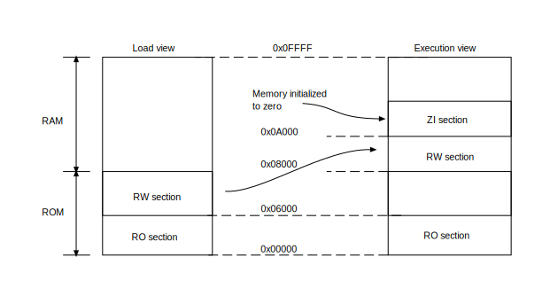

# Arm Compiler for Embedded Reference Guide

[Arm compiler for Embedded Reference Guide](https://developer.arm.com/documentation/101754/0622)

## Overview

## armclang Reference

## armlink Reference

### armlink Command-line Options

### Linking Models Supported by armlink

### Image Structure and Gerneration

#### The structure of an Arm ELF image

An Arm ELF image contains sections,regions,and segments, and each link stage has a different view of the image.

The structure of an image is defined by the:

- Number of its constituent regions and output sections.
- Positions in memory of these regions and sections when the image is loaded.
- Positions in memory of these regions and sections when the image executes.

##### Views of the image at each link stage

Each link stage has a different view of the image.

The image views are:

*ELF object file view (linker input)*

The ELF object file view comprises input sections. The ELF object file can be:

- A relocatable file that holds code and data suitable for linking with other object files to create an executable or a shared object file.
- A shared object file that holds code and data.

*Linker view*

The linker has two views for the address space of a program that become distinct in the presence of overlaid, position independent,and relocateable program fragments(code or data):

- The load address of a program fragment is the target address that the linker expects an external agent such as a program loader, dynamic linker, or debugger to copy the fragment from the ELF file. This might no be the address at which the fragment executes.
- The execution address of a program is the target address where the linker expects the fragment to reside whenever it participates in the execution of the program.

If a fragment is position independent or relocatable, its execution address can vary during execution.

*ELF image file view (linker output)*

The ELF image file view comprises program segments and output sections:

- A load region corresponds to a program segment.
- An execution region contains one or more of the following output sections:
    - RO section
    - RW section
    - XO section
    - ZI section

One or more execution regions make up a load region.

When describing a memory view:

- The term root region means a region that has the same load and execution addresses.
- Load regions are equivalent to ELF segments.

The following figure shows the relationship between the views at each link stage:

Figure 1. Relationship between sections, regions and segments

##### Input sections, output section, regions, and program segments

An object or image file is constructed from a hierarchy of input sections, output sections, regions, and program segments.

*Input section*

An input section is an individual section from an input object file. It contains code, initialized data, or describes a fragment of memory that is not initialized or that must be set to zero before the image can execute. These properties are reprensented by attributes such as RO,RW,XO and ZI. These attributes are used by `armlink` to group input sections into bigger building blocks called output section and regions.

*Output section*

An output section is a group of input sections that have the same RO,RW,XO,or ZI attribute,and that are placed contiguously in memory by the linker. An output section has the same attributes as its consituent input sections. Within an output section, the input sections are sorted according to the section placement rules.

*Region*

A region contains up to three output sections depending on the contents and the number of sections with different attributes. By default, the output sections in a region are sorted according to their attributes:

- If no XO output sections are present, then the RO output section is placed first, followed by the RW output section, and finally the ZI output section.
- If all code in the execution region is execute-only, then an XO output section is placed first, followed by the RW output section, and finally the ZI output section.

A region typically maps onto a physical memory device, such as ROM, RAM, or peripheral. You can change the order of output sections using scatter-loading.

*Program segment*

A program segment corresponds to a load region and contains execution regions. Program segments hold information such as text and data.

With armlink, the maximum size of a program segment is 2GB.
XO memory is supported only for ARMv6-M,ARMv7-M,ARMv8-M architecture.

Considerrations when execute-only sections are present

Be aware of the following when eXecute-only (XO) sections are present:

- You can mix XO and non-XO sections in the same execution region. In this case, the XO section loses it XO property and results in the output of a RO section.
- If an input file has one or more XO sections then the linker generates a separate XO execution region if the XO and RO sections are in distinct regions. In the final image, the XO execution region immediately precedes the RO execution region, unless otherwise specified by a scatter file or the `--xo_base` option.

The linker automatically fabricates a separate ER_XO execution region for XO sections when all the following are true:

- You do not specify the `--xo_base` option or a scatter file.
- The input files contain at least one XO section.

##### Load view and execution view of an image

Image regions are placed in the system memory map at load time. The location of the regions in memory might change during execution.

Before you can execute the image, you might have to move some of its region to their execution addresses and create the ZI output sections. For example, initialized RW data might have to be copied from its load address in ROM to its execution address in RAM.

The memory map of an image has the following distinct views:

*Load view*

Describes each image region and section in terms of the address where it is located when the image is loaded into memory, that is, the location before image execution starts.

*Load view*

Describes each image region and section in terms of the address where it is located during image execution.

The following figure shows these views for an image without an XO section

The following figure shows load and execution views for an image with an XO section:

Note: XO memory is supported only for Arm®v6-M, Armv7-M, and Armv8-M architectures. However, XO is not supported on Armv6-M for any form of position independent code.

The following table compares the load and execution views:

|Load|Description|Execution|Description|
|-|-|-|-|
|Load address|The address where a section or region is loaded into memory before the image containing it starts executing. The load address of a section or a non-root region can differ from its execution address.|Exection address|The address where a section or region is located while the image containing it is being executed.|
|Load region|A load region describes the layout of a contiguous chunk of memory in load address space.|Execution region|An execution region describes the layout of a contiguous chunk of memory in execution address space.|

##### Methods of specifying an image memory map with the linker

An image can consist of any number of regions and output sections. Regions can have different load and exection addresses.

When constructing the memory map of an image, `armlink` must have information about:

- How input sections are grouped into output sections and regions
- Where regions are to be located in the memory map.

Depending on the complexity of the memory map of the image, there are two ways to pass this information to `armlink`:

Command-line options for simple memory map descriptions

You can use the following options for simple cases where an image has only one or two load regions and up to three execution regions:

- --first
- --last
- --ro_base
- --rosplit
- --rw_base
- --split
- --xo_base
- --zi_base

*Scatter file for complex memory map descriptions*

A scatter file is textual description of the memory layout and code and data placement. It is used for more complex cases where you require complete control over the grouping and placement of image components.

#### Image entry points

An entry point in an image is the location that is loaded into the PC. It is the location where program execution starts. Although there can be more than one entry point in an image, you can specify only one when linking.

Not every ELF file has to have an entry point. Multiple entry points in a single ELF file are note permitted.

##### Types of entry point

There are two distinct types of entry point:

*Initial entry point*

    The initial entry point for an image is a single value that is stored in the ELF header file. It is the entry point where execution begins. For programs loaded into RAM by an operating system or boot loader, the loader starts the image execution by transferring control to the initial entry point in the image.

    You can select one of many possible entry points for an image. An image can have only one initial entry point. The initial entry point can be, but is not required to be, one of the entry points set by the `ENTRY` directive for `armasm` legacy assembler.

    Typically, the initial entry point is identified by `__main`. In C or C++, this initial entry point is the main() function. In GNU syntax assembler, you can identify this initial entry point with `.global main`. When `armlink` detects this inital entry point, it automatically includes the `__main` startup code from the C library, and sets that as the initial entry point.

    For C and C++ code, the `__main()` function in the C library is also an entry point, and is typically th initial entry point for an image.

    ##### Why have multiple entry points

    An entry point in an object file informs the linker that the location is expected to be referenced by an external entity. Therefore, the linker knows not to remove the section for that entry point when performing unused section elimination.

    If you have multiple entry points, and none of them are `__main`, then you must use the `armlink` option `--entry=<location>` to specify the initial entry point for the image.