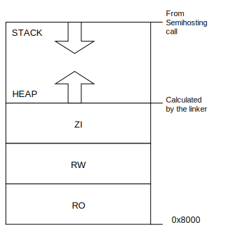
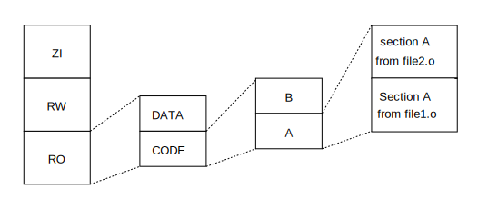

# Arm Compiler for Embedded User Guide

[Arm Compiler for Embedded User Guide -- Introduction](https://developer.arm.com/documentation/100748/0622/Introduction)

## Getting Started

## Using Common Compiler Options

## Writing Optimized Code

## Assembling Assembly Code

## Using Assembly and Intrinsics in C or C++ Code

## SVE Coding Considerations with Arm Compiler for Embedded 6

## Alignment support in Arm Compiler for Embedded 6

## Building for different target architectures

## Mapping Code and Data to the Target

## Overlay support in Arm Compiler for Embedded 6

## Embedded Software Development

### Default compilation tool behavior

It is useful to be aware of the default behavior of the compilation tools if you do not yet know the full technical specifications of the target hardware.

For example, when you start work on software for an embedded application, you might not know the details of target peripheral devices, the memory map, or even the processor itself.

To enable you to proceed with software development before such details are known, the compilation tools have a default behavior that enables you to start building and debugging application code immediately.

### Default memory map

In an image where you have not described the memory map, the linker places code and data according to a default memory map.

Figure 1. Default memory map

The default memory map is described as follow:

- The image is linked to load and run at address `0x8000`. All read-only (RO) sections are placed first, followed by read/write (RW) sections, then zero-initialize (ZI) sections.
- The heap follows directly on from the top of ZI, so the exact location is decided at link time.
- The stack base location is provided by semihosting operation during application startup. The value that this semihosting operation returns depends on the debug environment.
  
Then linker observes a set of rules to decide where in memory code and data are located:

Figure 2. Linker placement rules

Generally, the linker sorts the Input sections by attribute (RO,RW,ZI), by name, and then by position in the input list.

To fully control the placement of code and data, you must use the scatter-loading mechanism.