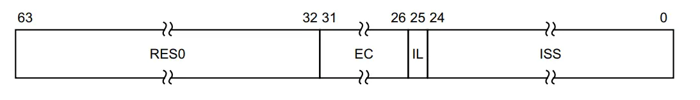

# Exception Handle

https://zhuanlan.zhihu.com/p/578252899

## 异常处理的基本概念

## 异常的处理与返回

## 异常向量表

## 异常现场

在异常发生时需要保存发生异常的现场 (异常现场也称异常上下文)，以免破坏了异常发生前正在处理的数据和程序状态。ARM64中，栈框就是用来保存异常上下文的。

栈框：Linux 内核中定义了一个 `struct pt_regs` 的数据结构来描述内核栈上保存寄存器的排列信息，通常用来保存中断上下文信息等。

常见的保存内容有：

- PSTATE 寄存器的值
- PC 值
- SP 值
- 通用寄存器 X0-X30 的值

## 同步异常的解析

ARMv8 体系结构中有一个与访问相关的寄存器

- 异常综合信息寄存器 (Exception Syndrome Register, ESR)

ESR_ELx 一共包含4个字段。

- Bit[63:32] 保留位
- Bit[31:26] 异常类 Exception Class,指示发生的异常分类，同时用来所以 ISS 字段
- Bit[25] 同步异常的指令长度 (Instruction Length)
- Bit[24:0] 指令综合编码信息，依赖异常类型 EC

 