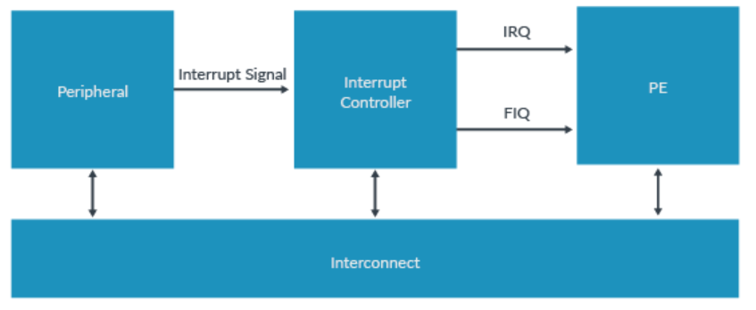

# GIC

[overview](https://developer.arm.com/documentation/198123/0302/Overview)

## Overview

This guide covers the basic operation of the GICv3 and v4 and the use of Shared Peripheral Interrupt (SPIs), Private Peripheral Interrupt (PPIs), and Software Generated Interrupts (SGIs).

An interrupt is a signal to the processor that an event has occurred which needs to be dealt with. Interrupts are typically generated by peripherals.

For example, a system might use a Universal Asynchronous Receiver/Transmitter (UART) interface to communicate with the outside world. When the UART receives data, it needs a mechanism to be able to tell the processor that new data has arrived and is ready to be processed. One mechanism that a UART could use is to generate an interrupt to signal the processor.

Small systems might have only a few interrupt sources and a single processor. However, larger systems might have many more potential interrupt sources and processors. The GIC performs the critical tasks of interrupt management, prioritization, and routing. The GIC marshals all interrupts from across the system, prioritizes them, and sends them to a core to be dealt with. GICs are primarily used to boost processor efficiency and to enable interrupt virtualization.

GICs are implemented based on the Arm GIC architecture. This architecture has evolved from GICv1 to the latest versions GICv3 and GICv4. Arm has several generic interrupt controllers that provide a range of interrupt management solutions for all types of Arm Cortex multiprocessor systems. These controllers range from the simplest GIC-400 for systems with small CPU cores counts to GIC-600 for high-performant and multi-chip systems. GIC-600AE adds additional safety features targeting high performant ASIL B to ASIL D systems.

## What is a Generic Interrupt Controller?

A Generic Interrupt Controller (GIC) takes interrupts from peripherals, prioritizes them, and delivers them to the appropriate processor core. The following diagram shows a GIC taking interrupts from n different peripherals, and distributing them to two defferent processors.

The GIC is the standard interrupt controller for Arm Cortex-A and Arm Cortex-R profile processors. The GIC provides a flexible and scalable approach to interrupt management, supporting systems with a single core to large multi-chip designs with hundreds of cores.

## Arm GIC fundamentals

### Interrupt types

The GIC can deal with four different types of interrupt sources:

- Shared Peripheral Interrupt(SPI). Periperal interrupts that can be delivered to any connected core.
- Private Peripheral Interrupt(PPI).Peripheral interrupts that are private to one core. An example of a PPI is an interrupt from the Generic Timer.
- Software Generated Interrupt(SGI). SGIs are typically used for inter-processor communication and are generated by a write to an SGI register in the GIC.
- Locality-specific Peripheral Interrupt(LPI). LPIs were firt introduced in GICv3 and have very different programing model to the other three types of interrupt. The configuration of LPIs is covered in the Arm CorLink Generic Interrupt Controller v3 and v4: Locality-specific Peripheral interrupt guide.

Each interrupt source is identified by an ID number, which is referred to as an INTID. The interrupt types that are introduced in the preceding list are defined in terms of ranges of INTIDs.

|INTID|Interrupt Type|Notes|
|-|-|-|
|0-15|SGIs|Banked per PE|
|16-31|PPIs|Banked per PE|
|32-1019   4096-5119 (GIC3.1)|SPIs|-|
|1020-1023|Special interrupt number|Used to signal special cases, see Settings for each PE for more information|
|1024-8191|Reserved|-|
|8192 and greater|LPIs|The upper boundary is IMPLEMENTATION DEFINED|

### How interrupts are signaled to the interrupt controller

Traditionally, interrupt are signaled from a peripheral to the interrupt controller using a dedicated hardware signal, as shown in the following image:

Arm CoreLink GICv3 supports this model, but also provides an additional signaling mechanism: message-signaled interrupts (MSI). MSIs are transmitted by a write to a register in the interrupt controller, as you can see here:

Using a message to forward the interrupt from a peripheral to the interrupt controller removes the requirement for a dedicated signal for each interrupt source. This can be an advantage for designers of large systems, where potentially hundreds or even thousands of signals might be routed across an SoC and converge on the interrupt controller.

Whether an interrupt is sent as a message or using a dedicated signal has little effect on the way that the interrupt handling code handles the interrupt. Some configuration of the peripherals might be required. For example, it might be necessary to specify the address of the interrupt controller. This peripheral configuration is beyond of the scope of this guide.

In Arm CoreLink GICv3, SPIs can be message-signaled interrupts. LPIs are always message-signaled interrupts. Different registers are used for the different interrupt types, as shown in the following table:

|Interrupt Type|Registers|
|SPI|`GICD_SETSPI_NSR` asserts an interrupt|
|LPI|`GITS_TRANSLATER`|

### Interrupt state machine

The interrupt controller maintains a state machine for each SPI,PPI,and SGI interrupt source. This state machine consists of four states:

- Inactive. The interrupt source is not currently asserted.
- Pending. The interrupt source has been asserted, but the interrupt has not yet been acknowledged by a PE.
- Active. The interrupt source has been asserted, and the interrupt has been acknowledged by a PE.
- Active and Pending. An instance of the interrupt has been acknowledged,and another instance is now pending.

The state machine is shown in the following diagram:

The life cycle of an interrupt depends on whether it is configured to be level-sensitive or edge-triggered:

- For level-sensitive interrupts, a rising edge on the interrupt input causes the interrupt to become pending, and the interrupt is held asserted until the peripheral de-asserts the interrupt signal.
- For edge-sensitive interrupts, a rising edge on the interrupt input causes the interrupt to become pending, but the interrupt is not held asserted.

### Level sensitive interrupt

The following diagram shows how the interrupt state transitions correspond to the interrupt signal:

Considering each state transition in turn:

- Inactive to pending. An interrupt transitions from inactive to pending when the interrupt source is asserted. At this point the GIC asserts the interrupt signal to the PE, if the interrupt is enabled and is of sufficient priority.
- Pending to active and pending. An interrupt transitions from pending to active and pending when a Processor Element (PE) acknowledges the interrupt by reading one of the interrupt Acknowledge Register(IARs). This read is typically part of an interrupt handing routine that execute after an interrupt exception is taken. At this point the GIC de-asserts the interrupt to the PE.
- Active and pending to active. An interrupt transitions from active and pending to active when the peripheral de-asserts the interrupt signal. This typically happens in response software writing to a status register in the peripherals.
- Active to inactive. An interrupt goes from active to inactive when the PE writes to one of the End of interrupt registers (EOIRs) in the CPU interface. This indicates that the PE has finished handling the interrupt.

### Edge-trigger interrupts

- Inactive to pending. An interrupt transitions from inactive to pending when the interrupt source is asserted. At this point the GIC asserts the interrupt signal to the PE, if the interrupt is enabled and is of sufficient priority.
- Pending to active. An interrupt transitions from pending to active when a PE acknowledges the interrupt by reading one of the IARs in the CPU interface. This read is typically part of an interrupt handling routine that executes after an interrupt exception is taken. However, software can also poll the IARs. At this point the GIC de-asserts the interrupt signal to the PE.
- Active to active and pending. An interrupt goes from active to active and pending if the peripheral re-asserts the interrupt signal.
- Active and pending to pending. An interrupt goes from active and pending to pending when the PE writes to one of the EOIRs in the CPU interface. This indicates that the PE has finished handling the first instance of the interrupt. At this point the GIC re-asserts the interrupt signal to the PE.

### Target interrupts

The Arm architecture assigns each PE a hierachal identifier that is called an affinity. The GIC uses affinity values to target interrupts at a specific core.

An affinity is a 32-bit value that is split into four fields:

`<affinity level 3>.<affinity level 2>.<affinity level 1>.<affinity level 0>`

The affinity of a PE is reported in `MPIDR_EL1`.

The exact meaning of the different levels of affinity is defined by the processor and SoC. For example, Arm Cortex-A53 and Arm Cortex-A57 processors use:

`<group of groups>.<group of processors>.<processor>.<core>`

Later designs, like those used in Arm Cortex-A55 and Arm Cortex-A76 processors, use:

`<group of processors>.<processor>.<core>.<thread>`

### Security model

The Arm GICv3 architecture supports Arm TrustZone technology. Each INTD must be assigned a group and security setting by software. GICv3 supports three combinations of settings, as you can see in the following table:

|Interrupt Type|Example use|
|-|-|
|Secure Group 0|Interrupts for EL3 (Secure Firmware)|
|Secure Group 1|Interrupts for EL1(Trusted OS)|
|Non-secure Group 1|Interrupts for the Non-secure state(OS or Hypervisor)|

Group 0 interrupts are always signaled as FIQs. Group 1 interrupts are signaled as either IRQ or FIQ, depending on the current Security state and Exception level of the PE, as you can see here:

|EL and Security state of PE|Group 0|Group 1|Group 1|
|-|-|-|-|
|||Secure|Non-secure|
|secure EL0/1|FIQ|IRQ|FIQ|
|non secure EL0/1/2|FIQ|FIQ|IRQ|
|EL3|FIQ|FIQ|FIQ|

These rules are designed to complement the AArch64 security state and Exception level routing controls. The following diagram shows a simplified software stack, and what happens when different types of interrupt are signaled while executing at EL0:

### Impact on software

Software controls the allocation of INTIDs to interrupt groups when configuring the interrupt controller. Only software executing in Secure state can allocate INTIDs to interrupt groups. Typically, only software executing in Secure state should be able to access the settings and state of Secure interrupts: Group 0 and Secure Group 1.

Accesses from Non-secure state to Secure interrupt settings and state can be enabled. This is controlled individually for each INTID, using the `GICD_NSACRn` and `GICD_NSACR` registers.

### Support for single Security state

GICv3 supports the Arm TrustZone technology, but the use of TrustZone is OPTIONAL. This means that you can configure your implementation to have either a single Security state or two Security states:

- `GICD_CTLR.DS == 0` Two Security states,Secure and Non-secure, are supported.
- `GICD_CTLR.DS == 1` Only a single Security state is supported.

Configure the GIC to use the same number of Security states as the attached PEs. Typically, this means that the GIC will support two Security states when connected to Arm Cortex-A profile processors and one Security state when connected to Arm Cortex-R profile processors.

### Programmer's model

The register interface of a GICv3 interrupt controller is split into three groups:

- Distributor interface
- Redistributor interface
- CPU interface

These interfaces are illustrated in the following diagram:

In general, the Distributor and the Redistributors are used to configure interrupts, and the CPU interface is used to handle interrupts.

#### Distributor

The Distributor registers are memory-mapped and used to configure SPIs. The Distributor provides a programming interface for:

- interrupt prioritization and distribution of SPIs
- Enable and disable SPIs
- Set the priority level of each SPI
- Route information for each SPI
- Set each SPI to be level sensitive or edge-triggered
- Generate message-signaled SPIs
- Control the active and pending state of SPIs
- Determine the programmer's model that is used in each Security state: affinity routing or legacy

#### Redistributors

There is one redistributor per connected core. The Redistributors provide a programming interface to:

- Enable and disable SGIs and PPIs
- Set the priority level of SGIs and PPIs
- Set each PPI to be level-sensitive or edge-triggered
- Assign each SGI and PPI to an interrupt group
- Control the state of SGIs and PPIs
- Control the base address for the data structures in memory that support the associated interrupt properties and pending state for LPIs
- Provide power management support for the connected PE

#### CPU interfaces

Each core contains a CPU interface, which are system registers that are used during interrupt handling. The CPU interfaces provide a programming interface to:

- Provide general control and configuration to enable interrupt handling
- Acknowledge an interrupt
- Perform a priority drop and deactivation of interrupts
- Set an interrupt priority mask for the PE
- Define the preemption policy for the PE
- Determine the highest priority pending interrupt for the PE

In Arm Corelink GICv3, the CPU interface registers are accessed as System registers: `ICC_*_ELn`

Software must enable the System register interface before using these registers. This is controlled by the SRE bit in the ICC_SRE_ELn registers, where n specifies the Exception level: EL1-EL3.

## Configuring the Arm GIC

This section of the guide describes how to enable and configure a GICv3-compliant interrupt controller in a bare metal environment.

The configuration of Locality-specific Peripheral Interrupts (LPIs) is significantly different to the configuration of Shared Peripheral Interrupts (SPIs), Private Peripheral Interrupt (PPIs), and Software Generated Interrupts (SGIs), and is beyond the scope of this guide. To learn more, refer to our guide Arm CoreLink Generic Interrupt Controller v3 and v4: Locality-specific Peripheral Interrupts.

Most systems that use a GICv3 interrupt controller are multi-core systems, and possibly also multi-processor systems. Some settings are global, which means that affect all the connected PEs. Other settings are particular to a single PE.

### Global settings

The Distributor control register(GICD_CTLR) must be configured to enable the interrupt groups and to set the routing mode as follows:

- `Enable Affinity routing (ARE bits)`: The ARE bits `GICD_CTLR` control whether the GIC is operating in GICv3 mode or legacy mode. Legacy mode provides backwards compatibility with GICv2. This guide assumes that the ARE bits are set to 1, so that GICv3 mode is being used.
- Enables `GICD-CTLR` contains separate enable bits for Group 0, Secure Group1 and Non-secure Group1:
  - `EnableGrp1S` enables ditribution of Secure Group 1 interrupts
  - `EnableGrp1NS` enables distribution of Non-secure Group 1 interrupts
  - `EnableGrp0` enables distribution of Group 0 interrupts

### Settings for each PE

### Redistributor configuration

Each core has its own Redistributor, as shown here:

The redistributor contains a register called `GICR_WAKER` which is used to record whether the connected PE is online or offline. Interrupt are only forwarded to a PE that the GIC believes is online. At reset, all PEs are treated as being offline.

To mark the connected PE as being online, software must:

- Clear `GICR_WAKER.ProcessorSleep` to `0`.
- Poll `GICR_WAKER.ChildrenAsleep` until it reads `0`.

It is important that software performs these steps before configuring the CPU interface, otherwise behavior can be UNPREDICTABLE.

While the PE is offline (`GICR_WAKER.ProcessorSleep`==1), an interrupt that is targeting the PE will result in a wake-request signal being asserted. Typically, this signal will go to the power controller of the system. The power controller then turns on the PE. On waking, software on that PE would clear the ProcessorSleep bit, allowing the interrupt that woke the PE to be forwarded.

### CPU interface configuration

The CPU interface is responsible for delivering interrupt exceptions to the PE to which it is connected. To enable the CPU interface, software must configure the following:

- Enable System register access.
  - The CPU interfaces(`ICC_*ELn`) section describes the CPU interface registers, and how they are accessed as system registers in GICv3. Software must enable access to the CPU interface registers, by setting the SRE bit in the `ICC_SRE_ELn` registers.
- Set Priority Mask and Binary Point registers
- Set EOI mode
- Enable signaling of each interrupt group

### PE configuration

Some configuration of the PE is also required to allow it to receive and handle interrupts. A detailed description of this is outside of the scope of this guide. In this guide, we will describe the basic steps that are required for an Armv8-A compliant PE executing in AArch64 state.

- Routing controls
  - The routing controls for interrupts are in `SCR_EL3` and `HCR_EL2` of the PE. The routing controls bits determine the Exception level to which an interrupt is taken. The routing bits in these registers have an UNKNOWN value at reset, so they must be initialized by software.
- Interrupt masks
  - The PE also has exception mask bits in `PSTATE`. When these bits are set, interrupt are masked. These bits are set at reset.
- Vector table
  - The location of the vector tables of PE is set by the `VBAR_ELn` registers. Like with `SCR_EL3` and `HCR_EL2`, `VBAR_ELn` registers have an UNKNOWN value at reset. Software must set the `VBAR_ELn` registers to point to the appropriate vector tables in memory.

### SPI, PPI and SGI configuration

So far, we have looked at configuring the interrupt controller itself. We will now discuss the configuration of the individual interrupt sources.

Which registers are used to configure an interrupt depends on the type of interrupt:

- SPIs are configured through the Distributor, using the `GICD_*` registers.
- PPIs and SGIs are configured through the individual Redistributors, using the `GICR_*` registers.

These different configuration mechanisms are illustrated in the following diagram:

Fo each INTID, software must configure the following:

- Priority: `GICD_IPRIORITYn`,`GICR_IPRIORITYn`
  - Each INTID has an associated priority, represented as an 8-bit unsigned value. `0x00` is the highest possible priority, and `0xFF` is the lowest possible priority. Running priority and preemption describes how the priority value in `GICD_IPRIORITYn` and `GICR_IPRIORITYn` masks low priority interrupts, and how it controls preemption. An interrupt controller is not required to implement all 8 priority bits. A minimum of 5 bits must be implemented if the GIC supports two Security states. A minimum of 4 bits must be implemented if the GIC support only a single Security state.
- Group: `GICD_IGROUPn`, `GICD_IGROUPMODn`, `GICR_IGROUPn`,`GICR_IGRPMODn`
  - As described in Security model, an interrupt can be configured to belong to one of the three interrupt gourps. These interrupt groups are Group 0, Secure Group 1 and Non-secure Group 1.
- Edge-triggered or level-sensitive: `GICD_ICFGRn`, `GICR_ICFGRn`
  - For PPIs and SPI, the software must specify whether the interrupt is edge-trigger or level-sensitive. SGIs are always treated as edge-triggered, and therefore GICR_ICFGR0 behaves as Read-As-One, Writes Ignored (RAO/WI) for these interrupts.
- Enable: `GICD_ISENABLERn`, `GICD_ICENABLER`,`GICR_ISENABLERn`,`GICR_ICENABLERn`
  - Each INTID has an enable bit. Set-enable registers and Clear-enable registers remove the requirement to perform read-modify-write routines. Arm recommands that the settings outlined in this section are configured before enabling the INTID.
- Non-maskable: Interrupts configured as non-maskable are treated as higher priority than all other interrupts belonging to the same Group. That is, a non-maskable Non-secure Gourp 1 interrupt is treated as higher priority than all other Non-secure Group 1 interrupts.
  - The non-maskable property is added in GICv3.3 and requires matching support in the PE.
  - Only Secure Group 1 and Non-secure Group 1 interrupts can be marked as non-maskable.

For a bare metal environment, it is often unnecesary to change settings after initial configuration. However, if an interrupt must be configured, for example to change the Group setting, you should first disable the interrupt before changing its configuration.

### Arm GICv3.1 and the extended INTID ranges

### Setting the target PE for SPIs

For SPIs, the target of the interrupt must be configured. This is controlled by `GICD_IROUTERn` or `GICD_IROUTERnE` for the GICv3.1 extended SPIs. There is a `GICD_IROUTERn` register for each SPI, and the `Interrupt_Routing_Mode` bit controls the routing policy. The options are:

- `GICD_IROUTERn.Interrupt_Routing_Mode == 0`
  - The SPI is delivered to the PE A.B.C.D, which are the affinity co-ordinates specified in the register.
- `GICD_IROUTERn.Interrupt_Routing_Mode == 1`
  - The SPI can be delivered to any connected PE that is participating in distribution of the interrupt group. The Distributor, rather than software, selects the target PE. The target can therefore vary each time the interrupt is signaled. This type of routing is referred to as 1-to-N.

## Handling interrupts

### Routing a pending interrupt to a PE

The Interrupt state machine section describes how an interrupt transitions from the inactive to the pending state when the source of the interrupt is asserted. When an interrupt becomes pending, the interrupt controller decides whether to send the interrupt to one of the connected PEs on the following tests. These tests determine which PE, if any, to send the interrupt to:

- Check that the group associated with the interrupt is enabled.
  - The security model section described how each INTID is assigned to a Group: Group 0, or Non-secure Group 1. For each Group, there is a Group enable bit in both the Distributor and in each CPU interface.
  - The interrupt controller checks that the Group enable bit is set for the Group associated with the INTID for that interrupt.
  - An interrupt that is a member of a disabled Group cannot be signaled to a PE. These interrupts remain in the pending state until the group is enabled.
- Check that the interrupt is enabled.
  - Individually diabled interrupts can become pending but will not be forwarded to a PE.
- Check the routing controls to decide which PEs can receive the interrupt.
  - Which PEs can receive an interrupt depends on what type of interrupt is being sent:
  - For SPIs, routing is controlled by `GICD_IROUTERn`. An SPI can target one specific PE, or any one of the connected PEs.
  - For LPIs, the routing information comes from the ITS.
  - PPIs are specific to one PE and can only be handled by that PE.
  - For SGIs, the originating PE defines the list of target PEs.
- Check the interrupt priority and priority mask to decide which PEs are suitable to handle the interrupt.
  - Each PE has a Priority Mask register, `ICC_PMR_EL1`, in its CPU interface. This register sets the minimum priority that is required for an interrupt to be forwareded to that PE. Only interrupts with a higher priority than the mask are signaled to the PE.
- Check the running priority to decide which PEs are available to handle the interrupt.
  - Running Priority and preemption covers running priority, and how this affects preemption. If the PE is not already handling an interrupt, the running priority is the idle priority: `0xFF`. Only an interrupt with a higher priority than the running priority can preempt the current interrupt.

### Taking an interrupt

When entering the exception handler, software does not know which interrupt it has taken. The handler must read one of the Interrupt Acknowledege Register (IARs) to get the INTID of the interrupt.

There are two IARs:

|Register|Use|
|-|-|
|ICC_IAR0_EL1|Used to acknowledge Group 0 interrupts. Typically read in FIQ handlers|
|ICC_IAR1_EL1|Used to acknowledge Group 1 interrupts. Typically used in IRQ handlers|
|ICC_NMIAR1_EL1|Used to acknowledge non-maskable Group 1 interrupts (GICv3.3 only)|

Reading an IAR returns the INTID of the taken interrupt and advances the state machine of the interrupt. Typically, the IARs are read on entry to an interrupt handler. However, software is free to read the registers at any time.

Sometimes, the IAR cannot return a valid INTID. For example, software reads `ICC_IAR0_EL1`, acknowledge Group 0 interrupts, but the pending interrupt belongs to Group 1. In this case, the read returns one of the reserved INTIDs, as shown in the following table:

|ID|Meaning|Example scenario|
|-|-|-|
|1020|||
|1021|||
|1022|||
|1023|||

A read of an IAR that returns one of these reserved values does not acknowledge an interrupt, if one is present.

### Example of interrupt handling

The following diagram shows an example of a mobile system with a modem interrupt which signals an incoming phone call. This interrupt is intended to be handled by the Rich OS in the Non-secure state.

### Running priority and preemption

The Priority Mask register sets the minimum priority that an interrupt must have to be forwarded to the PE. The GICv3 architecture also has the concept of a running priority. When a PE acknowledges an interrupt, its running priority becomes the same as the priority of the interrupt. The running priority returns to its former value when the PE writes to one of the End of Interrupt (EOI) registers. The following diagram shows an example shows an example the running priority of a PE over time:

The current running priority is reported in the Running Priority register in the CPU interface `ICC_RPR_EL1`.

The concept of running priority is important when considering preemption. Preemption occurs when a high priority interrupt is signaled to a PE that is already handling a lower priority interrupt. Preemption introduces some additional complexity for software, but it can prevent a low priority interrupt from blocking the handling of a higher priority interrupt.

The following diagram shows what would happen if preemption was not allowed:

The high priority interrupt is blocked until the previously signaled low priority interrupt is taken. Now consider the same situation, but with preemption enabled:

When the higher priority interrupt becomes pending, it preempts the previously signaled low priority interrupt. The preceding diagram shows one level of preemption. However, it is possible to have multiple levels of preemption.

The Arm CoreLink GICv3 architecture allows software to control preemption by specifying the difference in priority required for preemption to occur. This is controlled through the Binary Point registers: `ICC_BPRn_EL1`.

The Binary Point registers split the priority into two fields, group priority and sub-priority, as you can see here:

For preemption, only the group priority bits are considered. The sub-priority bits are ignored.

For example, consider the following three interrupts:

- INTID A has priority `0x10`
- INTID B has priority `0x20`
- INTID C has priority `0x30`

in this example, we decided that:

- A can preempt B or C.
- B cannot preempt C, because B and C have similar priorities.

To achieve this, the split between Group and sub-priority could be set at N=4, as you can see here:

With this split, B and C have the same priority for the purpose of preemption. However, A still has a higher priority, which means that it can preempt either B or C.

The Binary Point registers only affect preemption, that is, whether an interrupt should be signaled while already handling a different interrupt. When choosing between pending interrupts, the Binary Point register are not used.

#### Notes

Preemption requires that the interrupt handler, or handlers,are written to support nesting. Details of how to write such an interrupt handler are outside of the scope of this guide.

### End of interrupt

Once the interrupt has been handled, software must inform the interrupt controller that the interrupt has been handled, so that the state machine can transition to the next state. The Arm CoreLink GICv3 architecture treats this as two tasks:

- Priority drop
  - This means dropping the running priority back to the value that it had before the interrupt was taken.
- Deactivation
  - This means updating the state machine of the interrupt that is currently being handled. Typically, this will be a transition from the Active state to the inactive state.

In the GICv3 architecture, priority drop and deactivation can happen together or separately. This is determined by the settings of `ICC_CTLR_ELn.EOImode`:

- `EOImode = 0`
  - A write to `ICC_EOIR0_EL1` for Group 0 interrupt, or `ICC_EOIR1_EL1` for Group 1 interrupts, performs both the priority drop and deactivation. This mode is often uesd for a simple bare metal environment.
- `EOImode = 1`
  - A write to `ICC_EOIR0_EL1` for Group 0 interrupt, or `ICC_EOIR1_EL1` for Group 1 interrupts results in a priority drop. A separate write to `ICC_DIR_EL1` is required for deactivation. This mode is often used for virtualization purposes.

Most software will use `EOIMode == 0`. `EOIMode ==1` is most often used by hypervisors.

### Checking the highest priority pending interrupt and running priority.

As their names suggest, the Highest Priority Pending interrupt registers, `ICC_HPPIR0_EL1` and `ICC_HPPIR1_EL1`, report the INTID of the highest priority pending interrupt of a PE. Running priority was introduced in Running priority and preemption, and is reported by the Running Priority register(`ICC_RPR_EL1`).

### Checking the state of individual INTIDs

The Distributor provides registers that indicate current state of each SPI. Similarly, the Redistributos provide registers that indicate the state of PPIs and SGIs for their connnected PEs.

These registers can also move an interrupt to a specific state. This can be useful, for example, for testing that the configuration is correct without requiring the peripheral to assert the interrupt.

There are separate registers to report the active state and the pending state. The following table lists the active state registers. The pending state registers have the same format:

|Register|Description|
|-|-|
|GICD_ISACTIVERn|Sets the active state for SPIs. One bit for each INTID.   Reads of a bit return the current state of the INTID:   - 1 - The INTID is active.    - 0 - The INTID is not active. Writing 1 to a bit activates the corresponding INTID.   Writing 0 to a bit has not effect.|
|GICD_ICACTIVERn| Clears the active state for SPIs.    On bit for each INTID.    Reads of a bit return the current state of the interrupt:    - 1 - The INTID is active.    - 2 - The INTID is not active.    Writing 1 to a bit activates the corresponding INTID.    Writing 0 to a bit has not effect.|
|GICR_ISACTIVERn|Sets the active state for SGIs and PPIs.    One bit for each INTID.    This register covers INTIDs 0 to 31, which are private to each PE.    Reads of a bit return the current state of the interrupt:    - 1 -  The INTID is active.    - 0 - The INTID is not active. Writing 1 to a bit activates the corresponding INTID.    Writing 0 to a bit has not effect.|
|GICR_ICACTIVERn|Clears the active state for SGIs and PPIs.    One bit for each INTID.   This register covers INTIDs 0 to 31, which are private to each PE.   Reads of a bit return the current state of the interrupt:    - 1 - The INTID is active.    - 0 - The INTID is not active. Writing 1 to a bit activates the corresponding INTID.    Writing 0 to a bit has not effect.|

## Sending and receiving Software Generated Interrupts

Software Generated Interrupts(SGIs) are interrupts that software can trigger by writing to a register in the interrupt controller.

Generating SGIs An SGI is generated by writing to one of the following SGI registers in the CPU interface:

|System register interface|Description|
|-|-|
|`ICC_SGI0R_EL1`|Generates a Secure Group 0 interrupt|
|`ICC_SGI1R_EL1`|Generates a Group 1 interrupt, for the current Security state of the PE.|
|`ICC_ASGI1R_EL1`|Generates a Group 1 interrupt, for the other Security state of the PE.|

You can see the basic format of the SGI registers in the following diagram:

### Controlling the SGI ID

The SGI ID field controls which INTID is generated. As described in interrupts types, INTID 0~15 are used for SGIs.

### Controlling the target

The IRM (Interrupt Routing Mode) field in the SGI registers controls which PE or PEs an SGI is sent to. There are two options:

- `IRM = 0`
  - The interrupt is sent to <aff3>.<aff2>.<aff1>.<Target List>, where <target list> is encoded as 1 bit for each affinity 0 node under <aff1>. This means that the interrupt can be sent to a maximum of 16 PEs, which might include the originating PE.
- `IRM = 1`
  - The interrupt is sent to all connected PEs, except the original PE (self).

### Controlling the Security state and grouping

The Security state and grouping of SGIs is controlled by:

- The `SGI register`, `ICC_SGI0R_EL1`,`ICC_SGI1R_EL1`,or `ICC_ASGIR_EL1`, that is written by software on the originating PE.
- The `GICR_IGROUPR0` and `GICR_IGRPMODR0` registers of the target PE or PEs.

Software executing in Secure state can send both Secure and Non-secure SGIs. Whether software executing in Non-secure state can generate Secure SGIs is controlled by `GICR_NSACR`.

This register can only be accessed by software executing in Secure state. The following table shows the GIC determines whether an interrupt is forwarded or not by inspecting:

- The Security state of the originating PE.
- The interrupt handling configuration of the PE which the interrupt is targeting.
- The SGI register.