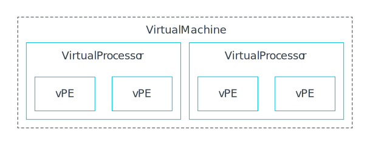
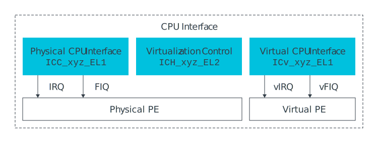
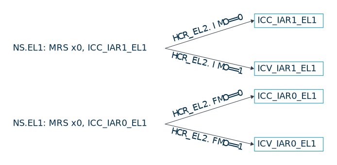
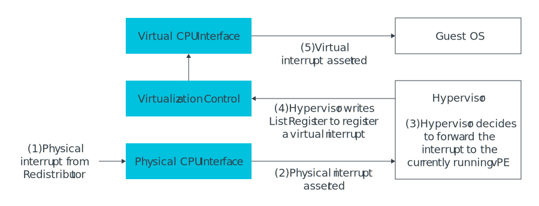
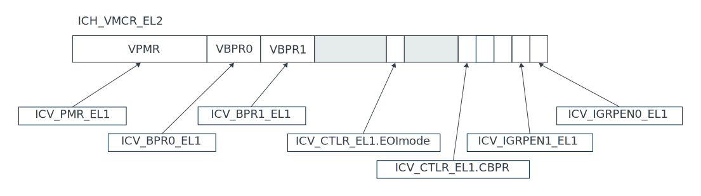

# Generic Interrupt Controller v3 and v4, Virtualization Version 1.2

https://developer.arm.com/documentation/107627/0102/Virtualization

https://zhuanlan.zhihu.com/p/673941561

[Linux 中断子系统](https://zhuanlan.zhihu.com/p/641041561)

## Virtualization

Armv8-A includes optional support for virtualization. To complement this functionality, GICv3 also supports virtualization. Support for virtualization in GICv3 adds the following functionality:

- Hardware virtualization of the CPU interface registers.
- The ability to generate and signal virtual interrupts
- Maintenance interrupts, to inform supervising software (such as a hypervisor) about specific events within a virtual machine.

#### Notes

The GIC architecture does not provide features for virtualizing the Distributor, Redistributor, or ITSs. Virtualization of these interfaces must be handled by software. This is outside the scope of this document and is not described here.

### Terminology

Hypervisors create,control, and schedule virtual machines (VM). A virtual machine is functionally equivalent to a physical system and contains one or more virtual processors. Each of those virtual processors contain one or more virtual PEs(vPEs).

The virtualization support in GICv3 and GICv4.1 works at the level of vPEs. For example, when creating a virtual interrupt, it targeted at a specific vPE, not a VM. In general, the GIC does not know how different vPEs relate to the virtual mahines. This is important to remember when thinking about some of the controls that are introduced later.

This guide uses the term hypervisor to mean any software running at EL2 which is responsible for managing vPEs. In this guide, we ignore the differences that can exist between virtualization software because we are concentrating on the features in the GIC. However, remember that not all virtualization solutions use all the features available within the GIC.

A given vPE can be described as scheduled or not-scheduled. A scheduled vPE is one that has been scheduled by the hypervisor to a physical PE (pPE) and is running. A system might contain more vPEs than pPEs. A vPE that is not scheduled by the hypervisor is not running and therefore  cannot currently receive interrupts.

## GICv3-Virtualization

This section gives an overview of the support for virtualization in GICv3. GICv3 virtualization is similar to the support first introduced in GICv2 and is mainly within the CPU interface. It allows virtual interrupts to be signaled to the currently scheduled vPE on a pPE.

### Interfaces

The CPU interface interface registers are split into three groups:

- ICC: Physical CPU interface registers
- ICH: Virtualization control registers
- ICV: Virtualization CPU interface registers

The following image shows the three groups of CPU interface registers:

#### Physical CPU interface registers

These registers have names with the format ICC_*_ELx.

The hypervisor executing at EL2 uses the regular ICC_*_ELx registers to handle physical interrupts.

#### Virtualization control registers

These registers have names with the format ICH_*_EL2.

The hypervisor has access to additional registers to control the virtualization features provided by the architecture. These features are as follow:

- Enabling and disabling the virtual CPU interface.
- Accessing virtual register state to enable context switching.
- Configuring maintenance interrupts.
- Controlling virtual interrupts for the currently scheduled vPE.

These registers controls the virtualization features of the physical PE from which they are accessed. It is not possible to access the state of another PE. That is, software on PEX cannot access state for PE Y.

#### Virtual CPU interface registers

These registers have names with the format ICV_*_EL1.

Software executing in a virtualization enviroment uses the ICV_\*\_EL1 registers to handle virtual interrupts. These registers have the same format and function as the corresponding ICC_\*\_EL1 register.

The ICV and ICC registers have the same instruction encodings. At EL2 and EL3, the ICC registers are always accessed. At EL1, the routing bits in HCR_EL2 determine whether the ICC or the ICV registers are accessed.

The ICV registers are split into three groups:

- Group 0
  - Register used for handling Group 0 interrupts, for example ICC_IAR0_EL1 and ICV_IAR0_EL1. When HCR_EL2.FMO == 1, ICV registers rather than ICC registers are accessed at EL1.
- Group 1
  - Registers used for handling Group 1 interrupts, for example ICC_IAR1_EL1 and ICV_IAR1_EL1. When HCR_EL2.IMO == 1, ICV registers rather than ICC registers are accessed EL1.
- Common
  - Registers used for handling both Group 0 and 1 interrupt, for example ICC_DIR_EL1. When either HCR_EL2.IMO==1 or HCR_EL2.FMO==1,ICV registers rather than ICC registers are accessed at EL1.

##### Note

Whether the ICV registers are used in Secure EL1 depends on whether Secure virtualization is enabled.

The following diagram shows an example of how the same instruction can access either an ICC or ICV register based on the HCR_EL2 routing controls.

### Managing virtual interrupts

A hypervisor can generate virtual interrupts for the currently scheduled vPE using the List registers, ICH_LR<n>_EL2. Each register represents one virtual interrut, and records the following information:

vINTID (virtual INTID)

    The INTID reported in the virtual environment

State

    The state (Pending, Active, Active and Pending, or Inactive) of the virtual interrupt. The state machine is automatically updated as software in the virtual environment interacts with the GIC. For example, the hypervisor might create a new virtual interrupt, initially setting the state as Pending. When software on the vPE reads ICV_IARn_EL1, the state is updated to Active.

Group

    In Non-secure state, the virtual environment always behaves as if GICD_CTLR.DS==1. In Secure state, the virtual environment behaves as if GICD_CTLR.DS==0 with FIQs routed to EL1. Therefore, in both cases virtual interrupts can be Group 0 or Group 1. Group 0 interrupts are delivered as vFIQs. Group 1 interrupts are delivered as vIRQs.

pINTID (physical INTID)

    A virtual interrupt can be optionally tagged with the INTID of a physical interrupt. When the state machine of the vINTID is updated, so is the state machine of the pINTID.

The List Registers do not record the target vPE. The List Registers implicitly target the currently scheduled vPE, it is the responsiblity of the software to context switch the List Registers when changing the scheduled vPE.

### Eample of a physical interrupt being forwarded to a vPE

The following diagram shows an example sequence of a physical interrupt that is forwarded to a vPE:

The sequence proceeds as follows:

1. A physical interrupt is forwarded to the physical CPU interface from the Redistributor.
2. The physical CPU interface checks whether the physical interrupt can be forwarded to the PE. In this instance, the checks pass, and a physical exception is asserted.
3. The interrupt is taken to EL2. The hypervisor reads the IAR, which returns the pINTID. The pINTID is now in the Active state. The hypervisor determins that the interrupt is to be forwarded to the currently running vPE. The hypervisor writes the pINTID to ICC_EOIR1_EL1. With ICC_CTLR_EL1.EMImode==1,this only performs priority drop without deactivating the physical interrupt.
4. The hypervisor writes one of the List registers to register a virtual interrupt as pending. The List register entry specifies the vINTID that is to be sent and original pINTID. The hypervisor then performs an exception return, returning exception to the vPE.
5. The virtual CPU interface checks whether the virtual interrupt can be forwarded to the vPE. These checks are the same as for physical interrupt, other than that they use the ICV registers. In this instance, the checks pass, and a virtual exception is asserted.
6. The virtual exception is taken to EL1. When software reads the IAR, the vINTID is returned and the virtual interrupt is now in the Active state.
7. The Guest OS handles the interrupt. When it has finished handling the interrupt, it writes the EOIR to perform a priority drop and deactivation. As the List register recorded the pINTID, this deactivates both the vINTID and pINTID.

This example shows a physical interrupt being forwarded to a vPE as a virtual interrupt. This could, for example, be from a peripheral assigned to the VM by the hypervisor. Not all virtual interrupts need be due to a physical interrupt. Virtualization software can creates virtual interrupts within the List Registers at any time.

### Maintenance interrupts

The CPU interface can be configured to generate physical interrupts if certain conditions are true in the virtual CPU interface.

These interrupts are reported as a PPI, with INTID 25. This interrupt is typically configured as Non-secure Group 1 and handled by the hypervisor software at EL2.

The generation of maintenance interrupts is controlled by ICH_HCR_EL2, and the interrupts that are currently asserted are reported in ICH_MISR_EL2.

#### Maintenance interrupt example

A maintenance interrupt can be generated if the vPE clears one of the Group enable bits in the Virtual CPU interface. On seeing this, a hypervisor could remove any List Register entries for pending virtual interrupts belonging to the disabled group.

### Context switching

When context switching between vPEs, the hypervisor software saves the state of one vPE and loads the context of anohter. The state of the Virtual CPU interface forms part of the context of a vPE. The virtual CPU interface state consists of the following information:

- The state of the ICV registers.
- The active virtual priorites.
- Any pending, active, or active and pending virtual interrupts.

The state of the ICV registers can be accessed from EL2 using the ICH registers. As an example, the following diagram shows how the fields in ICH_VMCR_EL2 map on to the ICV register state.

The active virtual priorites must be saved and restored when switching vPEs. The active priorities for the current vPE can be accessed using the ICH_APxRn_el2 registers.

As described in Managing interrupts, virtual interrupts are managed using the List registers. The state of these registers is specific to the current vPE. Therefore, these registers must be saved and restored on context switches.