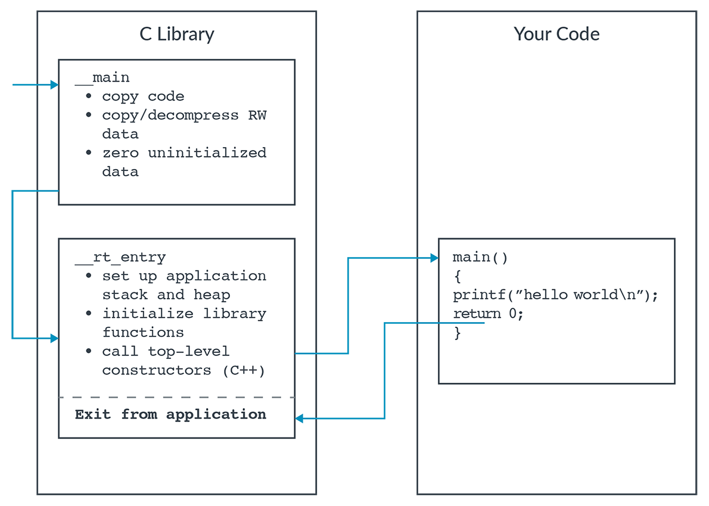
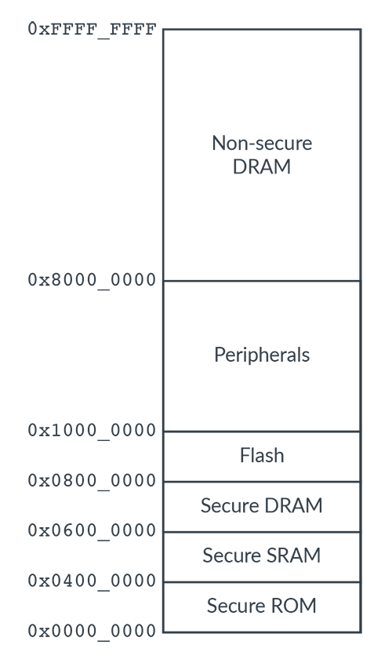
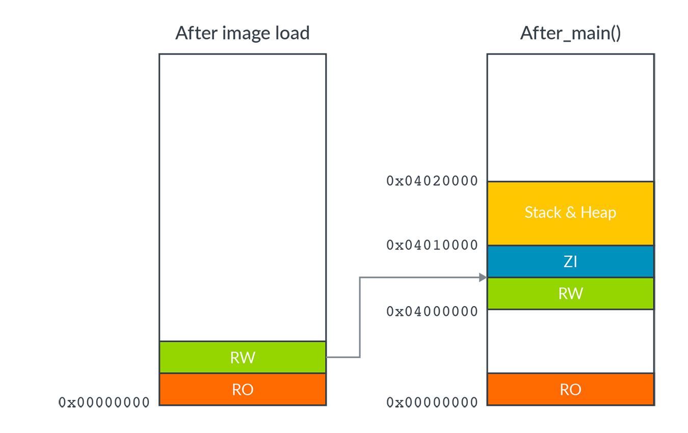
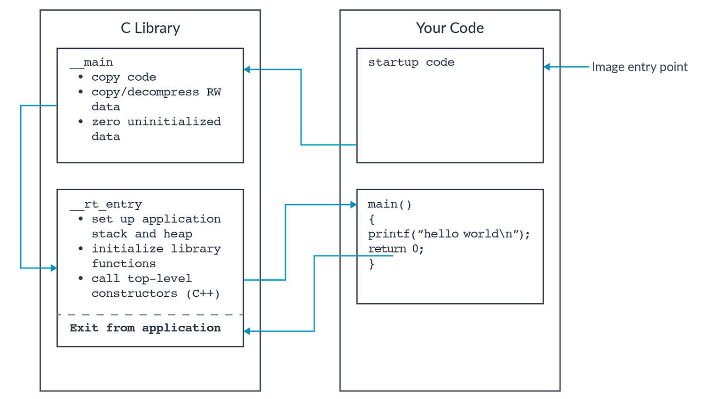

# ARM learning path

[ARM learning path](https://learn.arm.com/learning-paths/embedded-systems/)

[Create and build a Hello world example project](https://learn.arm.com/learning-paths/embedded-systems/bare-metal/hello/)

## Building your first embedded image

### Overview

Coding for an embedded system typically requires the programmer to have more direct interaction with the device hardware than a programmer writing software for a general-purpose computer. This is because:

- Embedded system may not have a display, so the programmer might need to retarget debug output to a serial output port.
- Embedded system typically monitor inputs waiting for a stimulus, and these events will require an interrupt handler.
- Embedded systems often require low-level initialization at startup, before any other code is executed, in the form of a reset hander.

This guide shows you how to write,compile,and run a simple program for an embedded system based on Arm technology. This information is useful for anyone who is new to writing software for an Arm-based embedded system.

This guide is the first in a collection of related documentation:

- Building your first embedded image (this guide)
- Retargeting output to UART
- Creating an event-driven embedded image
- Changing Exception level and secturity state in an embedded image

At then end of this guide, you will be able to:

- write a simple hello world example program for an embedded system
- Configure the memory map
- Build an Executable and Linkable Format(ELF) image using the Arm Compiler 6 toolchain
- Run a simulation of the ELF image on the supplied FVP model

[ARM Development Studio User Guide](https://developer.arm.com/documentation/101470/2024-0/)

### write and compile hello world

1. create a new file called `hello_world.c`
```C
#include <stdio.h>

int main(void) {
 printf("Hello World\n");
 return 0;
}
```

2. Compile the C code to object code with armclang:

```bash
$ armclang -c -g --target=aarch64-arm-none-eabi hello_world.c
```
- `-c` tells the compiler to stop after compiling to object code. We will perform the link step to create the final executable in the next step.
- `-g` tells the compiler to include debug information in the image
- `--target=aarch64-arm-non-eabi` tells the compiler to target the Armv8-A AArch64 ABI.

3. Create an executable image by linking the object using armlink. This generates an ELF image file named `__image.axf`

```bash
$ armlink hello_world.o
```

Because we have not specified an entry point, when you run this image the entry point defaults to `__main()` in the Arm libraries. These libraries perform a number of setup activities, including:

- Copying all the code and data from the image into memory.
- Setting up an area of memory for the application stack and heap.
- Branching to the `main()` function to run the application.

This diagram illustrates the code startup sequence that how control passes from the C library to your code:



### Specify the memory map

If you tried to execute the image that you created in the last step on the FVP_Base_Cortex_A73x2-A53x4 model, it would not run. This is because the default memory map used by armlink does not match the memory map used by the model. Instead of using the default memory map, you will specify a new memory map that matches the model and allows the image to run successfully. To do this, you will create a scatter file that tells the linker the structure of the memory map.

The memory map describes the different regions of target memory, and what they can be used for. For example, ROM can hold read-only code and data but cannot store read-write data.



Create a scatter file to tell the linker about the structure of the memory map:

1. Create a new file scatter.txt in the same directory as hello_world.c with the following contents:

```
ROM_LOAD 0x00000000 0x00010000
  {
    ROM_EXEC +0x0
    {
      * (+RO)
    }

    RAM_EXEC 0x04000000 0x10000
    {
      * (+RW, +ZI)
    }
    ARM_LIB_STACKHEAP 0x04010000 ALIGN 64 EMPTY 0x10000
    {}
  }
```

2. Rebuild the image using the scatter file:

```bash
$ armclang -c -g --target=aarch64-arm-none-eabi hello_world.c 
$ armlink --scatter=scatter.txt hello_world.o
```

#### Advanced information

The statements in the scatter file define the different regions of memory and their purpose.

Let's look at them squentially. The following instruction defines a load region.

```
ROM_LOAD 0x00000000 0x00010000
  {...}
```

A load region is an area of memory that contains the image file at reset before execution starts. The first number specified gives the starting address of the region, and the second number gives the size of the region.

The following instruction defines an execution region:

```
ROM_EXEC +0x0
  {
    * (+RO)
  }
```

Execution regions define the memory locations in which different parts of the image will be placed at run-time.

An execution region is called a root region if it has the same load-time and execute-time address. `ROM_EXEC` qualifies as a root region because its execute-time is located at an offset of `+0x0` from the start of the load region (that is, the region has the same load-time and execute-time addresses). The initial entry point of an image must be in a root region. In our scatter file, all read-only(`RO`) code including the entry point `__main()` is placed in the `ROM_EXEC` root region.

```
RAM_EXEC 0x04000000 0x10000
    {
      * (+RW, +ZI)
    }
```
`RAM_EXEC` contains any read-write (RW) or zero-initialize (ZI) data. Because this has been placed in SRAM, it is not a root region.

This instruction specifies the placement of the heap and stack:

```
ARM_LIB_STACKHEAP 0x04010000 EMPTY 0x10000
    {}
```
- The heap starts at `0x04010000` and grows upward.
- The stack starts at `0x0401FFFF` and grows downwards.

The `EMPTY` declaration reserves `0x10000` of unitialized memory, starting at `0x04010000`.

`ARM_LIB_STACKHEAP` and `EMPTY` are syntactically significant for the linker. However, `ROM_LOAD`, `ROM_EXEC`,and `RAM_EXEC` are not syntactically significant and could be renamed if you like.

### Run the image with a model

You can run the executable image `__image.axf` from the command line using the FVP_Base_Cortex-A73x2-A53x4 model:

```
$ FVP_Base_Cortex-A73x2-A53x4 __image.axf -C pctl.startup=0.0.1.0
```

When the model is running, the message hello world appears on your screen.

By default, the model boots up multiple cores. This could lead to strange or inconsistent behaviors, such as multiple hello world prints. To avoid this type or result, we use the `-c pctl.startup=0.0.1.0` options to specify that only a single core should be used.

Another method to avoid strange or inconsistent results is to write some startup code that shuts down all but one core. We will discuss writing startup code later in this guide.

At reset, the code and data will be in the `ROM_LOAD` section. The library function `__main()` is responsible for copying the RW and ZI data, and `__rt_entry()` sets up the stack and heap. The Arm docunmentation, for example the `Arm Compiler armlink User Guide`, refers to this process as scatter loading.




### Write a reset handler

Typically, an embedded system needs some low-level initialization at startup.

Often this initialization must occur before any other code is executed. This means that you must define and change the entry point for the system in a way that reflects the execution flow that is shown in the following diagram:



1. Create a new file, `startup.s`, with the following contents:

```asm
  .section  BOOT,"ax" // Define an executable ELF section, BOOT
  .align 3                     // Align to 2^3 byte boundary

  .global start64
  .type start64, "function"
start64:


  // Which core am I
  // ----------------
  MRS      x0, MPIDR_EL1
  AND      x0, x0, #
```

The MPIDR_EL1 register provides a CPU identification mechanism. The `Aff0` and `Aff1` bitfields let us check which numbered CPU in a cluster the code is running on. This startup code sends all but one CPU to sleep. The status of the Floating Point Unit (FPU) in the model is unknown. The Architecural Feature Trap Register, `CPTR_EL3`, has no defined reset value. Setting `CPTR_EL3` to zero disables trapping of SIMD,FPU, and a few other instructions.

2. Compile the startup code:

```bash
$ armclang -c -g --target=aarch64-arm-none-eabi startup.s
```

3. Modify the scatter file so that the startup code goes into the root region `ROM_EXEC`:

```
ROM_EXEC +0x0
  {
    startup.o(BOOT, +FIRST)
    * (+RO)
  }
```
Adding the line `startup.o(BOOT, +FIRST)` ensures that the `BOOT` section of our startup file is placed first in the `ROM_EXEC` region.

4. Link the object, specifying an entry label for the linker.Execution branches to this entry label on reset:

```bash
$ armlink --scatter=scatter.txt --entry=start64 hello_world.o startup.o
```

5. Run the executable image `__image.axf` from the command-line:

```bash
FVP_Base_Cortex-A73x2-A53x4 __image.axf
```
The message hello world appears on your screen.

## Retargeting output UART

Semihosting enables code running on a target system, the model, to interface with a debugger running on a host system, the computer, and to use its input and output (I/O) facilities. This means that you can interact with a model or microcontroller that may not possess I/O functionality.

In `Building your first embedded image`, we use a `printf()` call in the code to display the "hello world" message. This `printf()` call triggers a request to a connected debugger through the library function `_sys_write`. To see how this works, you can use `fromelf` to inspect the compiled code, as shown in the following instruction:

```bash
 fromelf --text -c __image.axf --output=disasm.txt
```

This command generates a disassembly of `__image.axf` in the file `disasm.txt`. Within the disassembly, look at `_sys_write`, which contains a HLT instruction:

```asm
_sys_write
    0x00003a74:    d100c3ff    ....    SUB      sp,sp,#0x300x00003a78:    a9027bfd    .{..    STP      x29,x30,[sp,#0x20]
    ...
    0x00003a9c:    d45e0000    ..^.    HLT      #0xf000
    ...
    0x00003aa8:    d65f03c0    .._.    RET
```

The debugger detects this halt as a semihosting by adding `__asm(".global __use_no_semihosting\n\t")`; to `main()`. Linking the image will now throw an error for any functions that use semihosting.

### Retarget functions to use UART

Real embedded systems operate without sophisticated debuggers, but many library functions depend on semihosting. You must modify, or retarget, these functions to use the hardware of the target instead of the host system.

To retarget `printf()` to use the PL011 UART of the model:

1. write a driver for the UART. Copy and paste the following code into a new file with the filename `p1011_uart.c`:

```C
struct pl011_uart {
    volatile unsigned int UARTDR;        // +0x00
    volatile unsigned int UARTECR;       // +0x04
    const volatile unsigned int unused0[4];    // +0x08 to +0x14 reserved
    const volatile unsigned int UARTFR;        // +0x18 - RO
    const volatile unsigned int unused1;       // +0x1C reserved
    volatile unsigned int UARTILPR;      // +0x20
    volatile unsigned int UARTIBRD;      // +0x24
    volatile unsigned int UARTFBRD;      // +0x28
    volatile unsigned int UARTLCR_H;     // +0x2C
   volatile unsigned int UARTCR;        // +0x30
    volatile unsigned int UARTIFLS;      // +0x34
    volatile unsigned int UARTIMSC;      // +0x38
    const volatile unsigned int UARTRIS;       // +0x3C - RO
    const volatile unsigned int UARTMIS;       // +0x40 - RO
    volatile unsigned int UARTICR;       // +0x44 - WO
    volatile unsigned int UARTDMACR;     // +0x48
};

// Instance of the dual timer
struct pl011_uart* uart;

// ------------------------------------------------------------
void uartInit(void* addr) {
    uart = (struct pl011_uart*) addr;
    // Ensure UART is disabled
    uart->UARTCR  = 0x0;
    // Set UART 0 Registers
    uart->UARTECR   = 0x0;  // Clear the receive status (i.e. error) register
    uart->UARTLCR_H = 0x0 | PL011_LCR_WORD_LENGTH_8 | PL011_LCR_FIFO_DISABLE | PL011_LCR_ONE_STOP_BIT | PL011_LCR_PARITY_DISABLE | PL011_LCR_BREAK_DISABLE;
    uart->UARTIBRD = PL011_IBRD_DIV_38400;
    uart->UARTFBRD = PL011_FBRD_DIV_38400;
    uart->UARTIMSC = 0x0;                     // Mask out all UART interrupts
    uart->UARTICR  = PL011_ICR_CLR_ALL_IRQS;  // Clear interrupts
    uart->UARTCR  = 0x0 | PL011_CR_UART_ENABLE | PL011_CR_TX_ENABLE | PL011_CR_RX_ENABLE;
    return;
}

// ------------------------------------------------------------
int fputc(int c, FILE *f) {
    // Wait until FIFO or TX register has space
    while ((uart->UARTFR & PL011_FR_TXFF_FLAG) != 0x0) {}
    // Write packet into FIFO/tx register
    uart->UARTDR = c;
    // Model requires us to manually send a carriage return
    if ((char)c == '\n') {
        while ((uart->UARTFR & PL011_FR_TXFF_FLAG) != 0x0){}
        uart->UARTDR = '\r';
    }
   return 0;
}
Modify hello_world.c to use the UART driver, so that the updated file contains:


#include <stdio.h>
#include "pl011_uart.h"

int main (void) {
  uartInit((void*)(0x1C090000));
  printf("hello world\n");
  return 0;
}
```
By redefining `fputc()` to use the UART you have retarget `printf()`. This is because `printf()` ultimately calls `fputc`.

3. Rebuild the image

```bash
$ armclang -c -g --target=aarch64-arm-none-eabi startup.s
$ armclang -c -g --target=aarch64-arm-none-eabi hello_world.c
$ armclang -c -g --target=aarch64-arm-none-eabi pl011_uart.c
$ armlink --scatter=scatter.txt --entry=start64 startup.o pl011_uart.o hello_world.o
```

4. Disassemble the image:

```
$ fromelf --text -c __image.axf --output=disasm.txt
```

### Use Telnet to interface with the UART

## Creating an event-driven embedded image

### Configure exception routing

To keep things simple, this guide will specify that all exceptions are taken at the highest exception level, EL3.

A `summary of the instruction and registers in the architecture` will help you to understand this section of the guide. In addition, you must keep in mind some rules that exceptions obey:

- An exception routed to a higher exception level cannot be masked, apart from EL0 to EL1 which can be masked with `PSTATE`.
- An exception routed to a lower exception level is always masked.
- An exception routed to the current exception level can be masked by `PSTATE`.

To configure exception routing, you need to perform the following tasks:

- Configure the Secure Configuration Register, SCR_EL3, to enable exception routing to EL3.
- Set the Vector Based Address Register, VBAR_EL3, to point a vector table.
- Disable masking (or ignoring) of exceptions at EL3 by `PSTATE`.

To do these things, add this code to `startup.s`:

```
// Configure SCR_EL3
// ------------------
MOV  w1, #0              // Initial value of register is unknown
ORR  w1, w1, #(1 << 3)   // Set EA bit (SError routed to EL3)
ORR  w1, w1, #(1 << 2)   // Set FIQ bit (FIQs routed to EL3)
ORR  w1, w1, #(1 << 1)   // Set IRQ bit (IRQs routed to EL3)
MSR  SCR_EL3, x1


// Install vector table
// ---------------------
.global vectors
LDR  x0, =vectors
MSR  VBAR_EL3, x0
ISB

// Clear interrupt masks
// ----------------------
MSR  DAIFClr, #0xF
```

### Configure the vector table

When any exception is taken, the processor must handle the exception correctly. This means that the processor must detect the type of exception, then branch to an approiate handler.

Let's look at the code in `vector.s`.Here we can see how a vector table is configured to branch `fiqFirstLevelHandler` when an FIQ event occurs:

```
.section  VECTORS,"ax"
   .align 12

   .global vectors
 vectors:

   .global fiqHandler

 // ------------------------------------------------------------
 // Current EL with SP0
 // ------------------------------------------------------------

   .balign 128
 sync_current_el_sp0:
   B        .                    //        Synchronous

   .balign 128
 irq_current_el_sp0:
   B        .                    //        IRQ

   .balign 128
 fiq_current_el_sp0:
   B        fiqFirstLevelHandler //        FIQ

   .balign 128
 serror_current_el_sp0:
   B        .                    //        SError

   //
   // NB, CODE OMITTED!
   //

fiqFirstLevelHandler:
  STP      x29, x30, [sp, #-16]!
  STP      x18, x19, [sp, #-16]!
  STP      x16, x17, [sp, #-16]!
  STP      x14, x15, [sp, #-16]!
  STP      x12, x13, [sp, #-16]!
  STP      x10, x11, [sp, #-16]!
  STP      x8, x9, [sp, #-16]!
  STP      x6, x7, [sp, #-16]!
  STP      x4, x5, [sp, #-16]!
  STP      x2, x3, [sp, #-16]!
  STP      x0, x1, [sp, #-16]!

  BL       fiqHandler

  LDP      x0, x1, [sp], #16
  LDP      x2, x3, [sp], #16
  LDP      x4, x5, [sp], #16
  LDP      x6, x7, [sp], #16
  LDP      x8, x9, [sp], #16
  LDP      x10, x11, [sp], #16
  LDP      x12, x13, [sp], #16
  LDP      x14, x15, [sp], #16
  LDP      x16, x17, [sp], #16
  LDP      x18, x19, [sp], #16
  LDP      x29, x30, [sp], #16
  ERET
```

In this case, only an FIQ entry and handler have been defined. In fact, `fiqFirstLevelHadnler` merely branches to `fiqHandler`, a procedure that we will define later in C. Here, we have used the `BL` instruction, or branch with link, which branches to the given label. The `BL` instruction saves the current value of the program counter plus four bytes, the next instruction address, to register x30.

Our C procedure ends with a return statement which compiles to a `RET` instruction. By default (that is, if no other register is specified) `RET` branches to the address stored in register x30.

The handler also saves and restores all the general-purpose registers. This is because these registers may be modified by the procedure call.

The remaining entries branch to self, because the handlers have not been written. When you ceate your own image, you will need to define and configure your vector table to handle all required event types.

### Configure the interrupt controller

Vector tables have a relatively small and fixed number of entries, because the number and type of exceptions are architectually defined.

But we might require a great number of different interrupts that are triggered by different sources. An additional piece of hardware is needed to manage these interrupts. The Arm Generic Interrupt Controller (GIC), does exactly this. We will not disccuss the GIC and its feature in this guide, but you can learn more in our programmers guide.

In gic.s, add the following code to enable the GIC, and define a source of interrupts from the physical timer:

```
.global gicInit
  .type gicInit, "function"
gicInit:
  // Configure Distributor
  MOV      x0, #GICDbase  // Address of GIC

  // Set ARE bits and group enables in the Distributor
  ADD      x1, x0, #GICD_CTLRoffset
  MOV      x2,     #GICD_CTLR.ARE_NS
  ORR      x2, x2, #GICD_CTLR.ARE_S
  STR      w2, [x1]

  ORR      x2, x2, #GICD_CTLR.EnableG0
  ORR      x2, x2, #GICD_CTLR.EnableG1S
  ORR      x2, x2, #GICD_CTLR.EnableG1NS
  STR      w2, [x1]
  DSB      SY

  // Configure Redistributor
  // Clearing ProcessorSleep signals core is awake
  MOV      x0, #RDbase
  MOV      x1, #GICR_WAKERoffset
  ADD      x1, x1, x0
  STR      wzr, [x1]
  DSB      SY
1:   // We now have to wait for ChildrenAsleep to read 0
  LDR      w0, [x1]
  AND      w0, w0, #0x6
  CBNZ     w0, 1b

  // Configure CPU interface
  // We need to set the SRE bits for each EL to enable
  // access to the interrupt controller registers
  MOV      x0, #ICC_SRE_ELn.Enable
  ORR      x0, x0, ICC_SRE_ELn.SRE
  MSR      ICC_SRE_EL3, x0
  ISB
  MSR      ICC_SRE_EL1, x0
  MRS      x1, SCR_EL3
  ORR      x1, x1, #1  // Set NS bit, to access Non-secure registers
  MSR      SCR_EL3, x1
  ISB
  MSR      ICC_SRE_EL2, x0
  ISB
  MSR      ICC_SRE_EL1, x0

  MOV      w0, #0xFF
  MSR      ICC_PMR_EL1, x0 // Set PMR to lowest priority

  MOV      w0, #3
  MSR      ICC_IGRPEN1_EL3, x0
  MSR      ICC_IGRPEN0_EL1, x0

//-------------------------------------------------------------
//Secure Physical Timer source defined
  MOV      x0, #SGIbase       // Address of Redistributor registers

  ADD      x1, x0, #GICR_IGROUPRoffset
  STR      wzr, [x1]          // Mark INTIDs 0..31 as Secure

  ADD      x1, x0, #GICR_IGRPMODRoffset
  STR      wzr, [x1]          // Mark INTIDs 0..31 as Secure Group 0

  ADD      x1, x0, #GICR_ISENABLERoffset
  MOV      w2, #(1 << 29)     // Enable INTID 29
  STR      w2, [x1]           // Enable interrupt source

  RET

// ------------------------------------------------------------

  .global readIAR0
  .type readIAR0, "function"
readIAR0:
  MRS       x0, ICC_IAR0_EL1  // Read ICC_IAR0_EL1 into x0
  RET

// ------------------------------------------------------------

  .global writeEOIR0
  .type writeEOIR0, "function"
writeEOIR0:
  MSR        ICC_EOIR0_EL1, x0 // Write x0 to ICC_EOIR0_EL1
  RET
```

We have defined the functions `readIAR0()` and `writeIAR0()`, using the `.global` and `.type` assembler directives. The `.global` directive makes the label visible to all files given to the linker, while the `.type` directive allows us to declare that lable is a function.

As you will see in `rebuild and test`, when you modify `hello_world.c` to call these functions, using these directives let us call these assembly functions from C code, following the Pricedure Call Standard(PCS). The PCS defines a number of things, including how values are passed and returned. In particular:

- Arguments are passed in `x0` to `x7` in the same order as the function prototype.
- Values are returned to the register `x0` and `x1`.

Using `readIAR0()`, we read the value of the Interrupt Controller Interrupt Acknowledge Register 0, ICC_IAR0_EL1. The lower 24 bits of this register give the interrupt identifier, INTID. By calling `readIAR0` in C, we can get the INTID from the GIC and then handle different interrupts case by case. Later in the C code `fiqHandler()` is defined, and you will see a call to   `writeEOIR0`. The INTID is passed to `x0`. INTID is then written to the Interrupt Controller End of Interrupt Register 0,ICC_EOIR0_EL1, which tells the processor that that interrupt is complete.


### Configure the timer to generate interrupts

So far, we have enabled the GIC, and defined a source of interrupts from a secure physical timer.We have a system timer, which we read using a comparator in the processor. We can also tell the hardware to generate an interrupt request after a set number of system ticks. Now we need a way to disable the comparator, so that it does not continue to interrupt the processor after the ticks have elapsed.

To enable the timer and define its behavior, add this code to timer.s

```
.section  AArch64_GenericTimer,"ax"
  .align 3

// ------------------------------------------------------------

  .global setTimerPeriod
  // void setTimerPeriod(uint32_t value)
  // Sets the value of the Secure EL1 Physical Timer Value Register (CNTPS_TVAL_EL1)
  // w0 - value - The value to be written into CNTPS_TVAL_EL1
  .type setTimerPeriod, "function"
setTimerPeriod:
  MSR     CNTPS_TVAL_EL1, x0
  ISB
  RET

// ------------------------------------------------------------

  .global enableTimer
  .type enableTimer, "function"
enableTimer:
  MOV    x0, #0x1            // Set Enable bit, and clear Mask bit
  MSR    CNTPS_CTL_EL1, x0
  ISB
  RET

// ------------------------------------------------------------

  .global disableTimer
  .type disableTimer, "function"
disableTimer:
  MSR    CNTPS_CTL_EL1, xzr // Clear the enable bit
  ISB
  RET
```

### Rebuild and test

Next we need to modify `hello_world.c` to call the assembly functions we created in the earlier steps:

```c
#include <stdio.h>
#include <stdint.h>
#include "pl011_uart.h"

extern void gicInit(void);
extern uint32_t readIAR0(void);
extern void writeEOIR0(uint32_t);

extern void setTimerPeriod(uint32_t);
extern void enableTimer(void);
extern void disableTimer(void);

volatile uint32_t flag;

int main () {
  uartInit((void*)(0x1C090000));
  gicInit();

        printf("hello world\n");

  flag = 0;
  setTimerPeriod(0x1000);  // Generate an interrupt in 1000 ticks
  enableTimer();

  // Wait for the interrupt to arrive
  while(flag==0){}

  printf("Got interrupt!\n");

        return 0;
}

void fiqHandler(void) {
  uint32_t intid;
  intid = readIAR0(); // Read the interrupt id

  if (intid == 29) {
    flag = 1;
    disableTimer();
  } else {
    printf("Should never reach here!\n");
  }

  writeEOIR0(intid);
        return;
}
```

## Changing Exception level and Security state in an embedded image

### Exception levels

