# AArch64 memory management Guide

[Overview](https://developer.arm.com/documentation/101811/0103/Overview)

[内存管理](https://zhuanlan.zhihu.com/p/452936477)

[MMU](https://zhuanlan.zhihu.com/p/619234382)

## What is memory management

Memory management describes how access to memory in a system is controlled. The hardware performs memory management every time that memory is accessed by either the OSs or applications. Memory management is a way of dynamically allocating regions of memory to applications.

### Why is memory management needed

Application processors are desined to run a rich OS, such as Linux, and to support virtual memory systems. Software that executions on the processor only sees virtual addresses, which the processor translates into physical addresses. These physical addresses are presented to the memory system and point to the actual physical locations in memory.

## Virtual and physical addresses

The benefit of using virtual addresses is that it allows management software, such as an Operating system, to control the view of memory that is presented to software. The OS can control what memory is visible, the virtual address at which that memory is visible, and what accesses are permitted to that memory. This allows the OS to sandbox applications (hiding the resources of one application from anohter application) and to provide abstraction from the underlying hardware.

One benefit of using virtual addresses is that an OS can present multiple fragmented physical regions of memory as a single, contiguous virtual address space to an application.

Virtual addresses also benefit software developers, who will not know a system's exact memory addresses when writing their application. With virtual addresses, software developers do not need to concern themselves with the physical memory. The application knows that it is up to the OS and the hardware to work together to perform the address translation.

In practice, each application can use its own set of virtual addresses that will be mapped to different locations in the physical system. As the operating system switches between different applications it re-programs the map. This means that the virtual addresses for the current application will map to the correct physical location in memory.

Virtual addresses are translated to physical addresses through mappings. The mappings between virtual addresses and physical addresses are stored in translation tables(sometimes referred to as page tables) as this diagram shows:

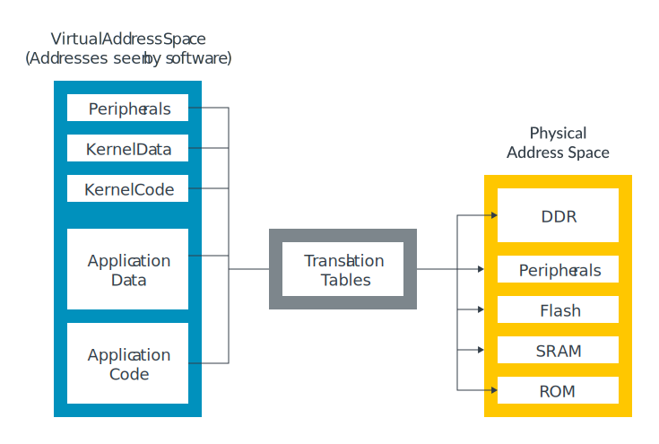

Translation tables are in memory and are managed by software, typically an OS or hypervisor. The translations tables are not static, and the tables can be updated as the needs of software change. This changes the mapping between virtual and physical addresses.

## Address spaces

There are several indepedent virtual address spaces in AAarch64. This diagram shows these virtual address spaces:

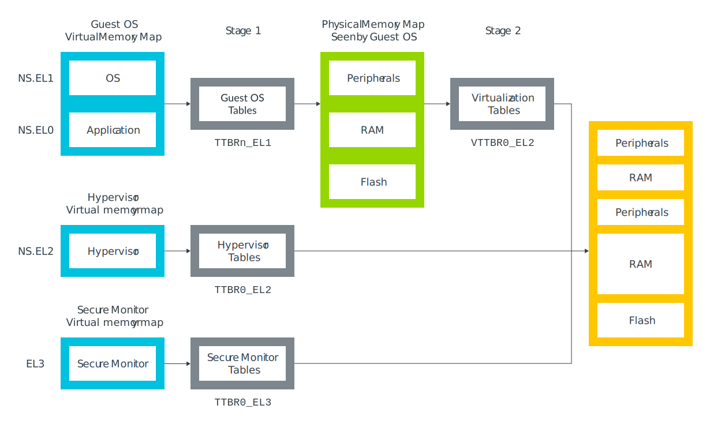

The diagram shows three virtual address spaces:

- Non-secure EL0 and EL1.
- Non-secure EL2.
- Secure EL3.

Each of these virtual address spaces is independent, and has its own settings and tables. We often call these settings and tables 'translation regimes'. There are also virtual address spaces for Secure EL0, and Secure EL1 and Secure EL2, but they are not shown in the diagram.

Because there are multiple virtual address spaces, it is important to specify which address space an address is in. For example, NS.EL2:0x8000 refers to the address 0x8000 in the Non-secure EL2 virtual address space.

The diagram also shows that the virtual addresses from Non-secure EL0 and Non-secure EL1 go through two sets fo tables. These tables support virtualization and allow the hypervisor to virtualize the view of physical memory that is seen by a virtual machine(VM).

Armv9-A supports all the virtual addresses spaces described above for Armv8-A. Armv9-A introduces the optional Realm Management Extension (RME). Whe RME is implemented, addtional translation regimes also present:

- Realm EL1 and EL0
- Realm EL2 and EL0
- Realm EL2

In virtualization, we call the set of translations that are controlled by the OS, Stage 1. The Stage 1 tables translate virtual addresses to intermediate physical addresses(IPA). In stage 1 the OS thinks that the IPAs are physical address spaces. However, the hypervisor controls a second set of translations, which we call Stage 2. This second set of translations translates IPAs to physical addresses. This diagram shows how the two sets of tranlations work:

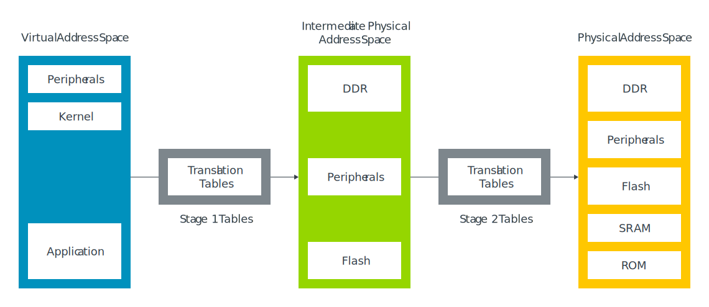

Although there are some minor differences in tha table format, the process of Stage 1 and Stage 2 translation is usually the same.

### physical addresses

As well as multiple virtual address spaces, AArch64 also has myltiple physical address spaces(PAS):

- Non-secure PAS0
- Secure PAS
- Realm PAS (Armv9-only)
- Root PAS (Armv9-only)

Which physical address space, or spaces, a virtual address can be mapped to depends on the current Security state of the processor. The following list shows the Security states with its corresponding virtual address mapping destinations:

- Non-secure state: virtual addresses can only map to Non-secure physical addresses.
- Secure state: virtual addresses can map to Secure or Non-secure physical addresses.
- Realm state: virtual addresses can map to Realm or Non-secure physical addresses
- Root state: virtual address can map to any physical address space.

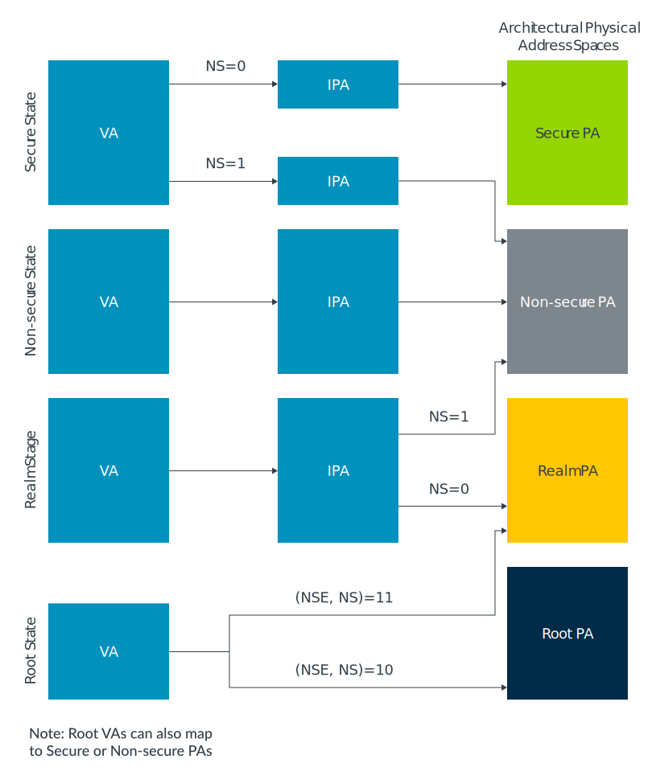

### Address sizes

AArch64 is a 64-bit architecture, but this does not mean that all addresses are 64-bit.

### Size of virtual addresses

Virtual addresses are stored in a 64-bit format. As a result, the address in load instructions (LDR) and store instructions (STR) is always specified in an X register. However, not all of the addresses in the X register are valid.

This diagram shows the layout of the virtual address space in AArch64:

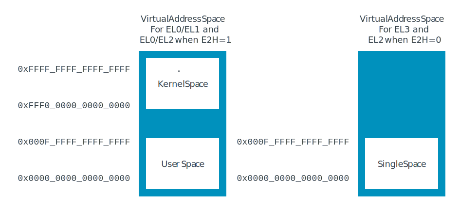

There are two regions for the EL0/EL1 virtual address space: kernel space and application space. These two regions are shown on the left-hand side of the diagram, with kernel space at the top, and application space, which is labelled 'User space', at the bottom of the address space. Kernel space and user space have separate translation tables and this means that their mappings can be kept separate.

There is a single region at the bottom of the address space for all other Exception levels. This region is shown on the right-hand side of the diagram and is the box with no text in it.

Each region of address space has a size of up to 52-bits. However, each region can be independently shrunk to a smaller size. The TnSZ fields in the TCR_ELx registers control the size of the virtual address space. For example, this diagram shows that TCR_EL1 controls the EL0/EL1 virtual address space:

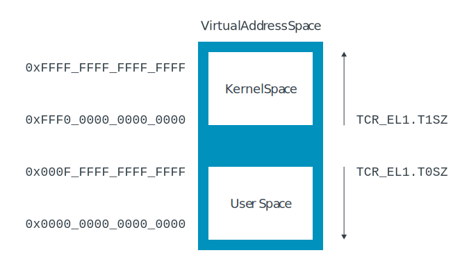

The virtual address size is encoded as:

```
virtual address size in bytes = 2 ^ (64-TCR_ELx.TnSZ)
```

The virtual address size can also be expressed as a number of address bits:

```
Number of address bits = 64 - TnSZ
```

Therefore, if `TCR_EL1.T1SZ` is set to 32, the size of the kernel region in the EL0/EL1 virtual address space is 2^32 bytes(0xFFFF_FFFF_0000_0000 to 0xFFFF_FFFF_FFFF_FFFF). Any address that is outside of the configured range or range will, when it is accessed, generate an exception as a translation fault. The advantage of this configuration is that we only need to describe as much of the address space as we want to use, which saves time and space. For example, imagine that the OS kernel needs 1GB of address space (30-bit address size) for its kernel space. If the OS sets T1SZ to 34, then only the translation table entries to describe 1GB are created, as 64-34 = 30.

### Size of phycical addresses

The size of a physical address is IMPLEMENTATION DEFINED, up to a maximum of 52 bits. The ID_AA64MMFR0_EL1 register reports the size that is implemented by the processor. For Arm Cortex-A processors, this will usually be 40 bits or 44 bits.

In Armv8.0-A, the maximum size for a physical address is 48 bits. This was extended to 52 bits in Armv8.2-A.

### Size of intermediate physical addresses

If you specify an output address in a translation table entry that is larger than the implemented maximum, the MMU will generate an exception as an address size fault.

The size of the IPA space can be configured in the same way as the virtual address space. VTCR_EL2.T0SZ controls the size. The maximum size that can be configured is the same as the physical address size that is supported by the processor. This means that you cannot configure a larger IPA space than the supported physical address space.

### Address Space Identifiers - Tagging translations with the owning process

Many modern OSs have applications that all seem to run from the same address region, this is what we have described as user space. In practice, different applications require different mappings. This means, for example, that the translation for VA 0x8000 depends on which application is currently running.

Ideally, we would like the translations for different applications to coexist within the Translation Lookaside Buffers(TLBs), to prevent the need for TLB invalidates on a context switch. But how would the processor know which version of the VA 0x8000 translation to use? In Aarch64, the answer is Address Space Identifiers(ASIDs).

For the EL0/EL1 virtual address space, translations can be marked as Global(G) or Non-Global (nG) using the nG bit in the attributes field of the translation table entry. For example, kernel mappings are Global translations, and application mappings are Non-Global translation. Global translations apply which ever application is currently running. Non-Global translations only apply with a specific application.

Non-global mappings are tagged with an ASID in the TLBs. On a TLB lookup, the ASID in the TLB entry is compared with the currently selected ASID. If they do not match, then the TLB entry is not used. This diagram shows a Glbal mapping in the kernel space with no ASID tag and a non-Global mapping in user space with an ASID tag:

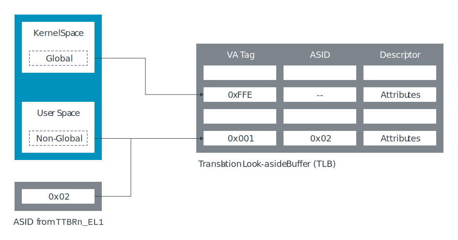

The diagram shows that TLB entries for multiple applications are allowed to coexit in the cache, and the ASID determines which entry to use.

The ASID is stored in one of the two TTBRn_EL1 registers. Usually TTBR0_EL1 is used for user space. As a result, a single register update can change both the ASID and the translation table that it points to.

In 2023 Arm introduced the ability to specify two ASIDs simultaneously. From Armv9.5-A, software has the option to use the ASID field in both TTBRn_EL1 registers. TTBR0_EL1.ASID is applied to addresses in the lower portion of the virtual address space and TTBR1_EL1.ASID to addresses in the upper portion of the virtual address space.

### Virtual Machine Identifiers -Tagging translations with owning VM

EL0/EL1 translations can also be tagged with a Virtual Machine Identifier(VMID). VMIDs allow translations from different VMs to coexit in the cache. This is similar to the way in which ASIDs work for translations from different applications. In practise, this means that some tranlations will be tagged with both a VMID and an ASID, and that both must match for the TLB entry to be used.

When virtualization is supported for a security state, EL0/EL1 translations are always tagged with a VMID - even if Stage 2 translation is not enable. This means that if you are writing initizlization code and are not using a hypervisor, it is important to set a known VMID value before setting up the Stage 1 MMU.

### Common not Private

If a system includes multiple processors, do the ASIDs and VMIDs used on one processor have the same meaning on other processors?

For Armv8.0-A the answer is that they do not have to mean the same thing. There is no requirement for software to use a given ASID in the same way across multiple processors. For example, ASID 5 might be used by the calculator on one processor and by the web browser on another processor. This means that a TLB entry that is created by one processor cannot be used another processor.

In practice, it is unlikely that software will use ASIDs differently across processors. It is more common for software to use ASIDs and VMIDs in the same way on all processors in a given system. Therefore, Armv8.2-A introducede the Common not Private(CnP) bit in the Translation Table Base Register(TTBR). When the CnP bit is set, the software promises to use the ASIDs and VMIDs in the same way on all processors, which allows the TLB entries that are created by one processor to be used by another.

We have been talking about processors, however, technically, we should be using the term, Processing Element(PE). PE is a generic term for any machine that implements the Arm architecture. It is important here because there are microarchitectural reasons why sharing TLBs between prossors would be difficult. But within multithread processor, where each hardware thread is a PE, it is much more desirable to share TLB entries.

## The Memory Management Unit (MMU)

The Memory Management Unit (MMU) is responsible for the translation of virtual addresses used by software to physical addresses used in the memory system.

The MMU contains the following:

- The table walk unit, which contains logic that reads the translation tables from memory.
- Translation Lookaside Buffers (TLBs), which cache recently used translations.

All memory addresses that are issued by software are virtual. These memory addresses are passed to the MMU, which checks the TLBs for a recently used cached translation. If the MMU does not find a recently cached translation, the table walk unit reads the appropriate table entry, or entries, from memory, as shown here:

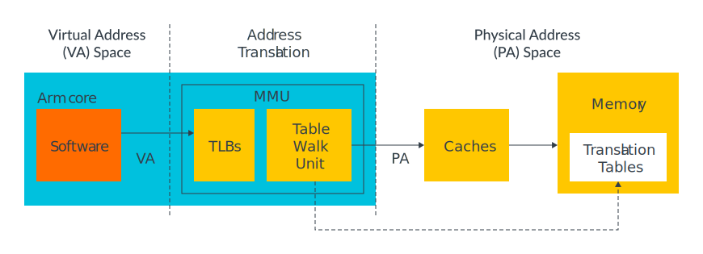

A virtual address must be translated to a physical address before a memory access can take place (because we must know which physical memory location we are accessing). This need for translation also applies to cached data, because on Arm6 and later processors, the data caches store data using the physical address(addresses that are physically tagged). Therefore, the address address must be translated before a cache lookup can complete.

### Table entry

The translation tables work by dividing the virtual address space into equal-sized blocks and by providing one entry in the table per block.

Entry 0 in the table provides the mapping for block 0, entry 1 provides the mapping for block 1, and so on. Each entry contains the address of a corresponding block of physical memory and the attributes to use when accessing the physical address.

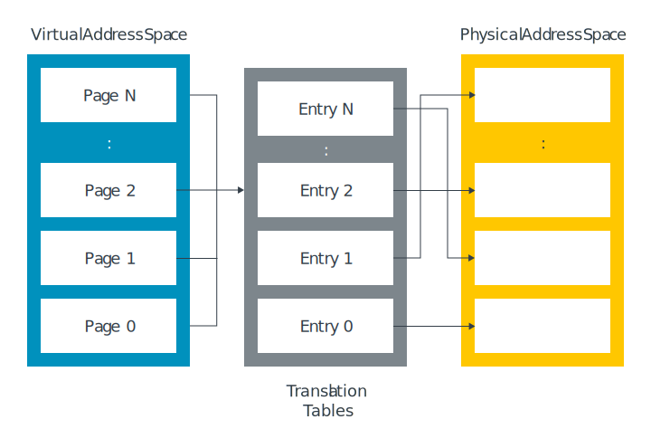

### Table lookup

A table lookup occurs when a translation takes place. When a translation happens, the virtual address that is issued by the software is split in two, as shown in this diagram:

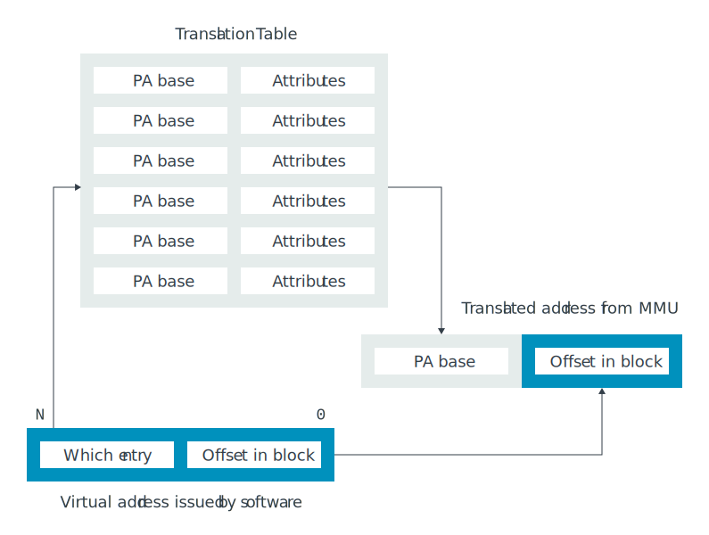

The upper-order bits, which are labelled 'Which entry' in the diagram, tell you which block entry to look in and they are used as an index into the table. This entry block contains the physical address for the virtual address.

The lower-order bits, which are labelled 'Offset in block' in the diagram, are an offset within that block and are not changed by the translation.

### Multilevel translation

In a single-level lookup, the virtual address space is split into equal-sized blocks. In practice, a hierarchy of tables is used.

The first table (Level 1 table) divides the virtual address space into large blocks. Each entry in this table can point to an equal-sized block of physical memory or it can point to another table which subdivides the block into smaller blocks. We call this type of table a 'multilevel table'. Here we can see an example of a multilevel table that has three levels:

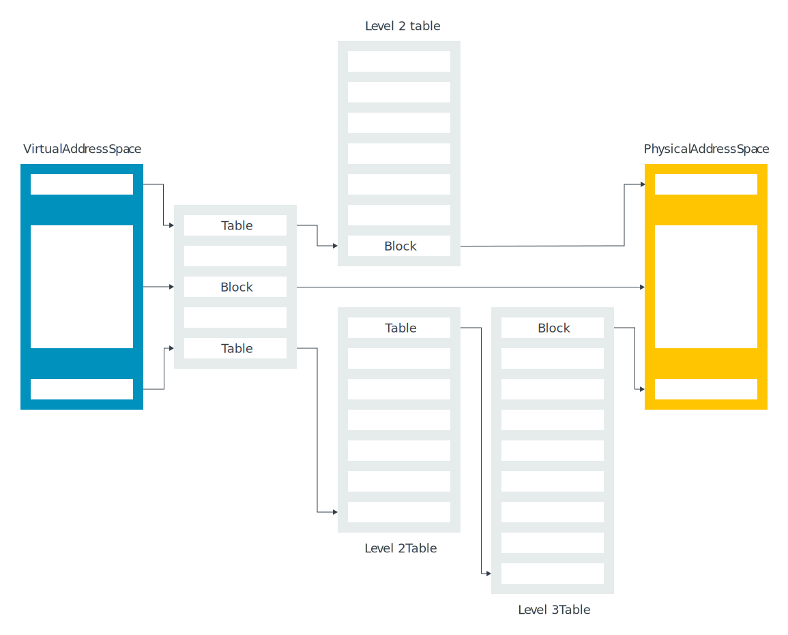

In Arm8-A,the maximum number of levels is four, and the levels are numbered 0 to 3. This multilevel approach allows both larger blocks and small blocks to be described. The characteristics of large and small blocks are as follows:

- Large blocks require fewer levels of reads to translate than small blocks. Plus, large blocks are more effcient to cache in the TLBs.
- Small blocks give software fine-grain control over memory allocation. However, small blocks are less effcient to cache in the TLBs. Caching is efficient because small blocks require multiple reads through the levels to translate.

To manage this trade-off, an OS must balance the efficiency of using large mappings against the flexibility of using smaller mappings for optimum performance.

## Controlling address translation Translation table format

Here we can see the different formats that are allowed for translation table entries:

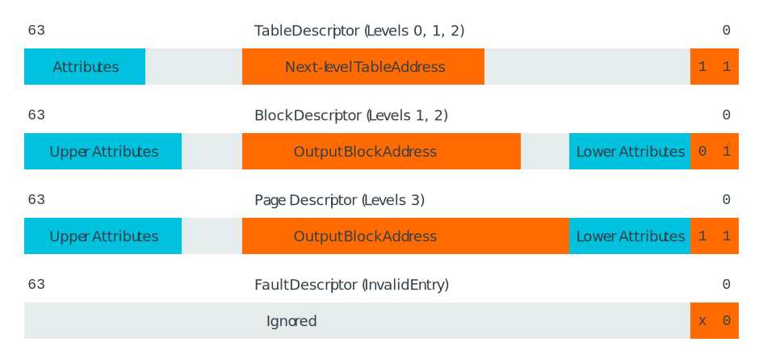

Each entry is 64 bits and the bottom two bits detemine the type of entry.

Notice that some of the table entries are only valid at specific levels. The maximum number of levels of tables is four, which is why there is no table descriptor for level 3(or the fourth level), tables. Similarly, there are no Block descriptors or Page descriptors for level 0. Because level 0 entry covers a large region of virtual address space, it does not make sense to allow blocks.

## Translation granule

A translation granule is the smallest block of memory that can be described. Nothing smaller can be described, only larger blocks, which are multiples of the granule.

AArch64 supports three different granule sizes: 4KB, 16KB, and 64KB.

The granule sizes that a processor supports are IMPLEMENTATION DEFINED and are reported by ID_AA64MMFR0_EL1. All Arm Cortex-A processors support 4KB and 64KB. The selected granule is the smallest block that can be described in the latest level table. Larger blocks can also be described. This table shows the different block sizes for each level of table based on the selected granule:

Before the introduction of Armv9.2-A and Armv8.7-A, there were restrictions on using 52-bit addresses. When the selected granule is 4KB or 16KB, the maximum virtual address region size is 48 bits. Similarly, output physical addresses are limited to 48 bits. It is only when the 64KB granule is used that the full 52 bits can be used.

### The starting level of address translation

Together, the granule and the size of the virtual address space control the starting level of address translation.

The previous table summarized the block size (size of virtual address range covered by a single entry) for each granule at each level of table. From the block size, you can work out which bits of the virtual address are used to index each level of table.

Let us take the 4KB granule as an example. This diagram shows the bits that are used to index the different levels of table for a 4KB granule:

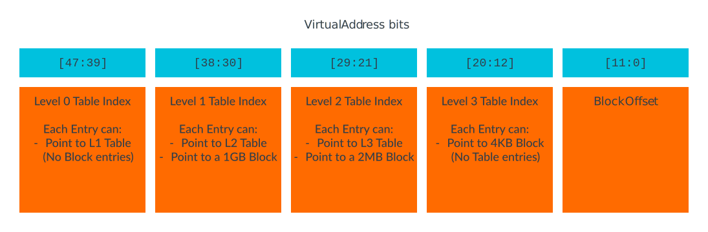

Imagine that, for a configuration, you set the size of the virtual address space, TCR_ELx.T0SZ, to 32. Then the size of the virtual address space, in address bits, is calculated as:

64 - T0SZ = 32-bit address space (address bits 31:0)

If we look at the previous 4KB granule diagram again, level 0 is indexed by bits 47:39. With a 32-bit address space you do not have these bits. Therefore, the starting level of translation for your configuration is level 1.

Next, imagine you set T0SZ to 34:

64 - T0SZ = 30-bit address space (address bits 29:0)

This time, you do not have any other bits that are used to index the level 0 table or the level 1 table, so the starting level of translation for your configuration is level 2.

As the previous diagram shows, when the size of the virtual address space reduces, you need fewer levels of tables to describe it.

These examples are based on using the 4KB granule. The same principle applies when using 16KB and 64KB granules, but the address bits change.

### Registers that control address translation

Address translation is controlled by a combination of system registers:

- SCTLR_ELx
  - M - Enable Memory Management Unit(MMU).
  - C - Enable for data and unified caches.
  - EE - Endianness of translation table walks.
- TTBR0_ELx and TTBR1_ELx
  - BADDR - Physical address (PA) (or intermediate physical address, IPA, for EL0/EL1) of start of translation table.
  - ASID - The Address Space Identifier for Non-Global translations.
- TCR_ELx
  - PS/IPS - Size of PA or IPA space, the maximum output address size.
  - TnSZ - Size of address space covered by table.
  - TGn - Granule size.
  - SH/IRGN/ORGN - Cacheability and sharability to be used by MMU table walks.
  - TBIn - Disabling of table walks to a specific table.
- MAIR_ELx
  - Attr - Controls the Type and cacheability in Stage 1 tables.

### MMU disabled

When the MMU is disabled for a stage of translation, all addresses are flat-mapped. Flat mapping means that the input and output addresses are the same.

## Translation Lookaside Buffer maintaince

The Translation Lookaside Buffers (TLBs) cache recently used tranlations. This cacheing allows the translations to be reused by subsequent lookups without needing to reread the tables.

The TLBs are caches of translations, not caches of the translation tables. The difference is subtle. Several register fields control how the translation table entries are interpreted. What is in a TLB entry is the interpretation of the translation table entry given the configuration at the point that the tables were walked. In the Arm Architecture Reference Manual (Arm ARM), such register fields are described as ‘permitted to be cached in a TLB’.

If you change a translation table entry, or the controls that affect how entries are interpreted, then you need to invalidate the affected entries in the TLB. If you do not invalidate those entries, then the processor might continue to use the old translation.

The processor is not permitted to cache a translation into the TLBs that results in any of the following faults:

- A translation fault (unmapped address)
- An address size fault (address outside of range)
- An access flag fault

As a result, you do not need to issue a TLB invalidate when mapping an address for the first time. However, you do need to issue a TLB invalidate if you want to do any of the following:

- Unmap an address
  - Take an address that was previously valid or mapped and mark it as faulting
- Change the mapping of an address
  - Change the output address or any of the attributes. For example, change an address from read-only to read-write permissions.
- Change the way the tables are interpreted
  - This is less common. But, for example, if the granule size was changed, then the interpretation of the tables also changes. Therefore, a TLB invalidate would be necessary.

### Format of a TLB operation

The TLBI instruction is used to invalidate entries in the TLBs. The syntax of this instruction is:

```
TLBI < type >< level >{IS|OS} {, < xt >}
```

Where:

- <type> Which entries to invalidate
  - All - All entries
  - VA - Entry matching VA and ASID in Xt
  - VAA - Entry matching VA in Xt, for any ASID
  - ASID - Any entry matching the ASID in Xt
  - and many more
- <level> Which address space to operate on
  - EL1 = EL0/1 virtual address space
  - EL2 = EL2 virtual address space
  - EL3 = EL3 virtual address space
- < IS|OS > Whether an operation is Inner Shareable (IS) or Outer Shareable (OS).
  - When IS is added to the operation, it is broadcast to the other cores in the Inner Shareable domain.
  - When OS is added to the operation, it is broadcast to the other cores in the Outer Shareable domain (Added in Armv8.4-A).
- < Xt > Which address or ASID to operate on
  - Only used for operations by address or ASID

Consider, for example, an Operating System that is updating an entry in its kernel translation tables. A typical TLB invalidate sequence would like this:

```
STR  X1, [X5]        // Write to translation table entry
DSB  ISH             // Barrier instructions - not covered in this guide
TLBI VAAE1IS  , X0   // Invalidate VA specified by X0, in EL0/1
                     // virtual address space for all ASIDs
DSB  ISH             // Barrier instructions - not covered in this guide
ISB                  // Synchronize context on this processor
```

## Address translation instructions

An Address Translation(AT) instruction lets the software query the translation for a specific address. The translation that results, including the attributes, is written to the Physical address Register, PAR_EL1.

The syntax of the AT instruction lets you specify which translation regime to use. For example, EL2 can query the EL0/EL1 translation regime. However, EL1 cannot use the AT instruction to query the EL2 tranlation regime, as this is a breach of privilege.

```
static inline void arm_at_s1e2w(vaddr_t vaddr)
{
    __asm__ volatile("at s1e2w, %0 ::"r"(vaddr));
}
```

If the requested translation would have caused a fault, no exception is generated. Instead, the type of fault that would have been is record in PAR_EL1.

```
bool mem_translate(struct addr_space *as, vaddr_t va, paddr_t *pa)
{
    uint64_t par = 0, par_saved = 0;

    par_saved = sysreg_par_el1_read();

    if (as->type == AS_HYP || as->type == AS_HYP_CPY) {
        arm_at_s1e2w(va);
    } else {
        arm_at_s12e1w(va);
    }

    ISB();

    par = sysreg_par_el1_read();
    sysreg_par_el1_write(par_saved);

    if (par & PAR_F) {
        return false;
    } else {
        if (pa != NULL) {
            *pa = (par & PAR_PA_MSK) | (va | (PAGE_SIZE-1));
        }
    }
}
```