# AArch64 memory attributes and properties

[Overview](https://developer.arm.com/documentation/102376/0200/Overview)

## Overview

This guide introduces the memory attributes and properties in Armv8-A and Armv9-A. It begins by explaining where attributes that describe memory come from and how they are assigned to regions of memory. Then it introduces the different attributes that are available and explains the basics of memory ordering.

This information is useful for anyone developing low-level code, like boot code or drivers. It is particularly relevant to anyone writing code to setup or manage the Memory Management Unit (MMU).

## What are memory attributes and properties, and why are they needed

Memory attributes and properties are a way of defining how memory behaves. They provide a structure and a set of rules for you to follow when you configure how memory addresses, or regions of memory addresses, are accessed and used in your system.

The memory attributes and properties can be applied to an address, and define the rules associated with memory access.

Consider a simple system with the address space you can see in this diagram:

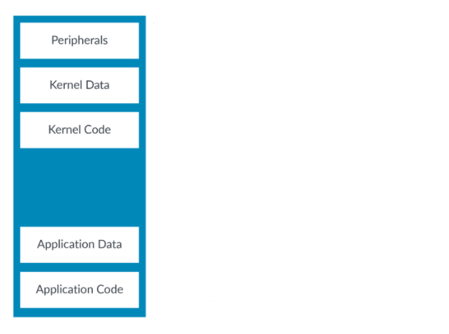

The arrangement of memory regions in the address space is called an address map. In this example, the address map contains:

- Memory and peripherals
- In the memories,code and data
- Resources belonging to the OS and resorces belonging to user applications

The way that the processor interacts with a peripheral is different to how it should interact with memory. For example, you usually want to cache memories but you do not want to cache periperals. Caching is the act of storing a copy of information from memory into a hardware structure, which is called a cache. The cache is closer to the core and faster for the core to access. Similarly, you will usually want the processor to block user access to kernel resources such as peripherals.

The following diagram shows the address map with some different memory attributes that you might want to apply to the memory regions:

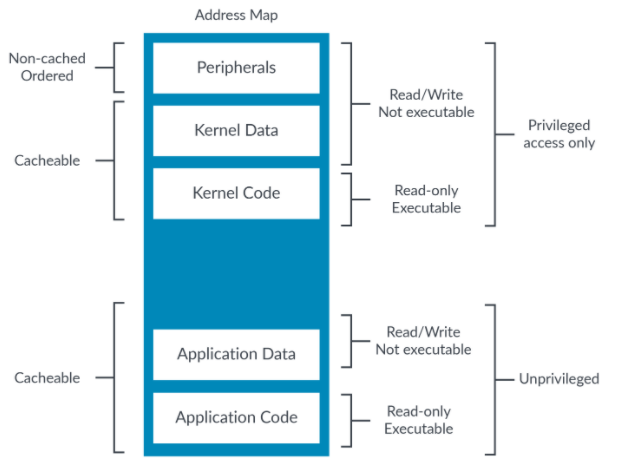

You need to be able to describe these different attributes to the processor, so that the processor accesses each location appropriately.

## Describing memory in AArch64

The mapping between virtual and physical address spaces is defined in a set of translation tables, also sometimes called page tables. For each block or page of virtual addresses, the translation tables provide the corresponding physical address and the attributes for accessing that page.

Each translation table entry is called a block or page descriptor. In most cases, the attributes come from this descriptor.

This diagram shows an example block descriptor, and the attribute fields within it:

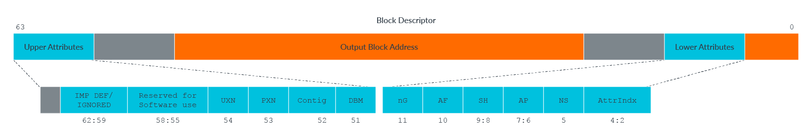

Important attributes discussed in this guide include the following:

- UXN and PXN - Execution permissions
- DBM - The dirty bit modifier
- AF - Access flag
- AP - Access permission
- AttrIndx - Selector for memory type and attributes

### Hierachical attributes

Some memory attributes canbe specified in the Table descriptors in high-level tables. These are hierachical attributes. This applies to Access Permissions, Execution Permissions, and the Physical Address space.

If these bits are set then they override the lower-level entries, and if the bits are clear the lower-level entries are used unmodified. An example, using PXNTable (execution permission) is shown here:

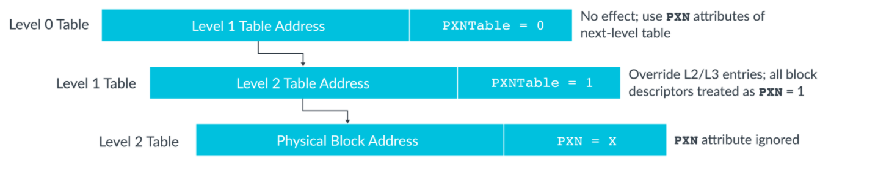

From Armv8.1-A, you can disable support for setting the access and execution permissions using the hierarchical attributes in a table descriptor. This is controlled by the Hierarchical Permission Disable (HPD) bits the relevant TCR_ELx register. When disabled, the bits used for the hierarchical controls are available to software to use for other purposes.

### MMU disabled

To summarize, the attributes for an address come from the translation tables. Translation tables are situated in memory and are used to store the mappings between virtual and physical addresses. The tables also contain the attributes for physical memory locations.

The translation tables are accessed by the Memory Management Unit (MMU).

What happens if the MMU is disabled? This is an important question to address when writing code that will run immediately after reset.

When the stage 1 MMU is disabled:

- All data accesses are Device-nGnRnE. This is explained in the section Device memory later in this guide.
- All instruction fetches are treated as either non-cacheable or cacheable, according to the value of the SCTLR_ELx.I (instruction cacheability control) field.
- All addresses have read/write access and are executable.

For Exception levels covered by virtualization, when stage 2 is diabled the attributes from stage 1 are used unmodified.

## Memory types

All addresses in a system that are not marked as faulting are assigned a memory type. The memory type is a high-level description of how the processor should interact with the address region. There are two memory types in Armv8-A, and Armv9-A: Normal memory and Device memory.

## Normal memory

The Normal memory type is used for anything that behaves like a memory, including RAM, Flash, or ROM. Code should only be placed in locations marked as Normal.

Normal is usually the most common memory type in a system, as shown in this diagram:

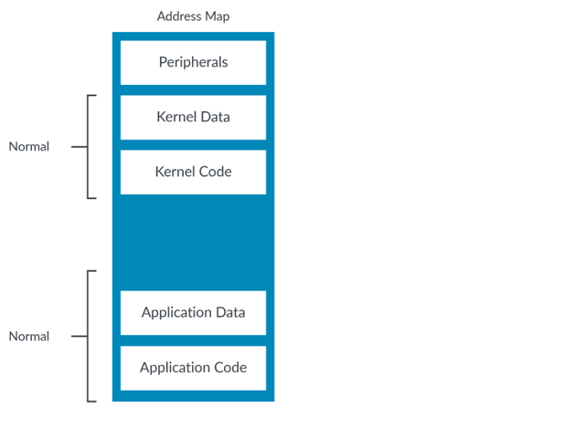

### Memory access ordering

Traditionally, computer processors execute instructions in the order that they were specified in the program. Things happen the number of times specified in the program and they happen one at a time. This is called the Simple Sequential Execution (SSE) model. Most modern processors may appear to follow this model, but in reality a number of optimizations are both applied and made available to you, to help speed up performance.

A memory location that is marked as Normal is assumed to have no direct side-effects when it is accessed. This means that reading the location just returns the data, but does not cause the data to change, or directly trigger another process. Because of this, for memory locations marked as Normal, a processor may merge accesses, perform accesses speculatively, or re-order accesses.

## Device memory

The Device memory type is used for describing peripherals. Peripheral registers are often referred to as Memory-Mapped I/O (MMIO). Here we can see what would be typically be marked as Device in our example address map:

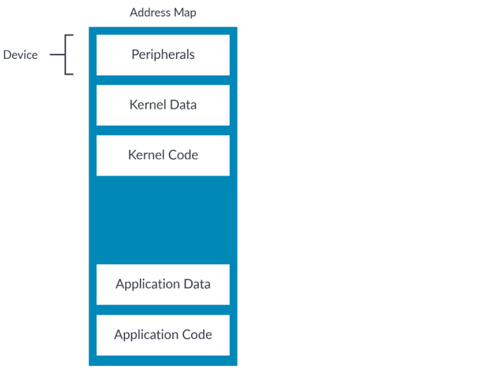

To review, the Normal memory type means that there are no side-effects to the access. For the Device type memory, the opposite is true. The Device memory type is used for locations that can have side-effects.

For example, a read to a FIFO would normally cause it to advance to the next piece of data. This means that the number of accesses to the FIFO is important, and therefore the processor must adhere to what is specified by the program.

Device regions are never cacheable. This is because it is very unlikely that you would want to cache accesses to a peripheral.

Speculative data accesses are not permitted to regions marked as Device. The processor can only access the location if it is architecturally accessed. That means that an instruction that has been architecturally executed has accessed the location.

Instructions should not be placed in regions marked as Device. We recommend that Device regions are always marked as not executable. Otherwise, it is possible that the processor might speculatively fetch instructions from it, which could cause problems for read-sensitive devices like FIFOs.

### sub-types of Device

There are four sub-types of Device,with varying levels of restrictions. These sub-types are the most permissive:

- Device-GRE
- Device-nGRE
- Device-nGnRE

This sub-type is the most restrictive:

- Device-nGnRnE

The letters after Device represent a combination of attributes:

- Gathering(G,nG). This specifies that accesses can be merged(G) or not(nG). This could be merging multiple accesses to the same location into one access or merging multiple smaller accesses into one larger access.
- Re-ordering(R,nR). This specifies that accesses to the same peripheral can be re-ordered(r) or not(nR). When re-ordering is permitted, the restrictions apply in the same way as for the Normal type. You can find more detail on normal memory access reordering in the Memory system,ordering,and barries guide.
- Early Write Acknowledgement(E,nE). This determines when a write is considered complete. If Early Acknowledgement is allowed (E), an access can be shown as complete once it is visible to other observers, but before it reaches its destination. For example, a write might become visible to other Processing Elements(PEs) once it reaches a write buffer in the interconnect. When Early Acknoeledgement is not allowed(nE), the write must have reached the destination.

Here are two examples:

- Device-GRE. This allows gathering,re-ordering, and early write acknowledgement.
- Device-nGnRnE. This does not allow gathering, re-ordering, and early acknowledgement.

We have already seen how re-ordering works, but we have not introduced gathering or early write acknowledgement. Gathering allows memory access to similar locations to be merged into a single bus transaction, optimizing the access. Early write acknowledgement indicates to the memory system whether a buffer can send write acknowledgements at a point on the bus between the core and the peripheral at the address, such that all PEs can observe the write, even if the peripherals has not yet received the write.

Normal Non-cacheable and Device-GRE might appear to be the same, but they are not. Normal Non-cacheable still allows speculative data accesses, but Device-GRE does not.

### Does the processor really do something different for each type?

## Describing the memory type

The memory type is not directly encoded into the translation table entry. Instead, the AttrIndx field in the translation table entry is used to select an entry from the MAIR_ELx (Memory Attribute Indirection Register).

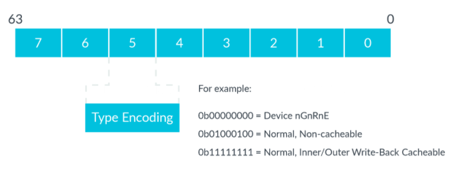

The selected field determines the memory type and cacheability information.

Why is an index to a register used, instead of encoding the memory type directly into the translation table entries? Because the number of bits in the translation table entries is limited. It requires eight bits to encode the memory type, but only three bits to encode the index into MAIR_ELx. This allows the architecture to efficiently use fewer bits in the table entries.

## Cacheability and shareability attributes

Locations marked as Normal also have cacheability and shareability attributes. The cacheability attributes control whether a location can be cached. If a location can be cached, the shareability attributes control which other agents need to see a coherent copy of the memory. This allows for some complex configuration, which is beyond the scope of this guide. However, Arm expects operating systems to mark the majority of DRAM memory as Normal Write-back cacheable, Inner shareable.

## Permissions

Access permissions can be encoded using either the direct permission scheme, or the indirect permission scheme. This chapter discusses the direct permission scheme. See the Permission indirection and permission overlay extensions section of this guide for details of the indirect permission scheme.

In the direct permissions scheme, the Access Permissions (AP) attribute controls whether a location can be read and written, and what privilege is necessary. 

|AP|Unprivileged (EL0)|Privileged(EL1/2/3)|
|-|-|-|
|00|No access|Read/write|
|01|Read/write|Read/write|
|10|No access|Read only|
|11|Read only|Read only|

If an access breaks the specified permissions, for example a write to a read-only region, an exception(labelled as a permission fault) is generated.

### Privileged accesses to unprivileged data

The standard permissiion model is that a more privileged entity can access anything belonging to a less privileged entity. For example, an OS can see all the resources that are allocated to an application, or a hypervisor can see all the resources that are allocated to a virtual machine (VM). This is because executing at a higher exception level means that the level of privilege is also higher.

However, this is not always desirable. Malicious applications might try to trick an OS into accessing data on behalf of the application, which the application should not be able to see. This requires the OS to check pointers in system calls.

The Arm architecture provides several controls to make this simpler. First, there is the PSTATE.PAN (Privileged Access Never)bit. When this bit is set, loads and stores from EL1 (or EL2 hen E2H==1) to unprivileged regions will generates an exception (Permission Fault), like this diagram illustates:

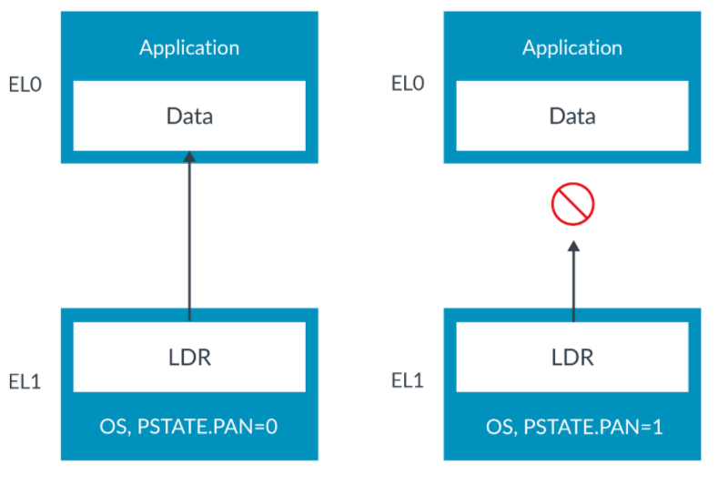

PAN allows unintended accesses to unprivileged data to be trapped. For example, the OS performs an access thinking that the destination is privilieged. In fact, the destination is unprivileged. This means that there is a mismatch between the OS expectation (that the destination is privieged) and reality (the destination is unprivileged). This could occure due to a programming error, or could be the result of an attack on the system. PAN allows us to trap the access before it occurs, catching the error or preventing the attack.

Sometimes the OS does need to access unprivileged regions, for example, to write to a buffer owned by an application. To support this, the instruction set provides the LDTR and STTR instructions.

LDTR and STTR are unprivileged loads and stores. They are checked against EL0 permission checking even when executed by the OS at EL1 or EL2. Because these are explicitly unprivieged access, they are not blocked by PAN,like this shows:

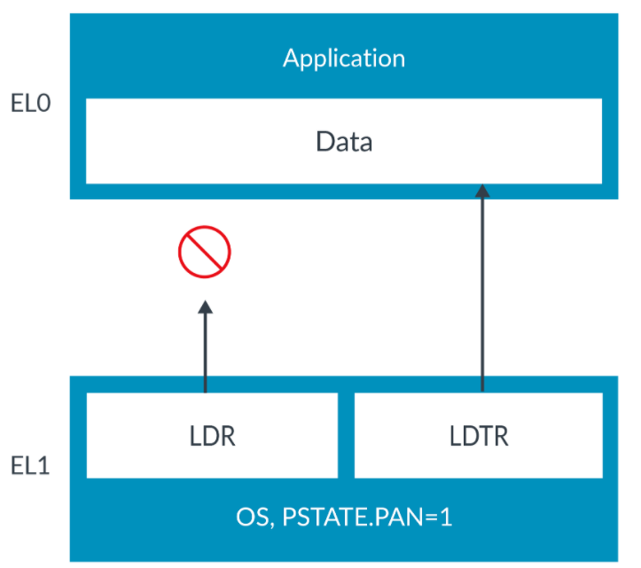

This allows the OS to distinguish between accesses that are intended to access privileged data and those which are expected to access unprivileged data. This also allows the hardware to use that information to check the accesses.

The T in LDTR stands for translation. This is because the first Arm processors to support virtual to physical translation only did so for User mode applications, not for the OS. For the OS to access application data it need a special load, a load with translation. Today of course, all software sees virtual addresses, but the name has remained.

### Execution permissions

In addition to data access permissions, there are also execution permissions. These attributes let you specify that instructions cannot be executed from the address:

- UXN. User (EL0) Execute Never (Not used at EL3, or EL2 when HCR_EL2.E2H == 0)
- PXN. Privileged Execute Never (Called XN at EL3, and EL2 when HCR_EL2.E2H == 0)

These are Execute Never bits. This means that setting the bit makes the location not executable.

There are separate Privileged and Unprivileged bits, because application code needs to be executable in user space (EL0) but should never be executed with kernel permissions (EL1/EL2),

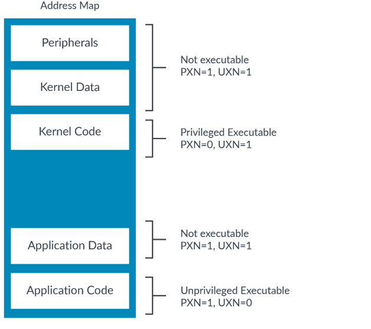

The architecture also provides controls bits in the System Control Register (SCTLR_ELx) to make all write-able addresses non-executable.

A location with EL0 write permissions is never executable at EL1.

## Permission indirection and permission overlay extensions

Access permissions can be encoded using either the direct permission scheme or the indirect permission scheme. This chapter discusses the indirect permission scheme. See the Permissions section of this guide for details of the direct permission scheme.

Permission indirection introduces a way to set permissions which allows more efficient use of the permission bits in Translation Table Descriptors (TTDs) while providing the ability to introduce new permission types.

Permission overlays allow permissions to be progressively restricted by processes running at EL0 while reducing the number of calls to processes running at more privileged exception levels (such as the OS), and without requiring costly Translation Lookaside Buffer (TLB) maintenance.

The use of permission indirection and permission overlays allows for a much more flexible approach to setting permissions on pages of memory and can reduce the performance impact of modifying access permissions.

### Permission indirection

When permission indirection is enabled, a Permission Indirection Index(PIIndex) field in the TTD is available. The PIIndex into the Permission Indirection Register(PIR) for the appropriate exception level, so that the OS(EL1), Hypervisor(EL2), or firmware(EL3) can set the stage 1 translation base permissions:

|Register|Description|
|-|-|
|PIRE0_EL1|PIR to set unprivileged EL1&0 base permissions|
|PIRE0_EL2|PIR to set unprivileged EL2&0 base permissions|
|PIR_EL1|PIR to set privileged EL1 base permissions|
|PIR_EL2|PIR to set privileged EL2 base permissions|
|PIR_EL3|PIR to set privileged EL3 base permissions|

The PIRE0_ELx, or PIR_ELx register fields indicate the base permissions to be applied to that page of memory. See th description of the Permission Indirection Registers for details of the permissions available.

The PIR filed indexed in the PII also specifies whether permission overlay is applied to that page of memory. If the PIR entry indicates that permission overlay is not applied, the POI field in the tranlation table entry is ignored.

### Permission overlays

The base permissions for the page of memory can be further restricted by use of the Permission Overlay Index (POIndex) field in the translation table entries. The POIndex field indexes into the Permission Overlay Register(POR) for the execution level:

|Register|Description|
|-|-|
|PRO_EL0|POR for unprivileged EL0 stage 1 overlay permissions|
|PRO_EL1|POR for privileged EL1 stage 1 overlay permissions|
|PRO_EL2|POR for privileged EL2 stage 1 overlay permissions|
|PRO_EL3|POR for privileged EL3 stage 1 overlay permissions|

The POR_ELx register fields specify the permissions overlay that is applied to the memory pages in addition to the base permissions. See the descriptions of the Permissions Overlay Registers for details of the addtional permission restrictions that can be configured.

The base permissions setting is allowed to be cached in the TLB, but the overlay setting is not. This means that the overlay setting can be changed without the need for a costly TLB invalidate(TLBI).

### An example of using permission indirection and permission overlay features

## Access Flag

You can use the Access Flag (AF) bit to track whether a region covered by the translation table entry has been accessed. You can set the AF bit to:

- AF = 0. Region not accessed
- AF = 1. Region accessed.

The AF bit is useful for operating systems, because you can use it to identify which pages are not currently being used and could be paged-out.

### Updating the AF bit

When the AF bit is being used, the translation tables are created with the AF bit initially clear. When a page is accessed, its AF bit is set. Software can parse the tables to check whether the AF bits are set or clear. A page with AF == 0 cannot have been accessed and is potentially a better candidate for being paged-out.

There are two ways that the AF bit can be set on access:

- Software Update: Accessing the page causes a synchronous exception (Access Flag fault). In the exception handler, software is responsible for setting the AF bit in the relevant translation table entry and returns.
- Hardware Update: Accessing the page causes hardware to automatically set the AF bit without needing to generate an exception. This behavior needs to be enabled using the hardware access update bit of the Translation Control Register(TCR_ELx.HA) that was added in Armv8.1-A.

### Dirty state

Armv8.1-A introduced the ability for the processor to manage the dirty state of a block or page. Dirty state records whether the block or page has been written to. This is useful, because if the block or page is paged-out, dirty state tells the managing software whether the contents of RAM need to be written out to the storage.

For example, let's consider a text file. The file is initially loaded from disk(Flash or hard drive) into RAM. When it is later removed from memory, the OS needs to know whether the content in RAM is more recent than what is on disk. If the content in RAM is more recent, then the copy on disk needs to be updated. If it is not, then the copy in RAM can be dropped.

When managing dirty state is enabled, software initially creates the translation table entry with the access permission set to Read-only and the DBM (Dirty Bit Modifier) bit set. If that page is written to, the hardware automatically updates the access permissions to Read-Write.

Setting the DBM bit to 1 changes the function of the access permission bits (AP[2] and S2AP[1]), so that instead of reording write permission, they record dirty state. This means that when the DBM bit is set to 1 the access permission bits do not cause permission faults.

The same results can be achieved without using the hardware update option. The page would be marked as Read-only, resulting in an exception (permission fault) on the first write. The exception handler would manually mark the page as read-write and then return. This approach might still be used if software wants to do copy-on-write.

## Alignment and endianness

### Alignment

An access is described as aligned if the address is a multiple of the element size.

For LDR and STR instructions, the element size is the size of the access. For example, a LDRH instruction loads a 16-bit value and must be from an address which is a multiple of 2 bytes to be considered aligned.

The LDP and STP instructions load and store a pair of elements, respectively. To be aligned, the address must be a multiple of the size of the elements, not the combined size of both elements. For example:

```
LDP x0,x1,[x2]
```

This example loads two 64-bit value, so 128 bits in total. The address in X2 needs to be a multiple of 64 bits to be considered aligned.

The same principle applies to vector loads and stores.

When the address is not a multiple of the element size, the access is unaligned. Unaligned accesses are allowed to addresses marked as Normal, but not to Device regions. An unaligned access to a Device region will trigger an exception (alignment fault).

Unaligned accesses to regions marked as Normal can be trapped by setting SCTLR_ELx.A. If this bit is set, unaligned accesses to Normal regions also generate alignment faults.

### Endianness

In Armv8-A, instruction fetches are always treated as little-endian.

For data accesses, it is IMPLEMENTATION DEFINED whether both little-endian and big-endian are supported. And if only one is supported, it is IMPLEMENTATION DEFINED which one is supported. For processors that support both big-endian and little-endian, endianness is configured per Exception level.

## Memory aliasing and mismatched memory types

When a given location in the physical address space has multiple virtual addresses, this is called aliasing.

Attributes are based on virtual addresses. This is because attributes come from the translation tables. When a physical location has multiple aliases, it is important that all of the virtual aliases have compatible attributes. We describe compatible as:

- Same memory type, and for Device the same sub-type
- For Normal locations, the same cacheability and shareability

If the attributes are not compatible, the memory accesses might not behaves as expected.

This diagram shows two examples of aliasing. The two aliasing. The two aliases of location A have compatible attributes. This is the recommended approach. The two aliases location B have incompatible attributes(Normal and Device), which can negatively affect coherency and performance:

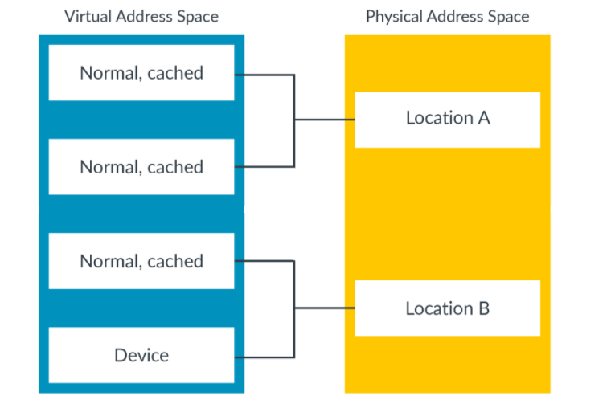

Arm strongly recommends that software does not assign incompatible attributes to different aliases of the same location.

