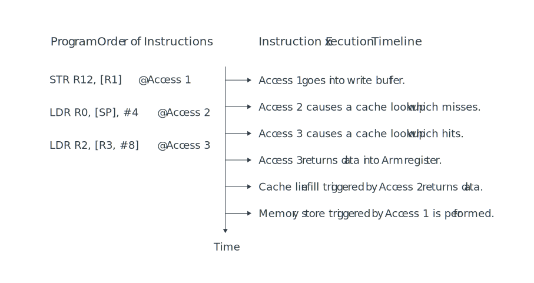
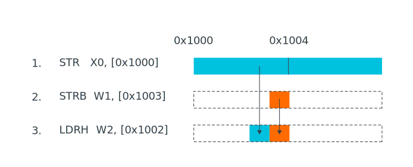

# Memory System, Ordering, and Barriers

## Memory ordering

Armv8-A implements a weakly-ordered memory architecutre. This architecture permits memory accesses which impose no dependencies to be issued or observed, and to complete in a different order from the order that is specified by the program order.

These weakly-ordered memory behaviors are only permitted if:

- The defined memory is Normal,Device-nGRE, or Device-GRE,or
- Device-nR accesses span a peripheral, as described in the Device memory and Normal memory topics in the Armv8-A memory model guide.

Memory reordering allows advanced processors to operate more efficiently, as you can see in the following diagram:



In this diagram, three instructions are listed in program order:

1. The first instruction, Access 1, performs a write to external memory that goes to the write buffer. This instruction is followed in program order by two reads.
2. The first read, Access 2, misses in the cache.
3. The next read, Access 3, hits in the cache.

Both read accesses could complete before the write buffer completes the write that is associated with Access 1. Caches which support Hit-Under-Miss mean that a load that hits in the cache, like Access 3, can complete before a load earlier in the program that missed in the cache, like Access 2.

### Limits on reordering

It is possible to reorder accesses to location that are marked Normal, Device-nGRE, or DeviceGRE. Consider the following example code sequence:



If the processor reordered these accesses, we might end up with the wrong value in memory, which is not allowed.

For accesses to the same bytes, ordering must be maintained. The processor needs to detect the read-after-write hazard and ensure that accesses are ordered correctly for intened outcome.

This does not mean that there is no possibility of optimization with this example. The processor could merge the two stores together, presenting a single combined store to the memory system. The processor could also detect that the load operation is from the bytes that are written by the store instructions. This means that the processor could return the new value without rereading it from memory.

In other cases, for example Address Dependencies, ordering is enforced. An address Dependency occurs when a load or store uses the result of previous load as an address. Here is an example:

```
LDR X0, [X1] 
STR X2, [X0]  ; Result of previous load is the address in this store.
```

Here is another example:

```
LDR X0, [X1] 
STR X2, [X5, X0] ; Result of previous load is used to calculate the address.
```

If there is an Address Dependency between two memory accesses, the processor must maintain the order.

This rule does not apply to control dependencies, which occur when the value from a previous load is used to make a decision. For example:

```
LDR X0, [X1] 
CBZ X0, somewhere_else 
LDR X2, [X5]      ; The control dependency on X0 does not guarantee ordering.
```

Sometimes, ordering needs to be enforced between accesses to Normal memory, or accesses to Normal and Device memory. Ordering can be achieved using Barrier instructions.

## Memory barriers

Memory barrier is the general term for an instruction which explicitly forces some form of ordering, synchronization, or restriction to memory accesses.

The Armv8 architecture defines memory barriers that provide a range of functionality, including:

- Ordering of load and store instructions
- Completion of load and store instructions
- Context synchronization
- Restrictions on speculation

There are some situations in which the effects of a weakly-ordered memory architecture are not desirable. The effects of these situations can later cause incorrect operation. This guide introduces the different memory barriers that are described by the architecture, and then identifies some of the common cases in which explicit ordering is required. This guide also describes how to use memory barriers to ensure correct operation.

## Who is an Observer?

An Observer refers to either a Processor Element (PE) or some other mechanism in the system, such as a peripheral device, that can generate reads from, or writes to, memory. Observers can observe memory accesses. The memory barriers in this guide specify when and which Observers observe these memory accesses.

A write to memory is observed when it reaches a point in the memory system in which it becomes visible. When it is visible, it is coherent to all the Observers in the specified Shareability domain, as specified in the memory barrier instruction. If a PE writes to a memory location, the write is observable if another PE would see the updated value if it read the same location. For example, if the memory is Normal cacheable, the write is observable when it reaches the coherent data caches of that Shareability domain.

The Armv8-A memory model is described as Other-multi-copy atomic. In an Other-multi-copy atomic system, a write from an Observer, if observed by a different Observer, must be observed by all other Observers that access the location coherently. However, an Observer can observe its own writes before making them visible to other observers in the system.

In practice, a memory model that is described as Other-multi-copy atomic allows PEs to implement local store buffers that are not coherent with other observers in the system, but that are locally hazard-checked for dependencies. Store Buffers (STBs) are micro-architectural mechanisms that are used to decouple the execution pipeline of a PE from the Load/Store Unit (LSU).

## Data Memory Barrier

The Data Memory Barrier (DMB) prevents the reordering of specified explicit data accesses across the barrier instruction. All explicit data load or store instructions, which are executed by the PE in program order before the DMB, are observed by all Observers within a specified Shareability domain before the data accesses after the DMB in program order.

## Data Synchronization Barrier

A DSB is a memory barrier that ensures that those memory accesses that occur before the DSB have completed before the completion of the DSB instruction. In doing this, it acts as a stronger barrier than a DMB. All the ordering that a DMB creates with specific arguments is also generated by a DSB with the same arguments.

## Instruction Barriers

The Arm architecture defines the context of the PE as the state of the caches, TLBs, and the System registers. Performing cache or TLB maintenance operations or updating System registers is classed as a context-changing operation.