# AArch64 virtualization Guide

https://developer.arm.com/documentation/102142/0100/Introduction-to-virtualization

## intriduction to virtualization

## virtualization in AArch64

Software running at EL2 or higher has access to serveral controls for virtualization:

- Stage 2 translation
- El1/0 instruction and register access trapping
- Virtual exception generation

## Stage 2 translation

### What is stage 2 translation

### VMIDs

Each VM is assigned a virtual machine identifier (VMID). The VMID is used to tag translation lookaside buffer (TLB) entries, to identify which VM each entry belongs to. This tagging allows translations for multiple different VMs to be present in the TLBs at the same time.

### VMID interaction with ASIDs

TLB entries can also be tagged with an Address Space Identifier (ASID). An application is assigned an ASID by the OS, and all the TLB entries in that application are tagged with that ASID.

This means that TLB entries for different applications are able to coexist in the TLB, without the possibility that one application uses the TLB entries that belong to a different application.

Each VM has its own ASID namespace. For example, two VMs might both use ASID 5, but they use them for different things. The combination of ASID and VMID is the thing that is important.

### Attribute combining and overriding

The stage 1 and stage 2 mapping both include attributes, such as type and access permissions. The Memory Management Unit(MMU) combines the attributes from the two stages to give a final effective value. The MMU does this by selecting the stage that is more restrictive, as you can see here:

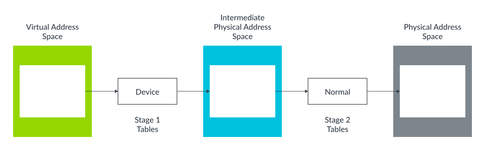

In this example, the Device type is more restrictive than the Normal type. Therefore, the resulting type is Device. The result ould be the same if we reversed the example, so that stage 1 = Normal, and stage 2 = Device.

This method os combining attributes works for most use cases, but sometimes the hypervisor might want to override this behavior. For example, during early boot of a VM. For these cases, there are some control bits that override the normal behavior:

- HCR_EL2.CD. This makes all stage 1 attributes Non-cacheable.
- HCR_EL2.DC. This forces stage 1 attributes to be Normal, Write-Back Cacheable.
- HCR_EL2.FWB. This allows stage 2 to override the stage 1 attribute, instead of regular attribute combining.

### Emulating Memory-mapped Input/Output(MMIO)

Like the physical address space on a physical machine, the IPA space in a VM contains regions that are used to access both memory and peripherals, as shown here:

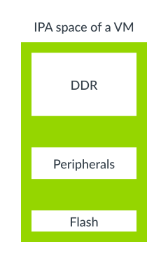

The VM can use peripherals regions to access both real physical peripherals, which are often referred to as directly assigned peripherals, and virtual peripherals.

Virtual peripherals are completely emulated in software by the hypervisor, as this diagram highlights:

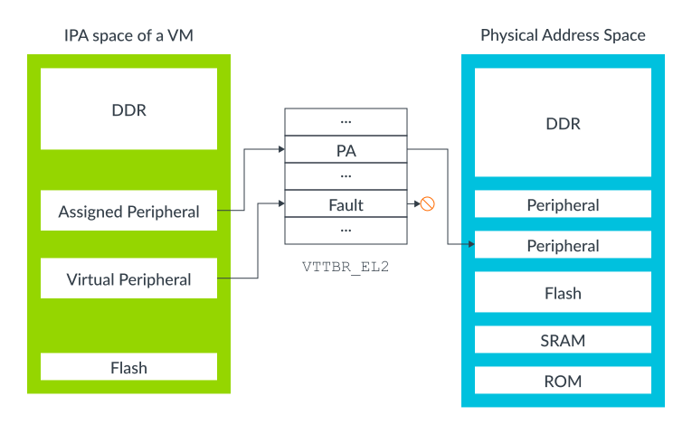

An assigned peripheral is a real physical device that has been allocated to the VM, and mapped into its IPA space. This allows software that is running within the VM to interact with peripheral directly.

A virtual peripheral is one that the hypervisor is going to emulate in software. The corresponding stage 2 table entries would be marked as fault. Software in the VM thinks that it can talk directly to the peripheral, but each access triggers a stage 2 fault, with the hypervisor emulating the peripheral access in the exception handler.

To emulate a peripheral, a hypervisor needs to know not only which peripheral was accessed, but also which register in that peripheral was accessed, whether the access was a read or a write, the size of the access, and the registers used for transferring data.

The Exception Model guide introduces the FAR_ELx registers. When dealing with stage 1 fualts, these registers report the virtual address that triggered the exception. A virtual address is not helpful to a hypervisor, because the hypervisor would not usually know how the Guest OS has configured its virtual address space. For stage 2 faults, there is an additional register, HPFAR_EL2, which reports the IPA of the address that aborted. Because the IPA space is controlled by the hypervisor, it can use this information to determine the register that it needs to emulate.

For single general-purpose register loads or stores that trigger a stage 2 fault, addintional syndrome information is provided. This information includes the size of the accesses and the source or destination address, and allows a hypervisor to determine the type of access that is being made to the virtual peripheral.

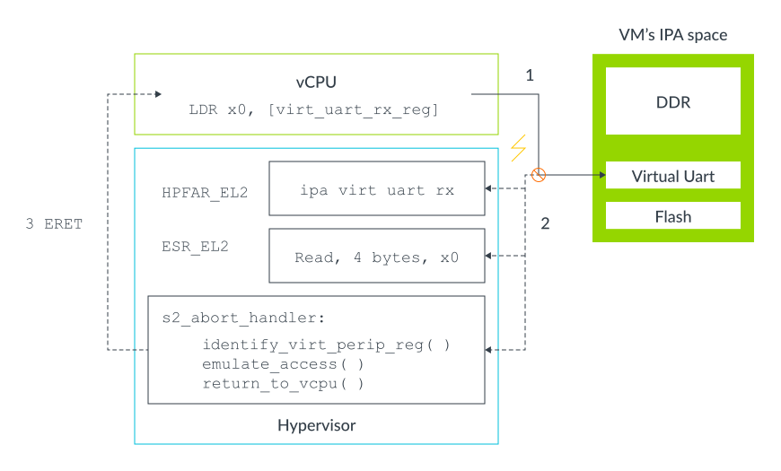

This process is described in these steps:

1. Software in the VM attempts to access the virtual peripheral. In this example, this is the receive FIFO of a virtual UART.
2. This access is blocked at stage 2 translation, leading to an abort routed to EL2.
   - The abort populates ESR_EL2 with information about the exception, including the number of bytes accessed, the target register and whether it was a load or store.
   - The abort also populates HPFAR_EL2 with the IPA of the aborting access.
3. The hypervisor uses the information from ESR_EL2 and HPFAR_EL2 to identify the virtual peripheral register accessed. This information allows the hypervisor to emulate the operation. It then returns to the vCPU via an ERET.
   - Execution restarts on the instruction after the LDR.

### System Memory Management Units (SMMUs)

So far, we have considered different types of access that come from the processor. Other masters in a system, such DMA controllers, might be allocated for use by a VM. We need some way to extend the stage 2 protections to those masters as well.

Consider a system with a DMA controller that does not use virtualization, as shown in the following diagram:

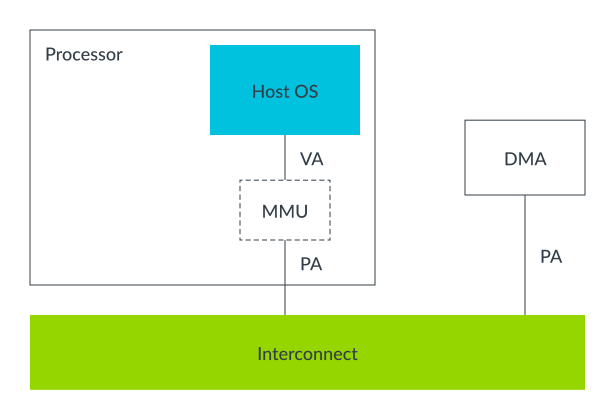

The DMA controller would be programmed via a driver, typically in kernel space. That kernel space driver can ensure that the OS level memory protections are not breached. This means that one application cannot use the DMA to get access to memory that it should not be able to see.

Let's consider the same system, but with the OS running within a VM, as shown in the following diagram:

In this system, a hypervisor is using stage 2 to provide isolation between VMs. The ability of software to see memory is limited by the stage 2 tables that the hypervisor controls.

Allowing a driver in the VM to directly interact with the DMA controller creates two problems:

- Isolation: The DMA controller is not subject to the stage 2 tables, and could be used to breach the VM's sandbox.
- Address space: With two stages of translation, what the kernel believes to be PAs are IPAs. The DMA controller still sees PAs,therefore the kernel and DMA controller have different views of memory. To overcome this problem, the hypervisor could trap every interaction between the VM and the DMA controller, providing the necessary translation. When memory is fragmented, this process is inefficient and problematic.

An alternative to trapping and emulating driver accesses is to extend the stage 2 regime to also cover other masters, such as our DMA controller. When this happens, those masters also need an MMU. This is referred to as a System Memory Management Unit (SMMU, sometimes also called IOMMU):

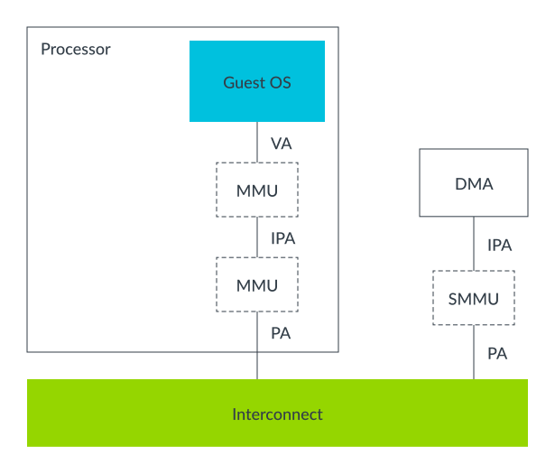

The hypervisor would be responsible for programming the SMMu, so that the upstream master, which is the DMA in our example, sees the same view of memory as the VM to which it is assigned.

This process solves both of the problems that we identified. The SMMU can enforce the isolation between VMs, ensuring that external masters cannot be used to breach the sandbox. The SMMU also gives a consistent view of memory to software in the VM and the external masters allocated to the VM.

Virtualization is not the only use case for SMMUs. There are many other cases that are not covered within the scope of this guide.

## Trapping and emulation of instruction

Sometimes a hypervisor needs to emulate operations within a Virtual Machine (VM). For example, software within a VM might try to configure low level processor controls relating to power management or chache coherency. Typically, you do not want to give the VM direct access to these controls, because they could be used to break isolation, or to affect other VMs in your system.

A trap causes an exception when a given action, such as reading a register, is performed. A hypervisor needs the ability to trap operations, like the ones that configure low level controls, in a VM and emulate them, without affecting other VMs.

The architecutre includes trap controls for you to trap operations in a VM and emulate them. When a trap is set, performing a specific action that would normally be allowed causes an exception to a higher Exception level. A hypervisor can use these traps to emulate operations within a VM.

For example, executing a Wait For Interrupt(WFI) instruction usually puts the CPU into a low power state. By asserting the TWI bit, if HCR_EL2.TWI==1, then executing WFI at EL0 or EL1 will instead cause an exception to EL2.

#### Note

> Traps are not just for virtualization. There are EL3 and EL1 controlled traps as well. However, traps are particularly useful to virtualization software. This guide only discusses the traps that are typically associated with virtualization.

In our WFI example, an OS would usually execute WFI as part of an idle loop. With a Guest OS within a VM, the hypervisor can trap this operation and schedule a different vCPU instead, as this diagram shows:

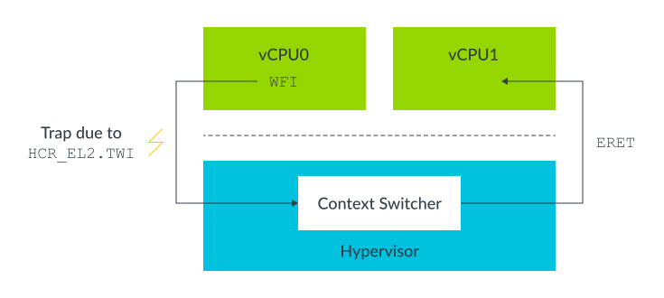

### Presenting virtual values of registers

Another example of using traps is to present virtual values of registers. For example, ID_AA64MMFR0_EL1 reports support for memory system-related features in the processor. An OS might read this register as part of boot, to determine which features within the kernel to enable. A hypervisor might want to present a different value, called a virtual value, to the Guest OS.

To do this, the hypervisor enables the trap that covers reads of the register. On a trap exception, the hypervisor determines which trap was triggered, and then emulates the operation. In this example, the hypervisor populates the destination register with the virtual value of ID_AA64MMFR0_EL1, as shown here:

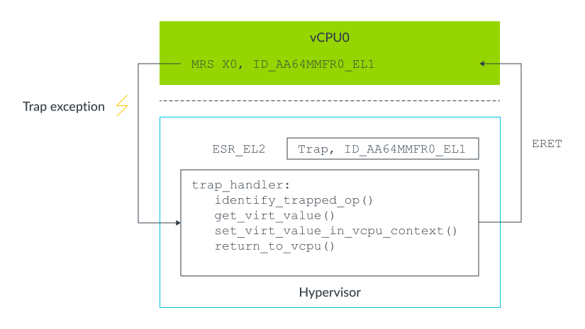

Traps can also be used as part of lazy context switching. For example, an OS will typically initialize the Memory Management Unit (MMU) configuration registers (TTBR<n>_EL1, TCR_EL1 and MAIR_EL1) during boot, and then will not reprogram them again. A hypervisor can use this to optimize its context switching routine, by only restoring the registers on a context switch and not saving them.

However, the OS might do something unusual and reprogram the register after boot. To avoid this causing any problems, the hypervisor can set the HCR_EL2.TVM trap. This setting causes any write to the MMU related registers to generate a trap into EL, which allows the hypervisor to detect whether it needs to update its saved copies of those registers.

#### Notes

> The architecture uses the terms trapping and routing for separate, but related,concepts. To recap, a trap causes an exception when a given action, such as reading a register, is performed. Routing refers to the Exception level that an exception is taken to once it has been generated.

### MIDR and MPIDR

Using a trap to virtualize an operation requires significant computation. The operation generates a trap exception to EL2,and the hypervisor determines the desired operation, emulates it and then returns to the guest. Feature registers, such as ID_AA64MMFR0_EL1, are not frequently accessed by operating systems. This means that the computation is acceptable when trapping accesses to these registers into a hypervisor to emulate a read.

For registers that are accessed more frequently, or in performance critical code, you want to avoid such compute load. Example of these registers and their values include:

- MIDR_EL1. The type of processor, for example Cortex-A53
- MPIDR_EL1. The affinity, for example core 1 of processor 2

A hypervisor might want a Guest OS to see the virtual values of these register, without having to trap each individual access. For these registers, the architecture provides an alternative to trapping:

- VPIDR_EL2. This is the value to return for EL1 reads of MIDR_EL1.
- VMPIDR_EL2. This is the value to return for EL1 reads of MPIDR_EL1.

The hypervisor can setup these registers before entering the VM. If software running within the VM read MIDR_EL1 or MPIDR_EL1, the hardware will automatically return the virtual value, without the need for a trap.

#### Notes

> VMPIDR_EL2 and VPIDR_EL2 do not have defined reset values. They must be initialized by start-up code before entering EL1 for the first time. This is especially important in bare metal environments.

### Virtualizing exceptions

Interrupts are used by hardware in the system to signal events to software. For example, a GPU might send an interrupt to signal that it has completed rendering a frame.

A system that uses virtualization is more complex. Some interrupts might be handled by the hypervisor itself. Other interrupts might come from devices allocated to a virtual Machine(VM), and need to be handled by software within that VM. Also, the VM that is targeted by an interrupt might not be running at the time that the interrupt is received.

This means that you need mechanism to support the handling of some interrupts in EL2 by the hypervisor. You also need mechanisms for forwarding other interrupts to a specific VM or specific Virtual CPU (vCPU) within a VM.

To enable these mechanisms, the architecture includes support for virtual interrupts: vIRQs, vFIQs, and vSErrors. These virtual interrupts behave like their physical couterparts (IRQs,FIQs,and SErrors), but can only be signaled while executing in EL0 and EL1. It is not possible to receive a virtual interrupt while executing EL2 or EL3.

#### Notes

> To recap, support for virtualization in Secure state was introduced in Armv8.4-A. For a virtual interrupt to be signaled in Secure EL0/1, Secure EL2 needs to be supported and enabled. Otherwise virtual interrupts are not signaled in Secure state

### Enabling virtual interrupts

To signal virtual interrupts to EL0/1, a hypervisor must set the corresponding routing bit in HCR_EL2. For example, to enable vIRQ signaling, a hypervisor must set HCR_EL2.IMO. This setting routes physical IRQ exception to EL2, and enables signaling of the virtual exception to EL1.

Virtual interrupts are controlled per interrupt type. Intheory, a VM could be configured to receive physical FIQs and virtual IRQs. In practice, this is unusual. A VM is usually configured only to receive virtual interrupts.

### Generating virtual interrupts

There are two mechanisms for generating virtual interrupts:

1. Internally by the core, using controls in HCR_EL2.
2. Using a GICv2, or later, interrupt controller.

Let's start with mechanism 1. There are three bits in HCR_EL2 that control virtual interrupt generation:

- VI = Setting this bit registers a vIRQ.
- VF = Setting this bit registers a vFIQ.
- VSE = Setting this bit registers a vSError.

Setting one of these bits is equivalent to an interrupt controller asserting an interrupt signal into the vCPU. The generated virtual interrupt is subjects to PSTATE masking, just like a regular interrupt.

This mechanism is simple to use, but the disadvantage is that it only provides a way to generate the interrupt itself. The hypervisor is then required to emulate the operation of the interrupt controller in the VM. To recap, thrapping and emulating operations in software involve overhead that is best avoided for frequent operations such as interrupts.

The second option is to use Arm's Generic Interrupt Controller (GIC) to generate virtual interrupts. From Arm GICv2, the GIC can signal both physical and virtual interrupts, by providing a physical CPU interface and a virtual CPU interface, as shown in the following diagram:

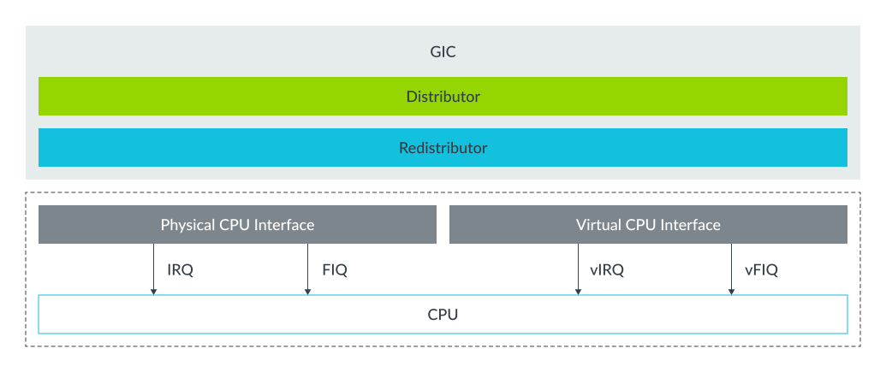

These two interface are identical, except that one signals physical interrupts and the other one signals virtual interrupts. The hypervisor can map the virtual CPU interface into a VM, allowing software in that VM to communicate directly with the GIC. The advantage of this approach is that the hypervisor only needs to set up the virtual interface, and does not need to emulate it. This approach reduces the number of times that the execution needs to be trapped to EL2, and therefore reduces the overhead of virtualizing interrupts.

#### Note

> Although Arm GICv2 can be used with Armv8-A designs, it is more common to see GICv3 or GICv4 used.

### Example of forwarding an interrupt to a vCPU

So far, we have looked at how virtual interrupts are enabled and generated. Let's see an example that shows the forwarding of a virtual interrupt to a vCPU. In this example, we will consider a physical periperhal that has been assigned to a VM, as shown in the following diagram:

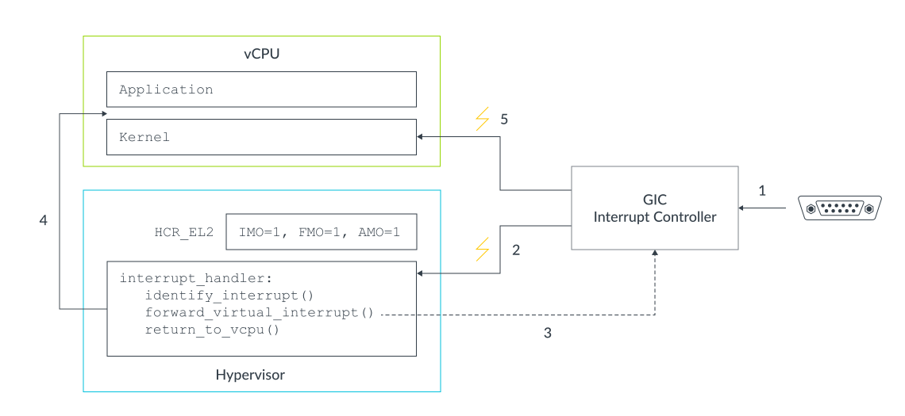

The diagram illustrates these steps:

1. The physical peripheral asserts its interrupt signal into the GIC.
2. The GIC generates a physical interrupt exception, either IRQ or FIQ, which gets routed to EL2 by the configuration of HCR_EL2.IMO/FMO. The hypervisor identifies the peripheral and determines that it has been assigned to a VM. It checks which vCPU the interrupt should be forwarded to.
3. The hypervisor configures the GIC to forward the physical interrupt as a virtual interrupt to the vCPU. The GIC will then assert the vIRQ or vFIQ signal, but the processor will ignore this signal while it is executing EL2.
4. The hypervisor returns control to the vCPU.
5. Now that the processor is in the vCPU (EL0 or EL1), the virtual interrupt from GIC can be taken. This virtual interrupt is subject to the PSTATE exception masks.

The example shows a physical interrupt being forwarded as a virtual interrupt. The example matches the assigned peripheral model described in the section on stage 2 translation. For a virtual peripheral, a hypervisor can create a virtual interrupt without linking it to a physical interrupt.

### Interrupt masking and virtual interrupts

In the AArch64 Exception Model guide, we introduced the interrupt mask bits in PSTATE, PSTATE.I for IRQs, PSTATE.F for FIQs, PSTATE.A for SErrors. When operating within a virtualized environment, these masks work in a slightly different way.

For example,for IRQs we have already seen that setting HCR_EL2.IMO does two things:

- Route physical IRQs to EL2
- Enables signaling of vIRQs in EL0 and EL1

This setting also changes the way that the PSTATE.I mask is applied. While in EL0 and EL1, if HCR_EL2.IMO==1,PSTATE.I operates on vIRQs not pIRQs.

### Virtualizing the generic timers

### Virtualization host extensions

The following diagram shows a simplified version of the software stack and Exception Level that we looked at in the section on virtualizing exceptions:

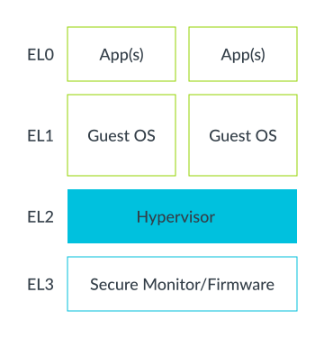

You can see how a standalone hypervisor maps to the Arm Exception levels. The hypervisor is running at EL2 and the virtual machines(VMs) at EL0/1. This situation is more problematic for hosted hypervisors, as shown in the following diagram:

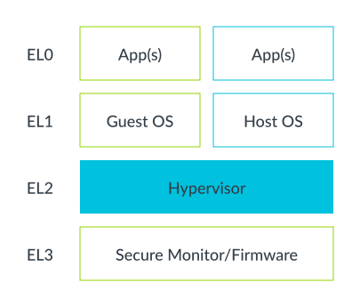

Traditionally, kernel run at El1, but the virtualization controls are in EL2. This means that most of the Host OS is at EL1, with some stub code running in EL2 to access the virtualization controls. This arrangement can be inefficient, because it may involve additional context switching.

The kernel will need to handle some differences between running at EL1 and EL2, but these are restricted to a small number of subsystems, for example early boot.

### Running the Host OS at EL2

VHE is controlled by two bits in HCR_EL2. These bits can be summarized as:

- E2H: Controls whether VHE is enabled.
- TGE: When VHE is enabled, controls whether EL0 is Guest or Host.

The following table summarizes the typical settings:

|Executing in HCR_EL2:|E2H|TGE|
|-|-|-|
|Guest kernel(EL1)|1|0|
|Guest OS(EL0)|1|0|
|Host kernel(EL2)|1|1*|
|Host application(EL0)|1|1|

*On an exception that exits from a VM into the hypervisor, TGE would initially be 0. Software would have to set the bit before running the main part of the host kernel.

You can see these typical settings in the following diagram:

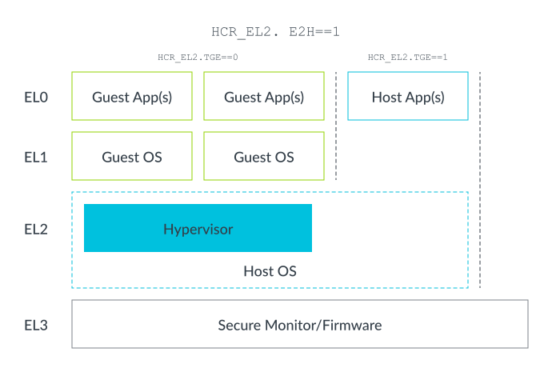

### Virtual address space

The following diagram shows what the virtual address spaces of EL0/EL1 looked like before VHE was introduced:

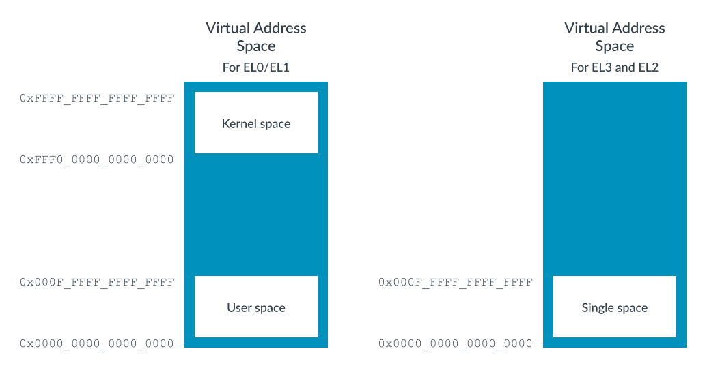

As discussed in Memory Management, EL0/1 has two regions. By convention, the upper region is refered to as kernel space, and the lower region is referred to as user space. However, EL2 only has a single region at the bottom of the address range. This difference is because, traditionally, a hypervisor would not host applications. This means that the hypervisor does not need a split between kernel space and user space.

#### Note

> The allocation of kernel space to the upper region, and user space to the lower region, is simplya convention. It is not mandated by the Arm architecture.

The EL0/1 virtual address space also supports Address Space Identifiers(ASID),but EL2 does not. This is because the hypervisor would not usually host applications.

To allow our Host OS to execute efficiently in EL2, we need to add the second region and ASID support. Setting HCR_EL2.E2H addresses these issues, as you can see in the following diagram:

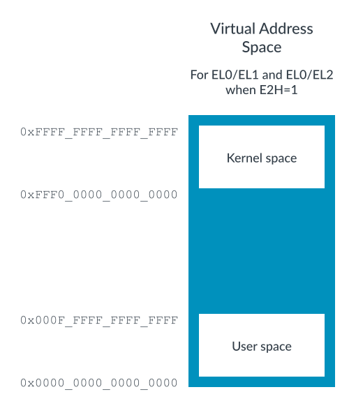

While in EL0, HCR_EL2.TGE controls which virtual address space is used: either the EL1 space or the EL2 space. Which space is used depends on whether the application is running under the Host OS (TGE==1) or the Guest OS (TGE==0).

### Re-directing register accesses

We saw in the section on Virtualizing generic timers that enabling VHE changes the layout of the EL2 virtual address space. However, we still have a problem with the configuration of the MMU. This is because our kernel will try to access _EL1 registers, such as TTBR0_EL1, rather than _EL2 registers such as TTBR0_EL2.

To run the same binary at EL2, we need to redirect the accesses from the EL1 registers to the EL2 equivalents. Setting E2H will do this, so that accesses to _EL1 system registers are redirected to their EL2 equivalents. This redirection illustrated in the following diagram:

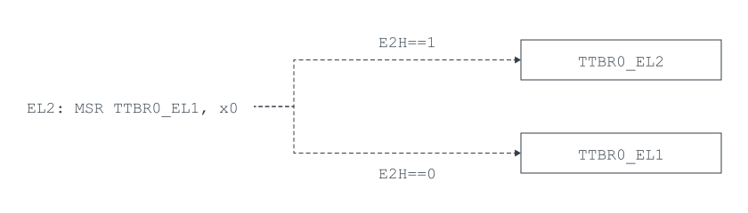

However, this redirection leaves us with a new problem. A hypervisor still needs access to the real _EL1 registers, so that it can implement task switching. To resolve this, a new set of register aliases are introduced with an _EL2 or EL02 suffix. When used at EL2, with E2H==1, these give access to the EL1 register for context switching. You can see this in the following diagrams:

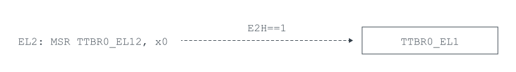

### Exceptions

Usually, the HCR_EL2.IMO/FMO/AMO bits control whether physical exceptions are routed to EL1 or EL2. When executing with TGE==1, all physical exceptions are routed to EL2, unless they are routed to EL3 by SCR_EL3. This is the case regardless of the actual values of the HCR_EL2 routing bits. This is because the application is executing as a child of the Host OS, and not a Guest OS. Therefore, any exceptions should be routed to the Host OS that is running in EL2.