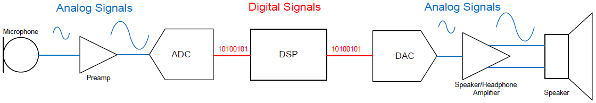
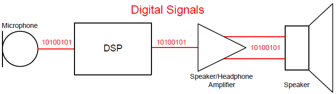

# Audio

## 难点

### 车里根本不是安静环境

在家听歌，环境通常 20~35dB，相对安静，但车内跑起来以后，车里噪声能轻松 60~75dB，高速甚至更高。你的音乐是在“噪声里打架”

1. 风噪

- A柱
- 后视镜
- 门缝
- 天窗
- 雨刮区域

空气高速流动，形成湍流，开始产生宽频噪声，尤其 4kHz以上高频段，非常明显，这也是为什么很多车高速，人会觉得声音变薄了，因为高频细节被风噪吃掉了。你会发现，原来低速时，人声很细腻，一上高速，怎么突然歌不好听了，很多时候，不是喇叭差，而是风噪把高频淹没了。

#### Audio Speed Compensation

车速越快，自动补偿，动态提升中高频，车自己在偷偷调音

### 胎噪是最恶心的敌人

如果说，风噪还能靠隔音解决，那胎噪是工程师噩梦。胎噪属于低频宽带噪声，而且持续存在。举个典型例子，粗糙柏油路和水泥路，声音完全不一样，原因就是路面激励不同。轮胎会形成连续机械振动，通过

轮胎 -> 悬架 -> 车架 -> 地板 -> 座舱

传到车里。重点来了，低频声音，特别难消除，因为波长太长，于是车里开始形成驻波，简单理解就是某些频率，被无限放大，导致低音发闷，轰头。

高端车型会做

#### Cabin Acoustic Modeling （座舱声学建模）

说白了就是提前仿真，看声音在车里怎么反弹，哪里驻波严重，哪里需要补偿，甚至连座椅材质都影响音质。

## Android

```
APP(QQ音乐/蓝牙/导航)
        ↓
Android Audio Framework
        ↓
Audio HAL
        ↓
ALSA Driver
        ↓
DSP / VBC
        ↓
Audio Codec
        ↓
I2S/TDM
        ↓
Smart AMP
        ↓
Speaker
```

### 场景

- 导航播报
- 电话
- 提示音
- 语音助手
- 倒车雷达
- ADAS报警
- 安全提示音

这些声音经常同时存在，比如：你导航同时QQ音乐放歌，来了电话，AEB报警突然响。系统怎么办，谁优先？谁减音？谁静音？

这就是 Audio Policy，智能调度。所以，车载音频本质是多任务实时音频系统，不是单纯播放器。

### Audio DSP

speaker -> ADC  -> Applications Processor <-> Audio Processor -> DAC -> Mic

1. EQ(均衡器)

补偿频率。比如：低频太弱，提升 80Hz；高配太刺耳，降低 5kHz。

车里天然偏音，不同位置，声音完全不同：副驾听感，后排听感，都不一样。所以DSP必须动态修正，否则听起来就是一锅粥。

2. 分频（Crossover）

很多人不知道，汽车喇叭不是全频工作。举个例子：Tweeter（高音）负责 2kHz以上；Mid Speaker（中音）负责 500Hz~4kHz；Woofer（低音）负责 20Hz~300Hz。因为物理极限：高音喇叭根本放不了低音，否则失真炸裂，所以DSP先切频，再给不同功放，最终分别输出。这也是为什么，智能座舱功放越来越多，8通道，12通道，16通道，甚至24通道，本质就是独立控制每个扬声器。

3. Time Alignment（时间校准）

这个是老司机最容易忽略，但又最牛逼技术。因为驾驶位离每个喇叭距离不同，比如左门0.5米，右门1.4米，如果同时播放，声音先到左耳，人会觉得声场歪了，声音全在左边。所以DSP会故意，给近的喇叭加延时，让声音同步到耳朵，形成声场中心。高端车坐进去，为什么感觉歌手在前挡风玻璃中间唱歌，就是这个原因。

### Codec 是什么

数字和模拟世界的翻译官

因为SOC里面，都是数字信号，但喇叭和麦克风都是模拟世界，必须转换。

**DAC** 数字 -> 模拟 负责放歌
**ADC** 模拟 -> 数字 负责录音，语音助手，电话，ANC

所以Codec本质 ADC+DAC+模拟前端

很多时候还有：

- MIC Bias
- PGA 增益
- HP Driver
- Mixer

为什么Codec选型这么重要，因为它决定底噪，动态范围，THD+N，信噪比。简单说，低端Codec音乐发闷，有噪声；高端Codec细节丰富，背景黑，人声干净。所以有时候喇叭一样，功放一样，换个 Codec，音质突然提升一大截。

### 为什么都爱用 Smart AMP

以前功放很简单，给电压，推喇叭，结束。现在不行，因为新能源车要求又响又省电，还不能发热。于是Class D功放普及，效率90%，但问题来了，容易EMI，于是很多车开始上 Smart AMP：

1. Speaker Protection
实时监测，音圈温度，避免烧喇叭

2. Excursion Protection
防止振膜位移过大，低音太猛，直接保护

3. 动态增益
音量大时，自动优化，减少失真

所以现在汽车越来越像 软件定义音频，不只是硬件，算法参与越来越深。


## RK3588

### Linux 声音系统整体结构

现代 Linux 音频系统，大致如下：

```
应用程序
    ↓
PulseAudio / PipeWire
    ↓
ALSA
    ↓
声卡驱动
    ↓
I2S / HDMI / USB
    ↓
Codec / DAC / ADC
    ↓
喇叭 / 麦克风
```

其中

|层级|作用|
|-|-|
|ALSA|Linux内核音频框架|
|PulseAudio|桌面音频服务器|
|PipeWire|新一代媒体框架|
|Codec|音频编解码芯片|
|I2S/TDM|数字音频总线|

### ALSA: Linux 音频的基础

ALSA是Linux内核中的声音子系统

它负责：

- 音频DMA
- PCM数据流
- I2S/TDM/HDMI 音频
- 声卡驱动
- mixer controls
- 音频时钟

本质上：ALSA = Linux 的音频驱动框架

#### card 与 device

这是ALSA中最核心的概念。ALSA把一整张声卡称为card。运行如下命令获取系统的声卡：

```
cat /proc/asound/cards
```

|card|设备|
|-|-|
|0|HDMI Audio|
|1|ES8388 Codec|

一个card可以包含多个音频设备，因此 ALSA 用：

```
card + device
```

定位真正的数据流端点，例如

```
hw:1,0
```

表示

|字段|含义|
|-|-|
|1|card1|
|0|device0|

查看播放设备：

```
aplay -l
```

查看录音设备

```
arecord -l
```

可见 es8388 这张card既可以回访，也可以录音

#### PCM：真正传输音频数据的接口

PCM（Pulse Code Modulation）在Linux音频里，通常表示

```
音频数据流接口
```

例如：

```
aplay music.wav
```

本质上是：

```
向 PCM device 写音频数据
```

PCM负责

- 播放
- 录音
- DMA buffer
- 音频流

#### Mixer：控制音频参数

很多人把 Mixer 与 PCM 混淆

实际上：

|类型|作用|
|-|-|
|PCM|音频数据|
|MIXER|音频控制参数|

Mixer 控制的是：

- 音量
- mute
- mic gain
- headphone switch
- ADC gain
- DAC gain

控制命令是

```
amixer 或者 alsamixer
```

Mixer control 本质上是：

```
驱动导出来的控制接口
```

例如

```
amixer controls
```

这些 controls 通常来自 Codec 驱动。

例如：

- ES8388
- ES8323
- RT5651
- RK809

### PulseAudio：桌面音频服务器

ALSA 虽然能驱动硬件，但它并不擅长：

- 多应用混音
- 动态设备切换
- 蓝牙音频
- 每应用音量管理

因此出现了 PulseAudio

PulseAudio 位于：应用与ALSA之间

架构如下：

```
应用程序
    ↓
PulseAudio
    ↓
ALSA
    ↓
硬件
```

PulseAudio的主要功能：

- 多应用混音
- 热插拔
- HDMI/蓝牙切换
- 网络音频
- 每应用音量控制

#### amixer控制的是哪个卡

如果我们运行

```
amixer
```

会看到有两个控制接口：master和Capture，一个是回放，一个是录音

如何知道它控制的是哪个声卡呢

运行如下命令：

```
amixer info
```

输出：

```
Card default 'paulse'/'PulseAudio'
```

说明：

```
default device -> PulseAudio
```

这是 PulseAudio 的虚拟声卡

如果想控制特定的硬件声卡，可用 -c 参数指定声卡编号。

```
amixer -c 1
```

#### 如何查看 PulseAudio 使用那张声卡

查看所有 PulseAudio sinks（用于播放）：

```
pactl list sinks short
```

查看所有 PulseAudio sources（用于录音）：

```
pactl list sources short
```

查看当前信息

```
pactl info
```

其中 Default Sink 是缺省播放的声卡（hdmi1），Default Source是缺省录音的声卡（es8388）

### PipeWire：新一代 Linux 多媒体框架

近年来，越来越多 Linux 发行版开始使用 PipeWire 代替 PulseAudio

PipeWire 的目标

```
统一 Linux 音频与视频系统
```

它试图同时兼容

- ALSA
- PulseAudio
- JACK

PipeWire官方文档描述其特点包括：

- graph-based processing
- low latency
- audio/video unified framework
- sandbox support
- Wayland screen capture

PipeWire 与 PulseAudio 的区别

|特性|PulseAudio|PipeWire|
|-|-|-|
|定位|音频服务器|多媒体框架|
|视频支持|无|有|
|JACK兼容|一般|原生|
|延迟|较高|更低|
|Wayland支持|一般|很好|
|架构|传统|graph-based|


## RK3588 + WiFi/蓝牙模组 I2S/PCM 通信

围绕 RK3588 平台，搭配 Wi-Fi/蓝牙芯片（RTL8852BE）构建的蓝牙音频系统，可以从硬件构成、通信原理、I2S/PCM协议标准、数据实现流程、底层配置说明。

### RK3588 控制板

- 集成多路 I2S/PCM 复用音频接口，支持主从模式配置
- 蓝牙音频链路固定为 Master（主机），主动输出同步时钟
- 适配音频采样率：音乐44.1K/48KHz、通话 8K/16KHz
- 硬件支持 I2S、PCM协议软件动态切换，适配蓝牙双音频场景。

### WIFI 蓝牙模组

- 核心芯片：Realtek RTL8852BE，集成WIFI6+蓝牙5.2
- 音频接口：4线 I2S/PCM复用接口，硬件固定为Slave（从机），被动接收时钟
- 控制接口：UART HCI 接口，实现蓝牙指令交互与设备控制

### 系统架构

整套蓝牙音频系统分为音频传输链路与设备控制链路，双链路独立工作

音频链路：RK3588（主机）-> I2S/PCM 物理总线 -> 8852 模块 -> 蓝牙天线完成音频收发

控制链路：RK3588 UART 接口 -> HCI协议指令 -> 实现模块配对、链接、音频链路切换


## 数字音频接口

[i2s/pcm/tdm](https://warmseaic.com/articles/i2s-tdm-pcm-audio-interface-comparison-guide)

[数字音频接口](https://blog.csdn.net/zhuwade/article/details/121793160)


在传统的音频电路中有麦克风、前置放大器、模数转换器ADC、数模转换器DAC、输出放大器，以及扬声器，他们之间使用模拟信号连接。随着技术的发展和对性能考虑，模拟电路逐渐被推到链路的两端（集成到设备内部），信号链中各集成电路之间将出现更多的数字接口形式。DSP通常都是数字接口的，换能器、放大器一般而言只有模拟接口，但现在也正在逐渐集成数字接口功能。目前，集成电路设计人员正在将换能器内的ADC、DAC和调制解调器集成到信号链一端，这样就不必再PCB上走任何模拟音频信号，并且减少了信号链中的器件数量。





数字音频信号的传输标准，如I2S、PCM和PDM主要用于同一块电路板上芯片之间音频信号的传输；Intel HDA用于PC的Audio子系统应用；S/PDIF和Ethernet AVB主要应用于板间长距离及需要电缆连接的场合。

### I2S


### PCM 接口


### PDM 接口


## RK3588 Android 12 音频驱动分析

[RK3588 Android 12 音频驱动分析全网最全](https://blog.csdn.net/longruic/article/details/139811532)

[rockchip audio 开发指南](http://pro934ad4.pic3.ysjianzhan.cn/upload/Rockchip_Developer_Guide_Audio_CN_9q2q.pdf)