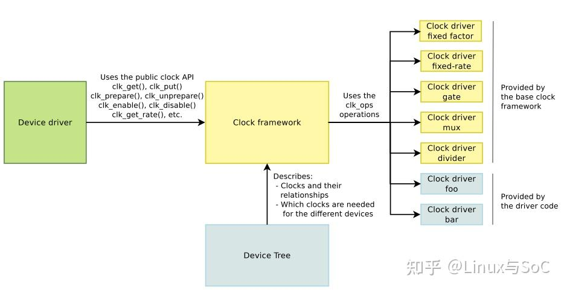

# Clock

## Linux 内核时钟子系统

[Linux内核时钟子系统](https://jishuzhan.net/article/1917523141899964417)

在SoC设计中，，“时钟”不仅是信号同步的基石，也是各个模块协调运作的前提。没有合理的时钟体系，CPU无法运行，外设无法通信，存储器无法读写。

Linux内核中，时钟子系统（Clock Subsystem）承担了统一管理硬件时钟资源的重要角色。要真正理解Linux内核的时钟子系统，必须先理解---底层硬件中的时钟控制器是如何构建的，他们解决了什么问题，提供了什么能力。

### 时钟控制器的本质

在现代SoC中，通常集成了成百上千个模块。
每个模块都需要时钟信号才能正常工作，但不同模块对时钟的要求千差万别：

- CPU需要高速高稳定的时钟（如2GHz）
- UART串口只需要低速时钟（如115200bps）
- I2C控制器需要400kHz甚至1MHz
- GPU、VPU需要动态可变的高频时钟以适配性能需求
- 某些模块休眠时还需要极低功耗的时钟支持（如RTC）

如果每个模块独立产生自己的时钟，不仅芯片面积庞大、能耗剧增。而且管理混乱，难以同步。
因此，必须有一个统一的“时钟管理系统”---这就是“时钟控制器”存在的意义

时钟控制器统一：
- 生成（产生时钟源）
- 配置（调整时钟频率）
- 分配（提供给不同模块）
- 控制（动态开关、节能管理）

### 时钟控制器硬件组成详解

一个完整的时钟控制器，通常包含以下基本模块：

1. 基础时钟源（Clock Source）
- 晶体振荡器（OSC）
提供稳定的基准频率，如24MHz、32.768kHz
- 锁相环（PLL）
将低频振荡器信号倍频成高频信号，例如24MHz通过PLL产生2.4GHz

2. 时钟选择器（Clock Mux）
- 用于选择时钟源，比如CPU既可以用低功耗PLL，也可以用高性能PLL
- 硬件上是多路复用器（MUX）

3. 时钟分频器与倍频器（Divider/Multiplier）
- 分频器（Divider）：将输入时钟除以一个整数，得到低速时钟
- 倍频器（Multipier）：将输入时钟乘以一个整数，得到更高速的时钟（较少使用）

4. 时钟门控（Clock Gating）
- 硬件开关，允许/禁止时钟信号向下游模块传输
- 用于功耗优化，不用的模块关闭时钟以节能

5. 动态时钟调整（DVFS支持）
- 支持动态改变PLL参数或选择不同时钟源，来调整CPU、GPU频率，达到性能/功耗动态平衡
- 与电源管理系统协同工作。

6. 时钟域（Clock Domain）
- 每个时钟源及其分支形成一个独立时钟域
- 跨时钟域通信时，需要同步逻辑防止亚稳态（如双触发器同步器）

### 时钟控制器的硬件寄存器结构

通常，一个时钟控制器寄存器结构大致包括：

|模块|寄存器功能|
|-|-|
|PLL配置寄存器|配置倍频因子、分频因子|
|MUX控制寄存器|选择时钟源|
|Divider寄存器|设置分频系数|
|Gating控制寄存器|开关各个模块对的时钟|
|时钟状态寄存器|查询时钟有效性|

每种配置一般对应一组固定地址寄存器，由时钟控制器硬件提供，内核驱动通过寄存器操作完成配置。

### 时钟控制器与低功耗设计

时钟管理器直接关系到SoC的功耗控制：
- 模块休眠时关闭对应时钟
- 动态调整频率降低动态功耗
- 在芯片待机状态，只保留最基本的RTC或Wakeup Clock

时钟门控和“动态频率调整（DVFS）”成为现代低功耗芯片设计不可或缺的一部分。


## Linux kernel中的CPU时钟管理

[Linux kernel中的CPU时钟管理](https://zhuanlan.zhihu.com/p/450542368)

绝大多数的电子器件都是由时钟驱动其工作的。而SoC芯片或电路板中的时钟以树状结构呈现，按时钟域进行划分，按照不同的时钟需求进行管理。

出于功耗和数据传输时序控制等目的，在内核代码中对时钟进行统一注册、统一管理。kernel代码中很早就出现了时钟管理机制。时钟管理框架如下图所示：



### 时钟定义

ARM处理器平台中基于dts描述时钟树，包括时钟结构、时钟属性等信息。由时钟框架驱动和设备驱动解析dts中时钟树信息，完成时钟系统的初始化、管理、使用。在设备树中定义了时钟的`providers`和`consumers`。前者代表时钟提供者，通常是一个固定的PLL，后者代表时钟使用者，例如处理器核心以及各种外部设备等。

#### Clock providers

1. #clock-cells
时钟提供者输出的时钟路数，当`#clock-cells`为0时，代表仅输出1路时钟，若大于等于1，则代表输出多路时钟，`Clock consumers`通过编号索引使用。下面的时钟节点`clock-cells`为0，代表仅能够输出1路时钟，这里面只提供了一路24MHz的固定时钟》

```
xin24m: xin24m {
  compatible = "fixed-clock";
  clock-frequency = <24000000>;
  clock-output-names = "xin24m";
  #clock-cells = <0>;
};
```

下面的时钟结点中`clock-cells`为1，代表能够输出多路时钟，这里面我们可以看出它提供了两路时钟分别是`PLL_PPLL`和`FCLK_SRC_PMU`，时钟频率分别是67.6MHz和97MHz

```
pmucru: pmu-clock-controller@ff750000 {
...
  #clock-cells = <1>;
  #reset-cells = <1>;
  assigned-clocks = <&pmucru PLL_PPLL>, <&pmucru FCLK_CM0S_SRC_PMU>;
  assigned-clock-rates = <676000000>, <97000000>;
 };
```

2. clock-output-names
顾名思义，它定义了输出时钟的名字。当`clock consumers`使用这路时钟的时候，我们可以见名知意。从下面的`clock-output-names`可以清楚的知道，这是外部晶振提供的24MHz时钟。

```
xin24m: xin24m {
  compatible = "fixed-clock";
  clock-frequency = <24000000>;
  clock-output-names = "xin24m";
  #clock-cells = <0>;
 };
```

3. clock-indices
这并不是一个必选项，当然也不常见。当存在多路输出时钟时，`clock consumer`以`index`引用对应的时钟，默认不指定`clock-indices`且没有使用`assigned-clock`时，`index`索引是线性增长的，像下面这样，ckil的index是0，而ckih的index就是1。

```
oscillator { #clock-cells = <1>;
    clock-output-names = "ckil", "ckih"; };
```

4. assigned-clocks
当输出多路时钟时，为每路输出时钟进行编号，以`phandle`+`specifier`组合进行管理，像下面这样：

```
pmucru: pmu-clock-controller@ff750000 {
...
  assigned-clocks = <&pmucru PLL_PPLL>, <&pmucru FCLK_CM0S_SRC_PMU>;
  assigned-clock-rates = <676000000>, <97000000>;
};
```
PLL_PPLL代表了`specifier`，其定义位于头文件`include/dt-bindings/clock/rk3399-cru.h`中。需要说明的是，这个头文件很重要，所有的`specifier`都可以在这里找到对应的宏。

5. assigned-clock-rates
这个定义是和 assigned-clocks成对使用的。它代表了`assigned-clocks`所对应的时钟频率，例如`PLL_PPLL`所对应的时钟频率是67.6MHz

```
pmucru: pmu-clock-controller@ff750000 {
...
  assigned-clocks = <&pmucru PLL_PPLL>, <&pmucru FCLK_CM0S_SRC_PMU>;
  assigned-clock-rates = <676000000>, <97000000>;
};
```

6. clock-frequency
当不使用assigned-clock-rates为输出时钟指定大小时，可以利用clock-frequency进行指定。像下面这样，指定了osc的时钟频率为32.678KHz

```
osc: oscillator { 
    compatible = "fixed-clock";
    #clock-cells = <1>;
    clock-frequency  = <32678>;
    clock-output-names = "osc"; };
```

#### Clock consumers

Clock consumers 意为时钟使用者，通常是CPU核心部件或者其他外设。我们以dsi为例说明Clock consumers设备树的组成》

```
vopb: vop@ff900000 {
  compatible = "rockchip,rk3399-vop-big";
  reg = <0x0 0xff900000 0x0 0x600>,
   <0x0 0xff901c00 0x0 0x200>,
   <0x0 0xff902000 0x0 0x1000>;
  reg-names = "regs", "cabc_lut", "gamma_lut";
  interrupts = <GIC_SPI 118 IRQ_TYPE_LEVEL_HIGH 0>;
  clocks = <&cru ACLK_VOP0>, <&cru DCLK_VOP0>, <&cru HCLK_VOP0>, <&cru DCLK_VOP0_DIV>;
  clock-names = "aclk_vop", "dclk_vop", "hclk_vop", "dclk_source";
  ...
};
```

1. clock
它代表了设备的时钟源，通常以phandle+specifier组合进行引用。例如本例中，aclk_vop时钟使用的是cru模块提供的ACLK_VOP0,它的时钟频率在cru结点中定义，大小是400000000

2. clock-names
这代表了Clock consumers中使用的时钟名字，方便设备驱动代码进行相应的时钟解析，例如

```
static int vop_bind(struct device *dev, struct device *master, void *data)
{
...
 vop->aclk = devm_clk_get(vop->dev, "aclk_vop");
 if (IS_ERR(vop->aclk)) {
  dev_err(vop->dev, "failed to get aclk source\n");
  return PTR_ERR(vop->aclk);
 }
...
}
```

以上是ARM平台RK3399的软件时钟树定义方式，具体可查看rk3399.dtsi文件。除此之外，可参考如下内核文档做相关了解。

```
Documentation/evicetree/indings/lock/lock-bindings.txt
```

## 