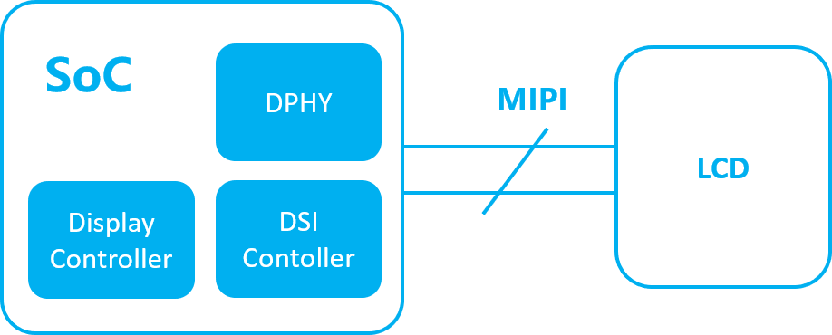
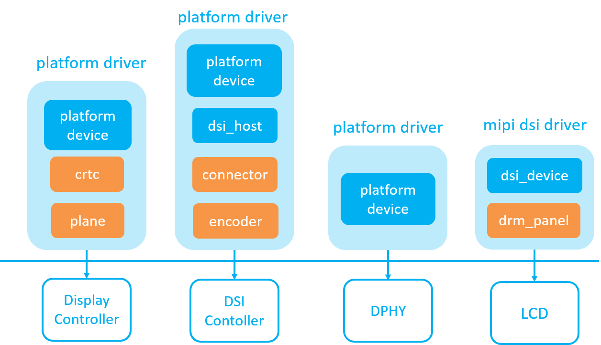
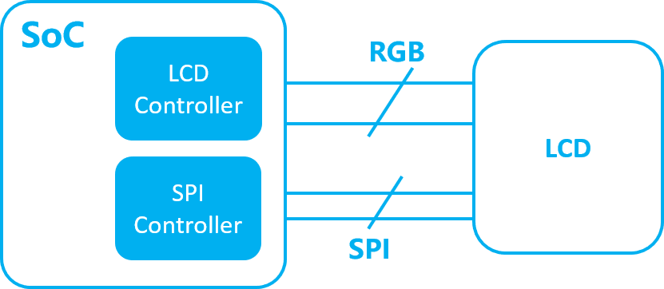
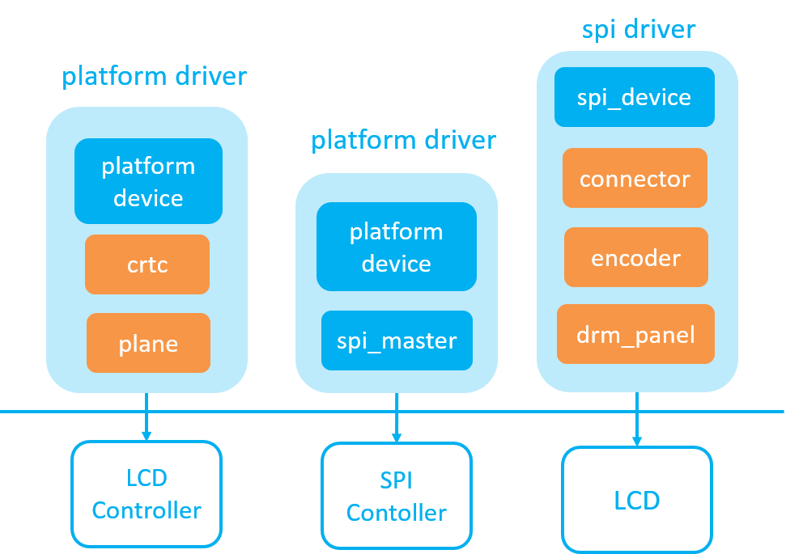
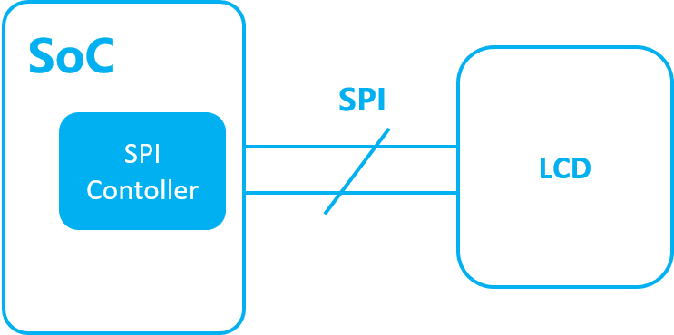
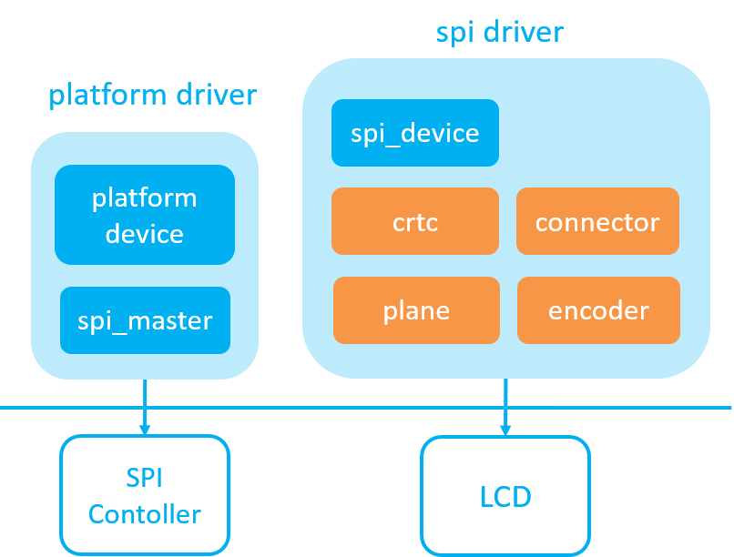
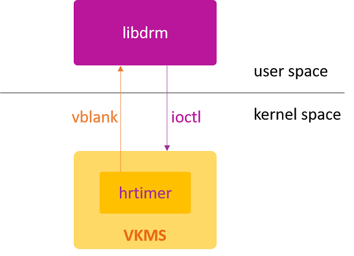

# drm

[DRM](https://blog.csdn.net/hexiaolong2009/category_9281458.html)

[weston 架构](https://www.cnblogs.com/arnoldlu/p/18091352)

[drm](https://doc.embedfire.com/linux/rk356x/linux_base/zh/latest/linux_app/drm/drm.html)

[drm-kms](https://events.static.linuxfound.org/sites/events/files/slides/brezillon-drm-kms.pdf)

[drm](https://www.cnblogs.com/zyly/p/17775867.html)

[开源mali安装](https://cloud.tencent.com/developer/article/1571948)

[andorid surfaceflinger](https://juejin.cn/post/7047745117267951646)

[gbm](https://blog.csdn.net/weixin_45730790/article/details/130830789)

[gpu](https://zhuanlan.zhihu.com/p/1930594532157813197)

[gl vs egl vs glx ](https://zhuanlan.zhihu.com/p/400553896)

[wayland egl](https://blog.csdn.net/czg13548930186/article/details/131103472)

[wayland](https://wayland-book.com/introduction/high-level-design.html)

[swrast](https://www.oryoy.com/news/ubuntu-xi-tong-xia-de-swrast-jie-mi-tu-xing-xuan-ran-de-di-ceng-ao-mi.html)

[mesa](https://zhuanlan.zhihu.com/p/432215702)

[arm G610 GPU](https://www.cnblogs.com/arnoldlu/p/18175082)

[wayland and weston](https://zhuanlan.zhihu.com/p/690561669)

[wayland and weston](https://cloud.tencent.com/developer/article/1445734)

[weston](https://www.cnblogs.com/arnoldlu/p/18091352)

[opengl](https://zhuanlan.zhihu.com/p/1930594532157813197)

[android surface](https://juejin.cn/post/7047745117267951646)

[drm virtio-gpu](https://www.cnblogs.com/ArsenalfanInECNU/p/14632356.html)

[Linux DMA-buf 驱动框架](https://blog.51cto.com/u_15284525/13702613)

## DRM

[DRM](https://blog.csdn.net/hexiaolong2009/category_9281458.html)

### DRM 简介

DRM是Linux目前主流的图形显示框架，相比FB架构，DRM更能适应当前日益更新的显示硬件。比如FB原生不支持多层合成，不支持VSYNC，不支持DMA-BUF，不支持异步更新，不支持fence机制等等，而这些功能DRM原生都支持。同时DRM可以统一管理GPU和Display驱动，使得软件架构更为统一，方便管理和维护。

DRM从模块上划分，可以简单分为3部分：libdrm、KMS、GEM

- libdrm
    对底层接口进行封装，向上层提供通用的API接口，主要是对各种IOCTL接口进行封装
- kms
    Kernel Mode Setting，所谓Mode Setting，其实说白了就两件事：更新画面和设置显示参数
    更新画面：显示buffer的切换，多图层的合成方式，以及每个图层的显示位置
    设置显示参数：包括分辨率、刷新率、电源状态（休眠唤醒）等。
- GEM
    Generic Execution Manager，主要负责显示buffer的分配和释放，也是GPU唯一用到DRM的地方。

基本元素

DRM框架涉及到的元素很多，大致如下：

KMS：`CRTC` `ENCODER` `CONNECTOR` `PLANE` `FB` `VBLANK` `property`
GEM: `DUMB` `PRIME` `fence`

|元素|说明|
|-|-|
|CRTC|对显示buffer进行扫描，并产生时序信号的硬件模块，通常指Display Controller|
|ENCODER|负责将CRTC输出的timing时序转换成外部设备所需要的信号的模块，如HDMI转换器或DSI Controller|
|CONNECTOR|连接物理显示设备的连接器，如HDMI、DisplayPort、DSI总线，通常和Encoder驱动绑定在一起|
|PLANE|硬件图层，有的Display硬件支持多层合成显示，但所有的Display Controller至少要有1个plane|
|FB|Framebuffer，单个图层的显示内容，唯一一个和硬件无关的基本元素|
|VBLANK|软件和硬件的同步机制，RGB时序中的垂直消影区，软件通常使用硬件VSYNC来实现|
|property|任何你想设置的参数，都可以做成property，是DRM驱动中最灵活、最方便的Mode setting机制|
|DUMB|只支持连续物理内存，基于Kernel中通用CMA API实现，多用于小分辨率简单场景|
|PRIME|连续、非连续物理内存都支持，基于DMA-BUF机制，可以实现buffer共享，多用于达内存复杂场景|
|fence|buffer同步机制，基于内核dma_fence机制实现，用于防止显示内容出现异步问题|

### DRM 驱动程序开发

https://blog.csdn.net/hexiaolong2009/article/details/89810355

#### Objects

在开始编写DRM驱动程序之前，我有必要对DRM内部的Objects进行一番介绍。因为这些Objects是DRM框架的核心，他们缺一不可。

软件抽象：framebuffer property gem
硬件抽象：crtc plane encoder connector

|object|说明|
|-|-|
|crtc|RGB信号发生源（TCON），显存切换控制器（Display Controller）|
|plane|Display Controller 的数据源通道，每个crtc至少有一个plane|
|encoder|RGB信号转换器（DSI controller），同时也控制显示设备的休眠唤醒|
|connnector|凡是能获取到显示参数的硬件设备，但通常和encoder绑定在一起|
|framebuffer|只用于描述显存信息（如 format、pitch、size等），不负责显存的分配释放|
|property|atomic操作的基础，任何想要修改的参数都可以做成property，供用户空间使用|
|gem|负责显存的分配、映射和释放|

plane 是连接 framebuffer 和 crtc 的纽带，而 encoder 则是连接 crtc 和 connector 的纽带。与物理 buffer 直接打交道的是 gem 而不是 framebuffer。

需要注意的是，上图蓝色部分即使没有实际的硬件与之对应，在软件驱动中也需要实现这些 objects，否则 DRM  子系统无法正常运行。

**drm_panel**

drm_panel 不属于 objects 的范畴，它只是一堆回调函数的结合。但它的存在降低了LCD驱动与encoder之间的耦合度。

耦合的产生：
1. connector 的主要作用就是获取显示参数，所以会在LCD驱动中去构造 connector object。但是 connector 初始化时需要 attach 上一个 encoder object，而这个 encoder object 往往是在另一个硬件驱动中生成的，为了访问该 encoder object，势必会产生一部分耦合的代码。
2. encoder 除了扮演信号转换的角色，还担任着通知显示设备休眠唤醒的角色。因此，当 encoder 通知 LCD 驱动执行响应的 enable/disable 操作时，就一定会调用 LCD 驱动导出的全局函数，这必然也会产生一部分的耦合代码。

为了解决该耦合的问题，DRM 子系统为开发人员提供了 drm_panel 结构体，该结构体封装了 connector & encoder 对 LCD 访问的常用接口。

于是，原来的Encoder驱动和 LCD 驱动之间的耦合，就转变成了上图中 Encoder 驱动与 drm_panel、drm_panel 与 LCD 驱动之间的 “耦合”，从而实现了 Encoder 驱动与 LCD 驱动之间的解耦合。

```
为了方便驱动程序设计，通常都将 encoder 与 connector 放在同一个驱动中初始化，即 encoder 在哪里， connector 就在哪。
```

**如何抽象硬件**

MIPI DSI接口



它在软件架构上与 DRM object 的对应关系如下图：



|object|说明|
|-|-|
|crtc|RGB timing的产生，以及显示数据的更新，都需要访问Display Controller 硬件寄存器，因此也放在 Display Controller 驱动中|
|plane|对 Overlay 硬件的抽象，同样需要访问 Display Controller 寄存器，因此也放在 Display Controller驱动中|
|encoder|将 RGB 并行信号转换为 DSI 串行信号，需要配置DSI硬件寄存器，因此放在 DSI Controller 驱动中|
|connector|可以通过drm_panel来获取LCD的mode信息，但是encoder在哪，connector就在哪，因此放在 DSI Controller驱动中|
|drm_panel|用于获取LCD mode，并提供LCD休眠唤醒的回调接口，供encoder调用，因此放在LCD驱动中|


MIPI DPI 接口

DPI 接口也就是我们常说的RGB并行接口，Video数据通过RGB并行总线传输，控制命令（如初始化、休眠、唤醒等）则通过SPI/I2C总线传输，比如早期的 S3C2440 SoC 平台。



对应关系为




MIPI DBI 接口

DBI 接口也就是我们平时常说的 MCU或 SPI 接口屏，这类屏的 VIDEO 数据和控制命令都是通过同一总线接口（I80、SPI接口）进行传输，而且这类屏幕必须内置GRAM显存，否则屏幕无法维持正常显示。



对应关系为



### DRM 驱动开发 VKMS

https://blog.csdn.net/hexiaolong2009/article/details/105180621

VKMS 是 Virtual Kernel Mode Setting 的缩写，之所以称它为Virtual KMS，是因为该驱动不需要真实的硬件，它完全是一个软件虚拟的“显示”设备，甚至连显示都算不上，因为当它运行时，你看不到任何显示内容。它唯一能提供的，就是一个由高精度timer模拟的VSYNC中断信号！该驱动存在的目的，主要是为了DRM框架测试，以及方便那些无头显示器设备的调试应用。虽然我们看不到VKMS的显示效果，但是在驱动流程上，它实现了modesetting该有的操作，因其逻辑简单，代码量少，拿来做学习案例讲解再好不过。



随着内核版本的不断升级，添加到VKMS的功能也越来越多

- Atomic Modeset
- VBlank
- Dumb Buffer
- Cursor & Primary Plane
- Framebuffer CRC
- plane Composition
- GEM Prime Import

## Linux graphic stack

### compositing

The compositor is a system service that receives each application's output buffers and draws them to an on-screen image.

A Wayland **surface** represents an application window; it is the application's handle to display its output and receive input events from the compositor. Attached to the surface is a Wayland buffer that contains the displayable pixel data plus color-format and color-format and size information. The pixel data is in the output buffer that the client application has rendered to.

The compositor maintains a list of all of the Wayland surfaces that represent application windows.

Wayland provides a protocol extension to share buffer objects via a Linux dma-buf, which represents a memory buffer that is shareable among hardware devices, drivers, and user-space programs. An application renders its scene graph via the Mesa interfaces using hardware acceleration as described in part 1, but, instead of transferring a reference to shared memory, the application sends a dma-buf object that references the buffer object while it is still located in graphics memory. The Wayland compositor uses the stored pixel data without ever reading it over the hardware bus.

### pixels to the monitor

DRM's mode-setting code controls all aspects of reading pixel data from graphics memory and sending it to an output device.

The minimum stages necessary are the framebuffer, plane, CRTC, encoder, and connector, each of which is described below.

The pipeline's first stage is the DRM framebuffer. It is the buffer object that stores the compositor's on-screen image, plus information about the image's color format and size.

Fetching the pixel data is called scanout, and the pixel data's buffer object is called the scanout buffer. The number of scanout buffers per framebuffer depends on the framebuffer's color format. Many formats, such as the common RGB-based ones, store all pixel data in a single buffer. With other formats, such as YUV-based ones, the pixel data might need to be split up into multiple buffers.

In DRM terminology, this is called a plane. It sets the scanout buffer's position, orientation, and scaling factors. Depending on the hardware, there can be multiple active planes using different framebuffers. All active planes feed their pixel output into the pipeline's third stage, which is called the cathode-ray tube controller (CRTC) for historical reasons.

The CRTC controls everything related to display-mode settings. The DRM driver programs the CRTC hardware with a display mode and connects it with all of its active planes and outputs. There can also be multiple CRTCs with different settings programmed to them. The exact configuration is only limited by hardware features.

 According to the programmed display mode and each plane's location, the CRTC hardware fetches pixel data from the planes, blends overlapping planes where necessary, and forwards the result to its outputs.

 Outputs are represented by encoders and connectors. As its name suggests, the encoder is the hardware component that encodes pixel data for an output. An encoder is associated with a specific connector, which represents the physical connection to an output device, such as HDMI or VGA ports with a connected monitor. The connector also provides information on the output device's supported display modes, physical resolution, color space, and the like. Outputs on the same CRTC mirror the CRTC's screen on different output devices.

 ### pipeline setup

 Deciding on policies for connecting and configuring the individual stages of the mode-setting pipeline is not the DRM driver's job. As part of its initial setup, the compositor opens the device file under /dev/dri, such as /dev/dri/card1, and invokes the respective ioctl() calls to program the display pipeline. It also fetches the available display modes from a connector and picks a suitable one.

 After the compositor has finished rendering the first on-screen image, it programs the mode-setting pipeline for the first time. To do so, it creates a framebuffer for the on-screen image's buffer object and attaches the framebuffer to a plane. It then sets the display mode for its on-screen buffer on the CRTC, connects all of the pipeline stages, from framebuffer to connector, and enables the display.

 It would first program the display mode in the CRTC, then upload all buffer objects into graphics memory, then set up the framebuffers and planes for scanout, and finally enable the encoders and connectors. 


## framebuffer

[屏幕显示 framebuffer](https://doc.embedfire.com/linux/rk356x/linux_base/zh/latest/linux_app/framebuffer/framebuffer.html)

Framebuffer中文译名为帧缓冲驱动，它是出现在2.2.xx内核中的一种驱动程序接口。主设备号29，次设备号递增。

Linux抽象出Framebuffer这个设备来供用户态进程实现直接写屏。Framebuffer机制模仿显卡的功能，将显卡硬件结构抽象掉，可以通过Framebuffer的读写直接对显存进行操作。用户可以将Framebuffer看成是显示内存的一个映像，将其映射到进程地址空间之后，就可以直接进行读写操作，而写操作可以立即反应在屏幕上。这种操作是抽象的，统一的。

用户不必关心物理显存的位置、换页机制等等具体细节，这些是由Framebuffer设备驱动来完成的。

Framebuffer实际上就是嵌入式系统中专门为GPU所保留的一块连续的物理内存，LCD通过专门的总线从Framebuffer读取数据，显示到屏幕上。

Framebuffer本质上是一块显示缓存，往显示缓存中写入特定格式的数据就意味着向屏幕输出内容。所以说Framebuffer就是一块白板。

屏幕位置从上到下，从左至右与内存地址是顺序的线性关系

### 双缓冲Framebuffer设计

在计算机上的动画与实际的动画有些不同：实际的动画都是先画好了，播放的时候直接拿出来显示就行。计算机动画则是画一张，就拿出来一张，再画下一张，再拿出来。如果所需要绘制的图形很简单，那么这样也没什么问题。但一旦图形比较复杂，绘制需要的时间较长，问题就会变得突出。让我们把计算机想象成一个画图比较快的人，假如他直接在屏幕上画图，而图形比较复杂，则有可能在他只画了某幅图的一半的时候就被观众看到。而后面虽然他把画补全了，但观众的眼睛却又只看到残缺的图像，这样就造成了屏幕的闪烁。如何解决这一问题呢？我们设想有两块画板，画图的人在旁边画，画好以后把他手里的画板与挂在屏幕上的画板相交换。这样以来，观众就不会看到残缺的画了。这一技术被应用到计算机图形中，称为双缓冲技术。即：在存储器（很有可能是显存）中开辟两块区域，一块作为发送到显示器的数据，一块作为绘画的区域，在适当的时候交换它们。由于交换两块内存区域实际上只需要交换两个指针，这一方法效率非常高，所以被广泛的采用。

### DRM

[屏幕显示DRM介绍](https://doc.embedfire.com/linux/rk356x/linux_base/zh/latest/linux_app/drm/drm.html)

### DRM 介绍

DRM是Linux目前主流的图形显示框架，相比FB架构，DRM更能适应当前日益更新的显示硬件。比如FB原生不支持多层合成，不支持VSYNC，不支持DMA-BUF，不支持异步更新，不支持fence机制等等，而这些功能DRM原生都支持。同时DRM可以统一管理GPU和Display驱动，使得软件架构更为统一，方便管理和维护。

可以看到DRM的图像系统可以分为两部分

- 应用层-libdrm
- 内核驱动层 - GEM，KMS

libdrm：对底层接口进行封装，向上层提供通用的API接口，主要是各种IOCTL接口进行封装。

KMS(Kernel Mode Setting)：即Mode Setting：更新画面和设置显示参数

1. 更新画面：显示buffer的切换，多图层的合成方式，以及每个图层的显示位置
2. 设置显示参数：包括分辨率、刷新率、电源状态（休眠唤醒）等。

GEM（Graphic Execution Manager）：主要负责显示buffer的分配和释放，内存管理与同步。

#### DRM显示

##### DRM与Framebuffer的区别

- framebuffer的使用十分简单，只需要在用户空间定义一个framebuffer的内存空间，只要直接操作这块内存就可以轻易的改变屏幕的显示
- 对于DRM而言，在framebuffer与显示器之间有四个部分，framebuffer的数据经过几个部件的联合处理最终把图像输出到显示器中

除此之外，DRM相比framebuffer而言有更多的优势：

1. DRM具有更多的社区维护者
2. DRM为显示提供更多的设置
3. DRM在用户空间能够享受更广泛的运用

不过framebuffer在图像并不负载的场景下的开发难度小于DRM显示系统开发

##### DRM显示系统分析

1. DRM Framebuffer

与上一章节的Framebuffer一样，DRM Framebuffer 也是一片存放图像的内存区域，且需要设置图像的格式（RGB888， YUV，C8等）以及画布的大小

2. CRTC

在DRM显示系统中CRTC会配置display timings和显示分辨率（Planes提供）来扫描framebuffer上的内容，传给Encoder。

display timings：扫描Framebuffer的时序，因为LCD屏的显示并不像0.96寸的屏幕那样，直接把所有的显示数据写进去就可以显示东西，LCD屏幕需要一定的时序才能正确显示东西，因此，CRTC在这里有着很重要的作用，生成视频模式定时信号，输出内容到Encoder中，Encoder和Connector则只作为数据的转化和传输

3. Planes

普遍翻译为平面，我觉得译为图层更合适，Planes是一个包含向CRTC发送数据的缓存块的内存对象，每个CRTC必须关联一个Planes，它是CRTC决定采用哪种视频模式的根据，显示分辨率（宽度和高度），像素大小，像素格式，刷新率等

Planes会分为三种类型：

- DRM_PLANE_TYPE_PRIMARY：主要图层，显示背景或者图像内容，每个CRTC中含一个
- DRM_PLANE_TYPE_OVERLAY: 用于显示叠加、缩放，每个CRTC含一个以上
- DRM_PLANE_TYPE_CURSOR：用于显示鼠标，每个CRTC中含0-N个

通常驱动会把Framebuffer绑定到DRM_PLANE_TYPE_PRIMARY上。

4. Encoder

译为编码器。它的作用就是将pixel像素编码（转换）为显示器所需要的信号。

如果我们要把图像输出到不同的显示器上显示，需要将其转化为不同的电信号，比如DVID、VGA等

所以它的作用：负责将帧转换为适当的格式，通过连接器传输。

比如说：HDMA connector需要使用TMDS格式的数据才能驱动，因此需要一个能够把像素格式转换为TMDS的编码器。

5. Connector

译为连接器。Connector常常对应于物理连接器（VGA，VDA。。。）他会🔗一个物理显示输出设备（monitor，laptop。。。）与当前物理连接的输出设备相关的信息（如🔗状态，EDID数据，DPMS状态或支持的视频模式）也存储在Connector内。


 ## GBM

 [gbm](https://blog.csdn.net/weixin_45730790/article/details/130830789)

