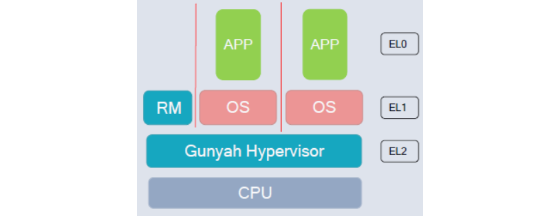
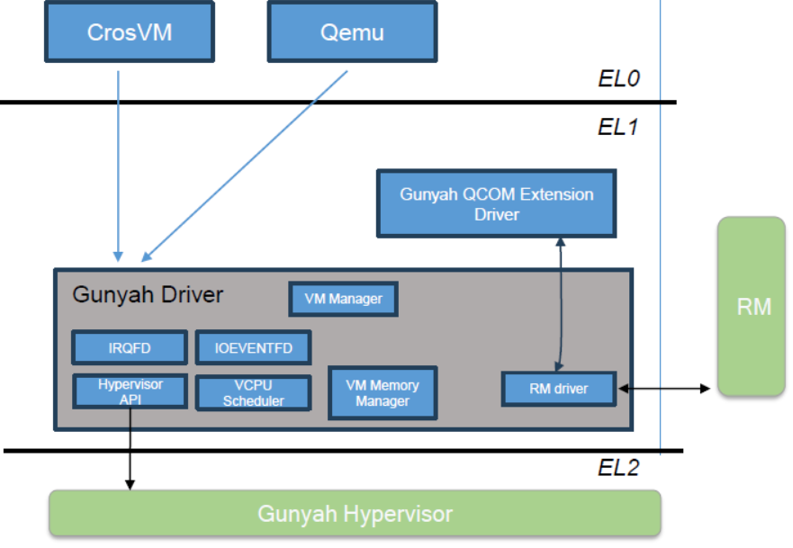
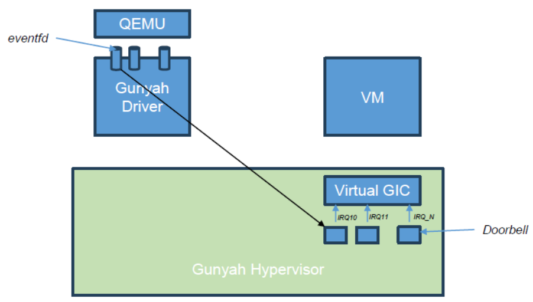

# Hypervisor

[ADAS与IVI的虚拟化：Hypervisor硬件基础与主流软件方案](https://cloud.tencent.com/developer/article/2640956)

[hypervisor](https://www.sciencedirect.com/science/article/pii/S138376212500270X)

[SPHERE Hypervisor](https://iris.unimore.it/retrieve/e31e1250-8849-987f-e053-3705fe0a095a/SPHERE_A_Multi-SoC_Architecture_for_Next-Generation_Cyber-Physical_Systems_Based_on_Heterogeneous_Platforms.pdf)

[智能汽车虚拟化（下）](https://cloud.tencent.com/developer/article/2370011?policyId=1003)

[一芯多屏](https://finance.sina.com.cn/stock/stockzmt/2022-01-26/doc-ikyamrmz7467700.shtml)

[Hypervisor-智能座舱和智能驾驶融合的关键技术](https://zhuanlan.zhihu.com/p/708778820)

[coqos hypervisor](https://zhuanlan.zhihu.com/p/48868811)

[gunyah hypervisor](https://www.qualcomm.com/developer/blog/2024/08/learn-about-gunyah--qualcomm-s-open-source--lightweight-hypervis)

[gunyah hypervisor](https://zhuanlan.zhihu.com/p/1941214283984793666)

[gunyah hypervisor](https://docs.qualcomm.com/doc/80-70023-3SC/topic/virtualization.html)

[hvisor](https://github.com/orgs/syswonder/repositories?type=all)

[eventfd](https://blog.csdn.net/JiangXiaoPeng001/article/details/90770118)

[irqfd](https://www.cnblogs.com/haiyonghao/p/14440723.html)

[reserved memory](https://blog.csdn.net/liyucheng987/article/details/123258399)

[virtio vring](https://blog.csdn.net/qq_41596356/article/details/128437440)

[virtgpu](https://www.ithome.com/0/734/809.htm)

[Device virtualization-软件虚拟化技术vs硬件虚拟化技术](https://zhuanlan.zhihu.com/p/1999137873287475498)

[sel4](https://www.mdpi.com/2079-9292/11/24/4201)

[SPHERE 基于异构平台的下一代信息物理系统多SoC架构](https://zhuanlan.zhihu.com/p/1919491370554463373)

[virtio](https://www.bilibili.com/video/BV17A4y1f7ua?spm_id_from=333.788.videopod.sections)

[Windows paravirtualized drivers for Crosvm + Gunyah](https://github.com/Droid-VM/gunyah-guest-drivers-windows)

## automobile

[现代智能汽车系统](https://blog.csdn.net/Godspeed_zwh/article/details/156448756)

混合临界性（Mixed-Criticality System）通过 Hypervisor 虚拟化技术和确定性操作系统，实现汽车功能安全分级管理。

Type1 Hypervisor 构建资源隔离的数字屏障，将 ASIL-D关键功能与QM级娱乐系统分离。确定性OS采用微内核架构和时间分区调度，确保关键任务完成，不受其他进程干扰。这种架构使智能汽车在保持高性能的同时，满足工业级安全要求，避免娱乐系统故障影响核心驾驶功能。

当我们将所有鸡蛋（功能）都放在一个篮子（HPC）里时，篮子的安全性就成了头等大事。我们不能让愤怒的小鸟（安卓游戏）因为 Bug 崩溃，而导致刹车系统（智驾OS）跟着一起死机。

这就引出了**混合临界系统 （Mixed-Criticality System）** 的设计哲学 —让“性命攸关”与“无关紧要”在同一颗芯片上和平共处。

### 系统软件栈 - hypervisor 与确定性OS

1. **混合临界安全性（Mixed-Critical Safety）**

在汽车行业，软件被严格分为不同的安全等级（ISO 26262）：

- ASIL-D（最高）：转向、制动、安全气囊。失效 = 致命
- ASIL-B（中等）：仪表显示、车道保持。失效 = 危险但可控
- QM（Quality Management）：中控娱乐、抖音、导航。烦人但安全

挑战：在单芯片架构下，QM级别的Android可能会因为内存泄漏耗尽系统资源，或者死循环沾满CPU，导致ASIL-D的刹车任务无法执行。

解法：我们必须构建一道数字柏林墙。

2. **Hypervisor（虚拟化技术）**

Hypervisor（虚拟化监控器）是运行在硬件之上的第一层软件，它把物理硬件切分成多个虚拟硬件。

（1）Type 1 Hypervisor（裸金属架构）

- 主流方案：QNX hypervisor、ACRN
- 特点：Hypervisor 直接运行在硬件上，不仅效率高，而且自身代码量极小（几万行），经过严格测试，很难崩溃
- 架构实战：
    - VM1（safety VM）：运行 QNX/Safety Linux。负责智驾感知、规控。分配固定的4个CPU核心和16GB内存。优先级：最高。
    - VM2（Entertainment VM）：运行 Android。负责中控屏、应用生态。分配剩余的CPU和内存。优先级：低。
    - VM3（Real-time VM）：运行Classic Autosar。负责网关转发和底层车控。

（2）资源隔离（Resource Partitioning）

- 空间隔离（Spatial Isolation）:
    - 利用 CPU 的 MMU（内存管理单元）和 IOMMU，强制规定 Android 只能访问 0x0000 到 0xFFFF 的内存
    - 如果Android视图访问越界地址（比如想改写刹车指令的内存），硬件会直接拦截并报错，绝不手软。
- 外设透传：
    - GPU被切分，智驾专用的CUDA核心只有QNX能用。
    - 以太网控制器被虚拟化，变成多个虚拟网卡。

3. **确定性操作系统（Deterministic OS）：拒绝随机**

为什么智驾系统不能用普通的Linux？因为普通Linux是“尽力而为”的。当系统负载重时，一个10ms的任务可能被拖到50ms才执行。对于时速 120km/h 的车，50ms意味着开出去1.6米，这不可接受。

**确定性（Determinism）** 意味着：**无论系统多忙，关键任务必须在预定的时间内完成。**

（1）**微内核架构（Microkernel）**

- **代表：QNX Neutrino，sel4** （形式化验证最强的 OS）
- **原理：**
    - 内核值保留最核心的功能（调度、IPC、中断）
    - 驱动、文件系统、协议栈都扔到用户态去运行
- **优势：**
    - **故障隔离：** 如果音频驱动崩溃了，它只是用户态的一个进程挂了，内核安然无恙，重启驱动即可，系统不会蓝屏。

（2）时间分区调度（Time Partitioning）

这是解决CPU资源争夺的终极手段。

- **原理**： 把CPU时间切成固定的**时间窗（Time Window）**
- **例子**：
    - 我们将 10ms 定义为一个周期
    - 0~2ms：强制分配给**智驾VM**，就算智驾没事干，这2ms也是空的，Android也不许用
    - 2~8ms：分配给 **Android VM**。如果Android任务重，算不玩也得暂停，等下一个周期
    - 8~10ms：分配给 **Autosar VM**
- **结果：** 智驾系统永远能保证每10ms获得2ms的计算时间。**刹车任务永远不会被抖音卡顿所影响**

（3）**确定性调度算法（Deterministic Scheduling）**
在多核异构 SoC 上，调度更加复杂
- **DAG（有向无环图）调度**：
    - 智驾任务通常时一条流水线：感知->融合->预测->规划->控制
    - 确定性OS会根据任务的**依赖关系**和**最晚截止时间（Deadline）**，静态生产一张调度表
    - 每个任务在哪个核上炮、什么时候跑，在编译阶段就定死了，运行时严丝合缝，如同精密的机械钟表

**结论：**
**Hypervisor + 确定性OS** 是智能汽车的**安全底座**。没有它们，高性能计算平台就是沙滩上的城堡，虽华丽却经不起风浪。它们保证了汽车在变得越来越像手机的同时，依然保持着那份属于工业品的严谨与可靠。


## Gunyah

[qualcomm Linux](https://docs.qualcomm.com/doc/80-70023-3SC/topic/virtualization.html)

[meet gunyah](https://www.qualcomm.com/developer/blog/2024/08/learn-about-gunyah--qualcomm-s-open-source--lightweight-hypervis)


Gunyah is a high performance and scalable Type-1 hypervisor built for demanding battery-powered,real-time,safety critical systems, we've developed for Qualcomm Technologies chipsets. The team developing a Linux driver for it takes active inputs from kernel maintainers and communitiy. With Gunyah,we can use one hypervisor across use cases as varied as automotive, mobile broadband, IoT and wearables.

This post covers the work in the Linux kernel to add support for Gunyah, with plans to upstream our patches. It also covers our work on extending support for Gunyah beyond the CrosVM virtual machine manager(VMM) to QEMU, the generic,open-source machine emulator and virtualizer. The Linux driver the team is developing will allow applications such as QEMU to interact with the hypervisor for VM management. You'll see how you can test-launch a VM on Gunyah yourself.

### Project 1:Ongoing development of Gunyah

Gunyah is an open-source,Type-1 hypervisor from Qualcomm, built with a strong focus on security and performance on battery-constrained devices. It has been designed as lightweight, versatile microkernel with just enough features to manage virtual machines.

As shown in the block diagram below, the architeture supports multiple OSes, has a small attack surface and includes a resource manager(RM):



The RM is a virtual machine(VM) that runs in execution level 1(EL1),working tightly with the core Gunyah hypervisor EL2. The RM implements some of the policies that are required to manage VMs, like the heavy lifting of creating and launching a virtual machine. It's an integrated component of the hypervisor in a different execution level.

#### Protected and unprotected VMs

Protected VMs that host some confidential/sensitive workloads have been the primary focus of Gunyah from the start. We didn't want Android on mobiles to handle sensitive tasks like face authentication or verification of mobile banking credentials. So, in that phase of an app, control of the display, touchscreen or camera can be transferred to a protected VM, where the sensitive information is validated. After that, the rest of the application can run in Android.

Gunyah supports two main types of VM:

- Protected, in which the VM's memory is protected from the host
- Unprotected, in which the VM's memory can be completely accessed by the host.

Addtionally, there are two types of protected VMs"

1. Qualcomm Trusted VM(QTVM) - These are VMs whose main execution image is signed using Qualcomm tools. The hypervisor ensures that the VM's image loaded in memory is verified by Trustzone, Qualcomm's secure software, before allowing the VM to start. Besides a kernel and maybe a ramdisk, the VM's execution image contains a devicetree, which can specify devices that the VM needs to access. This static DT implies that some of the VM resources(such as amount of memory and number of VCPUs) are static in nature.

2. Google VMs - These VMs are defined by the Android Virtualization Framework (AVF). The hypervisor does not enforce VM image authentication in this case. Instead, authentication is performed by PVM firmware, a software blob that runs in the VM before the VM kernel takes over. The DT used by the VM in this case is dynamic;i.e.,generated at runtime.

#### Gunyah feature

- A protected VM's memory is private to it and cannot be accessed by its host. That is achieved by the hypervisor using the page table-based memory protection feature of a CPU. A second-stage page table associated with the host OS is modified by the hypervisor so that the host loses access to the VM's memory.

Of course, in some cases it's desirable to share memory between a protected VM and its host. But as of today, Gunyah is not exposing any API for the protected VM to share part of its private memory with the host. Instead, the host can assign some of its memory for the VM to use in either shared or private mode, which needs to happen before the VM can begin execution. As an example, the host could, as part of the VM creation process, assign 500 MB of its memory for the VM's private use and 100 MB of its memory for shared use.

Protection from malicious devices is achieved using the system memory management unit(SMMU). For instance, a device assigned to the host cannot use direct memory access(DMA) to access the protected VM's memory. Second-stage page tables in the SMMU associated with the device will be set up so that the device will see a fault when accessing the protected VM's memory.

- The generic interrupt controller (GIC) is virtualized at the layer of the hypervisor, EL2.
- Both proxy and native scheduling schemes for VCPUs are supported. In the proxy scheme, the host scheduler handles VCPU scheduling intelligently. The host scheduler may have advanced algorithm that can improve both the performance and power consumption of a VM. In the native scheme, the hypervisor scheduler directly handles VCPU scheduling, which could be desirable for some critical VMs.
- The first gigabyte of the VM's intermediate physical address space is available as memory-mapped I/O(MMIO) region that can be trapped and emulated.
- Protected VM memory is sanitized after a warm reset of the system. A warm reset could be triggered for various reasons, for example, when there is a deadlock in the host OS. On some platforms, after a warm reset, memory contents are preserved, which could include data of a protected VM that was active at the time of reset. To prevent  the host OS from accessing such data as it boots up again. Gunyah arranges for the VM's memory to be sanitized by Trustzone software, which runs early after a warm reset.
- Gunyah provides for pre-host VMs, which can be launched very early during the boot sequence(or even before the host OS starts booting) by UEFI firmware. That is useful  for VMs that need to be functional very early during boot and cannot wait until the host has come up.
- To allow VMs to communication with one another, the hypervisor supports shared memory, doorbell and message queue.
- Gunyah now supports demand paging. Before, if you wanted to launch a VM with, say, 500 MB, all 500MB had to be allocated and pinned before Gunyah would start executing the VM. But if the VM needed only 100 MB to run well, then memory was wasted. So, we've added support for demand paging in the hypervisor for better memory management. Now, when the VM accesses a valid page that has not yet been allocated, a fault goes out to the host, which allocates a page of varying size that the hypervisor maps into VM.
- Device passthrough allows some devices to be assigned and directly accessed by the VM. We're working on optimizing Gunyah for automotive, IoT and mobile use cases.


### Project 2: The Linux Gunyah driver

The Gunyah driver that we are actively developing is close to being accepted by the upstream Linux kernel community. As shown in the diagram below, the driver is designed to enable VMMs like CrosVM and QEMU to manage VMs on the Gunyah hypervisor:



The driver runs at EL1 and provide an interface between VMMs and the hypervisor. The driver provides UAPIs for standard tasks  like running a VCPU, registering eventfds and creating VMs and VCPUs. Additionally:

- There's an explicit ioctl to start the VM. We took that path instead of folding it into the API for running a VCPU.
- Another ioctl tells the driver to share and lend memory to a VM. The only difference between share and lend is that lent memory is protected, which makes the lend API useful for allocating private memory of protected VMs. Note that the v17 upstream driver we have published does not currently support the lend API. However, the version of driver included in Android Common Kernel supports the lend API.
- An ioctl is provided for VMMs to specify where the devicetree is located in VM's memory. Before the VM is allowed to start, the VM's devicetree needs to be validated by the resource manager.
- There is currently no provision to set and get VCPU registers on the fly. Instead, the hypervisor sets the initial register context of the boot VCPU.

We envision future changes to the Linux driver to add support for different VM types, including QTVM and Google AVF VMs.


### Project 3: Gunyah Accelerator for QEMU

We're working on changes to enable QEMU to support Gunyah as an accelerator option. We expect the changes will be merged into the QEMU code base once our Linux driver is accepted upstream.

A typical invocation of QEMU to launch a VM on Gunyah could look like this:

```bash
qemu-system-aarch64  -cpu cortex-a57 -nographic --hda vm_disk.img -m 256M --accel gunyah -machine virt,highmem=off,protected-guest-support=prot0 - object arm-protected-guest,id=prot0,swiotlb-size=16777216 -append "rw root=/dev/vda rdinit=/sbin/init earlyprintk=serial panic=0" -kernel Image
```

Some salient points about the proposed changes to QEMU:

- Only AArch64 is supported as a target.
- The argument - accl gunyah specifies that the Gunyah accelerator is to be used.
- Both protected and unprotected types of VM are supported.
- We've tested VM bringup on both a Qualcomm Soc and the QEMU virtual platform running the open-source version of Gunyah. Instructions have been provided in the patch on how to test VM bringup on a QEMU virtual platform using that open-source version.
- We've introduced some changes for the Arm virt machine platform.
    - Support for protected VMs(guest), indicated on the command line as follows:

```bash
-machine virt, protected-guest-support=prot0 - object arm-protected-guest,id=prot0,swiotlb-size=16777216
```
swiotlb-size indicates the size of the shared memory region that QEMU needs to allocate and share with VM. That region is also marked reserved in the devicetree and associated with restricted DMA pool functionality of the Linux kernel.

- We have noticed subsequently that there are others working on adding similar support for the virt machine platform. We shall review and join efforts with them as necessary.
- Support for accelerator-specific devicetree customization. For example, Gunyah needs to see addtional attributes in a devicetree, like the scheduling scheme required for the VM, and virtual devices that the hypervisor needs to create to support injection of an interrupt(doorbell)
- Only proxy-scheduled VMs are supported. Future changes could be published to add support for hypervisor-scheduled VM.
- The diagram below illustrates how QEMU can inject an interrupt into the VM. Since the GIC is handled by the hypervisor itself, we create doorbells as virtual devices and bind them to various IRQ lines. QEMU registers an eventfd for each interrupt it wishes to inject. Whenever it writes into the eventfd,the Gunyah linux kernel driver rings the corresponding doorbell to activate its IRQ.




## Xvisor

### 项目核心功能

[xvisor](https://blog.csdn.net/gitblog_00546/article/details/143522559)

1. **设备树配置**：支持基于设备树的配置，使得系统配置更加灵活和易于管理。
2. **高分辨率时间管理**：提供无滴答（tickless）和高分辨率的时间管理机制，确保系统时间和高精度。
3. **线程框架**：内置线程框架，支持多线程操作，提高系统的并发处理能力。
4. **主机设备驱动框架**：提供主机设备驱动框架，简化设备驱动的开发和管理。
5. **IO设备仿真框架**：支持IO设备的仿真，使得虚拟机可以无缝访问物理设备。
6. **动态模块加载**：支持运行时加载模块，增强系统的扩展性和灵活性。
7. **直通硬件访问**：提供硬件直通访问功能，确保虚拟机可以直接访问物理硬件资源。
8. **动态虚拟机管理**：支持动态创建和销毁虚拟机，提高资源利用率。
9. **管理终端**：提供管理终端，方便用户进行系统管理和监控。
10. **网络虚拟化**：支持网络虚拟化，使得虚拟机可以拥有独立的网络环境。
11. **输入设备虚拟化**：支持输入设备的虚拟化，确保虚拟机可以正常接受输入信号。
12. **显示设备虚拟化**：支持显示设备的虚拟化，确保虚拟机可以正常显示输出。

### 项目最新更新的功能

1. **增强的设备树支持**：进一步优化了设备树的配置和管理，提高了系统的兼容性和稳定性。
2. **改进的时间管理机制**：对时间管理机制进行了优化，提高了时间精度和系统性能。
3. **新的线程调度算法**：引入了新的线程调度算法，提高了系统的并发处理能力和响应速度。
4. **增强的IO设备仿真**：对IO设备仿真框架进行了改进，支持更多类型的设备仿真。
5. **动态模块加载优化**：优化了动态模块加载机制，提高了模块加载的速度和稳定性。
6. **硬件直通访问增强**：增强了硬件直通访问功能，支持更多类型的硬件资源直通。
7. **管理终端功能扩展**：扩展了管理终端的功能，提供了更多的系统管理和监控选项
8. **网络虚拟化增强**：增强了网络虚拟化功能，支持更复杂的网络配置和管理。
9. **输入设备虚拟化优化**：优化了输入设备虚拟化机制，提高了输入信号的响应速度和准确性。
10. **显示设备虚拟化增强**：增强了显示设备虚拟化功能，支持更高分辨率的显示输出。


## coqos-hypervisor

[coqos-hypervisor](https://www.sysgo.com/blog/article/navigating-the-embedded-landscape-rtos-vs-hypervisors)

[pikeos](https://www.sysgo.com/pikeos)

### Realtime Operating System(RTOS): Determinism meets Efficiency

An RTOS is designed for predictable, real-time behavior. It ensures that high-priority tasks execute within a guaranteed time frame - an essential requirement for systems where delays can lead to failure(e.g. braking systems in vehicles or control loops in industrial automation).

#### Key feature of an RTOS:

- **Deterministic Scheduling:** Often using fixed-priority or round-robin scheduling to guarantee timing constraints
- **Lightweight Footprint:** Designed to run on microcontrollers with limited RAM/CPU
- **Fast Context Switching:** Optimized for performance on constraned hardware
- **Minimal Latency:** Ideal for hard real-time applications

#### Common RTOS Use Cases:

- Automotive ECUs: Powertrain control, braking systems
- Medical Devices: Infusion pumps, pacemakers
- Industrial Control: PLCs,motor controllers
- Consumer Electronics: Smart thermostats, fitness trakers

Popular RTOSes include FreeRTOS, Zephyr, and SYSGO's PikeOS.

### Hypervisors: Isolation, Consolidation, and Security

A hypervisor enables multiple operating systems to run simultaneously on single hardware platform. In embedded contexts, this allows mixing different workloads - some critical, some general-purpose - while ensuring isolation between them.

#### Key benefits:

- Strong Isolation: Faults or security breaches in one guest OS do not impact others
- Mixed-Criticality: Supports both safety-critical and non-critical tasks on one platform
- Hardware Consolidation: Reduces BOM by running everything on a single SOC
- Certification and Compliance: Facilitates system partitioning for safety standards(ISO 26262:Automotive,DO-178C)

#### Hypervisor Use Cases:

- Automotive Domain Controllers: Running infotainment, telematics, and ADAS on the same ECU, quick bring-up of CAN data
- Aerospace Systems: Combining flight control with naviation and mission management
- Industrial Gateways: Running real-time control alongside edge analytics and connectivity stacks
- Medical Imaging Devices: Separating imaging pipelines from general OS environments

### RTOS vs Hypervisor

Choosing between an RTOS and a hypervisor depends on application complexity, functional safety level, isolation requirements, and resource availability.

|Requirement|Use RTOS|Use Hypervisor|
|-|-|-|
|Hard real-time performance|++|+(if configured correctly)|
|Low footprint|+|-(hypervisor adds overhead)|
|Mixed-criticality|-|+|
|Safety certification|+(depends on RTOS)|++(strong support)|
|Secure isolation|-(limited)|++|
|software reuse|-(often monolithic)|+(legacy OS reuse possible)|

### Aquick Decision Guide for Engineers

Choosing between an RTOS and a Hypervisor can seem complex, but it often comes down to a few practical questions:

#### Choose an RTOS when:

- You need hard real-time performance with minimal latency
- Your system has limited resources(RAM,CPU,Flash)
- You're devleoping a single-purpose embedded device
- Your project does not require secure isolation between software tasks or features
- Certification is required, but the system is monolithic and relatively simple

Example: A microcontroller-based motor controller with strict timing and no connectivity requirements.

#### Choose a Hypervisor when:

- You want to run multiple operating systems
- You need to combine safety-critical and non-critical functions on one device(also clled mixed criticality)
- Your system must be secure, with strong isolation between software domains or functional applications, as well as execution time allocation per partition to the processor
- You're targeting a multi-core SoC and want to consolidate hardware
- You're reusing legacy software that was built for another OS or hardware platform

Example: An automotive domain controller running Linux for infotainment and a real-time OS for vehicle control on the same processor.