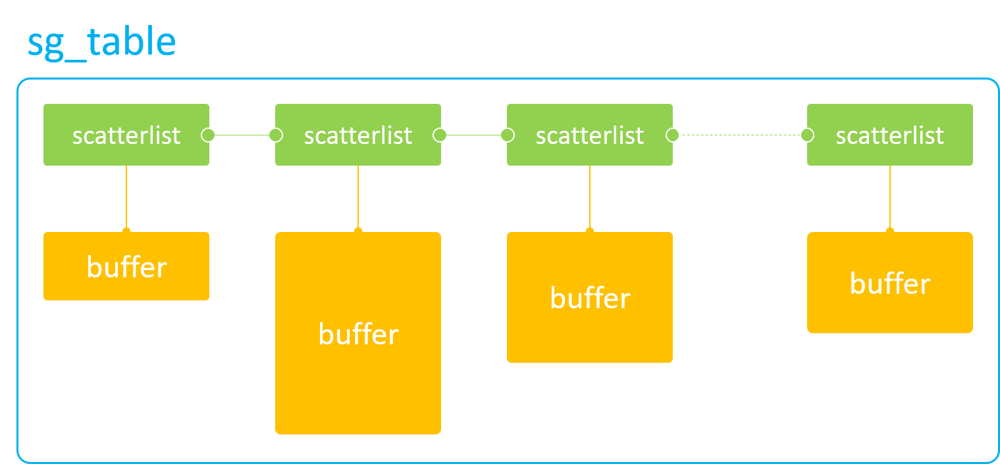

# linux

[kernel](https://sphinxes0o0.github.io/notes/kernel/)

[kernel document](https://docs.linuxkernel.org.cn/driver-api/clk.html)
[chinese document](https://www.kernel.org/doc/html/latest/translations/zh_CN/core-api/cpu_hotplug.html)

[regmap](https://zhuanlan.zhihu.com/p/483789131)
[regmap1](https://blog.csdn.net/qq_35552527/article/details/111212089)
[regmap+spi](https://blog.csdn.net/glen_cao/article/details/127348358)
[regmap](https://www.cnblogs.com/schips/p/linix_regmap.html)

[clock](https://zhuanlan.zhihu.com/p/605593587)

[regulator](https://www.zhaixue.cc/rk3588/rk3588-regulator.html)

[resource](https://blog.csdn.net/Bin_Watson/article/details/126022882)

[ioremap](https://www.codeleading.com/article/39815601323/)

[device access](https://www.cnblogs.com/wolfcs/p/17656752.html)

[rootfs in kernel image](https://blog.csdn.net/u012247418/article/details/107727631)

[uefi](https://kagurazakakotori.github.io/ubmp-cn/part2/loader/bootoption.html)

[driver framework](https://doc.embedfire.com/linux/rk356x/driver/zh/latest/linux_driver/subsystem_power_management.html)

[buildroot](https://doc.embedfire.com/lubancat/build_and_deploy_buildroot/zh/latest/doc/add_custom_content/add_custom_content.html)

[buildroot doc](https://hugh712.gitbooks.io/buildroot/content/understanding-rebuilds.html)

[restricted dma pool v15](https://lore.kernel.org/all/20210624155526.2775863-1-tientzu@chromium.org/)

[restricted dma pool v3](https://www.spinics.net/lists/kernel/msg3787068.html)

[kernel config](https://www.kernelconfig.io/)

[音频基础](https://mp.weixin.qq.com/mp/appmsgalbum?__biz=MjM5MTkxOTQyMQ==&action=getalbum&album_id=2140155659944787969#wechat_redirect)

[openGL基础概念](https://mp.weixin.qq.com/s?__biz=MjM5MTkxOTQyMQ==&mid=2257486712&idx=1&sn=4b8debc7708dd9c0c8ddb2a8d8d07615&scene=21&poc_token=HPtQ8GmjRBvwz-CPgs5jVinFrTnHNLezQLxYbYIk)

[scmi](https://www.qualcomm.com/developer/blog/2024/08/scmi--abstracting-platform-resources-using-power-and-performance)

[ARM 低功耗架构](https://blog.csdn.net/qq_40456702/article/details/134533317)

[Linux 驱动](https://wiki.lckfb.com/zh-hans/linux-docs-tspi3-rk3576/linux-driver-Basics/char-device/implement-char-device.html)


## DMA-BUF

### dma-buf (一)

https://blog.csdn.net/hexiaolong2009/article/details/102596744

### dma-buf (二) -- kmap/vmap

https://blog.csdn.net/hexiaolong2009/article/details/102596761

#### dma-buf 只能用于DMA硬件访问吗

在内核代码中，我们见得最多的dma-buf API莫过于 `dma_buf_attach()` `dma_buf_map_attachment()`，dma-buf难道只能DMA硬件来访问吗？当然不是，dma-buf本质上是buffer与file的结合，因此它仍然是一块buffer。不要看它带了dma字样就被迷惑了，dma-buf不仅能用于DMA硬件访问，也同样适用于CPU软件访问，这也是dma-buf在内核中大受欢迎的一个重要原因。

我才决定将 `dma_buf_kmap()`/`dma_buf_vmap()` 作为dma-buf系列教程的第二章来讲解，因为这两个接口使用起来实在是比DMA操作接口简单太多了。

#### dma-buf 只能分配离散 buffer 吗

当然不是！就和内核中 dma-mapping 接口一样，dma-buf 既可以是物理连续的buffer，也可以是离散的buffer，这最终取决于exporter驱动采用何种方式来分配buffer。
因此为了尽量让读者易于理解，这篇特意使用了内核中最简单、最常见的 `kzalloc()` 函数来分配 dma-buf，这块buffer就是物理连续的了。

#### CPU Access

从linux-3.4开始，dma-buf引入了CPU操作接口，使得开发人员可以在内核空间里直接使用CPU来访问dma-buf的物理内存。

如下 dma-buf API 实现了CPU在内核空间对 dma-buf 内存的访问：

- dma_buf_kmap()
- dma_buf_kmap_atomic()
- dma_buf_vmap()

(它们的反向操作分别对应各自的unmap接口)

通过 dma_buf_kmap()/dma_buf_vmap()操作，就可以把实际的物理内存，映射到kernel空间，并转化成CPU可以连续访问的虚拟地址，方便后续软件直接直接读写这块物理内存。因此，无论这块buffer在物理上是否连续，在经过 kmap/vmap 映射后的虚拟地址一定是连续的。

上述的3个接口分别和linux内存管理子系统（MM）中的 kamp(), kmap_atomic() 和 vmap() 函数一一对应：

|函数|说明|
|-|-|
|kmap()|一次只能映射1个page，可能会睡眠，只能在进程上下文中调用|
|kmap_atomic()|一次只能映射1个page，不会睡眠，可在中断上下文中调用|
|vmap()|一次可以映射多个page，且这些pages物理上可以不连续，只能在进程上下文中调用|

```
1. 
```

### dma-buf (三) -- map attachment

dma-buf设计之初是为了满足那些大内存访问需求的硬件而设计的，如GPU/DPU。在这种场景下，如果使用CPU直接访问memory，那么性能会大大降低。因此，dma-buf在内核中出现频率最高的还是它的 `dma_buf_attach()` 和 `dma_buf_map_attachment()`接口。

#### DMA Access 

dma-buf 提供给DMA硬件访问的API主要就两个：

- `dma_buf_attach()`
- `dma_buf_map_attachment()`

这两个接口调用有严格的先后顺序，必须先attach，再 map_attachment，因为后者的参数是由前者提供的，所以通常这两个接口形影不离。

##### sg_table

由于 DMA操作涉及到内核中 dma-mapping 诸多接口及概念，本篇为避重就轻，无意讲解。但 `sg_table`的概念必须要提一下，因为它是 dma-buf 供 DMA 硬件访问的终极目标，也是 DMA硬件访问离散 memory 的唯一途径

sg_table 本质上是一块块单个物理连续的buffer所组成的链表，但是这个链表整体上看却是离散的，因此它可以很好的描述从高端内存上分配出的离散buffer。当然，它同样可以描述从低端内存上分配出来的物理连续buffer。



sg_table 代表着整个链表，而它的每一个链表项则由 scatterlist 来表示。因此，1个scatterlist也就对应着一块物理连接的buffer。我们可以通过如下接口来获取一个scatterlist对应的buffer的物理地址和长度：

- sg_dma_address(sgl)
- sg_dma_len(sgl)

有了buffer的物理地址和长度，我们就可以将这两个参数配置到DMA硬件寄存器中，这样就可以实现DMA硬件对这一块buffer的访问。那如何访问整块离散buffer呢？当然是用个for循环，不断地解析scatterlist，不断地配置DMA硬件寄存器


>对于现代多媒体硬件来说，IOMMU的出现，解决了程序员编写for循环的烦恼。因为在for循环中，每次配置完DMA硬件寄存器后，都需要等待本次DMA传输完毕，然后才能进行下一次循环，这大大降低了软件的执行效率。而IOMMU的功能就是用来解析sg_table的，它会将sg_table内部一个个离散的小buffer映射到自己内部的设备地址空间，使得这整块buffer在自己内部的设备地址空间上是连续的。这样，在访问离散buffer的时候，只需要将IOMMU映射后的设备地址（与MMU映射后的CPU虚拟地址不是同一概念）和整块buffer的size配置到DMA硬件寄存器中即可，中途无需再多次配置，便完成了DMA硬件对整块离散buffer的访问，大大的提高了软件的效率。


##### dma_buf_attach()

该函数实际是“dma-buf attach device”的缩写，用于建立一个dma-buf与device的连接关系，这个连接关系被存放在新创建的dma_buf_attachment对象中，供后续调用 dma_buf_map_attachment() 使用

##### dma_buf_map_attachment()

该函数实际是 “dma-buf map attachment into sg_table”的缩写，它主要完成“

1. 生成 sg_table
2. 同步 cache

选择返回sg_table而不是物理地址，是为了兼容所有DMA硬件（带或不带IOMMU），因为sg_table既可以表示连续物理内存，也可以表示非连续物理内存。

同步cache是为了防止该buffer事先被CPU填充过，数据暂存在cache中而非DDR上，导致DMA访问的不是最新的有效数据。通过将cache中的数据写回到DDR上可以避免此类问题的发生。同样的，在DMA访问内存结束或，需要将cache设置为无效，以方便后续CPU直接从DDR上（而非cache上）读取该内存数据。通常我们使用以下流式DMA映射接口来完成cache的同步：

- dma_map_singble()/dma_unmap_singble()
- dma_map_page()/dma_unmap_page()
- dma_map_sg()/dma_unmap_sg()

NOTE: 这里涉及DMA和一致性缓存

#### 为什么需要attach操作？

同一个dma-buf可能会被多个DMA硬件访问，而每个DMA硬件可能会因为自身硬件能力的限制，对这块buffer有自己特殊的要求。比如硬件A的寻址能力只有xxx，那么在分配dma-buf的物理内存时，就必须以硬件A的能力标准进行分配。

attach操作可以让exporter驱动根据不同的device硬件能力，来分配最合适的物理内存

> 通过设置device->dma_params参数，来告知exporter驱动该DMA硬件的能力限制。

#### 何时分配内存？

既可以在export阶段，也可以在 map attachment阶段分配，甚至可以在两个阶段都分配，这通常由DMA硬件能力来决定。


### dma-buf (四) -- mmap

https://blog.csdn.net/hexiaolong2009/article/details/102596791

### dma-buf (五) -- File

https://blog.csdn.net/hexiaolong2009/article/details/102596802

