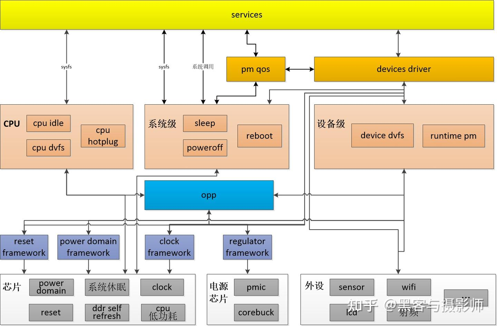

# Power Management

## Linux下Power Management开发总结

[Linux下Power Management开发总结](https://www.cnblogs.com/arnoldlu/p/6229978.html)

内核中功耗开发无论是新模型开发还是已有模型的调优，都需要了解现有的框架，遵循已有框架，简单有效的膝盖。关于Linux省电，从开机-->运行-->suspend-->关机这四种状态，开关机不太受关注，但是足够快也是省电的一种。

suspend是系统级省电，涉及到各外设、Memory、CPU等等各种设备，总之是尽量关闭。只保留不能断电部分用于唤醒系统，以及系统恢复，比如外设唤醒中断、RAM Retention等。suspend本身也有不同种类，mem/standby/hibernation。大部分使用的还是mem，即suspend to ram。此时内核处于冻结状态（PROCESS FREEZE），系统tick停止，只有中断将其从睡眠唤醒才会去处理任务。

在系统运行过程中省电，则要复杂多了。对于CPU在工作时是根据负载动态调频调压（CPUFREQ），没有工作处理的时候进入IDLE（CPUIDLE），更进一步在多核情况下CPU都可以被热插拔（CPU HOTPLUG）；对于各种其他外设可以根据是否被使用而动态关闭（RUNTIME PM）。当然这些调节都要保证性能的输出（PM QoS）。

在系统运行过程中，高温可能导致设备损坏，因此根据温度来分配功耗也是一门必要手段（THERMAL）。

当然省电也离不开一些基础功能比如时钟控制（CLOCK）、供电开关（REGULATOR）、电源域划分（POWER DOMAIN），以及内核和应用都会用到的睡眠锁、唤醒源、唤醒事件都可以归到唤醒事件框架中（WAKEUP EVENT）。

系统供电时使用AC还是电池，被抽象成POWER SUPPLY

### Linux内核Power Management知识点

1. PM COMMON

2. SUSPEND

suspend能提供最深层次的省电，对外接口是/sys/power/state，一般由用户空间触发。suspend、wakeup、hibernate、sleep、str等等概念容易混淆，对其进行了区分，并架构上一级sysfs进行了介绍。

往/sys/power/state写入mem可以触发suspend功能，suspend流程由着明晰的划分：PM core-->Device PM-->syscore-->machine,同样的resume有着对应的阶段，但是顺序是反过来的。Hibernate功能和suspend有着明显的区别，hibernate则是将本来应保存到RAM中的内容保存到了存储设备上了，可以更加省电。

对suspend的优化，因为其涉及到进程冻结、脏数据回写、各种外设的suspend、CPU等等内容，很容易引入问题，需要将其流程细分。
将suspend流程划分为不同phase，尤其Device相关需要再进行细分。而且基于function call graph，甚至可以细节到每个函数执行时间。基本上达到了像素级的优化。

内核节点
```
/sys/power/state

/sys/kernel/debug/tracing/events/power/suspend_resume

/sys/kernel/debug/suspend_stats
```

3. WAKEUP EVENT
具备唤醒功能的设备被称为 wakeup source,它产生的唤醒时间被称为 wakeup events

4. RUNTIME PM

设备影响功耗的行为，主要有是否具备唤醒能力，设备wakelock阻止系统进入唤醒的能力，从设备驱动角度看电源管理，驱动相关的功耗行为包括suspend/resume/shutdown/poweroff/runtime，传统的suspend/resume逐渐被抛弃，runtime_suspend/runtime_resume/runtime_idle更加灵活高效。

5. CPUIDLE

CPU 无事可做时就会进入idle进程，cpu_idle是cpuidle进程的主循环，cpuidle_idle_call是入口点。

cpuidle device是一种虚拟的设备，提供了CPU支持的不同cpuidle状态以及进入状态的驱动。cpuidle支持不同种类的状态。cpuidle governor是决策机构，cpuidle driver是执行机构，cpuidle core提供了触发点以及不同参数配置接口。

6. CPU OPS/HOTPLUG
针对SMP，在cpuidle和cpufreq之间还存在一种低功耗技术cpu的热插拔。动态关闭不需要的CPU核，也可以达到节省功耗的目的。

7. CPUFREQ
cpufreq也称作DVFS，定义了不同的Voltage和Frequency的组合。

## 一文搞懂Linux电源管理

[一文搞懂Linux电源管理](https://zhuanlan.zhihu.com/p/580754972)

### 介绍

为了解决不必要功耗的消耗，linux提供了多种电源管理方式。为了解决系统不工作时的功耗消耗，linux提供了休眠（suspend to ram or disk）、关机（Power off）、复位（reboot）。为了解决运行时不必要的功耗消耗，linux提供了runtimne pm，cpu/device dvfs、cpu hotplug、cpu idle、clock gate、power gate、reset等电源管理的机制。为了解决运行时电源管理对性能的影响，linux提供了pm qos的功能，用于平和性能与功耗，这样既能降低功耗，又不影响性能。

### 框架



功耗管理不仅是软件的逻辑，还需要硬件功能的支撑。硬件设计决定了功耗的下限，热设计决定了功耗的上限，而软件就是通过一些机制及策略将功耗尽可能逼近硬件功耗下限。