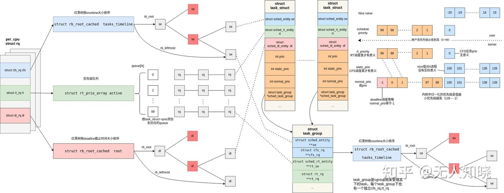

# Realtime

## MCS

[混合系统集成方法](https://rk.51cto.com/article/317121.html)

## Scheduler

### linux 调度策略

[linux 调度策略](https://blog.csdn.net/gkxg001/article/details/145747262)

1. SCHED_BATCH
    - **特点**：`SCHED_BATCH` 是一种用于**批处理任务的调度策略**。它适用于那些**对实时性要求不高但需要长时间运行的任务**，例如后台计算任务。与`SCHED_OTHER`不同，`SCHED_BATCH`会减小进程的调度频率，尽量让进程一次性运行更长时间，从而提高效率。
    - **适用场景**：适合批处理任务，如科学计算、数据处理等。

2. SCHED_DEADLINE
    - **特点**：`SCHED_DEADLINE`是一种**实时调度策略，适用于对时间敏感的任务。它通过三个参数（运行时间、周期、截止时间）来管理任务的执行**。例如，一个任务可能可能需要再每100ms的周期内运行10ms，并且必须在90ms内完成。
    - **适用场景**：适用于需要严格时间约束的实时任务，如工业自动化、音频处理等。

3. SCHED_IDLE
    - **特点**：`SCHED_IDLE`是**一种低优先级的调度策略，适用于那些只有在系统空闲时才运行的任务**。它确保这些任务不会干扰其他更高优先级的任务。
    - **适用场景**：适合低优先级的后台任务，如磁盘清理工具。

4. SCHED_FIFO
    - **特点**：`SCHED_FIFO`是一种**实时调度策略，采用先进先出的方式。一旦进程获得CPU，它会一直运行，直到主动放弃CPU或被更高优先级的进程抢占**。
    - **适用场景**：适用于实时性要求极高的任务，如音视频处理。

5. SCHED_RR
    - **特点**：`SCHED_RR`是一种**带有时间片的实时调度策略。它与`SCHED_FIFO`类似，但在时间片耗尽后会释放CPU**。
    - **适用场景**：适用于需要多个实时任务公平共享CPU的场景。

6. SCHED_OTHER
    - **特点**：`SCHED_OTHER`是**Linux系统默认的调度策略，基于完全公平调度器（CFS）**。它通过**动态优先级的时间片来平衡系统中所有进程的CPU时间**。
    - **适用场景**：适用于大多数普通用户程序和后台服务。

### Linux 调度策略

[Linux调度策略](https://zhuanlan.zhihu.com/p/713813474)

进程是资源管理的单位，线程是调度的单位。调度器决定了将哪个进程放到CPU上执行，以及执行多长时间。操作系统进行合理的进程调度，使得资源得到最大化地利用。Linux 的调度机制由调度策略（policies）和优先级（priority）两个属性共同决定。

#### Linux 进程状态及调度发生的时机

一个Linux进程从被创建到死亡，可能会经过很多种状态，比如执行、暂停、可中断睡眠、不可中断睡眠、退出等。我们可以把Linux下繁多的进程状态，归纳为三种基本状态：

- 就绪（ready）：进程 已经获得了CPU以外的所有必要资源，比如进程空间，信号，锁等。就绪状态下的进程等到CPU调度，便可立即执行
- 执行（running）：进程获得CPU，执行程序。
- 阻塞（blocked）：当进程由于等待某个事件而无法执行时，便放弃CPU，处于阻塞状态。

Linux中的就绪态和运行态对应的都是TASK_RUNNING标志位，就绪态表示进程正处在队列中，尚未被调度来运行态则表示进程正在CPU上运行；所谓的调度就是线程从就绪到CPU执行的选择过程。

#### 调度的时机

调度的调用时机主要包括以下几种情况：

- 时钟中断
- 系统调用返回用户空间
- 阻塞和唤醒
- 进程退出
- 优先级变化
- 工作队列和软中断
- 主动放弃CPU

这些调用时机确保了操作系统能够公平有效地分配CPU资源给各个进程，并保持系统的响应性和稳定性。调度通过一系列复杂的算法来决定哪一个就绪进程最应该获得下一次的CPU时间，这些算法包括但不限于CFS调度器用于普通进程，以及其他针对实时进程的调度策略。

#### 调度策略

1. 调度类（scheduling class）

在Linux中，使用 struct sched_class 结构体描述一个具体的调度类，常见的调度策略类：

|调度类|调度类描述|关联的调度策略|
|-|-|-|
|stop_sched_class|CPU热插拔，系统紧急停止等（不对应用层暴露）|NA|
|dl_sched_class|Deadline调度器（Deadline）：适用对截止时间有严格要求的任务，确保这些任务在规定的时间内完成|SCHED_DEADLINE|
|rt_sched_class|实时调度器（RT）：用于处理实时性要求非常高的任务|SCHED_FIFO、SCHED_RR|
|fair_sched_class|完全公平调度器（CFS）：注重在多个任务之间实现资源的公平分配，以保证系统的整体效率和公平性|SCHED_OTHER、SCHED_BATCH、SCHED_IDLE|
|idle_sched_class|空闲调度器，每个CPU都会有一个idle线程。当没有其他进程可以调度时，调度运行idle线程|NA|

每个线程都对应一种调度策略，每种调度策略又对应一种调度类；以上的调度类有优先级概念：

```C
#define SCHED_DATA				\
	STRUCT_ALIGN();				\
	__sched_class_highest = .;		\
	*(__stop_sched_class)			\
	*(__dl_sched_class)			\
	*(__rt_sched_class)			\
	*(__fair_sched_class)			\
	*(__idle_sched_class)			\
	__sched_class_lowest = .;
```

```C
kernel/sched/core.c
static inline struct task_struct *
__pick_next_task(struct rq *rq, struct task_struct *prev, struct rq_flags *rf)
{
......
	for_each_class(class) {//优先级从高到低获取task
		p = class->pick_next_task(rq);
		if (p)
			return p;
	}
......
```

Linux调度核心在选择下一个合适的task运行的时候，会按优先级的顺序遍历调度类的pick_next_task。因此执行调度策略的顺序：SCHED_DEADLING > SCHED_FIFO/SCHED_RR > SCHED_NORMAL/SCHED_BATCH > SCHED_IDLE

Linux内核提供的这些调度策略供用户程序来选择使用，其中stop调度器和idle调度器仅由内核使用，用户无法进行选择。

2. 调度类关键结构体

sched_class 定义了一个调度器应该具备的基本操作，结构体定义如下：

```C
struct sched_class {

#ifdef CONFIG_UCLAMP_TASK
	int uclamp_enabled;
#endif

	void (*enqueue_task) (struct rq *rq, struct task_struct *p, int flags);
	void (*dequeue_task) (struct rq *rq, struct task_struct *p, int flags);
	void (*yield_task)   (struct rq *rq);
	bool (*yield_to_task)(struct rq *rq, struct task_struct *p);

	void (*check_preempt_curr)(struct rq *rq, struct task_struct *p, int flags);

	struct task_struct *(*pick_next_task)(struct rq *rq);

	void (*put_prev_task)(struct rq *rq, struct task_struct *p);
	void (*set_next_task)(struct rq *rq, struct task_struct *p, bool first);

#ifdef CONFIG_SMP
	int (*balance)(struct rq *rq, struct task_struct *prev, struct rq_flags *rf);
	int  (*select_task_rq)(struct task_struct *p, int task_cpu, int flags);

	struct task_struct * (*pick_task)(struct rq *rq);

	void (*migrate_task_rq)(struct task_struct *p, int new_cpu);

	void (*task_woken)(struct rq *this_rq, struct task_struct *task);

	void (*set_cpus_allowed)(struct task_struct *p, struct affinity_context *ctx);

	void (*rq_online)(struct rq *rq);
	void (*rq_offline)(struct rq *rq);

	struct rq *(*find_lock_rq)(struct task_struct *p, struct rq *rq);
#endif

	void (*task_tick)(struct rq *rq, struct task_struct *p, int queued);
	void (*task_fork)(struct task_struct *p);
	void (*task_dead)(struct task_struct *p);

	/*
	 * The switched_from() call is allowed to drop rq->lock, therefore we
	 * cannot assume the switched_from/switched_to pair is serialized by
	 * rq->lock. They are however serialized by p->pi_lock.
	 */
	void (*switched_from)(struct rq *this_rq, struct task_struct *task);
	void (*switched_to)  (struct rq *this_rq, struct task_struct *task);
	void (*prio_changed) (struct rq *this_rq, struct task_struct *task,
			      int oldprio);

	unsigned int (*get_rr_interval)(struct rq *rq,
					struct task_struct *task);

	void (*update_curr)(struct rq *rq);

#ifdef CONFIG_FAIR_GROUP_SCHED
	void (*task_change_group)(struct task_struct *p);
#endif

#ifdef CONFIG_SCHED_CORE
	int (*task_is_throttled)(struct task_struct *p, int cpu);
#endif
};
```

3. 调度类与task_struct的关系



- linux调度单元是线程，内核对应task_struct；在task_struct中根据不同调度类型的sched_entity来管理
- 每个cpu上有一个rq来管理此cpu上的cfs、rt及deadline调度，分别使用不同的rq类型管理
- cfs_rq内部使用rb树关联se（se关联task_struct或task_group），cfs_rq适用se的vruntime来管理其在rb树中的位置，每次挑选线程时选择最小的vruntime任务执行
- rt_rq适用queue管理对应的rq_se（se关联task_struct或task_group），rq按照优先级挑选对应的rq_se，相同优先级的task会添加到同一个queue中
- dl_rq也是使用rb树关联dl_se，按照deadline时间到期的远近在rb中排序；每次挑选选择最近时间到期的dl线程。
- task_struct中有4个prio（rt_priority,static_prio,normal_prio,prio），其中normal_prio是内核归一化使用的优先级；在同一CPU的rq上实时线程永远比普通线程优先选择运行。普通线程调度策略的优先级值为0，而实时调度策略的优先级取值范围1~99。
- task_group（cgroup）也使用se（struct sched_entity）来管理其下的task，每个cgroup下也有独立cfs_rq，rt_rq，构成层级关系；当CFS调度器选到的se是一个task_group时，会根据cgroup内部的cfs_rq再去选择最小vruntime的se执行。

4. 各种调度策略介绍及使用方式

4.1 SCHED_DEADLINE
它是一种实时调度策略，主要特点有：
- 周期性和截止时间
- 带宽分配
- 严格的优先级
- deadline调度参数的含义

4.2 SCHED_RR
当线程间的优先级不同时，优先级高的先调度。当优先级相同时，固定的时间片循环调度。被调用的rt线程满足如下条件时会让出CPU：

- 调度期间的时间片使用完
- 主动放弃CPU
- 被高优先级的线程抢占
- 线程终止

如果因为时间片使用完或主动放弃CPU而导致线程让出CPU，此时此线程将会被放置在与其优先级别对应的队列的队尾。如果因为被抢占而让出CPU，则会被放置到队头，等更高优先级让出CPU时，继续执行此线程

4.3 SCHED_FIFO
与 SCHED_RR 实时调度策略相似，不过它没有时间片的概念，如果一个SCHED_FIFO任务不释放CPU，同级别其他rt任务也得不到执行；被调用的线程让出CPU条件与SCHED_RR类似，只是没有时间片使用完的情况

4.4 SCHED_OTHER
SCHED_OTHER 是普通进程的默认调度策略，也是完全公平调度（CFS）锁管理的策略。CFS使用一种基于虚拟运行时间的公平调度算法，确保所有进程在长时间内获得大致相等的CPU时间。

- 优先级范围：它的内核归一化优先级范围是100到139，用户空间程序通过修改nice值来控制，nice值在-20~19
- 交互性：SCHED_OTHER旨在为所有进程提供公平的时间片分配，因此它适合于需要良好响应性的交互式应用程序。
- 时间片计算：CFS根据进程的nice值来决定进程可以获得的时间片长度。nice值越低，进程获得的时间片就越长。
- 抢占：`SCHED_OTHER`进程可以被更高优先级的实时进程抢占

每个SCHED_OTHER策略的线程都拥有一个nice值，其取值范围为-20~19，默认值为0；nice值是一个权重因子（每增加1级权重减少1.25倍），值越小权重越大，CPU为其分配的动态时间片会越多，每级nice控制的load差异大概是10%左右

4.5 SCHED_BATCH
SCHED_BATCH 是一种专门为批处理任务设计的调度策略，适用于长时间运行的、计算密集型的任务；

- 优先级范围：它的内核归一化优先级范围是100到139， 用户空间程序通过修改nice值来控制，nice值在-20~19
- 延迟唤醒：SCHED_BATCH进程在被唤醒后不会立即抢占当前运行的进程，而是会等待一段时间，以确保不会打断正在运行的交互式任务。
- 降低交互性影响：通过使用SCHED_BATCH，系统可以确保这些CPU密集型任务不会干扰到其他更需要响应性的交互式任务。

```C
kernel/sched/fair.c 
/*
 * Preempt the current task with a newly woken task if needed:
 */
static void check_preempt_wakeup(struct rq *rq, struct task_struct *p, int wake_flags)
{    
    /*
     * Batch and idle tasks do not preempt non-idle tasks (their preemption
     * is driven by the tick):
     */
 if (unlikely(p->policy != SCHED_NORMAL) || !sched_feat(WAKEUP_PREEMPTION))
 return;
```

4.6 SCHED_IDLE
可以理解为比nice=19更低的SCHED_OTHER策略。当系统中没有其他线程需要使用CPU时才会大量使用CPU；调整SCHED_IDLE调度策略线程的nice值对最终运行行为不会产生改变；注意这里的sched_idle并不会使用idle_shed_class调度类，它依然是cfs调度类

4.7 CFS下几种调度策略对比的例子

```bash
# 启动任务并绑定到指定CPU
taskset -c 7 <process_name>

# 修改已经运行进程CPU亲核性
taskset -pc 5,7 <pid>

# 设置进程为SCHED_OTHER策略
chrt -o -p 0 <pid>

# 设置进程为SCHED_BATCH策略
chrt -b -p 0 <pid>

# 设置进程为SCHED_IDLE策略
chrt -i -p 0 <pid>

# 查看进程调度策略
chrt -p <pid>

# 调整cfs进程nice值
renice -n <-20~19> -p <PID>
```

### 实时调度实战

[实时调度实战](https://zhuanlan.zhihu.com/p/29235176417)

Linux 系统中的进程可以分为不同的类型，其中实时进程对时间要求较高，他们需要在规定时间内完成任务。实时进程又可以进一步分为硬实时和软实时进程。硬实时进程必须在绝对的时间窗口内完成任务，否则可能会导致系统失效或灾难性后果，比如航空航天控制、医疗设备等领域的任务。软实时进程虽然也追求在规定时间内完成任务，但偶尔的超时通常不会导致系统完全失效，只会影响系统的服务质量或用户体验，像多媒体处理、网络通信等场景中的任务。除了实时进程，还有普通进程，他们对时间的要求相对较低，在系统资源分配中处于相对次要的地位。

为了实现对进程的有效调度，linux 系统采用了多种调度算法。其中，时间片轮转调度算法是一种常见的调度方式。它将CPU的时间划分为一个个固定长度的时间片，每个进程轮流获得一个时间片来运行。当一个进程的时间片用完后，即使它还没有完成任务，也会被暂停，然后被放入就绪队列的末尾，等待下一轮调度。这种调度方式就像是超市里的顾客们轮流在收银台结账，每个人都有机会得到服务，从而保证了系统的公平性和响应性。

实时调度器主要为了解决以下四种情况：

1. 在唤醒任务时，待唤醒的任务放置到哪个运行队列最合适
2. 新唤醒任务的优先级比某个运行队列的当前任务更低时，怎么处理这个更低优先级任务
3. 新唤醒任务的优先级比同一运行队列的某个任务更高时，并且抢占了该更低优先级任务，该低优先级任务怎么处理
4. 当某个任务降低自身优先级，导致原来更低优先级任务相比之下具有更高优先级，这种情况怎么处理

对于情况2和情况3，实时调度器采用push操作。push操作从根域中所有运行队列中挑选一个运行队列（一个cpu对应一个运行队列），该运行队列的优先级比待push任务的优先级更低。运行队列的优先级是指该运行队列上所有任务的最高优先级。

#### 实时调度策略

Linux 内核中提供了两种实时调度策略：SCHED_FIFO 和 SCHED_RR，其中 RR 是带有时间片的 FIFO。这两种调度算法实现的都是静态优先级。内核不为实时进制计算动态优先级。这能保证给定优先级别的实时进程总能抢占优先级比他低的进程。linux 的实时调度算法提供了一种软实时工作方式。实时优先级范围从 0 到 MAX_RT_PRIO 减一。默认情况下，MAX_RT_PRIO 为 100（定义在include/linux/sched.h），所以默认的实时优先级范围是从0到99。SCHED_NORMAL级进程的nice值共享了这个取值空间，它的取值范围是从 MAX_RT_PRIO 到 MAX_RT_PRIO+40。也就是说，在默认情况下，nice 值从 -20 到 19 直接对应的是从 100 到 139 的优先级范围，这就是普通进程的静态优先级范围。在实时调度策略下，schedule() 函数的运行会关联到实时调度类 rt_sched_class。

##### SCHED_FIFO 独占 CPU 的霸王龙

以音频处理场景为例，在实时音频录制和播放中，就经常会用到SCHED_FIFO策略。在录制音频时，需要保证音频数据的连续性和及时性，不能有丝毫的延迟或中断。如果采用SCHED_FIFO策略，音频录制进程一旦获得CPU资源，就会持续运行，将麦克风采集到的音频数据及时地写入存储设备。在播放音频时，音频播放进程也会独占CPU，按照顺序将音频数据从存储设备中读取出来，并发送到音频输出设备进行播放。这样可以确保音频的流畅播放，不会出现卡顿或杂音的情况，为用户带来高品质的音频体验。

SCHED_FIFO策略的优点显而易见，它可以为那些对时间要求极为严格的实时进程提供稳定且可预测的执行时间，这对于一些需要精确控制时间的系统来说至关重要，比如工业控制系统，机器人控制等领域。在这些系统中，任务的执行时间必须是可预测的，否则可能会导致严重的后果。

然而，SCHED_FIFO策略也存在明显的缺点。由于它没有时间片的概念，一旦一个低优先级的进程先获得了CPU资源，并且一直不主动放弃，那么其他优先级较低的进程就可能会一直处于饥饿状态，无法获得CPU资源来执行。这就好比一群人在排队等待服务，但是排在前面的人一直占用着服务资源不离开，后面的人就只能一直等待，这显然是不公平的。

##### SCHED_RR 公平轮替的“时间掌控者”

与SCHED_FIFO不同，SCHED_RR像是一位公平的时间掌控者，采用时间片轮转的调度机制。在这种策略下，每个进程都会被分配到一个固定的时间片。当进程运行时，时间片会逐渐减少。一旦进程用完了自己的时间片，它就会被放入就绪队列的末尾，同事释放CPU资源，让其他相同优先级的进程有机会执行。这就像一场接力比赛，每个选手都有规定的跑步时间，时间一到就把接力棒交给下一位选手，保证了每个选手都有公平的参与机会。

以动画渲染场景为例，在制作动画时，通常会有多个任务同时进行，比如模型渲染、材质处理、光影计算等。这些任务可能具有相同的优先级，需要合理地分配CPU资源。如果采用SCHED_RR策略，每个渲染任务都会被分配一个时间片。在自己的时间片内，任务可以充分利用CPU资源进行计算和处理。当时间片用完后，任务会暂停，将CPU资源让给其他任务。这样可以确保每个渲染任务都能得到及时地处理，不会因为某个任务长时间占用CPU而导致其他任务延迟，从而保证了动画渲染的高效进行。

SCHED_RR策略在保证实时性的同时，还兼顾了公平性。它通过时间片的轮转，让每个进程都能在一定的时间内获得CPU资源，避免了低优先级进程长时间得不到执行的情况。这使得它在一些对响应时间要求较高，同时又需要保证公平性的实时进程中得到了广泛应用，比如交互式应用程序、游戏等。在这些应用中，用户希望能够得到及时地响应，同时也不希望某个任务独占CPU资源，导致其他操作变得迟缓。


调度优化-调度策略配置测试报告

一、测试概述
本文档描述如何通过配置任务的调度策略和cgroup分组，实现系统的混合关键级调度，将安全关键业务部署在实时调度域，非安全业务运行在分时调度域内，并通过层次化调度策略确保低优先的任务能够获得最低服务保障，避免任务饥饿。

二、编写不同安全级别关键任务代码
1. 模拟非安全业务
非安全业务采用SCHED_OTHER的分时调度策略，此策略为创建任务时默认的调度策略
```C
#include <stdio.h>
#include <stdlib.h>
#include <unistd.h>
#include <sched.h>

void *normal_task(void *arg) {

    // 主循环
    while(1) {
        // 模拟工作负载
        usleep(1000000); // 1s
    }

    return NULL;
}

int main() {
    pthread_t task_thread;

    // 创建分时任务线程
    if (pthread_create(&task_thread, NULL, normal_task, NULL) != 0) {
        perror("pthread_create failed");
        exit(EXIT_FAILURE);
    }

    // 等待分时任务线程结束
    pthread_join(task_thread, NULL);

    return 0;
}
```

2. 模拟低关键任务代码
低关键任务采用SCHED_FIFO的实时调度策略，此策略下如果任务获得CPU执行时，且没有其他高优先级的任务抢占的情况下，将一直执行到结束
```C
void *low_critical_task(void *arg) {
    struct sched_param param;
    param.sched_priority = 1;

    // 设置实时调度策略
    if (sched_setscheduler(0, SCHED_FIFO， &param) == -1) {
        perror("sched_setscheduler failed");
        exit(EXIT_FAILURE);
    }

    // 主循环
    while(1) {
        // 模拟工作负载
        usleep(100000); // 100ms
    }

    return NULL;
}
```

3. 模拟高关键任务代码
高关键任务采用SCHED_DEADLINE的实时调度策略，此策略下如果任务获得CPU执行时，保证每个周期运行一定的时间，直到声明的截止时间，以此保证完整的运行时间
```C
void *high_critical_task(void *arg) {
    struct sched_param param;
    param.sched_priority = 99;

    // 设置实时调度策略
    if (sched_setscheduler(0, SCHED_DEADLINE， &param) == -1) {
        perror("sched_setscheduler failed");
        exit(EXIT_FAILURE);
    }

    struct sched_attr attr;
    attr.size = sizeof(attr);
    attr.sched_policy = SCHED_DEADLINE;
    attr.sched_runtime = 10000000; //10ms
    attr.sched_deadline = 20000000; //20ms
    attr.sched_period = 10000000; //10ms

    if (sched_setattr(0, &attr, 0) == -1) {
        perror("sched_setattr failed");
        exit(EXIT_FAILURE);
    }

    // 主循环
    while(1) {
        // 模拟工作负载
        usleep(10000); // 10ms
    }

    return NULL;
}
```

三、配置 cgroup 分组


四、运行测试不同类型调度策略的任务

[chrt测试方法](https://cloud.tencent.com/developer/article/2118807)