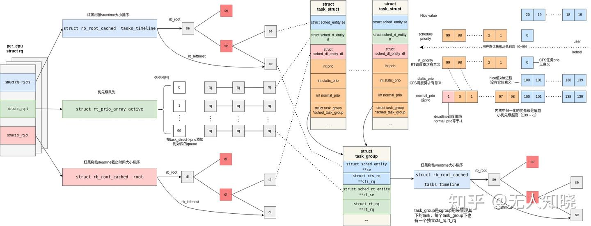

# Realtime

[蔚来天枢](https://news.qq.com/rain/a/20250103A0208900)

[蔚来天枢](https://zhuanlan.zhihu.com/p/1972833468116398485)

[rcore-os](https://rcore-os.cn/rCore-Tutorial-Book-v3/chapter9/2device-driver-4.html)

[SPHERE 基于异构平台的下一代信息物理系统多SoC架构](https://zhuanlan.zhihu.com/p/1919491370554463373)


## MCS

[混合系统集成方法](https://rk.51cto.com/article/317121.html)

[rel4 mcs](https://rel4team.github.io/zh/docs/reL4kernel/mcs_support/mcs_support/)

[sel4](https://deepwiki.com/seL4/seL4)

## Scheduler

### linux 调度策略

[linux 调度策略](https://blog.csdn.net/gkxg001/article/details/145747262)

1. SCHED_BATCH
    - **特点**：`SCHED_BATCH` 是一种用于**批处理任务的调度策略**。它适用于那些**对实时性要求不高但需要长时间运行的任务**，例如后台计算任务。与`SCHED_OTHER`不同，`SCHED_BATCH`会减小进程的调度频率，尽量让进程一次性运行更长时间，从而提高效率。
    - **适用场景**：适合批处理任务，如科学计算、数据处理等。

2. SCHED_DEADLINE
    - **特点**：`SCHED_DEADLINE`是一种**实时调度策略，适用于对时间敏感的任务。它通过三个参数（运行时间、周期、截止时间）来管理任务的执行**。例如，一个任务可能可能需要再每100ms的周期内运行10ms，并且必须在90ms内完成。
    - **适用场景**：适用于需要严格时间约束的实时任务，如工业自动化、音频处理等。

3. SCHED_IDLE
    - **特点**：`SCHED_IDLE`是**一种低优先级的调度策略，适用于那些只有在系统空闲时才运行的任务**。它确保这些任务不会干扰其他更高优先级的任务。
    - **适用场景**：适合低优先级的后台任务，如磁盘清理工具。

4. SCHED_FIFO
    - **特点**：`SCHED_FIFO`是一种**实时调度策略，采用先进先出的方式。一旦进程获得CPU，它会一直运行，直到主动放弃CPU或被更高优先级的进程抢占**。
    - **适用场景**：适用于实时性要求极高的任务，如音视频处理。

5. SCHED_RR
    - **特点**：`SCHED_RR`是一种**带有时间片的实时调度策略。它与`SCHED_FIFO`类似，但在时间片耗尽后会释放CPU**。
    - **适用场景**：适用于需要多个实时任务公平共享CPU的场景。

6. SCHED_OTHER
    - **特点**：`SCHED_OTHER`是**Linux系统默认的调度策略，基于完全公平调度器（CFS）**。它通过**动态优先级的时间片来平衡系统中所有进程的CPU时间**。
    - **适用场景**：适用于大多数普通用户程序和后台服务。

### Linux 调度策略

[Linux调度策略](https://zhuanlan.zhihu.com/p/713813474)

进程是资源管理的单位，线程是调度的单位。调度器决定了将哪个进程放到CPU上执行，以及执行多长时间。操作系统进行合理的进程调度，使得资源得到最大化地利用。Linux 的调度机制由调度策略（policies）和优先级（priority）两个属性共同决定。

#### Linux 进程状态及调度发生的时机

一个Linux进程从被创建到死亡，可能会经过很多种状态，比如执行、暂停、可中断睡眠、不可中断睡眠、退出等。我们可以把Linux下繁多的进程状态，归纳为三种基本状态：

- 就绪（ready）：进程 已经获得了CPU以外的所有必要资源，比如进程空间，信号，锁等。就绪状态下的进程等到CPU调度，便可立即执行
- 执行（running）：进程获得CPU，执行程序。
- 阻塞（blocked）：当进程由于等待某个事件而无法执行时，便放弃CPU，处于阻塞状态。

Linux中的就绪态和运行态对应的都是TASK_RUNNING标志位，就绪态表示进程正处在队列中，尚未被调度来运行态则表示进程正在CPU上运行；所谓的调度就是线程从就绪到CPU执行的选择过程。

#### 调度的时机

调度的调用时机主要包括以下几种情况：

- 时钟中断
- 系统调用返回用户空间
- 阻塞和唤醒
- 进程退出
- 优先级变化
- 工作队列和软中断
- 主动放弃CPU

这些调用时机确保了操作系统能够公平有效地分配CPU资源给各个进程，并保持系统的响应性和稳定性。调度通过一系列复杂的算法来决定哪一个就绪进程最应该获得下一次的CPU时间，这些算法包括但不限于CFS调度器用于普通进程，以及其他针对实时进程的调度策略。

#### 调度策略

1. 调度类（scheduling class）

在Linux中，使用 struct sched_class 结构体描述一个具体的调度类，常见的调度策略类：

|调度类|调度类描述|关联的调度策略|
|-|-|-|
|stop_sched_class|CPU热插拔，系统紧急停止等（不对应用层暴露）|NA|
|dl_sched_class|Deadline调度器（Deadline）：适用对截止时间有严格要求的任务，确保这些任务在规定的时间内完成|SCHED_DEADLINE|
|rt_sched_class|实时调度器（RT）：用于处理实时性要求非常高的任务|SCHED_FIFO、SCHED_RR|
|fair_sched_class|完全公平调度器（CFS）：注重在多个任务之间实现资源的公平分配，以保证系统的整体效率和公平性|SCHED_OTHER、SCHED_BATCH、SCHED_IDLE|
|idle_sched_class|空闲调度器，每个CPU都会有一个idle线程。当没有其他进程可以调度时，调度运行idle线程|NA|

每个线程都对应一种调度策略，每种调度策略又对应一种调度类；以上的调度类有优先级概念：

```C
#define SCHED_DATA				\
	STRUCT_ALIGN();				\
	__sched_class_highest = .;		\
	*(__stop_sched_class)			\
	*(__dl_sched_class)			\
	*(__rt_sched_class)			\
	*(__fair_sched_class)			\
	*(__idle_sched_class)			\
	__sched_class_lowest = .;
```

```C
kernel/sched/core.c
static inline struct task_struct *
__pick_next_task(struct rq *rq, struct task_struct *prev, struct rq_flags *rf)
{
......
	for_each_class(class) {//优先级从高到低获取task
		p = class->pick_next_task(rq);
		if (p)
			return p;
	}
......
```

Linux调度核心在选择下一个合适的task运行的时候，会按优先级的顺序遍历调度类的pick_next_task。因此执行调度策略的顺序：SCHED_DEADLING > SCHED_FIFO/SCHED_RR > SCHED_NORMAL/SCHED_BATCH > SCHED_IDLE

Linux内核提供的这些调度策略供用户程序来选择使用，其中stop调度器和idle调度器仅由内核使用，用户无法进行选择。

2. 调度类关键结构体

sched_class 定义了一个调度器应该具备的基本操作，结构体定义如下：

```C
struct sched_class {

#ifdef CONFIG_UCLAMP_TASK
	int uclamp_enabled;
#endif

	void (*enqueue_task) (struct rq *rq, struct task_struct *p, int flags);
	void (*dequeue_task) (struct rq *rq, struct task_struct *p, int flags);
	void (*yield_task)   (struct rq *rq);
	bool (*yield_to_task)(struct rq *rq, struct task_struct *p);

	void (*check_preempt_curr)(struct rq *rq, struct task_struct *p, int flags);

	struct task_struct *(*pick_next_task)(struct rq *rq);

	void (*put_prev_task)(struct rq *rq, struct task_struct *p);
	void (*set_next_task)(struct rq *rq, struct task_struct *p, bool first);

#ifdef CONFIG_SMP
	int (*balance)(struct rq *rq, struct task_struct *prev, struct rq_flags *rf);
	int  (*select_task_rq)(struct task_struct *p, int task_cpu, int flags);

	struct task_struct * (*pick_task)(struct rq *rq);

	void (*migrate_task_rq)(struct task_struct *p, int new_cpu);

	void (*task_woken)(struct rq *this_rq, struct task_struct *task);

	void (*set_cpus_allowed)(struct task_struct *p, struct affinity_context *ctx);

	void (*rq_online)(struct rq *rq);
	void (*rq_offline)(struct rq *rq);

	struct rq *(*find_lock_rq)(struct task_struct *p, struct rq *rq);
#endif

	void (*task_tick)(struct rq *rq, struct task_struct *p, int queued);
	void (*task_fork)(struct task_struct *p);
	void (*task_dead)(struct task_struct *p);

	/*
	 * The switched_from() call is allowed to drop rq->lock, therefore we
	 * cannot assume the switched_from/switched_to pair is serialized by
	 * rq->lock. They are however serialized by p->pi_lock.
	 */
	void (*switched_from)(struct rq *this_rq, struct task_struct *task);
	void (*switched_to)  (struct rq *this_rq, struct task_struct *task);
	void (*prio_changed) (struct rq *this_rq, struct task_struct *task,
			      int oldprio);

	unsigned int (*get_rr_interval)(struct rq *rq,
					struct task_struct *task);

	void (*update_curr)(struct rq *rq);

#ifdef CONFIG_FAIR_GROUP_SCHED
	void (*task_change_group)(struct task_struct *p);
#endif

#ifdef CONFIG_SCHED_CORE
	int (*task_is_throttled)(struct task_struct *p, int cpu);
#endif
};
```

3. 调度类与task_struct的关系



- linux调度单元是线程，内核对应task_struct；在task_struct中根据不同调度类型的sched_entity来管理
- 每个cpu上有一个rq来管理此cpu上的cfs、rt及deadline调度，分别使用不同的rq类型管理
- cfs_rq内部使用rb树关联se（se关联task_struct或task_group），cfs_rq适用se的vruntime来管理其在rb树中的位置，每次挑选线程时选择最小的vruntime任务执行
- rt_rq适用queue管理对应的rq_se（se关联task_struct或task_group），rq按照优先级挑选对应的rq_se，相同优先级的task会添加到同一个queue中
- dl_rq也是使用rb树关联dl_se，按照deadline时间到期的远近在rb中排序；每次挑选选择最近时间到期的dl线程。
- task_struct中有4个prio（rt_priority,static_prio,normal_prio,prio），其中normal_prio是内核归一化使用的优先级；在同一CPU的rq上实时线程永远比普通线程优先选择运行。普通线程调度策略的优先级值为0，而实时调度策略的优先级取值范围1~99。
- task_group（cgroup）也使用se（struct sched_entity）来管理其下的task，每个cgroup下也有独立cfs_rq，rt_rq，构成层级关系；当CFS调度器选到的se是一个task_group时，会根据cgroup内部的cfs_rq再去选择最小vruntime的se执行。

4. 各种调度策略介绍及使用方式

4.1 SCHED_DEADLINE
它是一种实时调度策略，主要特点有：
- 周期性和截止时间
- 带宽分配
- 严格的优先级
- deadline调度参数的含义

4.2 SCHED_RR
当线程间的优先级不同时，优先级高的先调度。当优先级相同时，固定的时间片循环调度。被调用的rt线程满足如下条件时会让出CPU：

- 调度期间的时间片使用完
- 主动放弃CPU
- 被高优先级的线程抢占
- 线程终止

如果因为时间片使用完或主动放弃CPU而导致线程让出CPU，此时此线程将会被放置在与其优先级别对应的队列的队尾。如果因为被抢占而让出CPU，则会被放置到队头，等更高优先级让出CPU时，继续执行此线程

4.3 SCHED_FIFO
与 SCHED_RR 实时调度策略相似，不过它没有时间片的概念，如果一个SCHED_FIFO任务不释放CPU，同级别其他rt任务也得不到执行；被调用的线程让出CPU条件与SCHED_RR类似，只是没有时间片使用完的情况

4.4 SCHED_OTHER
SCHED_OTHER 是普通进程的默认调度策略，也是完全公平调度（CFS）锁管理的策略。CFS使用一种基于虚拟运行时间的公平调度算法，确保所有进程在长时间内获得大致相等的CPU时间。

- 优先级范围：它的内核归一化优先级范围是100到139，用户空间程序通过修改nice值来控制，nice值在-20~19
- 交互性：SCHED_OTHER旨在为所有进程提供公平的时间片分配，因此它适合于需要良好响应性的交互式应用程序。
- 时间片计算：CFS根据进程的nice值来决定进程可以获得的时间片长度。nice值越低，进程获得的时间片就越长。
- 抢占：`SCHED_OTHER`进程可以被更高优先级的实时进程抢占

每个SCHED_OTHER策略的线程都拥有一个nice值，其取值范围为-20~19，默认值为0；nice值是一个权重因子（每增加1级权重减少1.25倍），值越小权重越大，CPU为其分配的动态时间片会越多，每级nice控制的load差异大概是10%左右

4.5 SCHED_BATCH
SCHED_BATCH 是一种专门为批处理任务设计的调度策略，适用于长时间运行的、计算密集型的任务；

- 优先级范围：它的内核归一化优先级范围是100到139， 用户空间程序通过修改nice值来控制，nice值在-20~19
- 延迟唤醒：SCHED_BATCH进程在被唤醒后不会立即抢占当前运行的进程，而是会等待一段时间，以确保不会打断正在运行的交互式任务。
- 降低交互性影响：通过使用SCHED_BATCH，系统可以确保这些CPU密集型任务不会干扰到其他更需要响应性的交互式任务。

```C
kernel/sched/fair.c 
/*
 * Preempt the current task with a newly woken task if needed:
 */
static void check_preempt_wakeup(struct rq *rq, struct task_struct *p, int wake_flags)
{    
    /*
     * Batch and idle tasks do not preempt non-idle tasks (their preemption
     * is driven by the tick):
     */
 if (unlikely(p->policy != SCHED_NORMAL) || !sched_feat(WAKEUP_PREEMPTION))
 return;
```

4.6 SCHED_IDLE
可以理解为比nice=19更低的SCHED_OTHER策略。当系统中没有其他线程需要使用CPU时才会大量使用CPU；调整SCHED_IDLE调度策略线程的nice值对最终运行行为不会产生改变；注意这里的sched_idle并不会使用idle_shed_class调度类，它依然是cfs调度类

4.7 CFS下几种调度策略对比的例子

```bash
# 启动任务并绑定到指定CPU
taskset -c 7 <process_name>

# 修改已经运行进程CPU亲核性
taskset -pc 5,7 <pid>

# 设置进程为SCHED_OTHER策略
chrt -o -p 0 <pid>

# 设置进程为SCHED_BATCH策略
chrt -b -p 0 <pid>

# 设置进程为SCHED_IDLE策略
chrt -i -p 0 <pid>

# 查看进程调度策略
chrt -p <pid>

# 调整cfs进程nice值
renice -n <-20~19> -p <PID>
```

### Linux 进程调度实战

[Linux进程调度实战](https://geek-blogs.com/blog/linux-sched/)


#### 调度器基础

1. 调度器的核心目标
调度器的设计需平衡多个目标，不同场景下侧重点不同：

- 公平性：确保每个进程获得合理的 CPU 时间，避免“饥饿”（某个进程长期无法获得资源）
- 响应性：优先保证交互式（如键盘输入、GUI）的低延迟，提升用户体验
- 吞吐量：最大化单位时间内完成的任务量，适合CPU密集型批处理任务
- 实时性：满足实时任务的deadline约束，确保关键任务（如工业控制、音频处理）的确定性执行。

2. Linux调度器的演进
Linux调度器经历了多次迭代，核心设计不断优化：

- O(1)调度器（2.6.0~2.6.23）：通过维护活跃/过期进程数组，实现 O(1)的时间复杂度的调度决策，但对交互任务公平性支持不足。
- CFS（完全公平调度，2.6.23至今）：目前默认调度器，基于“虚拟运行时间”（vruntime）实现公平性，核心思想是“让每个进程尽可能获得相同的CPU时间”。
- 实时调度器：时钟与CFS并存，支持SCHED_FIFO和SCHED_RR策略，满足实时场景需求。

#### Linux调度核心：CFS
CFS是Linux针对普通进程（非实时）的默认调度器，其设计颠覆了传统“时间片”模型，转而以“公平分配CPU时间”核心。

1. 核心思想：虚拟运行时间（vruntime）

CFS 认为“公平”即“每个进程获得的CPU时间与权重成正比”。为实现这一点，CFS为每个进程维护一个 vruntime（虚拟运行时间），表示进程“理应”占用的CPU时间。调度器始终选择 vruntime最小的进程运行，确保“欠CPU时间”的进程优先执行。

2. 实现机制：红黑树和调度实体

- 调度实体（sched_entity）：内核用`struct shced_entity`描述进程的调度属性，包含vruntime、权重（与优先级相关）等。
- 红黑树（rbtree）：所有可运行进程的“sched_entity”按runtime排序，存储在红黑树中。调度器通过选择红黑树的最左节点（vruntime最小）来决定下一个运行进程，保证O(log n)的时间复杂度的调度策略。

3. 调度触发时机
CFS调度在以下场景触发：

- 时间片结束：进程运行一段时间后，调度器检查是否需要切换（通过scheduler_tick周期性触发）
- 进程状态发生变化：如进程阻塞（等待I/O）、唤醒、创建/退出。
- 主动放弃CPU：进程调用“sched_yield()”。

4. vruntime 计算逻辑

vruntime的核心公式为：

`vruntime += 时机运行时间 * (NICE_0_LOAD/进程权重)`

- NICE_0_LOAD：基准权重（默认1024，对应`nice=0`的进程）
- 进程权重：与 `nice` 值相关（`nice`范围-20~19，值越小权重越大）。例如
    - `nice=-20` （最高优先级）：权重1024*8 = 8192
    - `nice=19` （最低优先级）：权重1024/8=128
- 直观理解：高优先级进程（低`nice`）的权重更大，相同时机运行时间下，vruntime增长更慢，因此能获得更多CPU时间。

#### 实时调度：SCHED_FIFO和SCHED_RR
linux为实时任务提供了两种调度策略，优先级高于CFS进程（实时进程可抢占CFS进程）

1. SCHED_FIFO

- 特性：一旦进程过得CPU，将持续运行直到：
    - 主动放弃CPU（如阻塞）
    - 被更高优先级的实时进程抢占
    - 调用 `sched_yield()`
- 适用场景：需长时间独占CPU的实时任务（如工业控制）

2. SCHED_RR（轮转实时调度）

- 特性：与SCHED_FIFO类似，但进程运行一段时间后会被强制放入队列尾部（时间片默认100ms，可通过`sched_rr_get_interval()`获取）
- 适用场景：多个同优先级实时任务需要轮流执行（如多媒体流处理）。

3. 实时优先级范围

实时进程的优先级范围为 1~99（1最低，99最高），优先级越高，抢占能力越强。

#### 任务状态与调度类

1. 进程状态

进程在生命中会切换多种状态，调度器仅关注可运行状态（TASK_RUNNING）的进程：

- `TASK_RUNNING`:进程可运行（正在CPU上执行或在就绪队列中等待）。
- `TASK_INTERRUPTIBLE`/`TASK_UNINTERRUPTIBLE`：进程阻塞（等待I/O或信号），不参与调度。
- `TASK_STOPPED`/`TASK_ZOMBIE`：进程停止或退出，不参与调度

2. 调度类（sched_class）

Linux内核通过调度类实现多种调度策略的层次化管理，优先级从高到低为：

1. `stop_sched_class`：最高优先级，用于停止CPU（如CPU热插拔）
2. `rt_sched_class`：实时调度类（SCHED_FIFO/SCHED_RR）
3. `fair_sched_class`：CFS调度类（默认策略）
4. `idle_sched_class`：空闲进程调度类（CPU空闲时运行的`swapper`进程）

调度器按此顺序遍历调度类，选择第一个有可运行进程的类进行调度。

#### 调度策略与优先级

#### 常用工具与实践操作

1. 调整CFS进程优先级 `nice`与`renice`
2. 管理实时进程 `chrt`

#### 最佳实践与注意事项

1. 避免滥用实时调度

- 风险：实时进程（尤其是最高优先级）可能抢占所有CPU，导致系统无响应（包括内核进程）
- 原则：仅在明确需要实时性时使用，且优先级不宜过高（建议50以下）

2. 合理设置CFS优先级

- CPU密集型任务：适用`SCHED_BATCH`（减少调度切换），或适当提高nice值（如`nice=10`）避免影响交互任务
- 后台低优先级任务：适用`SCHED_IDLE`策略（如日志清理、备份），确保仅在CPU空闲时运行。

3. 避免优先级反转

优先级反转：低优先级进程持有高优先级进程所需的锁，导致高优先级进程阻塞
解决方案：

- 适用支持**优先级继承**的锁（如`pthread_mutexattr_setprotocol(&attr,PTHREAD_PRIO_INHERIT)`）
- 避免在实时进程中长时间持有锁

4. 利用cgroups限制CPU资源

通过cgroups的`cpu.shares`可按比例分配CPU时间（适用于容器或多租户场景）

#### 调度器域、负载均衡与cgroups

1. 调度器域

在多CPU系统（CMP、NUMA）中，调度器将CPU分组为调度器域（如socket、core），并在域内、域间进行负载均衡，避免某个CPU过载而其他CPU空闲

2. 负载均衡
调度器通过以下机制平衡CPU负载：

- 周期性负载均衡：`scheduler_tick`触发，检查并迁移任务
- 唤醒时负载均衡：进程唤醒时，选择负载较轻的CPU运行

3. cgroups与调度

cgroups 提供了更细粒度的资源控制

- cpu.shares:按比例分配CFS进程的CPU（相对权重）
- cpu.cfs_quota_us/cpu.cfs_period_us:限制CFS进程的CPU使用率
- cpuset：将进程绑定到特定CPU核心，减少跨核心调度开销

#### 故障排查与性能分析工具

1. 监控调度行为

2. 深入分析：`perf`与`trace-cmd`

### 实时调度实战

[实时调度实战](https://zhuanlan.zhihu.com/p/29235176417)

Linux 系统中的进程可以分为不同的类型，其中实时进程对时间要求较高，他们需要在规定时间内完成任务。实时进程又可以进一步分为硬实时和软实时进程。硬实时进程必须在绝对的时间窗口内完成任务，否则可能会导致系统失效或灾难性后果，比如航空航天控制、医疗设备等领域的任务。软实时进程虽然也追求在规定时间内完成任务，但偶尔的超时通常不会导致系统完全失效，只会影响系统的服务质量或用户体验，像多媒体处理、网络通信等场景中的任务。除了实时进程，还有普通进程，他们对时间的要求相对较低，在系统资源分配中处于相对次要的地位。

为了实现对进程的有效调度，linux 系统采用了多种调度算法。其中，时间片轮转调度算法是一种常见的调度方式。它将CPU的时间划分为一个个固定长度的时间片，每个进程轮流获得一个时间片来运行。当一个进程的时间片用完后，即使它还没有完成任务，也会被暂停，然后被放入就绪队列的末尾，等待下一轮调度。这种调度方式就像是超市里的顾客们轮流在收银台结账，每个人都有机会得到服务，从而保证了系统的公平性和响应性。

实时调度器主要为了解决以下四种情况：

1. 在唤醒任务时，待唤醒的任务放置到哪个运行队列最合适（这里称为pre-balance）
2. 新唤醒任务的优先级比某个运行队列的当前任务更低时，怎么处理这个更低优先级任务
3. 新唤醒任务的优先级比同一运行队列的某个任务更高时，并且抢占了该更低优先级任务，该低优先级任务怎么处理
4. 当某个任务降低自身优先级，导致原来更低优先级任务相比之下具有更高优先级，这种情况怎么处理

对于情况2和情况3，实时调度器采用push操作。push操作从根域中所有运行队列中挑选一个运行队列（一个cpu对应一个运行队列），该运行队列的优先级比待push任务的优先级更低。运行队列的优先级是指该运行队列上所有任务的最高优先级。

对于情况4，实时调度器采用pull操作。当某个运行队列上准备调度时，候选任务比当前任务的优先级更低时，实时调度器检查其他运行队列，确定是否可以pull更高优先级任务到本运行队列。还有，当某个运行队列上发生调度时，该运行队列上没有任务比当前任务优先级高，实时调度器执行pull操作，从其他运行队列中pull更高优先级任务到本运行队列。

每个CPU变量运行队列rq，包含一个rt_rq数据结构。rt_rq数据结构主要内容如下：

```C
struct rt_rq {
    struct rt_prio_array  active;
    ...
    unsigned long         rt_nr_running;         // 可运行实时任务个数
    unsigned long         rt_nr_migratory;       // 该运行队列上可以迁移到其他运行队列的实时任务个数
    unsigned long         rt_nr_uninterruptible;
    int                   highest_prio;
    int                   overloaded;
};
```

实时任务优先级范围为0到99.这些实时任务组织称优先级索引数组active，该优先级数组的数据结构类型为 rt_prio_array。rt_prio_array数据结构由两部分组成，一部分是位图，另一部分是数组。

```C
struct rt_prio_arry {
    unsigned long bitmap[BITS_TO_LONGS(MAX_RT_PRIO+1)];
    struct list_head queue[MAX_RT_PRIO]；
}
```

#### 实时调度策略

Linux 内核中提供了两种实时调度策略：SCHED_FIFO 和 SCHED_RR，其中 RR 是带有时间片的 FIFO。这两种调度算法实现的都是静态优先级。内核不为实时进制计算动态优先级。这能保证给定优先级别的实时进程总能抢占优先级比他低的进程。linux 的实时调度算法提供了一种软实时工作方式。实时优先级范围从 0 到 MAX_RT_PRIO 减一。默认情况下，MAX_RT_PRIO 为 100（定义在include/linux/sched.h），所以默认的实时优先级范围是从0到99。SCHED_NORMAL级进程的nice值共享了这个取值空间，它的取值范围是从 MAX_RT_PRIO 到 MAX_RT_PRIO+40。也就是说，在默认情况下，nice 值从 -20 到 19 直接对应的是从 100 到 139 的优先级范围，这就是普通进程的静态优先级范围。在实时调度策略下，schedule() 函数的运行会关联到实时调度类 rt_sched_class。

##### SCHED_FIFO 独占 CPU 的霸王龙

以音频处理场景为例，在实时音频录制和播放中，就经常会用到SCHED_FIFO策略。在录制音频时，需要保证音频数据的连续性和及时性，不能有丝毫的延迟或中断。如果采用SCHED_FIFO策略，音频录制进程一旦获得CPU资源，就会持续运行，将麦克风采集到的音频数据及时地写入存储设备。在播放音频时，音频播放进程也会独占CPU，按照顺序将音频数据从存储设备中读取出来，并发送到音频输出设备进行播放。这样可以确保音频的流畅播放，不会出现卡顿或杂音的情况，为用户带来高品质的音频体验。

SCHED_FIFO策略的优点显而易见，它可以为那些对时间要求极为严格的实时进程提供稳定且可预测的执行时间，这对于一些需要精确控制时间的系统来说至关重要，比如工业控制系统，机器人控制等领域。在这些系统中，任务的执行时间必须是可预测的，否则可能会导致严重的后果。

然而，SCHED_FIFO策略也存在明显的缺点。由于它没有时间片的概念，一旦一个低优先级的进程先获得了CPU资源，并且一直不主动放弃，那么其他优先级较低的进程就可能会一直处于饥饿状态，无法获得CPU资源来执行。这就好比一群人在排队等待服务，但是排在前面的人一直占用着服务资源不离开，后面的人就只能一直等待，这显然是不公平的。

##### SCHED_RR 公平轮替的“时间掌控者”

与SCHED_FIFO不同，SCHED_RR像是一位公平的时间掌控者，采用时间片轮转的调度机制。在这种策略下，每个进程都会被分配到一个固定的时间片。当进程运行时，时间片会逐渐减少。一旦进程用完了自己的时间片，它就会被放入就绪队列的末尾，同事释放CPU资源，让其他相同优先级的进程有机会执行。这就像一场接力比赛，每个选手都有规定的跑步时间，时间一到就把接力棒交给下一位选手，保证了每个选手都有公平的参与机会。

以动画渲染场景为例，在制作动画时，通常会有多个任务同时进行，比如模型渲染、材质处理、光影计算等。这些任务可能具有相同的优先级，需要合理地分配CPU资源。如果采用SCHED_RR策略，每个渲染任务都会被分配一个时间片。在自己的时间片内，任务可以充分利用CPU资源进行计算和处理。当时间片用完后，任务会暂停，将CPU资源让给其他任务。这样可以确保每个渲染任务都能得到及时地处理，不会因为某个任务长时间占用CPU而导致其他任务延迟，从而保证了动画渲染的高效进行。

SCHED_RR策略在保证实时性的同时，还兼顾了公平性。它通过时间片的轮转，让每个进程都能在一定的时间内获得CPU资源，避免了低优先级进程长时间得不到执行的情况。这使得它在一些对响应时间要求较高，同时又需要保证公平性的实时进程中得到了广泛应用，比如交互式应用程序、游戏等。在这些应用中，用户希望能够得到及时地响应，同时也不希望某个任务独占CPU资源，导致其他操作变得迟缓。

#### 实时调度类的数据结构详解

1 优先级队列 rt_prio_array

在kernel/sched.c中，是一组链表，每个优先级对应一个链表。还维护一个由101bit组成的bitmap，其中实时进程优先级为0~99，占100bit，再加1bit的定界符。当某个优先级别上有进程被插入列表时，相应的比特位就被置位。通常sched_find_first_bit()函数查询该bitmap，它返回当前被置位的最高优先级的数组下标。由于使用位图，查找一个任务来执行所需要的时间并不依赖活动任务的个数，而是依赖优先级的数量。可见实时调度是一个O(1)调度策略。

```
struct rt_prio_array {
	DECLARE_BITMAP(bitmap, MAX_RT_PRIO+1); /* 包含1 bit的定界符 */
	struct list_head queue[MAX_RT_PRIO];
};
```

这里用 include/linux/types.h 中的DECLARE_BITMAP宏来定义指定长度的位图，用include/linux/list.h中的struct list_head来为100个优先级定义各自的双链表。在实时调度中，运行进程根据优先级放到对应的队列里面，对于相同的优先级的进程后面来的进程放到同一优先级队列的队尾。对于FIFO/RR调度，各自的进程需要设置相关的属性。进程运行时，要根据task中的这些属性判断和设置，放弃cpu的时机（运行完成是时间片用完）。

2. 实时运行队列rt_rq

在kernel/sched.c中，用于组织实时调度的相关信息。

```C
struct rt_rq {
	struct rt_prio_array active;
	unsigned long rt_nr_running;
#if defined CONFIG_SMP || defined CONFIG_RT_GROUP_SCHED
	struct {
		int curr; /* 最高优先级的实时任务 */
#ifdef CONFIG_SMP
		int next; /* 下一个最高优先级的任务 */
#endif
	} highest_prio;
#endif
#ifdef CONFIG_SMP
	unsigned long rt_nr_migratory;
	unsigned long rt_nr_total;
	int overloaded;
	struct plist_head pushable_tasks;
#endif
	int rt_throttled;
	u64 rt_time;
	u64 rt_runtime;
	/* Nests inside the rq lock: */
	spinlock_t rt_runtime_lock;
 
#ifdef CONFIG_RT_GROUP_SCHED
	unsigned long rt_nr_boosted;
 
	struct rq *rq;
	struct list_head leaf_rt_rq_list;
	struct task_group *tg;
	struct sched_rt_entity *rt_se;
#endif
};
```

3. 实时调度实体 sched_rt_entity

在 Linux内核的实时调度机制中，sched_rt_entity结构体扮演着至关重要的角色，它就像是一个精心打造的“任务名片”，记录了实时进程参与调度所需的关键信息。该结构体定义于include/linux/sched.h头文件中，其源码如下：

```
struct sched_rt_entity {
    struct list_head run_list;         // 用于将“实时调度实体”加入到优先级队列中的
    unsigned long timeout;            // 用于设置调度超时时间
    unsigned long watchdog_stamp;     // 用于记录jiffies的值
    unsigned int time_slice;         // 时间片
    unsigned short on_rq;
    unsigned short on_list;
    struct sched_rt_entity *back;     // 用于由上到下连接“实时调度实体”
#ifdef CONFIG_RT_GROUP_SCHED
    struct sched_rt_entity *parent;   // 指向父类“实时调度实体”
    /* rq on which this entity is (to be) queued: */
    struct rt_rq *rt_rq;             // 表示“实时调度实体”所属的“实时运行队列”
    /* rq "owned" by this entity/group: */
    struct rt_rq *my_q;              // 表示“实时调度实体”所拥有的“实时运行队列”，用于管理“子任务”
#endif
} __randomize_layout;
```

run_list 字段是一个双向链表节点，它就像一根无形的线，将各个实时调度实体按照优先级串联起来，加入到优先级队列中，方便调度器快速定位和处理。当一个实时进程被创建或者状态发生变化时，它的run_list就会被插入到相应的优先级队列中，等待调度器的调度。

timeout字段是用于设置调度超时时间，这就像是给任务设定了一个“闹钟”。当任务运行时间超过这个设定的超时时间时，调度器可能会对其进行特殊处理，比如将其从CPU上移除，重新调度其他任务，以确保系统的实时性和稳定性。在一些对时间要求极高的实时系统中，如自动驾驶汽车的控制系统，每个任务在规定的时间内完成，否则可能会导致严重的后果。timeout字段就可以保证这些任务不会因为长时间占用CPU而影响其他关键任务的执行。

watchdog_stamp字段用于记录jiffies的值，jiffies是Linux内核中的一个全局变量，表示系统启动以来的时钟滴答数。通过记录jiffies的值，watchdog_stamp可以为调度器提供时间参考，用于判断任务的运行状态和调度时机。比如，调度器可以根据watchdog_stamp和当前jiffies值来计算任务的运行时间，从而决定是否需要对任务进行调度。

time_slice字段表示时间片，对于采用时间片轮转调度策略（如SCHED_RR）的实时进程来说，这个字段尤为重要。它规定了每个进程在被调度后可以连续运行的时间长度。当进程的时间片用完后，调度器会将其从CPU上移除，并将其放入就绪队列的末尾，等待下一轮调度。这就像一场接力比赛，每个选手都有固定的跑步时间，时间一道就把接力棒交给下一位选手，保证了每个选手都有公平的参与机会。在多媒体播放系统中，音频和视频的解码任务通常采用SCHED_RR策略，通过合理设置time_slice，可以确保音频和视频的流畅播放，不会出现卡顿或延迟的情况。

在支持实时组调度（CONFIG_RT_GROUP_SCHED）的情况下，parent字段指向父类“实时调度实体”，这就像是一个家族树中的父子关系，通过这种关系，调度器可以更好的管理和调度整个任务组。rt_rq字段表示“实时调度实体”所属的“实时运行队列”，而my_q字段则表示“实时调度实体”所拥有的“实时运行队列”，用于管理“子任务”。这种层次化的结构设计，使得调度器能够更加灵活地处理复杂的实时任务场景。

4. 实时就绪队列 struct rt_rq

struct rt_rq结构体是Linux内核实时调度的核心数据结构之一，它就像是一个高效的“任务指挥官”，负责管理实时进程的运行队列，在核心调度器管理活动中发挥着举足轻重的作用。该结构体定义于 kernel/sched/sched.h 头文件中，其源码如下：

```C
struct rt_rq {
    struct rt_prio_array active;        // 优先级队列
    unsigned int rt_nr_running;        // 在RT运行队列中所有活动的任务数
    unsigned int rr_nr_running;
#if defined CONFIG_SMP || defined CONFIG_RT_GROUP_SCHED
    struct {
        int curr;                       // 当前RT任务的最高优先级
#ifdef CONFIG_SMP
        int next;                       // 下一个要运行的RT任务的优先级，如果两个任务都有最高优先级，则curr == next
#endif
    } highest_prio;
#endif
#ifdef CONFIG_SMP
    unsigned long rt_nr_migratory;     // 任务没有绑定在某个CPU上时，这个值会增减，用于任务迁移
    unsigned long rt_nr_total;         // 用于overload检查
    int overloaded;                    // RT运行队列过载，则将任务推送到其他CPU
    struct plist_head pushable_tasks;  // 优先级列表，用于推送过载任务
#endif /* CONFIG_SMP */
    int rt_queued;                     // 表示RT运行队列已经加入rq队列
    int rt_throttled;                  // 用于限流操作
    u64 rt_time;                       // 累加的运行时，超出了本地rt_runtime时，则进行限制
    u64 rt_runtime;                    // 分配给本地池的运行时
    /* Nests inside the rq lock: */
    raw_spinlock_t rt_runtime_lock;
#ifdef CONFIG_RT_GROUP_SCHED
    unsigned long rt_nr_boosted;       // 用于优先级翻转问题解决
    struct rq *rq;                     // 指向运行队列
    struct task_group *tg;             // 指向任务组
#endif
};
```

active 字段是一个rt_prio_array类型的优先级队列，它维护了100个优先级的队列（链表），优先级范围从0到99，从高到低排列。同时，它还定义了位图，用于快速查询。这就像是一个多层的货架，每个货架层对应一个优先级，实时进程根据其优先级被放置在相应的货架上。调度器可以通过位图快速找到最高优先级的队列，从而选择优先级最高的进程进行调度，大大提高了调度效率。在航空航天控制系统中，各种实时任务的优先级划分非常严格，通过active优先级队列，调度器能够快速响应优先级任务，确保系统的安全和稳定运行。

rt_nr_running字段表示在“实时运行队列”中所有活动的任务数，这个数字就像是一个实时监控的计数器，调度器可以根据它来了解当前实时运行队列中的任务负载情况。如果任务数过多，调度器可能会采取一些措施，如任务迁移、限流等，以保证系统的正常运行。

在支持对称多处理（CONFIG_SMP）或实时组调度（CONFIG_RT_GROUP_SCHED）的情况下，highest_prio结构体中的curr字段表示当前RT任务的最高优先级，next字段表示下一个要运行的RT任务的优先级。如果两个任务都有最高优先级，则curr和next字段值相等。这些字段就像是调度器的“指南针”，帮助调度器在众多任务中准确地选择下一个要运行的任务。

rt_nr_migratory字段用于记录任务没有绑定在某个CPU上时，这个值会增减，用于任务迁移。在多处理器系统中，当某个CPU的负载过高时，调度器可以根据这个字段的值，将一些可迁移的任务迁移到其他CPU上，以实现负载均衡。rt_nr_total字段用于overload检查，当rt_nr_total超过一定阈值时，说明系统可能处于过载状态，调度器会采用相应的措施，如将任务推送到其他CPU，以缓解系统压力。overloaded字段表示RT运行队列过载，当该字段为真时，调度器会将任务推送到其他CPU，以保证系统的正常运行。pushable_tasks字段是一个优先级列表，用于推送过载任务，它就像是一个“任务搬运工”，将过载的任务从一个CPU推送到其他CPU上。

rt_queued字段表示RT运行队列已经加入rq队列，rq队列是系统中所有进程的运行队列，RT运行队列是其中的一部分。rt_throttled字段用于限流操作，当实时进程的运行时间超过一定限制时，以保证系统的公平性和稳定性。rt_time字段表示累加的运行时，当超出本地rt_runtime时，则进行限制。rt_runtime字段表示分配给本地池的运行时，它就像是一个“资源配额”，限制了实时进程在本地的运行时间。

在支持实时组调度（CONFIG_RT_GROUP_SCHED）的情况下，rt_nr_boosted字段用于优先级反转问题解决。在实时调度系统中，可能会出现优先级翻转的情况，即低优先级任务持有高优先级任务所需的资源，导致高优先级任务无法执行。通过rt_nr_boosted字段，调度器可以对任务的优先级进行调整，解决优先级翻转问题。rq字段指向运行队列，tg字段指向任务组，通过这些指针，调度器可以更好地管理和调度整个任务组。

**实时调度的主要操作：** 实时调度的操作在 kernel/sched_rt.c中实现。
（1）**进程插入enqueue_task_rt：** 更新调度信息，调用enqueue_rt_entity()-->_enqueue_rt_entity(),将调度实体插入到相应优先级队列的末尾。如下：

```C
static void
enqueue_task_rt(struct rq *rq, struct task_struct *p, int wakeup, bool head)
{
	struct sched_rt_entity *rt_se = &p->rt;
 
	if (wakeup)
		rt_se->timeout = 0;
 
	enqueue_rt_entity(rt_se, head); /* 实际工作 */
 
	if (!task_current(rq, p) && p->rt.nr_cpus_allowed > 1)
		enqueue_pushable_task(rq, p); /* 添加到对应的hash表中 */
}
 
static void enqueue_rt_entity(struct sched_rt_entity *rt_se, bool head)
{
	dequeue_rt_stack(rt_se); /* 先从运行队列中删除 */
	for_each_sched_rt_entity(rt_se)
		__enqueue_rt_entity(rt_se, head); /* 然后添加到运行队列尾部 */
}
 
static void __enqueue_rt_entity(struct sched_rt_entity *rt_se, bool head)
{
	struct rt_rq *rt_rq = rt_rq_of_se(rt_se);
	struct rt_prio_array *array = &rt_rq->active;
	struct rt_rq *group_rq = group_rt_rq(rt_se);
	struct list_head *queue = array->queue + rt_se_prio(rt_se);
 
	/*
	 * Don't enqueue the group if its throttled, or when empty.
	 * The latter is a consequence of the former when a child group
	 * get throttled and the current group doesn't have any other
	 * active members.
	 */
	if (group_rq && (rt_rq_throttled(group_rq) || !group_rq->rt_nr_running))
		return;
 
	if (head)
		list_add(&rt_se->run_list, queue);
	else
		list_add_tail(&rt_se->run_list, queue);
	__set_bit(rt_se_prio(rt_se), array->bitmap);
 
	inc_rt_tasks(rt_se, rt_rq); /* 运行进程数增一 */
}
```
该函数先获取运行队列中的优先级列表，然后调用include/linux/list.h：list_add_tail()--->_list_add()，将进程插入到链表的末尾。如下：
```C
static inline void __list_add(struct list_head *new,
			      struct list_head *prev,
			      struct list_head *next)
{
	next->prev = new;
	new->next = next;
	new->prev = prev;
	prev->next = new;
}
```

（2）**进程选择pick_next_task_rt:** 实时调度会选择最高优先级的实时进程来运行。调用 _pick_next_task_rt() ---> pick_next_rt_entity() 来完成获取下一个进程的工作。如下：

```C
static struct task_struct *pick_next_task_rt(struct rq *rq)
{
	struct task_struct *p = _pick_next_task_rt(rq); /* 实际工作 */
 
	/* The running task is never eligible for pushing */
	if (p)
		dequeue_pushable_task(rq, p);
 
#ifdef CONFIG_SMP
	/*
	 * We detect this state here so that we can avoid taking the RQ
	 * lock again later if there is no need to push
	 */
	rq->post_schedule = has_pushable_tasks(rq);
#endif
 
	return p;
}

static struct task_struct *_pick_next_task_rt(struct rq *rq)
{
	struct sched_rt_entity *rt_se;
	struct task_struct *p;
	struct rt_rq *rt_rq;
 
	rt_rq = &rq->rt;
 
	if (unlikely(!rt_rq->rt_nr_running))
		return NULL;
 
	if (rt_rq_throttled(rt_rq))
		return NULL;
 
	do { /* 遍历组调度中的每个进程 */
		rt_se = pick_next_rt_entity(rq, rt_rq);
		BUG_ON(!rt_se);
		rt_rq = group_rt_rq(rt_se);
	} while (rt_rq);
 
	p = rt_task_of(rt_se);
	/* 更新执行域 */
	p->se.exec_start = rq->clock_task;
 
	return p;
}

static struct sched_rt_entity *pick_next_rt_entity(struct rq *rq,
						   struct rt_rq *rt_rq)
{
	struct rt_prio_array *array = &rt_rq->active;
	struct sched_rt_entity *next = NULL;
	struct list_head *queue;
	int idx;
	/* 找到第一个可用的 */
	idx = sched_find_first_bit(array->bitmap);
	BUG_ON(idx >= MAX_RT_PRIO);
	/* 从链表组中找到对应的链表 */
	queue = array->queue + idx;
	next = list_entry(queue->next, struct sched_rt_entity, run_list);
	/* 返回找到的运行实体 */
	return next;
}
```
该函数调用sched_find_first_bit()返回位图中当前被置位的最高优先级，以作为这组链表的数组下标找到其优先级队列。然后调用list_entry()--->container_of()，返回该优先级队列中的第一个进程，作为下一个要运行的实时进程。例如当前所有实时进程中最高优先级为45，则直接读取rt_prio_array中的queue[45]，得到优先级为45的进程队列指针。该队列头上的第一个进程就是被选中的进程。这种算法的复杂度为O(1)。

sched_find_first_bit 的实现如下。它与CPU体系结构相关，其他体系结构会实现自己的 sched_find_first_bit 函数。下面的实现以最快的方式搜索100bit的位图，它能保证100bit中至少有一位被清除。

```C
static inline int sched_find_first_bit(const unsigned long *b)
{
#if BITS_PER_LONG == 64
	if (b[0])
		return __ffs(b[0]);
	return __ffs(b[1]) + 64;
#elif BITS_PER_LONG == 32
	if (b[0])
		return __ffs(b[0]);
	if (b[1])
		return __ffs(b[1]) + 32;
	if (b[2])
		return __ffs(b[2]) + 64;
	return __ffs(b[3]) + 96;
#else
#error BITS_PER_LONG not defined
#endif
}
```

（3）**进程删除 dequeue_task_rt** 从优先级队列中删除实时进程，并更新调度信息，然后把这个进程添加到队尾。调用链 dequeue_rt_entity() --> dequeue_rt_stack() --> _dequeue_rt_entity()，如下：

```C
static void dequeue_task_rt(struct rq *rq, struct task_struct *p, int sleep)
{
	struct sched_rt_entity *rt_se = &p->rt;
	/* 更新调度信息 */
	update_curr_rt(rq);
	/* 实际工作，将rt_se从运行队列中删除然后 
      添加到队列尾部 */
	dequeue_rt_entity(rt_se);
	/* 从hash表中删除 */
	dequeue_pushable_task(rq, p);
}

static void update_curr_rt(struct rq *rq)
{
	struct task_struct *curr = rq->curr;
	struct sched_rt_entity *rt_se = &curr->rt;
	struct rt_rq *rt_rq = rt_rq_of_se(rt_se);
	u64 delta_exec;
 
	if (!task_has_rt_policy(curr)) /* 判断是否问实时调度进程 */
		return;
	/* 执行时间 */
	delta_exec = rq->clock_task - curr->se.exec_start;
	if (unlikely((s64)delta_exec < 0))
		delta_exec = 0;
 
	schedstat_set(curr->se.exec_max, max(curr->se.exec_max, delta_exec));
	/* 更新当前进程的总的执行时间 */
	curr->se.sum_exec_runtime += delta_exec;
	account_group_exec_runtime(curr, delta_exec);
	/* 更新执行的开始时间 */
	curr->se.exec_start = rq->clock_task;
	cpuacct_charge(curr, delta_exec); /* 组调度相关 */
 
	sched_rt_avg_update(rq, delta_exec);
 
	if (!rt_bandwidth_enabled())
		return;
 
	for_each_sched_rt_entity(rt_se) {
		rt_rq = rt_rq_of_se(rt_se);
 
		if (sched_rt_runtime(rt_rq) != RUNTIME_INF) {
			spin_lock(&rt_rq->rt_runtime_lock);
			rt_rq->rt_time += delta_exec;
			if (sched_rt_runtime_exceeded(rt_rq))
				resched_task(curr);
			spin_unlock(&rt_rq->rt_runtime_lock);
		}
	}
}

static void dequeue_rt_entity(struct sched_rt_entity *rt_se)
{
	dequeue_rt_stack(rt_se); /* 从运行队列中删除 */
 
	for_each_sched_rt_entity(rt_se) {
		struct rt_rq *rt_rq = group_rt_rq(rt_se);
 
		if (rt_rq && rt_rq->rt_nr_running)
			__enqueue_rt_entity(rt_se, false); /* 添加到队尾 */
	}
}

static void dequeue_rt_stack(struct sched_rt_entity *rt_se)
{
	struct sched_rt_entity *back = NULL;
 
	for_each_sched_rt_entity(rt_se) { /* 遍历整个组调度实体 */
		rt_se->back = back; /* 可见rt_se的back实体为组调度中前一个调度实体 */
		back = rt_se;
	}
	/* 将组中的所有进程从运行队列中移除 */
	for (rt_se = back; rt_se; rt_se = rt_se->back) {
		if (on_rt_rq(rt_se))
			__dequeue_rt_entity(rt_se);
	}
}

static void __dequeue_rt_entity(struct sched_rt_entity *rt_se)
{
	struct rt_rq *rt_rq = rt_rq_of_se(rt_se);
	struct rt_prio_array *array = &rt_rq->active;
	/* 移除进程 */
	list_del_init(&rt_se->run_list);
	/* 如果链表变为空，则将位图中对应的bit位清零 */
	if (list_empty(array->queue + rt_se_prio(rt_se)))
		__clear_bit(rt_se_prio(rt_se), array->bitmap);
 
	dec_rt_tasks(rt_se, rt_rq); /* 运行进程计数减一 */
}
```

可见更新调度信息的函数为 update_curr_rt()，在 dequeue_rt_entity() 中将当前实时进程从运行队列中移除，并添加到队尾。完成工作函数为 dequeue_rt_stack() -->_dequeue_rt_entity()，它调用 list_del_init()-->_list_del() 删除进程。然后如果链表变为空，则将位图中对应优先级的bit位清零。如下：

```C
static inline void __list_del(struct list_head * prev, struct list_head * next)
{
	next->prev = prev;
	prev->next = next;
}
```
从上面的介绍可以看出，对于实时调度，linux的实现比较简单，仍然采用之前的O(1)调度策略，把所有的运行进程根据优先级放到不用的队列里面，采用位图方式进行使用记录。进队列仅仅是删除原来队列里面的本进程，然后将它挂到队列尾部；而对于“移除”操作，也仅仅是从队里里面移除后添加到运行队列尾部。

#### 配置和优化指南

1. 系统调用设置：掌握调度的“魔法棒”

pthread_setschedparam主要用于设置线程的调度参数，其函数原型如下：
```C
#include <pthread.h>
int pthread_setschedparam(pthread_t thread, int policy, const struct sched_param *param);
```

sched_setscheduler函数则用于设置进程的调度策略和优先级，其函数原型为：
```C
#include <sched.h>
int sched_setscheduler(pid_t pid, int policy, const struct sched_param *param);
```

2. 性能优化建议：提高效率的“秘籍”

- 根据任务特点选择调度策略是关键的一步
- 合理分配优先级也是优化实时调度性能的重要手段
- 优化系统资源配置也不容忽视
    - 在多处理器系统中，可以根据任务的特点和 CPU 的负载情况，将任务绑定到特定的 CPU 核心上执行，以提高 CPU 缓存的命中率，减少任务在不同 CPU 核心之间切换带来的开销
    - 对于一些计算密集型的实时任务，可以将它们固定分配到性能较强的 CPU 核心上，以充分发挥 CPU 的计算能力
    - 实时任务通常对内存的访问速度和稳定性有较高的要求，因此可以通过优化内存分配算法、减少内存碎片等方式，提高内存的使用效率和性能。此外，还可以采用内存锁定技术，将关键的实时任务所需的内存页面锁定在物理内存中，避免它们被交换到磁盘上，从而提高任务的执行速度和实时性


## Linux 进程管理之调度域

[Linux 进程管理之调度域](https://zhuanlan.zhihu.com/p/580456593)

### 基本原理

schedule domain 分为三个层次，从低到高依次为SMT，MC和ALL CPU。SMT即single multi thread，level0 调度域，同一个物理 Core 中的所有 thread 都在该调度域中；MC即 multi Core，level 1 调度域，同一个cluster中的所有物理Core中的所有CPU都在该调度域中；ALL Cpu，Level 2 调度域，也是最高级别的调度域，该调度域包括SOC中所有的CPU。其中如果不支持超线程，则没有SMT调度域，如果是单核SOC，则没有MC调度域，但是包括所有CPU的调度域一定是存在的，也就是说单核系统只有一个调度域，这个调度域中只有一个CPU。

### SoC拓扑

该SOC集成了两个NUMA Node，每个NUMA Node 集成两个cluster，每个cluster集成了两个物理Core，每个物理Core又虚拟出了两个逻辑CPU。

### 从CPU0的视图来看调度域

Cpu0 和 Cpu1 同属于一个物理Core，所以他们两个属于一级调度域；Cpu0，Cpu1，Cpu2和Cpu3 同属于一个Cluster，所以他们四个属于二级调度域；Cpu0-Cpu15属于三级调度域。由此拓扑我们可以归纳出几个特性要点：

- 一级调度域中的CPU亲和性最高
- 高一级的调度域覆盖低一级的调度域
- 做负载均衡的时候应该先尝试在一级调度域做均衡，一级调度域均衡失败，再考虑二级调度域，二级调度域失败再考虑三级调度域。

### 从CPU8的视图看调度域

Cpu8 和 Cpu9 同属于一个物理Core，所以他们两个属于一级调度域；Cpu8，Cpu9，Cpu10，Cpu11同属于一个Cluster，所以他们属于二级调度域；Cpu0-Cpu15属于三级调度域。由此我们知道，对不同的CPU来说，一级调度域和二级调度域可能是不同的，但是三级调度域一定是相同的，都包括所有的CPU。

### CPU拓扑

DTS中定义的CPU拓扑最终要反应到软件上，ARM64的CPU拓扑用结构体sturct cpu_topology来描述，本章节会详细介绍该结构体的定义以及初始化。

#### cpu_topology结构体定义

```C
struct cpu_topology {
	int thread_id;
	int core_id;
	int cluster_id;
	cpumask_t thread_sibling;
	cpumask_t core_sibling;
};
```

每一个CPU都会维护这么一个结构体实例，用来描述CPU拓扑，从不同的CPU的视角来看，CPU的拓扑是不一样的。

thread_id 当前CPU的Thread ID从mpidr_el1寄存器中获取
core_id 当前CPU的Core ID从mpidr_el1寄存器中获取
cluster_id 当前CPU的Cluster ID从mpidr_el1寄存器中获取
当前CPU的兄弟thread，即在同一个Core中的CPU。这里要注意的是兄弟thread也包括当前CPU。比如上图中CPU0的兄弟thread是CPU0和CPU1。
当前CPU的兄弟Core，即在同一个Cluster中的CPU。比如上图中CPU0的兄弟Core实际包括CPU0，CPU1,CPU2和CPU3。

#### cpu_topology初始化

调用 store_cpu_topology接口完成CPU拓扑的初始化，有两个路调用该接口。Boot CPU的调用路径如下：
kernel_init_freeable -> smp_prepare_cpus ->store_cpu_topology
也就是说每个CPU都会调用 store_cpu_topology 接口完成CPU拓扑的初始化。

```
void store_cpu_topology(unsigned int cpuid)
{
	struct cpu_topology *cpuid_topo = &cpu_topology[cpuid];
	u64 mpidr;

	if (cpuid_topo->cluster_id != -1)
		goto topology_populated;

	mpidr = read_cpuid_mpidr();

	/* Uniprocessor systems can rely on default topology values */
	if (mpidr & MPIDR_UP_BITMASK)
		return;

	/* Create cpu topology mapping based on MPIDR. */
	if (mpidr & MPIDR_MT_BITMASK) {
		/* Multiprocessor system : Multi-threads per core */
		cpuid_topo->thread_id  = MPIDR_AFFINITY_LEVEL(mpidr, 0);
		cpuid_topo->core_id    = MPIDR_AFFINITY_LEVEL(mpidr, 1);
		cpuid_topo->cluster_id = MPIDR_AFFINITY_LEVEL(mpidr, 2) |
					 MPIDR_AFFINITY_LEVEL(mpidr, 3) << 8;
	} else {
		/* Multiprocessor system : Single-thread per core */
		cpuid_topo->thread_id  = -1;
		cpuid_topo->core_id    = MPIDR_AFFINITY_LEVEL(mpidr, 0);
		cpuid_topo->cluster_id = MPIDR_AFFINITY_LEVEL(mpidr, 1) |
					 MPIDR_AFFINITY_LEVEL(mpidr, 2) << 8 |
					 MPIDR_AFFINITY_LEVEL(mpidr, 3) << 16;
	}

	pr_debug("CPU%u: cluster %d core %d thread %d mpidr %#016llx\n",
		 cpuid, cpuid_topo->cluster_id, cpuid_topo->core_id,
		 cpuid_topo->thread_id, mpidr);

topology_populated:
	update_siblings_masks(cpuid);
}
```

- 从 mpidr_el1寄存器获取thread_id,core_id和cluster_id
- 调用 update_siblings_mask 接口更新 sibling

```C
static void update_siblings_masks(unsigned int cpuid)
{
	struct cpu_topology *cpu_topo, *cpuid_topo = &cpu_topology[cpuid];
	int cpu;

	/* update core and thread sibling masks */
	for_each_possible_cpu(cpu) {
		cpu_topo = &cpu_topology[cpu];

		if (cpuid_topo->cluster_id != cpu_topo->cluster_id)
			continue;

		cpumask_set_cpu(cpuid, &cpu_topo->core_sibling);
		if (cpu != cpuid)
			cpumask_set_cpu(cpu, &cpuid_topo->core_sibling);

		if (cpuid_topo->core_id != cpu_topo->core_id)
			continue;

		cpumask_set_cpu(cpuid, &cpu_topo->thread_sibling);
		if (cpu != cpuid)
			cpumask_set_cpu(cpu, &cpuid_topo->thread_sibling);
	}
}
```

- 如果clusterID相同，说明是兄弟core，更新core_sibling
- 如果coreID，说明是兄弟thread,更新core_sibling

#### 调度域的初始化

kernel_init_freeable ->sched_init_smp -> init_sched_domains(cpu_active_mask)

```
```


## 调度优化-调度策略配置测试报告

一、测试概述
本文档描述如何通过配置任务的调度策略和cgroup分组，实现系统的混合关键级调度，将安全关键业务部署在实时调度域，非安全业务运行在分时调度域内，并通过层次化调度策略确保低优先的任务能够获得最低服务保障，避免任务饥饿。

二、编写不同安全级别关键任务代码
1. 模拟非安全业务
非安全业务采用SCHED_OTHER的分时调度策略，此策略为创建任务时默认的调度策略
```C
#include <stdio.h>
#include <stdlib.h>
#include <unistd.h>
#include <sched.h>

void *normal_task(void *arg) {

    // 主循环
    while(1) {
        // 模拟工作负载
        usleep(1000000); // 1s
    }

    return NULL;
}

int main() {
    pthread_t task_thread;

    // 创建分时任务线程
    if (pthread_create(&task_thread, NULL, normal_task, NULL) != 0) {
        perror("pthread_create failed");
        exit(EXIT_FAILURE);
    }

    // 等待分时任务线程结束
    pthread_join(task_thread, NULL);

    return 0;
}
```

2. 模拟低关键任务代码
低关键任务采用SCHED_FIFO的实时调度策略，此策略下如果任务获得CPU执行时，且没有其他高优先级的任务抢占的情况下，将一直执行到结束
```C
void *low_critical_task(void *arg) {
    struct sched_param param;
    param.sched_priority = 1;

    // 设置实时调度策略
    if (sched_setscheduler(0, SCHED_FIFO， &param) == -1) {
        perror("sched_setscheduler failed");
        exit(EXIT_FAILURE);
    }

    // 主循环
    while(1) {
        // 模拟工作负载
        usleep(100000); // 100ms
    }

    return NULL;
}
```

3. 模拟高关键任务代码
高关键任务采用SCHED_DEADLINE的实时调度策略，此策略下如果任务获得CPU执行时，保证每个周期运行一定的时间，直到声明的截止时间，以此保证完整的运行时间
```C
void *high_critical_task(void *arg) {
    struct sched_param param;
    param.sched_priority = 99;

    // 设置实时调度策略
    if (sched_setscheduler(0, SCHED_DEADLINE， &param) == -1) {
        perror("sched_setscheduler failed");
        exit(EXIT_FAILURE);
    }

    struct sched_attr attr;
    attr.size = sizeof(attr);
    attr.sched_policy = SCHED_DEADLINE;
    attr.sched_runtime = 10000000; //10ms
    attr.sched_deadline = 20000000; //20ms
    attr.sched_period = 10000000; //10ms

    if (sched_setattr(0, &attr, 0) == -1) {
        perror("sched_setattr failed");
        exit(EXIT_FAILURE);
    }

    // 主循环
    while(1) {
        // 模拟工作负载
        usleep(10000); // 10ms
    }

    return NULL;
}
```

三、配置 cgroup 分组


四、运行测试不同类型调度策略的任务

[chrt测试方法](https://cloud.tencent.com/developer/article/2118807)
