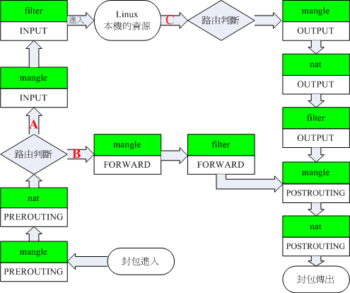

# iptables

[docker iptables](https://blog.csdn.net/taiyangdao/article/details/88844558)

## iptables default

- INPUT
- OUTPUT
- FORWARD



## docker iptables

- DOCKER
- DOCKER-ISOLATION
- DOCKER-USER (since 17.06)

```
iptables -N DOCKER
iptables -N DOCKER-ISOLATION-STAGE-1
iptables -N DOCKER-ISOLATION-STAGE-2
iptables -N DOCKER-USER
iptables -A FORWARD -j DOCKER-USER
iptables -A FORWARD -j DOCKER-ISOLATION-STAGE-1
iptables -A FORWARD -o docker0 -m conntrack --ctstate RELATED,ESTABLISHED -j ACCEPT
iptables -A FORWARD -o docker0 -j DOCKER
iptables -A FORWARD -i docker0 ! -o docker0 -j ACCEPT
iptables -A FORWARD -i docker0 -o docker0 -j ACCEPT
iptables -A DOCKER-ISOLATION-STAGE-1 -i docker0 ! -o docker0 -j DOCKER-ISOLATION-STAGE-2
iptables -A DOCKER-ISOLATION-STAGE-1 -j RETURN
iptables -A DOCKER-ISOLATION-STAGE-2 -o docker0 -j DROP
iptables -A DOCKER-ISOLATION-STAGE-2 -j RETURN
iptables -A DOCKER-USER -j RETURN
```