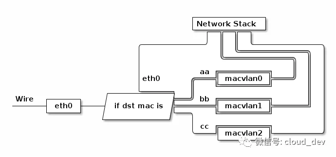

# MacVlan

[docker docs](https://docs.docker.com/network/macvlan/)

[docker macvlan](https://godleon.github.io/blog/Docker/docker-network-macvlan/)

[linux macvlan](https://www.cnblogs.com/bakari/p/10893589.html)

[网卡虚拟化](https://mp.weixin.qq.com/s?__biz=MzI1OTY2MzMxOQ==&mid=2247485246&idx=1&sn=c42a3618c357ebf5f6b7b7ce78ae568f&chksm=ea743386dd03ba90ad65940321385f68f9315fec16d82a08efa12c18501d8cadf95cf9e614a2&scene=21#wechat_redirect)

## MacVlan

macvlan 是 Linux Kernel 支持的新特性，需要 4.0 以上。

macvlan 这种技术听起来有点像 VLAN，但他们的实现机制是完全不一样的。macvlan 的子接口和原来的主接口是完全独立的，可以单独配置 MAC 地址和 IP 地址，而 VLAN 子接口和主接口共用相同的 MAC 地址。VLAN 用来划分广播域，而 macvlan 共享同一个广播域。

通过不同的子接口，macvlan 也能做到流量的隔离。macvlan 会根据收到包的目的 MAC 地址判断这个包需要交给哪个虚拟网卡，虚拟网卡再把包交给上层协议栈处理。

共有四种模式

- private
- vepa
- bridge
- passthru

