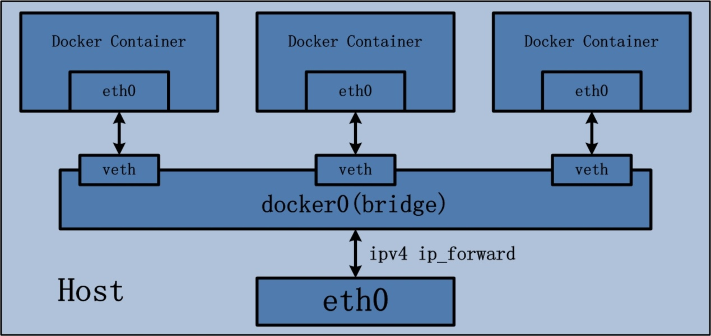
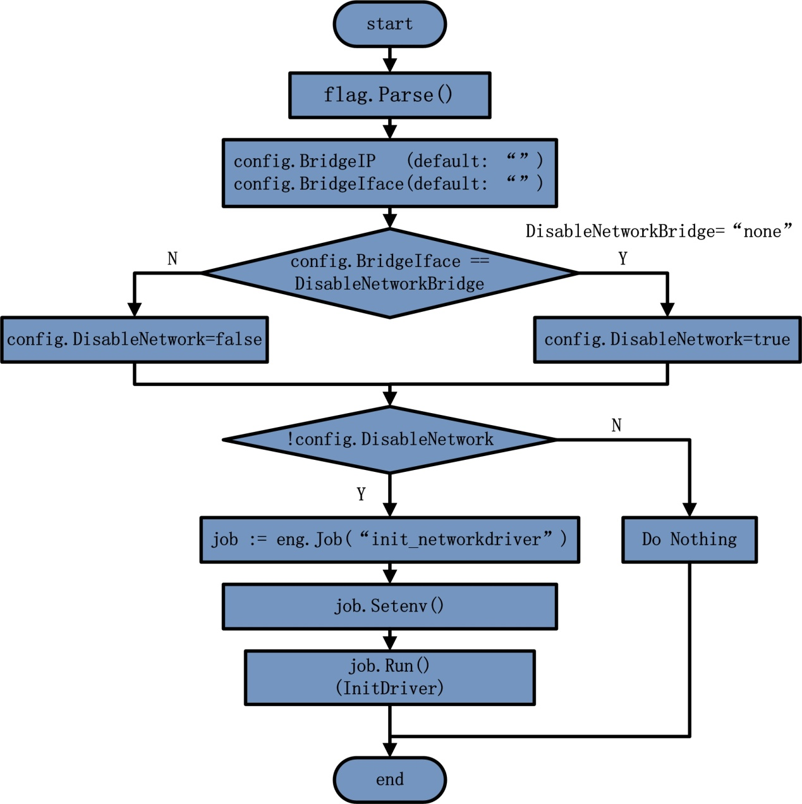
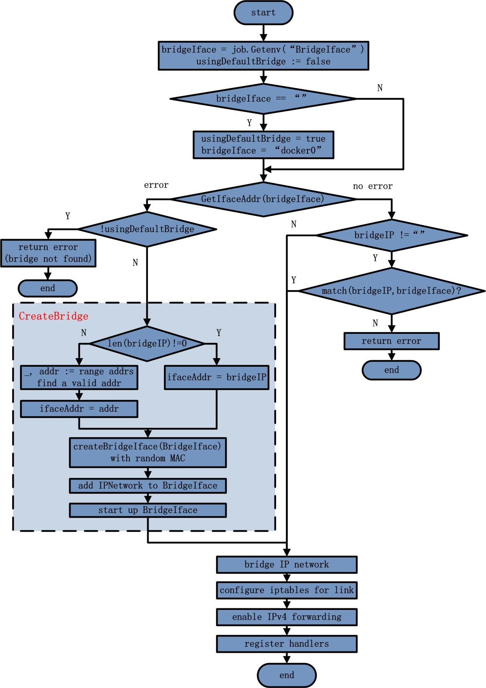

# Docker network

[Docker Daemon Network](http://blog.daocloud.io/docker-source-code-analysis-part6/)

## Network Drivers
- bridge (default)
    - The default network driver. Bridge networks are usually used when your applications run in standalone containers that need to communicate.
- host
    - For standalone containers, remove network isolation between the container and the Docker host, and use the host's network. host is only available for swarm services on 17.06 and higher.
- overlay
    - Overlay networks connect multiple docker daemon together and enable swarm services to communicate with each other. You can also use overlay networks to facilitate communication between a swarm service and a standalone container, or between two standalone containers on different Docker daemons. This strategy removes the need to do OS-level routing between these containers.
- macvlan
    - Macvlan networks allow you to assign a MAC address to a container, making it appear as a physical device on your network. The Docker Daemon routes traffic to containers by their MAC address.
- none
    - disable networking
- Networks plugins

### Network Driver Summary
- User-defined bridge networks
    - are best when you need multiple containers to communicate on the same Docker host.
- Host networks
    - are best when the network stack should not be isolated from the docker host, but you want other aspects of the container to be isolated.
- Overlay networks
    - are best when you need containers running on different docker hosts to communicate, or when multiple applications work together using swarm services.
- Macvlan networks
    - are best when you are migrating from a VM setup or need your containers to look like physical hosts on your network, each with a unique MAC address.
- Third-party network plugins
    - allow you to integrate Docker with specialized network stack.

## Docker EE Networking Features
- HTTP routing mesh
- Session stickness

## Docker Daemon Network

### Network Configuration



### Daemon Network Initialization



#### Env and Commandline Interface

- EnableIptables
- EnableIpForward
- BridgeIface
- BridgeIP
- InterContainerCommunication

#### Host Network

连接到host网络的容器共享Docker宿主机的网络栈，即容器的网络配置与host宿主机一样。可以通过--network=host参数来指定该容器使用host网络。

在容器中可以看到host的所有网卡，并且连hostname也是host的。

直接使用host网络最大的好处就是性能，如果容器对网络传输效率有较高的要求，则可以选择host网络。不便之处就是牺牲一些灵活性，比如要考虑端口冲突问题

另一个用途是容器可以直接配置host网络。比如某些跨host的网络解决方案，其本身也是以容器方式运行的，这些方案需要对网络进行配置。

相当于该容器拥有了host主机的网络，那么其ip等配置也相同，相当于主机中套了一个与外部一模一样的容器，可以直接通过host的ip地址来访问该容器


#### Bridge Network



#### Iptables

```
// Configure iptables for link support
if enableIPTables {
        if err := setupIPTables(addr, icc); err != nil {
            return job.Error(err)
        }
}

// We can always try removing the iptables
if err := iptables.RemoveExistingChain("DOCKER"); err != nil {
        return job.Error(err)
}

if enableIPTables {
        chain, err := iptables.NewChain("DOCKER", bridgeIface)
        if err != nil {
            return job.Error(err)
        }
        portmapper.SetIptablesChain(chain)
}
```

#### Ip Forward

```
if ipForward {
        // Enable IPv4 forwarding
        if err := ioutil.WriteFile("/proc/sys/net/ipv4/ip_forward", []byte{'1', '\n'}, 0644); err != nil {
            job.Logf("WARNING: unable to enable IPv4 forwarding: %s\n", err)
        }
}
```

## Docker and iptables
On linux, Docker manipulates iptables rules to provide network isolation. This is an implementation detail, and you should not modify the rules Dockr inserts into your iptables policies.