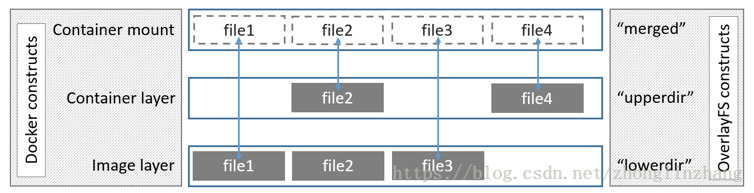
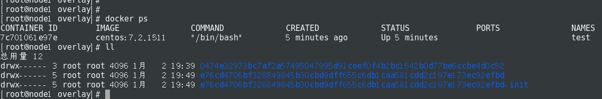
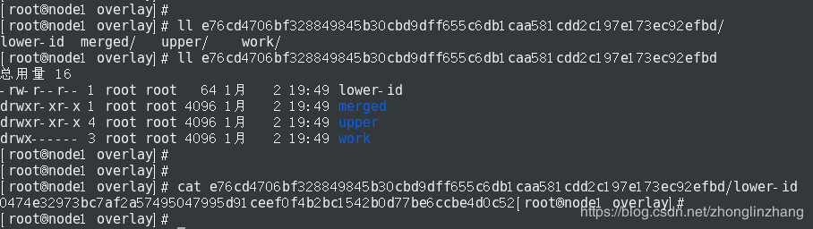

# OverlayFS

[链接](https://blog.csdn.net/zhonglinzhang/article/details/80970411)

[overlay2 pr](https://github.com/moby/moby/pull/22126)

OverlayFS是一个类似AUFS的现代联合文件系统
OverlayFS是内核提供的文件系统，overlay和overlay2是docker的存储驱动

## 1. Overlay介绍
### 1.1 Overlay原理介绍
OverlayFS将linux主机上的两个目录合并成一个目录。这些目录被称为层，统一过程被称为联合挂载。
OverlayFS底层目录称为lowerdir，高层目录称为upperdir，合并统一视图称为merge。当需要修改一个文件时，使用CoW将文件从只读的lowerdir复制到可写的Upper进行修改，结果也保存在Upper层。在Docker中，底下的只读层就是image，可写层就是Container。

如下图所示，镜像层是lowerdir, 容器层是upperdir, 统一的视图层是merged层

### 1.2 Overlay镜像结构
在路径/var/lib/docker/overlay/, 每个镜像层都有一个对应的目录，包含了该层镜像的内容

### 1.3 Overlay容器结构
创建容器会在已有的镜像层上创建了一层容器层，容器层在路径/var/lib/docker/overlay下也存在对应的目录

文件lower-id用来记录下层的镜像层，upper包含了容器层的内容。创建容器时将lower-id指向的镜像层目录以及upper目录联合挂在到merged目录。work用来完成如CoW操作

### 1.4 文件操作
读操作

    * 如果容器层不存在，则从lowdir中读取
    * 只在容器层存在，则直接从容器层中读取改文件
    * 文件存在容器和镜像层，容器层upperdir会覆盖镜像层lowerdir中的文件

写操作
    * 首次写入：在upperdir中不存在，overlay和overlay2执行copy_up操作，把文件从lowerdir拷贝到upperdir，由于overlayfs是文件界别的
    copy_up操作只发生在文件首次写入，以后都只修改副本
    overlayfs只使用两层，因此性能很好，查找搜索都更快
    * 删除文件和目录：当文件在容器被删除时，在容器层（upperdir）创建without文件，镜像层的文件是不会被删除的，因为他们是只读的，但without文件会阻止他们展现，当目录在容器内被删除时，在容器层(upperdir)一个不透明的目录，这个和上面without原理一样，阻止用户继续访问，即便镜像层仍然存在

性能问题
    * 页缓存：overlay支持页缓存共享，也就是说如果多个容器访问同一个文件，可以共享同一个页缓存。使得overlay/overlay2驱动高效地利用了内存
    * copy_up:aufs和overlayfs，由于第一次写入都会导致copy_up，尤其是大文件，会导致写延迟，以后的吸入会有问题。由于overlayfs层级比aufs的多，所以overlayfs的拷贝高于aufs
    * inode限制：使用overlay存储驱动可能导致inode过度消耗，特别是当容器和镜像很多的情况下，所以建议使用overlay2

## 2. Overlay2介绍
Overlay的改进版，只支持4.0以上内核添加了Multiple lower layers in overlayfs的特性，所以overlay2可以直接造成multiple lower layers不用像overlay一样要通过硬链接的方式(最大128层)，所以消耗更少的inode

### 2.1 Overlay2镜像结构
### 2.2 Overlay2容器结构
启动一个容器，也是在/var/lib/docker/overlay2目录下生成一层容器层，目录包括diff, link, lower, merged, work

diff记录每一层自己内容的数据，link记录该层链接目录（实际是l目录下到层的链接）

可以用mount查看挂载情况

### 2.3 Overlay和Overlay2的区别
本质区别是镜像层之间共享数据的方法不同
- Overlay共享数据方式是通过硬连接，只挂载一层，其他层通过硬连接形式共享
- Overlay2是通过每层的lower文件

#### 为什么overlay相比overlay2要更加占用inode
Overlay只支持两层lowerdir和upperdir，并且只支持一个lowerdir，所以如果你的镜像容器有多层的话，层与层之间的数据共享是通过硬连接来实现的