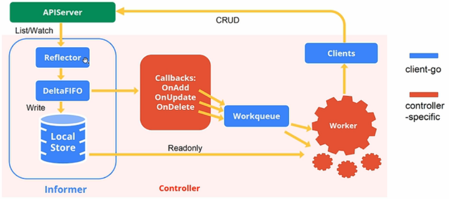

# Client-go

[client-go in sample-controller](https://github.com/kubernetes/sample-controller/blob/master/docs/controller-client-go.md)

[深入浅出](https://so.csdn.net/so/search/s.do?q=%E6%B7%B1%E5%85%A5%E6%B5%85%E5%87%BAkubernetes%E4%B9%8Bclient-go&t=blog&u=weixin_42663840)

## Architeture




## Installation

https://github.com/kubernetes/client-go/blob/master/INSTALL.md

## What's included

- The `kubernetes` package contains the clientset to access Kubernetes API

- The `discovery` package is used to discover APIs supported by a Kubernetes API

- The `dynamic` package contains a dynamic client that can perform generic operations on arbitary Kubernetes API objects

- The `plugin/pkg/client/auth` packages contain optional authentication plugins for obtaining credentials from external sources.

- The `transport` package is used to set up auth and start a connection

- The `tools/cache` package is useful for writing controllers

## Versioning

- For each `v1.x.y` Kubernetes release, the major version (first digit) would remain `0`

- Bugfixes will result in the patch version (third digit) changing. PRs that are cherry-picked into an older Kubernetes release branch will result in an update to the corresponding branch in `client-go`, with a corresponding new tag changing the patch version

## How to get it

```bash
go get k8s.io/client-go@v0.19.0
```

## How to use it

### In Cluster

https://github.com/kubernetes/client-go/tree/master/examples/in-cluster-client-configuration

```
"k8s.io/client-go/rest"
config, err := rest.InClusterConfig()
```

### Out of Cluster

https://github.com/kubernetes/client-go/tree/master/examples/out-of-cluster-client-configuration

```
"k8s.io/client-go/tools/clientcmd"
config, err := clientcmd.BuildConfigFromFlags("", *kubeconfig)
```

### Examples

https://github.com/kubernetes/client-go/tree/master/examples