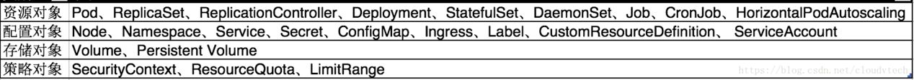

# CRD

[crd example](https://blog.csdn.net/boling_cavalry/article/details/88917818)

[crd](https://zhuanlan.zhihu.com/p/114659529)

[kubebuilder](https://my.oschina.net/u/4172827/blog/3084709)

[crd 详解](https://www.jianshu.com/p/cc7eea6dd1fb)

[crd 扩展](https://www.cnblogs.com/double12gzh/p/11335058.html)

## Resouces

## Custom Resource Definition

- 创建自定义API对象 (Custom Resource Definition)
- 用代码生成工具生成 informer 和 client 相关代码
- 创建并运行自定义控制器，k8s 环境中所有的自定义对象相关的 “增、”
