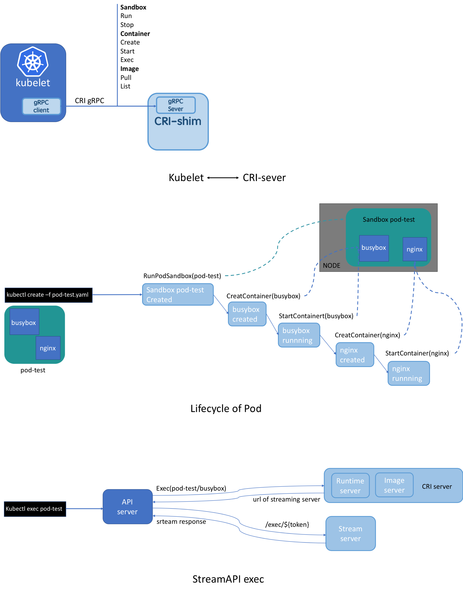
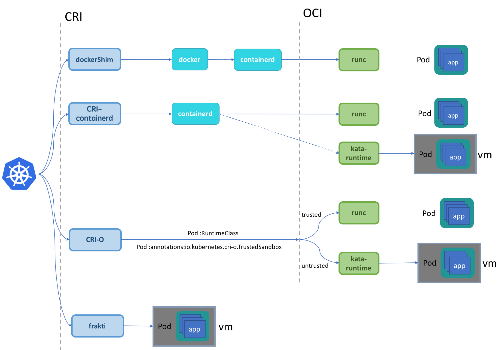

# CRI

## CRI

https://developer.aliyun.com/article/692117

k8s 不需要关心底层容器运行时，kubelet 只感知到 CRI server，而 CRI server 只需遵循 CRI 标准实现对应的 runtime 的标准化的接口

### CRI 接口定义

kubelet/apis/cri/runtime/v1alpha2/api.proto

```go
service RuntimeService {
    // Version returns the runtime name, runtime version, and runtime API version.
    rpc Version(VersionRequest) returns (VersionResponse) {}
    // RunPodSandbox creates and starts a pod-level sandbox. Runtimes must ensure
    // the sandbox is in the ready state on success.
    rpc RunPodSandbox(RunPodSandboxRequest) returns (RunPodSandboxResponse) {}
    // CreateContainer creates a new container in specified PodSandbox
    rpc CreateContainer(CreateContainerRequest) returns (CreateContainerResponse) {}
    // Exec prepares a streaming endpoint to execute a command in the container.
    rpc Exec(ExecRequest) returns (ExecResponse) {}
    // ContainerStats returns stats of the container. If the container does not
    // exist, the call returns an error.
    rpc ContainerStats(ContainerStatsRequest) returns (ContainerStatsResponse) {}
    // ListContainerStats returns stats of all running containers
    // Status returns the status of the runtime.
    rpc Status(StatusRequest) returns (StatusResponse) {}
    ...
}

// ImageService defines the public APIs for managing images.
service ImageService {
    // ListImages lists existing images.
    rpc ListImages(ListImagesRequest) returns (ListImagesResponse) {}
    // ImageStatus returns the status of the image. If the image is not
    // present, returns a response with ImageStatusResponse.Image set to
    // nil.
    rpc ImageStatus(ImageStatusRequest) returns (ImageStatusResponse) {}
    // PullImage pulls an image with authentication config.
    rpc PullImage(PullImageRequest) returns (PullImageResponse) {}
    // RemoveImage removes the image.
    // This call is idempotent, and must not return an error if the image has
    // already been removed.
    rpc RemoveImage(RemoveImageRequest) returns (RemoveImageResponse) {}
    // ImageFSInfo returns information of the filesystem that is used to store images.
    rpc ImageFsInfo(ImageFsInfoRequest) returns (ImageFsInfoResponse) {}
}
```

CRI server 包括 RuntimeService 和 ImageService 两个服务，均为 gRPC server。ImageService 负责镜像的管理，比如查询、拉取、删除镜像等；RuntimeService 负责四大块：PodSandbox (Pause 容器或者一台虚拟机，取决于具体的 runtime 实现)，Container，Streaming API(exec)，状态查询接口等。



### CRI 分类

