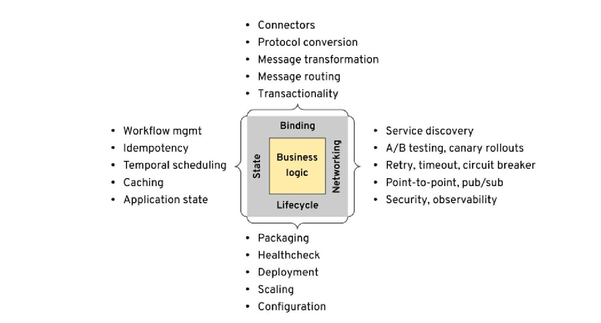
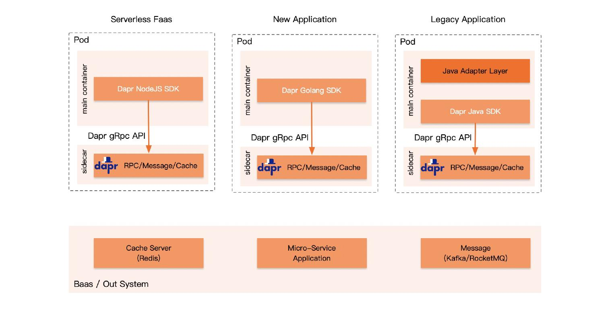
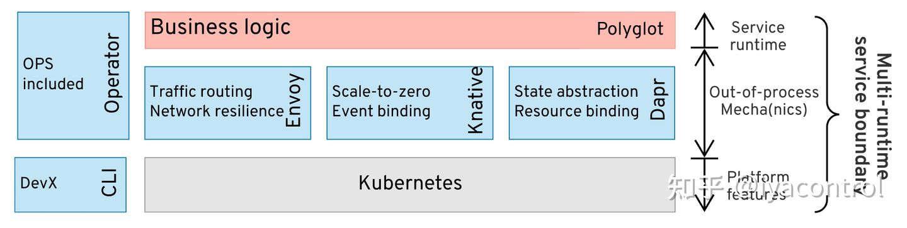
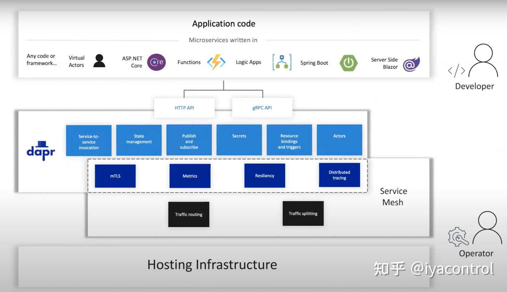

# Dapr

[infoq](https://www.infoq.com/articles/multi-runtime-microservice-architecture/)

[ali use cases](https://blog.dapr.io/posts/2021/03/19/how-alibaba-is-using-dapr/)

[dapr + service mesh + knative](https://www.zhihu.com/question/351298264)

## Ali use case

### Multi-language support

#### FaaS and serverless scenarios

- rapid development and iteration
- short life cycle

#### Multi-language application integration

## Multiple Runtime

dapr vs service mesh

