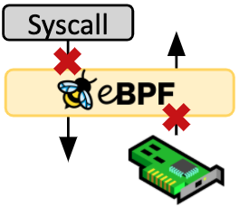
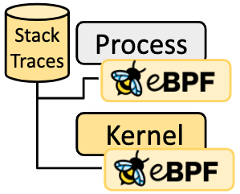
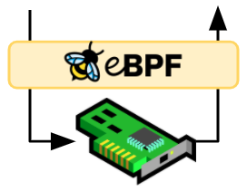
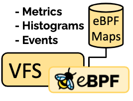

# ebpf

[ebpf](https://ebpf.io/)

## Introduction

The Linux kernel has always been an ideal place to implement monitoring/observability, networking, and security. Unfortunately this was often impractical as it required changing kernel source code or loading kernel modules, and resulted in layers of abstractions stacked on top of each other. eBPF is a revolutionary technology that can run sandboxed programs in the Linux kernel without changing kernel source code or loading kernel modules.

By making the Linux kernel programmable, infrastructure software can leverage existing layers, making them more intelligent and feature-rich without continuing to add additional layers of complexity to the system or compromising execution efficiency and safety.

eBPF has resulted in the development of a completely new generation of software able to reprogram the behavior the Linux kernel and even apply logic across multiple subsystems which were traditionally completely independent.

### Security

Building on the foundation of seeing and understanding all system calls and combining that with a packet and socket-level view of all networking operations allows for revolutionary new approaches to securing systems. While aspects of system call filtering, network-level filtering, and process context tracing have typically been handled by completely independent systems, eBPF allows for combinning the visibility and control of all aspects to create security systems operating on more context with better level of control.

### Tracing & Profiling

The ability to attach eBPF programs to trace points as well as kernel and user application probe points allows unprecedented visibility into the runtime behavior of applications and the system itself. By giving introspection abilities to both the application and system side, both views can be combined, allowing powerful and unqiue insights to troubleshoot system performance problems. Advanced statistical data structures allow to extract meaningful visibility data in an efficient manner, without requiring the export of vast amounts of sampling data as typically done by similar systems.

### Networking

The combination of programmability and effciency makes eBPF a natural fit for all packet processing requirements of networking solutions. The programmability of eBPF enables adding addtional protocol parsers and easily program any forwarding logic to meet changing requirements without ever leaving the packet processing context of the Linux kernel. The effeciency provided by the JIT compiler provides execution performance close to that of natively compiled in-kernel code.

### Observability & Monitoring

Instead of relying on static counters and gauges exposed by the operating system, eBPF enables the collection & in-kernel aggregation of custom metrics and generation of visiblity events based on a wide range of possible sources. This extends the depth of visibility that can be achieved as well as reduces the overall system overhead significantly by only collecting the visibility data required and by generating histograms and similar data structures at the source of the event instead of relying on the export of samples.