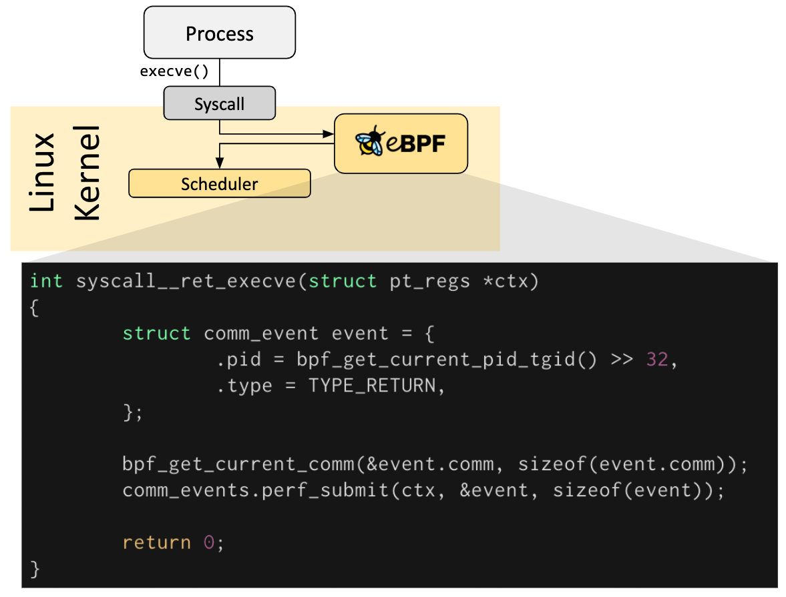

# Introduction

The following chapters are a quick introduction into eBPF. If you would like to learn more about eBPF, see the [eBPF & XDP Reference Guide](https://docs.cilium.io/en/stable/bpf/). Whether you are a developer looking to build an eBPF program, or interested in leveraging a solution that uses eBPF, it is useful to understand the basic concepts and architecutre.

## Hook Overview

eBPF programs are event-driven and are run when the kernel or an application passes a certain hook point. Predefined hooks include system calls, function entry/exit, kernel tracepoints, network events, and serveral others.

If a predefined hook does not exist for a particular need, it is possible to create a kernel probe(kprobe) or user probe(uprobe) to attach eBPF programs almost anywhere in kernel or user applications.

## How are eBPF programs written

In a lot of scenarios, eBPF is not used directly but indirectly via projects like Cilium, bcc, or bpftrace which provide an abstraction on top of eBPF and do not require to write programs directly but instead offer the ability to specify intent-based definitions which are then implemented with eBPF.

if no higher-level abstraction exists, programs need to be written directly. The Linux kernel expects eBPF programs to be loaded in the form of bytecode. While it is of course possible to write bytecode directly, the more common development practice is to leverage a compiler suite like LLVM to compile pseudo-C code into eBPF bytecode.

## Loader & Verification Architecture

When the desired hook has been identified, the eBPF program can be loaded into the Linux kernel using the bpf system call. This is typically done using one of the available eBPF libraries. The next section provides an introduction into the available development toolchains.

As the program is loaded into the Linux kernel, it passes through two steps before being attached to the requested hook:

### Verification

The verification step ensures that the eBPF program is safe to run. It validates that the program meets serveral conditions, for example:

- The process loading the eBPF program holds the required capabilities (privileges). Unless unprivileged eBPF is enabled, only privileged processes can load eBPF programs.
- The program does not crash or otherwise harm the system
- The program always runs to completion (i.e. the program does not sit in a loop forever, holding up further processing).

### JIT Compilation

The Just-in-Time(JIT) compilation step translates the generic bytecode of the program into the machine specific instruction set to optimize execution speed of the program. This makes eBPF programs run as efficiently as natively compiled kernel code or as code loaded as a kernel module.

## Maps

A vital aspect of eBPF programs is the ability to share collected information and to store state. For this purpose, eBPF programs can leverage the concept of eBPF maps to store and retrieve data in a wide set of data structures. eBPF maps can be accessed from eBPF programs as well as from applications in user space via a system call.

the following is an incomplete list of supported map types to give an understanding of the diversity in data structures. For various map types, both a shared and a per-CPU variation is available.

- Hash tables, Arrays
- LRU (Least Recently Used)
- Ring Buffer
- Stack Trace
- LPM (Long Prefix match)
- ...

## Helper Calls

eBPF programs cannot call into arbitrary kernel functions. Allowing this would bind eBPF programs to particular kernel versions and would complicate compatibility of programs. Instead, eBPF programs can make function calls into helper functions, a well-known and stable API offered by the kernel.

The set of available helper calls is constantly evolving. Examples of available helper calls:

- Generate random numbers
- Get current time & date
- eBPF map access
- Get process/cgroup context
- Manipulate network packets and forwarding logic

## Tail & Function Calls

eBPF programs are composable with the concept of tail and function calls. Function calls allow defining and calling functions within an eBPF program. Tail calls can call and execute another eBPF program and replace the execution context, similar to how the execve() system call operates for regular processes.

## eBPF Safety

*With great power there must also come great responsibility.*

eBPF is an incrediblly powerful technology and now runs at the heart of many critical software infrastructure components. During the development of eBPF, the safety of eBOF was the most crucial aspect when eBPF was considered for inclusion into the Linux kernel. eBPF safety is ensured through several layers:

### Required Privileges

Unless unprivileged eBPF is enabled, all processes that intend to load eBPF programs into the Linux kernel must be running in privileged mode(root) or require the capability CAP_BPF. This means that untrusted programs cannot load eBPF programs.

If unprivileged eBPF is enbaled, unprivileged processes can load certain eBPF programs subject to a reduced functionality set and with limited access to the kernel.

### Verifier

If a process is allowed to load an eBPF program, all programs still pass through the eBPF verifier. The eBPF verifier ensures the safety of the program itself. This means, for example:

- Programs are validated to ensure they always run to completion, e.g. an eBPF program may never block or sit in a loop forever. eBPF programs may contain socalled bounded loops but the program is only accepted if the verifier can ensure that the loop contains an exit condition which is guaranteed to become true.
- Programs may not use any uninitialized variables or access memory out of bounds.
- Programs must fit within the size requirements of the system. It is not possible to load arbitrarily large eBPF programs.
- Program must have a finite complexity. The verifier will evaluate all possible execution paths and must be capable of completing the analysis within the limits of the configured upper complexity limit.

### Hardening

Upon successful completion of the verification, the eBPF program runs through a hardening process according to whether the program is loaded from a privileged or unprivileged process. This step includes:

- **Program execution protection:** The kernel memory holding an eBPF program is protected and made read-only. If for any reason, whether it is a kernel bug or malicious manipulation, the eBPF program is attempted to be modified, the kernel will crash instead of allowing it to continue executing the corrupted/manipulated program.

- **Mitigation against Spectre:** Under speculation CPUs may mispredict branches and leave observable side effects that could be extracted through a side channel. To name a few examples: eBPF programs mask memory access in order to redirect access under transient instructions to controlled areas, the verifier also follows program paths accessible only under speculative execution and the JIT compiler emits Retpolines in case tail calls cannot be converted to direct calls.

- **Constant blinding:** All constants in the code are blinded to prevent JIT spraying attacks. This prevents attackers from injecting executable code as constants which in the presence of another kernel bug, could allow an attacker to jump into the memory section of the eBPF program to execute code.

### Abstracted Runtime Context

eBPF programs cannot access arbitrary kernel memory directly. Access to data and data structures that lie outside of the context of the program must be accessed via eBPF helpers. This guarantees consistent data access and makes any such access subject to the privileges of the eBPF program, e.g. an eBPF program running is allowed to modify the data of certain data structures if the modification can be guaranteed to be safe. An eBPF program cannot randomly modify data structures in the kernel.