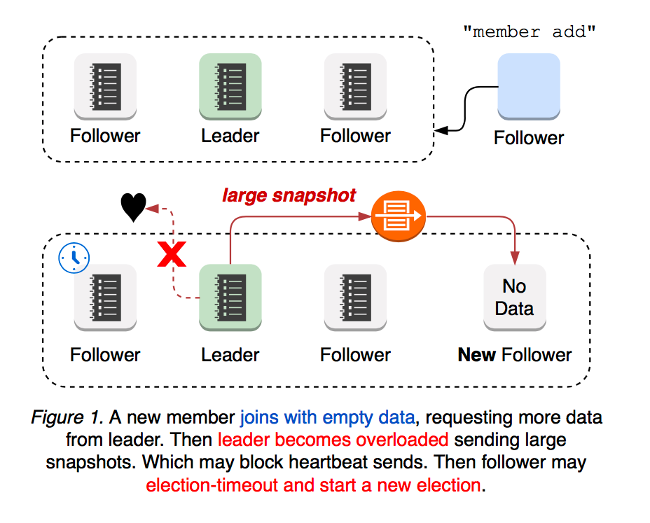
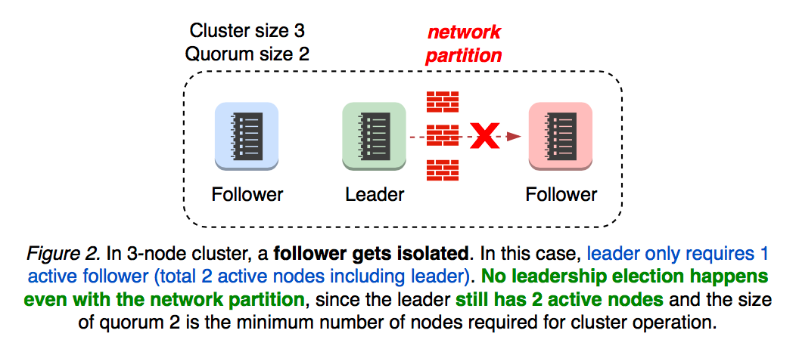
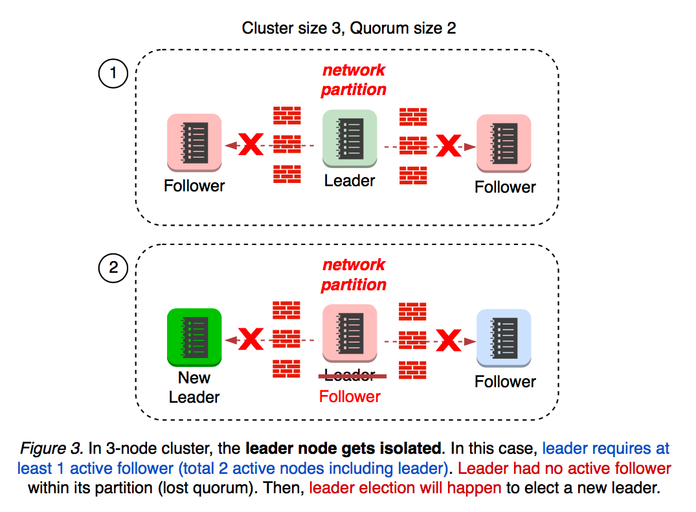
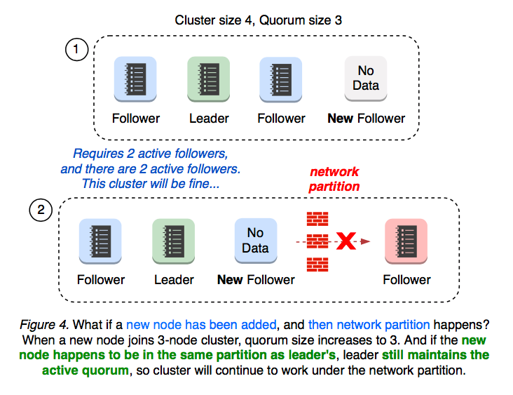
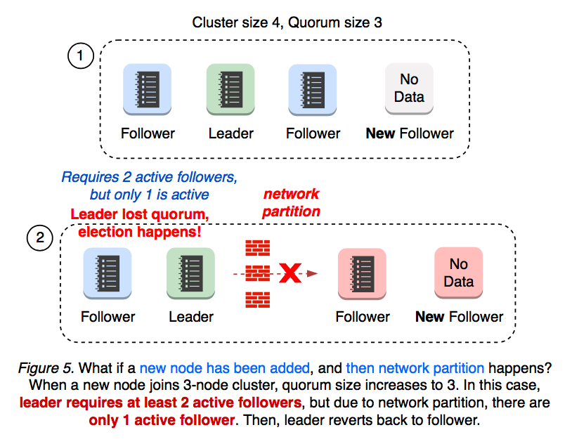
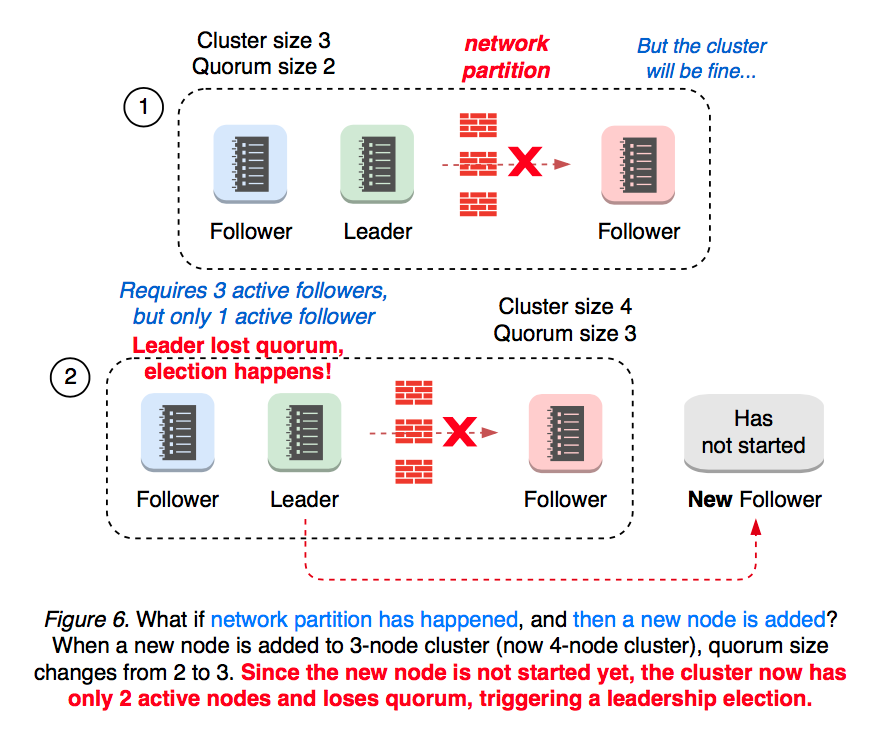
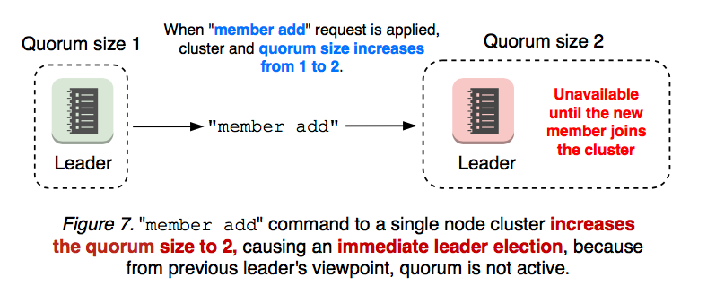
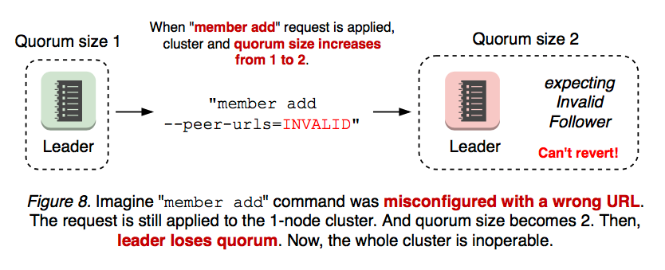
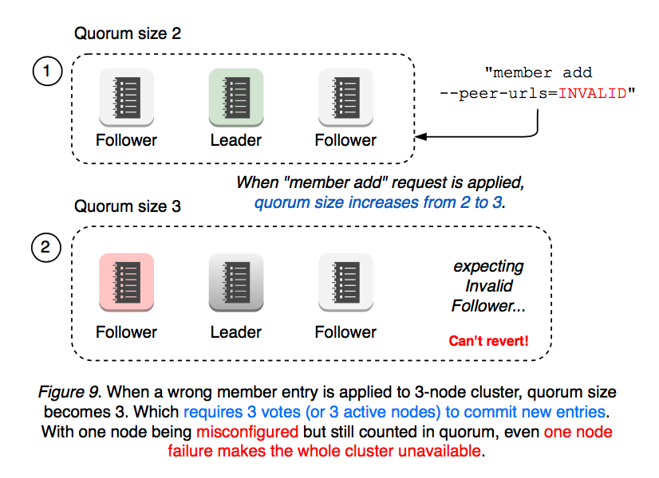

# Etcd

[etcdctl 访问 kubernetes](https://jimmysong.io/kubernetes-handbook/guide/using-etcdctl-to-access-kubernetes-data.html)


## Get keys

```bash
#!/bin/bash

keys=`./etcdctl --cacert=/etc/kubernetes/pki/etcd/ca.crt --cert=/etc/kubernetes/pki/etcd/peer.crt --key=/etc/kubernetes/pki/etcd/peer.key get /registry --prefix -w json|python -m json.tool|grep key|cut -d ":" -f2|tr -d '"'|tr -d ","`
for x in $keys;do
  echo $x|base64 -d|sort
done
```

## Data Model

etcd is designed to reliably store inrequently updated data and provide reliable watch queries. etcd exposes previous versions of key-value pairs to support inexpensive snapshots and watch history events("time travel queries"). A persistent, multiple-version, concurrency-control data model is a good fit for these use cases.

etcd stores data in a multiversion persistent key-value store. The persistent key-value store preserves the previous version of a key-value pair when its value is superseded with new data. The key-value store is effectively immutable; its operations do not update the structure in-place,but instead always generate a new updated structure. All past versions of keys are sitll accessible and watchable after modification. To prevent the data store from growing indefinitely over time and from maintaining old versions, the store may be compacted to shed the oldest version of superseded data.

### Logical view

The store's logical view is a flat binary key space. The key space has a lexically sorted index on byte string keys so range queries are inexpensive.

The key space maintains multiple revisions. When the store is created, the initial revision is 1. Each atomic mutative operation(e.g., a transaction operation may contain multiple operations) creates a new revision on the key space. All data held by previous revisions remains unchanged. Old versions of key can still be accessed through previous revisions. Likewise, revisions are indexed as well; ranging over revisions with watchers is efficient. If the store is compacted to save space, revisions before the compact revision will be removed. Revisions are monotonically increasing over the lifetime of a cluster.

A key's life spans a generation, from creation to deletion. Each key may have one or multiple generations. Creating a key increments the version of that key, starting at 1 if the key does not exist at the current revision. Deleting a key generates a key tombstone, concluding the key's current generation by resetting its revison to 0. Each modification of a key increments its version. So, versions are monotonically increasing with a key's generation. Once a compaction happens, any generation ended before the compaction revision will be removed, and values set before the compaction revision except the last one will be removed.

### Physical view

etcd stores the physical data as key-value pairs in a persistent b+tree. Each revision of the store's state only contains the delta from its previous revision to be efficient. A single revision may correspond to multiple keys in the tree.

The key of key-value pair is a 3-tuple (major, sub, type). Major is the store revision holding the key. Sub differentiates among keys within the same revision. Type is an optional suffix for special value(.e.g. `t` if the value contains a tombstone). The value of key-value pair contains the modification from previous revision, thus one delta from previous revision. The b+tree is ordered by key in lexical byte-order. Ranged lookups over revision delta are fast; this enables quickly finding modifications from one spcific revision to another. Compaction removes out-of-date key-value pairs.

etcd also keeps a secondary in-memory btree index to to speed up range queries over keys. The keys in the btree index are the keys of the store exposed to user. The value is a pointer to the modification of the persistent b+tree. Compaction removes dead pointers.

## client design

### Glossary

*Balancer*: etcd client load balancer that implements retry and failover mechanism. etcd client should automatically balance loads between multiple endpoints.

*Endpoints*: A list of etcd server endpoints that clients can connect to. Typically, 3 or 5 client URLs of an etcd cluster.

*Pinned endpoint*: When configured with multiple endpoints, <= v3.3 client balancer chooses only one endpoint to establish a TCP connection, in order to conserve total open connections to etcd cluster. In v3.4, balancer round-robins pinned endpoints for every request, thus distributing loads more evenly.

*Client Connection*: TCP connection that has been established to an etcd server, via gRPC Dial.

*Sub Connection*: gRPC SubConn interface. Each sub-connection contains a list of addresses. Balancer creates a SubConn from a list of resolved addresses. gRPC ClientConn can map to multiple SubConn (e.g. example.com resolves to 10.10.10.1 and 10.10.10.2 of two sub-connections). etcd v3.4 balancer employs internal resolver to establish one sub-connection for each endpoint.

*Transient disconnected*: When gRPC server returns a status error of `code Unavailable`.

### Client Requirement

- Correctness.Requests may fail in the presence of server faults. However, it never violates consistency guarantees: global ordering properties, never write corrupted data, at-most once semantics for mutable operations, watch never observes partial events, and so on.

- Liveness. Servers may fail or disconnect briefly. Clients should make progress in either way. Clients should never deadlock waiting for a server to come back from offline, unless configured to do so. Ideally, clients detect unavailable servers with HTTP/2 ping and failover to other nodes with clear error messages.

- Effectiveness. Clients should operate effectively with minimum resources: previous TCP connections should be gracefully closed after endpoint switch. Failover mechanism should effectively predict the next replica to connect, without wastefully retrying on failed nodes.

- Portability. Official client should be clearly documented and its implementation be applicable to other language bindings. Error handling between different language bindings should be consistent. Since etcd is fully committed to gRPC, implementation should be closely aligned with gRPC long-term design goals.

### Client Overview

etcd client implements the following component:

- balancer that establishes gRPC connections to an etcd cluster
- API client that sends RPCs to an etcd server, and
- error handler that decides whether to retry a failed request or switch endpoints.

Languages may differ in how to establish an initial connection(e.g. configure TLS), how to encode and send Protocol Buffer messages to server, how to handle stream RPCs, and so on. However, errors returned from etcd server will be the same. So should be error handling and retry policy.

## Server Design

[Server Design](https://etcd.io/docs/v3.4.0/learning/design-learner/)

### Background

#### 1. New Cluster member overloads Leader

A newly joined etcd member starts with no data, thus demanding more updates from leader until it catches up with leader's logs. The leader's network is more likely to be overloaded, blocking or dropping leader heartbeats to followers. In such case, a follower may election-timeout to start a new leader election. That is, a cluster with a new member is more vulnerable to leader election. Both leader election and the subsquent update propagation to the new member are prone to causing periods of cluster unavailability.



#### 2. Network Partitions scenarios

What if network partition happens? It depends on leader partition. If the leader still maintains the active quorum, the cluster would continue to operate.



##### 2.1 Leader Isolation

What if the leader becomes isolated from the rest of the cluster? Leader monitors progress of each follower. When leader lose connectivity from the quorum, it reverts back to follower which will affect the cluster availability.



When a new node is added to 3 node cluster, the cluster size becomes 4 and the quorum size becomes 3. What if a new node had joined the cluster, and the network partition happens? It depends on which partition the new member gets located after partition.

##### 2.2 Cluster Split 3+1

If the new node happens to be located in the same partition as leader's, the leader still maintains the active quorum of 3. No leadership election happens, and no cluster availability gets affected.



##### 2.3 Cluster Split 2+2

If the cluster 2+2 partitioned, then neither of partition maintains the quorum of 3. In this case, leadership election happens.



##### 2.4 Quorum Lost

What if network partition happens first, and then a new member gets added? A partitioned 3-node cluster already has one disconnected follower. When a new member is added, the quorum changes from 2 to 3. Now, this cluster only have 2 active nodes to 4, thus losing quorum and starting a new leadership election.



Since member add operation can change the size of quorum, it is always recommened to "member remove" first to replace an unhealthy node.

Adding a new member to a 1-node cluster changes the quorum size to 2, immediately causing a leader election when the previous leader finds out quorum is not active. This is because "member add" operation is a 2-step process where user needs to apply "member add" command first, and then starts the new node process.



#### 3. Cluster Misconfigurations

An even worse case is when an added member is misconfigured. Membership reconfiguration is a two-step process: "etcdctl member add" and starting an etcd server process with the given peer URL. That is, "member add" command is applied regardless of URL, even when the URL value is invalid. If the first step is applied with invalid URLs, the second step cannot even start the new etcd. Once the cluster loses quorum, there is no way to revert the membership change.



Same applies to a multi-node cluster. For example, the cluster has two members down(one is failed, the other is misconfigured) and two members up, but now it requires at least 3 votes to change the cluster membership.



As seen above, a simple misconfiguration can fail the whole cluster into an inoperative state. In such case, an operator need manually recreate the cluster with `etcd --force-new-cluster` flag. As etcd has become a mission-critical service for kubernetes, even the slightest outage may have significant impact on users. What can we better to make etcd such operations easier? Among other things, leader election is most critical to cluster availability: 

#### Raft Learner

In order to mitigate such availability gaps in the previous section,  Raft §4.2.1 introduces a new node state “Learner”, which joins the cluster as a non-voting member until it catches up to leader’s logs.


## Authentication design

