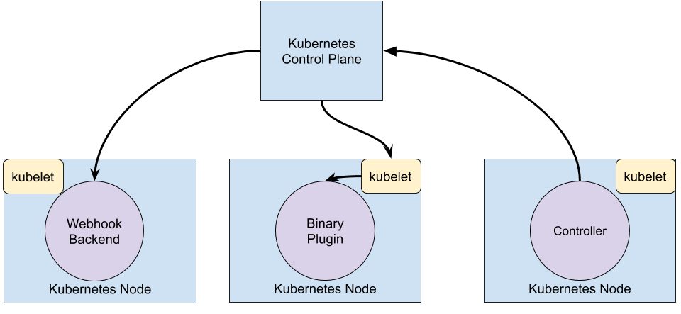

# Extending

[Extending your Kubernetes Cluster](https://kubernetes.io/docs/concepts/extend-kubernetes/extend-cluster/)

Kubernetes is highly configurable and extensible. As a result, there is rarely a need to fork or submit patches to the Kubernetes project code.

This guide describes the options for customizing a Kubernetes cluster. It is aimed at cluster operators who want to understand how to adapt their Kubernetes cluster to the needs of their work environment. Developers who are prospective Platform Developers or Kubernetes Project Contributors will also find it useful as an introduction to what extension points and patterns exist, and their trade-offs and limitations.

## Overview

Customization approaches can be broadly divided into *configuration*, which only involves changing flags, local configuration files, or API resources; and *extensions*, which involve running additional programs or services. This document is primarily about extensions.

## Configuration

*Configuration files* and *flags* are documented in the Reference section of the online documentation, under each binary:

- kubelet
- kube-apiserver
- kube-controller-manager
- kube-scheduler

Flags and configuration files may not always be changeable in a hosted Kubernetes service or a distribution with managed installation. When they are changeable, they are usually only changeable by the cluster administrator. Also, they are subject to change in future Kubernetes versions, and setting them may require restarting processes. For those reasons, they should be used only when there are no other options.

*Built-in Policy APIs*, such as ResourceQuota, PodSecurityPolicies, NetworkPolicy and Role-based Access Control(RBAC), are built-in Kubernetes APIs. APIs are typically used with hosted Kubernetes services and with managed Kubernetes installations. They are declarative and use the same conventions as other Kubernetes resources like pods, so new cluster configuration can be repeatable and be managed the same way as applications. And, where they are stable, they enjoy a defined support policy like other Kubernetes APIs. For these reasons, they are preferred over *configuration files* and *flags* where suitable.

## Extensions

Extensions are software components that extend and deeply integrate with Kubernetes. They adapt it to support new types and new kinds of hardware.

Most cluster administrators will use a hosted or distribution instance of Kubernetes. As a result, most Kubernetes users will not need to install extensions and fewer will need to auther new ones.

## Extension Patterns

Kuberntes is designed to be automated by writing client programs. Any program that reads and/or writes to the Kubernetes API can provide useful automation. *Automation* can run on the cluster or off it. By following the guidance in this doc you can write highly available and robust automation. Automation generally works with any Kubernetes cluster, including hosted clusters and managed installations.

There is a specific pattern for writing client programs that work well with Kubernetes called the *Controller* pattern. Controllers typically read an object's `spec`, possible do nothings, and then update the object's `.status`. 

A controller is a client of Kubernetes. When Kubernetes is the client and calls out to a remote service, it is called a *Webhook*. The remote service is called a *Webhook Backend*. Like Controllers, Webhooks do add a point of failure.

In the webhook model, Kubernetes makes a network request to a remote service. In the *Binary Plugin* model, Kubernetes executes a binary(program). Binary plugins are used by the kubelet and kubectl.

Below is a diagram showing how the extension points interact with the Kubernetes control plane.

## Extension Points

## API Extensions

### User-Defined Types

Consider adding a Custom Resource to Kubernets if you want to define new controllers, application configuration objects or other declarative APIs, and to manage them using Kubernetes tools, such as `kubectl`.

Do not use a Custom Resource as data storage for application, user, or monitoring data.

Combining New APIs with Automation

The combination of a custom resource API and a control loop is called the Operator pattern. The Operator pattern is used to manage specific, usually stateful, applications. These custom APIs and control loops can also be used to control other resources, such as storage or policies.