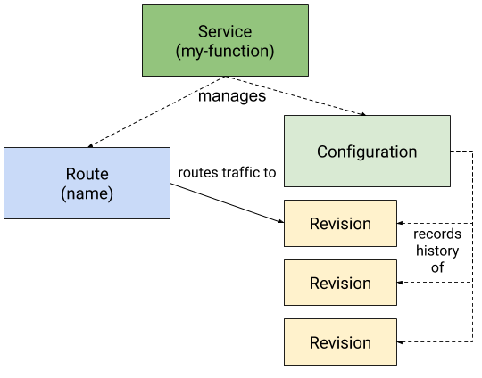

# Knative

https://knative.dev/

https://github.com/knative/

[Knative 实践](https://www.jianshu.com/p/cca919712a04)

Knative extends Kubernetes to provide developers with a set of tools that simplify the process of deploying and managing event-driven applications that can run anywhere.

Developers using Knative can use familiar languages and frameworks to solve common use cases, such as:

- Deploying a container
- Routing and managing traffic with blue/green deployment
- Scaling automatically and sizing workloads based on demand
- Binding running services to eventing ecosystems

## How it works

Knative consists of the Knative Serving and Knative Eventing components.

These components are delivered as Kubernetes custom resource definitions (CRDs), which can be configured by a cluster administrator to provide default settings for developer-created applications and event workflow components.

## Installing Knative

## Connecting to your cluster

The `kn` Client uses your `kubectl` client configuration, the kubeconfig file, to connect to your cluster. This file is usually automatically created when you create a Kubernetes cluster. `kn` looks for your kubeconfig file in the default location of `$HOME/.kube/config`

## Serving Component

### Knative Serving

Knative Serving builds on Kubernetes and Istio to support deploying and serving of serverless applications and functions. Serving is easy to get started with and scales to support advanced scenarios.

The Knative Serving project provdies middleware primitives that enable:

- Rapid deployment of serverless containers
- Automatic scaling up and down to zero
- Routing and network programming for Istio components
- Point-in-time snapshots of deployed code and configurations

#### Serving resources

Knative Serving defines a set of objects as Kubernetes Custom Resource Definition (CRDs). These objects are used to define and control how your serverless workload behaves on the cluster:

- **Service**: The `service.serving.knative.dev` resource automatically manages the whole lifecycle of your workload. It controls the creation of other objects to ensure that your app has a route, a configuration, and a new revision for each update of the service. Service can be defined to always route traffic to the latest revision or to a pinned revision.

- **Route**: The `route.serving.knative.dev` resource maps a network endpoint to one or more revisions. You can manage the traffic in serveral ways, including fractional traffic and named routes.

- **Configuration**: The `configuration.serving.knative.dev` resource maintains the desired state for your deployment. It provides a clean separation between code and configuration and follows the Twelve-Factor App methodology. Modifying a configuration creates a new revision.

- **Revision**: The `revision.serving.knative.dev` resource is a point-in-time snapshot of the code and configuation for each modification made to the workload. Revisions are immutable objects and can be retained for as long as useful. Knative Serving Revisions can be automatically scaled up and down according to incoming traffic.

