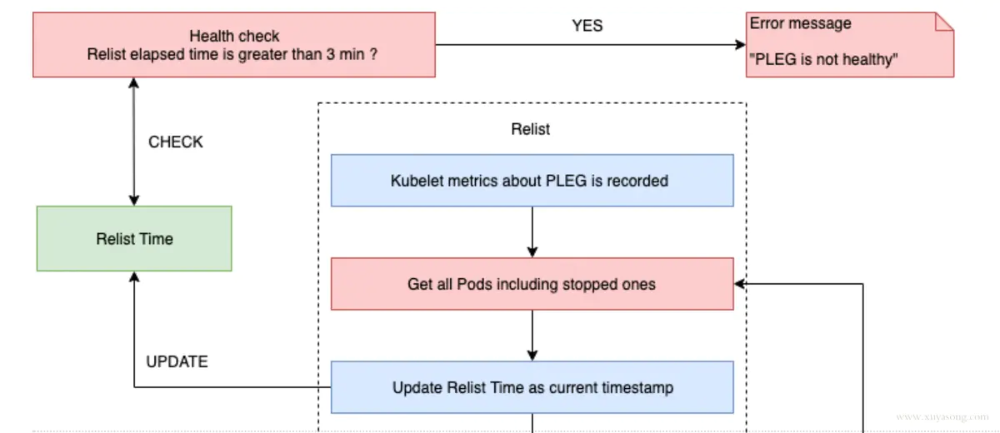

# Kubelet

[kubelet](https://www.cnblogs.com/heboxiang/p/12180291.html)

[kubelet原理解析一](https://www.jianshu.com/p/253ce74398f0)

[pleg](https://www.jianshu.com/p/a735eee106b3)

[pod](https://www.jianshu.com/p/49c21b5feb99)

## PLEG

Pod Life Event Generator
主要负责将 Pod 状态变化记录 event 以及触发 Pod 同步

***kubernetes/pkg/kubelet/pleg/generic.go***