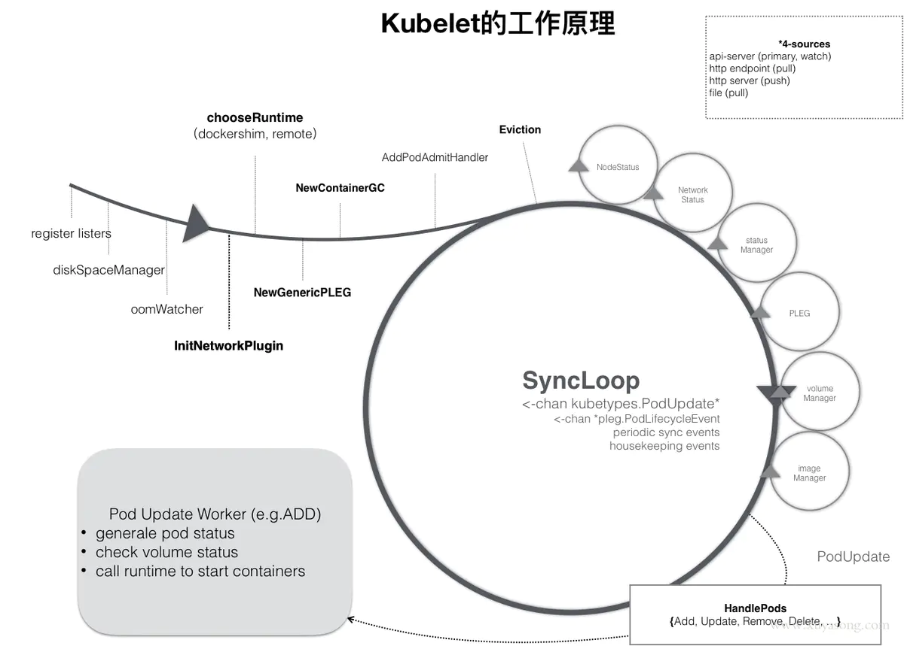
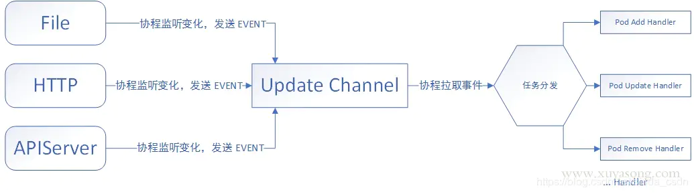

# PodManager

[kubelet 解析一](https://www.jianshu.com/p/253ce74398f0)

## 参数初始化和校验

```go
// construct a KubeletServer from kubeletFlags and kubeletConfig
kubeletServer := &options.KubeletServer{
    KubeletFlags:         *kubeletFlags,
    KubeletConfiguration: *kubeletConfig,
}
```
kubeletFlags 和 kubeletConfig 

## 构造 kubeDeps

- KubeClient
- CSIClient
- CAdvisor

## RunKubelet

***cmd/kubelet/kubelet.go***

- CreateAndInitKubelet
    - NewMainKubelet and Run

***kubernetes/pkg/kubelet/kubelet.go***

- k.Run
    - start managers
        - image manager
        - oom watcher
        - resource analyzer
        - volume manager
        - status manager
        - probe manager
        - runtime class manager
    - **pleg.Start**
    - **syncLoop**
- k.ListenAndServe
    - default handlers
        - healthz
        - pods
        - metrics
            - cadvisor
            - probes
            - resources
    - debug or system log handlers if needed



## Pod 处理

pod 被调度到 node 上后，会触发 syncLoop 处理 update event



### syncLoop

syncLoop 对 pod 的生命周期进行管理，其中 syncLoop 调用了 syncLoopIteration 函数，该函数根据 podUpdate 的信息，针对不同的操作，由 syncHandler 来执行 pod 的增删改查等生命周期的管理，其中的 syncHandler 包括 HandlePodSyncs 和 HandlePodCleanups 等

- syncLoopIteration
    - select
        - configCh
            - watch pod 信息的变化
        - syncCh
            - sync pod info
        - houseKeepingCh
            - pod clean ups
        - plegCh
            - pod life event generator
        - livenessManager.Update()
            - liveness check based on restartPolicy

#### configCh

***HandlePodAdditions***

#### houseKeepingCh

***HandlePodCleanups***

#### syncCh

### SyncPod

Pod 是一个逻辑概念

Pod 内有一个 infra container，也被称为 pause 容器或 sandbox，即沙箱容器，为其他容器提供共享的网络和文件挂载资源。此容器被创建后将 hold 住 Network Namespace，其他由用户自己定义的容器通过 container 模式加入到这个容器的 Namespace。

#### create pod

#### probe check

#### delete pod