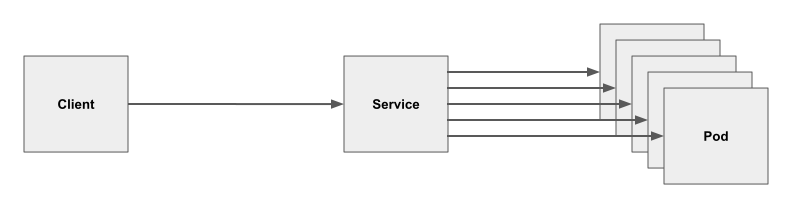
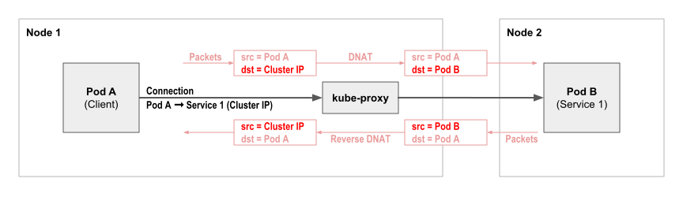
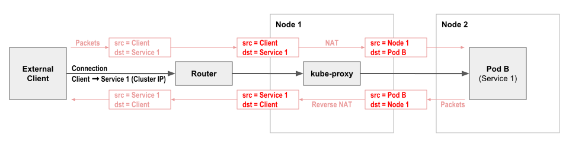
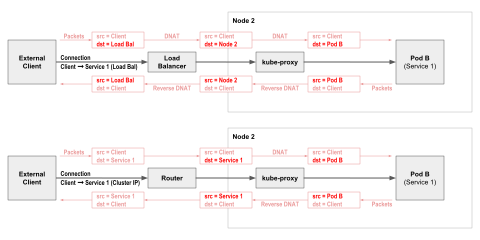
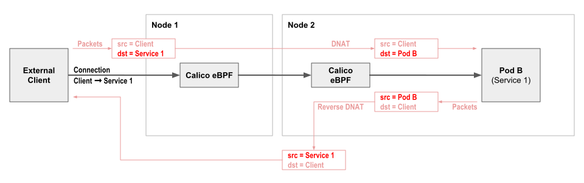
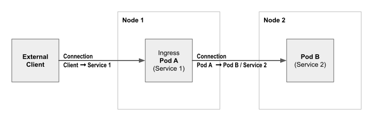
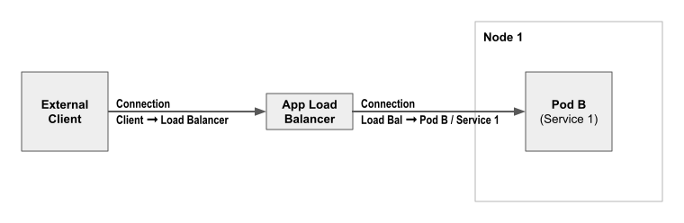

# Calico Kubernetes

## About Kubernetes Services

### What are Kubernetes Services?

Kubernetes Services provide a way of abstracting access to a group of pods as a network service. The group of pods backing each service is usually defined using a label selector.

When a client connects to a Kubernetes service, the connection is load balanced to one of the pods backing the service, as illustrated in this conceptual diagram:

There are three main types of Kubernetes services:

- Cluster IP - which is the usual way of accessing a service from inside the cluster
- Node port - which is the most basic way of accessing a service from outside the cluster
- Load balancer - which uses an external load balancer as a more sophisticated way to access a service from outside the cluster

## Cluster IP services

The default service type is `ClusterIP`. This allows a service to be accessed within the cluster via a virtual IP address. known as the service Cluster IP. The Cluster IP for a service is discoverable through Kubernetes DNS. For example, `my-svc.my-namespace.svc.cluster-domain.example`. The DNS name and Cluster IP address remain constant for the life time of the service, even though the pods bakcing the service may be created or destroyed, and the number of pods backing the service may change over time.

In a typical Kubernetes deployment, kube-proxy runs on every node and is responsible for intercepting connections to Cluster IP addresses and load balancing across the group of pods backing each service. As part of this process DNAT is used to map the destination IP address from the Cluster IP to the chosen backing pod. Response packets on the connection then have the NAT reverse on their way back to the pod that initiated the connection.

Importantly, network policy is enforced based on the pods, not the service Cluster IP. (i.e. Egress network policy is enforced for the client pod after the DNAT has changed the connection's IP to the chosen service backing pod. And because only the destination IP for the connection is changed, ingress network policy for the backing pod sees the original client pod as the source of the connection.)

### Node port services

The most basic way to access a service from outside the cluster is to use a service of type `NodePort`. A Node Port is a port reserved on each node in the cluster through which the service can be accessed. In a typical Kubernetes deployment, kube-proxy is responsible for intercepting connections to Node Ports and load balancing them across the pods backing each service.

As part of this process NAT is used to map the destination IP address and port from the node IP and Node Port, to the chosen backing pod and service port. In addition the source IP address is mapped from the client IP to the node IP, so that response packets on the connection flow back via the original node, where the NAT can be reversed. (It's the node which performed the NAT that has the connection tracking state needed to reverse the NAT.)

Note that because the connection source IP address is SNATed to the node IP address, ingress network policy for the service backing pod does not see the original client IP address. Typically this means that any such policy is limited to restricting the destination protocol and port, and cannot restrict based on the client/source IP. This limitation can be circumvented in some scenarios by using externalTrafficPolicy or by using Calico's eBPF dataplane native service handing (rather than kube-proxy) which preserves source IP address.

### Load balancer services

Services of type `LoadBalancer` expose the service via an external network load balancer (NLB). The exact type of network load balancer depends on which public cloud provider or, if on-prem, which specific hardware load balancer integration is integrated with your cluster.

The service can be accessed from outside of the cluster via a specific IP address on the network load balancer, which by default will load balance evenly across the nodes using the service node port.

Most network load balancers preserve the client source IP address, but because the service then goes via a node port, the backing pods themselves do not see the client IP, with the same implications for network policy. As with node ports, this limitation can be circumvented in some scenarios by using externalTrafficPolicy or by using Calico's eBPF dataplane native service handing(rather than kube-proxy) which preserves source IP address.

### Advertising service IPs

One alternative to using node ports or network load balancers is to advertise service IP addresses over BGP. This requires the cluster to be running on an underlying network that supports BGP, which typically means an on-prem deployment with standard Top of Rack routers.

Calico supports advertising service Cluster IPs, or External IPs for services configured with one. If you are not using Calico as your network plugin then MetalLB provides similar capabilities tht work with a variety of different network plugins.

### externalTrafficPolicy:local

By default, whether using servie type `NodePort` or `LoadBalancer` or advertising service IP addresses over BGP, accessing a service from outside the cluster load balances evenly across all the pods backing the service, independent of which node the pods are on. This behavior can be changed by configuring the service with `externalTrafficPolicy:local` which specifies that connections should only be load balance to pods backing the ervice on the local node.

When combined with services of type `LoadBalancer` or with Calico service IP address advertising, traffic is only directed to nodes that host at least one pod backing the service. This reduces the potential extra network hop between nodes, and perhaps more importantly, to maintain the source IP address all the way to the pod, so network policy can restrict specific external clients if desired.

### Calico eBPF native service handling

As an alternative to using Kubernetes standard kube-proxy, Calico's eBPF dataplane supports native service handling. This preserves source IP to simplify network policy, offers DSR(Direct Server Return) to reduce the number of network hops for return traffic, and provides even load balancing independent of topology, with reduced CPU and latency compared to kube-proxy.

## Kubernetes Ingress

### What is Kubernetes Ingress?

Kubernetes Ingress builds on top of Kubernetes Services to provide load balancing at the application layer, mapping HTTP and HTTPS requests with particular domains or URLs to Kubernetes services. Ingress can also be used to terminate SSL/TLS before load balancing to ther service.

The details of how Ingress is implemented depend on which Ingress Controller you are using. the Ingress Controller is responsible for monitoring Kubernetes Ingress resources and provisioning/configuring one or more ingress load balancers to implement the desired load balancing behavior.

Unlike Kubernetes services, which are handled at the network layer(L3-4), ingress load balancers operate at the application layer (L5-7). Incoming connections are terminated at the load balancer so it can inspect the individual HTTP/HTTPS requests. The requests are then forwarded via separate connections from the load balancer to the chosen service backing pods. As a result, network policy applied to the backing pods can restrict access to only allow connections from the load balancer, but cannot restrict access to specific original clients.

### Why use Kubernetes Ingress?

Given that Kubernetes Services already provide a mechanism for load balancing access to services from outside of the cluster, why might you want to use Kubernetes Ingress?

The mainline use case is if you have multiple HTTP/HTTPS services that you want to expose through a single external IP address, perhaps with each service having a different URL path, or perhaps as multiple different domains. This is lot simpler from a client configuration point of view than exposing each service outside of the cluster using Kubernetes Services, which would give each service a separate external IP address.

If on the other hand, your application architecture is fronted by a single "front end" microservice then Kubernetes Services likely already meet your needs. In this case you might prefer to not add Ingress to the picture, both from a simplicity point of view, and potentially also so you can more easily restrict access to specific clients using network policy. In effect, your "front end" microservice already plays the role of Kubernetes Ingress, in a way that is not that dissimilar to in-cluster ingress solutions discussed below.

### Types of ingress solutions

Broadly speaking there are two types of ingress solutions: 

- in-cluster ingress - where ingress load balancing is performed by pods within the cluster itself.
- External ingress - where ingress load balancing is implemented outside of the cluster by appliances or cloud provider capabilities.

#### In-cluster ingress solutions

In-cluster ingress solutions use software load balancers running in pods within the cluster itself. There are many different ingress controllers to consider that follow this pattern, including for example the NGINX ingress controller. The advantages of this approach are that you can:

- horizontally scale your ingress solution up to the limits of Kubernetes
- choose the ingress cntroller that best suits your specific needs, for example, with particular load balancing algorithms, or security options

To get your ingress traffic to the in-cluster ingress pods, the ingress pods are normally exposed externally as a Kubernetes service, so you can use any of the standard ways of accessing the service from outisde of the cluster. A common approach is use an external network hops, and retains the client source IP address, which allows network policy to be used to restrict access to the ingress pods to particular clients if desired.

### External ingress solutions

External ingress solutions use application load balancers outside of the cluster. The exact details and features depend on which ingress controller you are using, but most cloud providers include an ingress controller that automates the provisioning and management of the cloud provider's application load balancers to provide ingress.

The advantages of this type of ingress solution is that your cloud provider handles the operational complexity of the ingress for you. The downsides are potentially more limited set of features compared to the rich range of in-cluster ingress solutions, and the maximum number of services exposed by ingress being constrained by cloud provider specific limits.

Note that most application load balancer support a basic mode of operation of forwarding traffic to the chosen service backing pods via the node port of the corresponding service.

In addition to this basic approach of load balancing to service node ports, some cloud providers support a second mode of application layer load balancing, which load balances directly to the pods backing each service, without going via node-ports or other kube-proxy service handling. This has the advantage of eliminating the potential second network hop assiciated with node ports load balancing to a pod on a different node. The potential disadvantage is that if you are operating at every high scales, for eample with hundreds of pods backing a service, you may exceed the application layer load balancers maximum limit of IPs it can load balance to in this mode. In this case switching to an in-cluster ingress solution is likely the better fit for you.