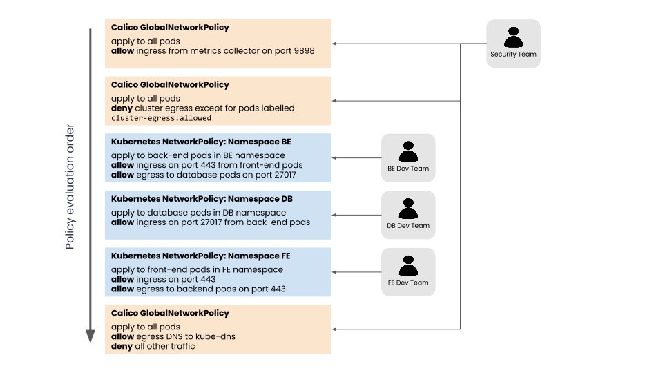

# About Kubernetes Networking

Kubernetes defines a network model that helps provide simplicity and consistency across a range of networking environments and network implementations. The Kubernetes network model provides the foundation for understanding how containers, pods, and services within Kubernetes communicate with each other. This guide explains the key concepts and how they fit together.

## The Kubernetes network model

The Kubernetes network model specifies:

- Every pod gets its own IP address
- Containers within a pod share the pod IP address and can communicate freely with each other
- Pods can communicate with all other pods in the cluster using pod IP addresses (without NAT)
- Isolation (restricting what each pod can communicate with) is defined using network policies

As a result, pods can be treated much like VMs or hosts (they all have unique IP addresses), and the containers within pods very much like processes running within a VM or host (they run in the same network namespace and share an IP address). This model makes it easier for applications to be migrated from VMs and hosts to pods managed by Kubernetes. In addition, because isolation is defined using network policies rather than the structure of the network remains simple to understand. This style of network is sometimes referred to as a "flat network".

Note that, although very rarely needed, Kubernetes does also support the ability to map host ports through to pods, or to run pods directly within the host network namespace sharing the host's IP address.

### Kubernetes network implementations

Kubernetes built in network support, kubenet, can provide some basic network connectivity. However, it is more common to use third party network implementations which plug into Kubernetes using the CNI (Container Network Interface) API.

There are lots of different kinds of CNI plugins, but the two main ones are:

- network plugins, which are responsible for connecting pod to the network
- IPAM (IP Address Management) plugins, which are responsible for allocating pod IP addresses

Calico provides both network and IPAM plugins, but can also integrate and work seamlessly with some other CNI plugins, including AWS,Azure and Google network CNI plugins, and the host local IPAM plugin. 

### Kubernetes Services

Kubernetes Services provide a way of abstracting access to a group of pods as a network service. The group of pods is usually defined using a label selector. Within the cluster the network service is usually represented as virtual IP address, and kube-proxy load balances connections to the virtual IP across the group of pods backing the service. The virtual IP is discoverable through Kubernetes DNS. The DNS name and virtual IP address remain constant for the life time of the service, even though the pods backing the service may be created or destroyed, and the number of pods backing the service may change over time.

Kubernetes Services can also define how a service is accessed from outside of the cluster, for example using

- a node port, where the service can be accessed via a specific port on every node
- or a load balancer, whether a network load balancer provides a virtual IP address that the service can be accessed via from outside the cluster.

Note that when using Calico in on-prem deployments you can also advertise service IP addresses, allowing services to be conveniently accessed without going via a node port or load balancer.

### Kubernetes DNS

Each Kubernetes cluster provides a DNS service. Every pod and every service is discoverable through the Kubernetes DNS service.

For example:

- Service: `my-svc.my-namespace.svc.cluster-domain.example`
- Pod: `my-pod.my-namespace.pod.cluster-domain.example`
- Pod created by a deployment exposed as a service: `pod-ip-address.deployment-name.my-namespace.svc.cluster-domain.example`

The DNS service is implemented as Kubernetes Service that maps to one or more DNS server pods(usually CoreDNS), that are scheduled just like any other pod. Pods in the cluster are configured to use the DNS service, with a DNS search list that includes the pod's own namespace and the cluster's default domain.

This means that if there is a service named `foo` in Kubernetes namespace `bar`, then pods in the same namespace can access the service as `foo`, and pods in other namepsaces can access the service as `foo.bar`

### NAT outgoing

The Kubernetes network model specifies that pods must be able to communicate with each other directly using pod IP addresses. But it does not mandate that pod IP addresses are routable beyond the boundaries of the cluster. Many Kubernetes network implementations use overlay networks. Typically for these deployments, when a pod initiates a connection to an IP address outside of the cluster, the node hosting the pod will SNAT(Source Network Address Translation) map the source address of the packet from the pod IP to the node IP. This enables the connection are automatically mapped back by the node replacing the node IP with the pod IP before forwarding the packet to the pod.

When using Calico, depending on your environment, you can generally choose whether you prefer to run an overlay network, or prefer to have fully routable pod IPs.

## About Network Policy

Kubernetes and Calico provide network policy APIs to help you secure your workloads.

- What network policy is and why it is important
- The differences between Kubernetes and Calico network policies and when you might want to use each

### What is network policy?

Network policy is the primary tool for securing a Kubernetes network. It allows you to easily restrict the network traffic in your cluster so only the traffic that you want to flow is allowed.

To understand the significance of network policy, let's briefly explore how network security was typically achieved prior to network policy. Historically in enterprise networks, network security was provided by desinging a physical topology of network devices (switches, routers, firewalls) and their associated configuration. The physical topolpgy defined the security boundaries of the network. In the first phase of virtualization, the same network and network device constructs were virtualized in the cloud, and the same techniques for creating specific network topologies of (virtual) network devices were used to provide network security. Adding new applications or services often required additional network design to update the network topology and network device configuration to provide the desired security.

In contrast, the Kubernetes network model defines a "flat" network in which every pod can communicate with all other pods in the cluster using pod IP address. This approach massively simplifies network design and allows new workloads to be scheduled dynamically anywhere in the cluster in the cluster with no dependencies on the network design.

In this model, rather than network security being defined by network topology boundaries, it is defined using network policies that are independent of the network topology. Network policies are further abstracted from the network by using label selectors as their primary mechanism for defining which workloads can talk to which workloads, rather then IP addresses or IP address ranges.

### Why is network policy important?

In an age where attacks are becoming more and more sophisticated, network security as a line of defense is more important than ever.

While you can (and should) use firewalls to restrict traffic at the perimeters of your network (commonly referred to as north-south traffic), their ability to police Kubernetes traffic is often limited to a granularity of the cluster as a whole, rather than to specific groups of pods, due to the dynamic nature of pod scheduling and pod IP addresses. In addition, the goal of most attackers once they gain a small foothold inside the perimeter is to move laterally (commonly referred to as east-west) to gain access to higher value targets, which perimeter based firewalls can't police against.

Network policy on the other hand is designed for the dynamic nature of Kubernetes by following the standard Kubernetes paradigm of using label selectors to define groups of pods, rather than IP address. And because network policy is enforced within the cluster itself it can police both north-south and east-west traffic.

Network policy represents an important evolution of network security, not just because it handles the dynamic nature of modern microservices, but because it empowers dev and devops engineers to easily define network security themselves, rather than needing to learn low-level networking details or raise tickets with a separate team responible for managing firewalls. Network policy makes it easy to define intent, such as "only this microservice gets to connect to the database", write that intent as code(typically in YAML files), and integrate authoring of network policies into git workflows and CI/CD processes.

### Kubernetes network policy

Kubernetes network policies are defined using the Kubernetes NetworkPolicy resource.

The main features of Kubernetes network policies are:

- Policies are namespace scoped (i.e. you create them within the context of a specific namespace just like, for example, pods)
- Policies are applied to pods using label selectors
- Policy rules can specify the traffic that is allowed to/from other pods, namespace, or CIDRs
- Policy rules can specify protocols (TCP, UDP, SCTP), named ports or port numbers

Kubernetes itself does not enforce network policies, and instead delegates their enforcement to network plugins. Most network plugins implement the mainline elements of Kubernetes network policies, though not all implement every feature of the specification. (Calico does implement every feature, and wa the original reference implementation of Kubernetes network policies)

### Calico network policy

In addition to enforcing Kubernetes network policy, Calico supports its own namespaced NetworkPolicy and non-namespaced GlobalNetworkPolicy resources, which provide addional feature beyond those supported by Kubernetes network policy. This includes support for:

- policy ordering/priority
- deny and log actions in rules
- more flexible match criteria for applying policies and in policy rules, including matching on Kubernetes ServiceAccounts, and (if using Istio & Envoy) cryptographic identity and layer 5-7 match criteria such as HTTP & gPRC URLs.
- ability to reference non-Kubernetes workloads in policies, including matching on NetworkSets in policy rules

While Kubernetes network policy applies only to pods, Calico network policy can be applied to multiple types of endpoints including pods, VMs, and host interfaces.

## Benefits of using Calico for network policy

### Full Kubernetes network policy support

Unlike some other network policy implementations, Calico implements the full set of Kubernetes network policy features.

### Richer network policy

Calico network policies allow even richer traffic control than Kubernetes network policies if you need it. In addition, Calico network policies allow you to create policy that applies across multiple namespaces using GlobalNetworkPolicy resources.

### Mix Kubernetes and Calico network policy

Kubernetes and Calico network policies can be mixed together seamlessly. One common use case for this is to split responsibilities between security / cluster ops teams and developer / service teams. For example, giving the security / cluster ops team RBAC permissions to define Calico policies, and giving developer / service teams RBAC permissions to define Kubernetes network policies in their specific namespace. As Calico policy rules can be ordered to be enforced either before or after Kubernetes network policies, and can include actions such as deny and log, this allows the security / cluster ops team to define basic higher-level more-general purpose rules, while empowering the developer / service teams to define their own fine-grained constraints on the apps and services they are responsible for.

For more flexible control and delegation of responsiblilities between two or more teams, Calico Enterprise extends this model to provide hierarchical policy.

### Ability to protect hosts and VMs

As Calico policies can be enforce on host interfaces, you can use them to protect your Kubernetes nodes (not just your pods), including for example, limiting access to node ports from outside of the cluster.

### Integrates with Istio

When used with Istio service mesh, Calico policy engine enforces the same policy model at the host networking layer and at the service mesh layer, protecting your infrastructure from compromised workloads and protecting your workloads from compromised infrastructure. This also avoid the need for dual provisioning of security at the service mesh and infrastructure layers, or having to learn different policy models for each layer.

### Default deny

One approach to ensuring these best practices are being followed is to define default deny network policies. These ensure that if no other policy is defined that explicity allows traffic to/from a pod, then the traffic will be denied. As a result, anytime a team deploys a new pod, they are forced to also define network policy for the pod. It can be useful to use a Calico GobalNetworkPolicy for this (rather than needing to define a policy every time a new namespace is created) and to include some exceptions to the default deny (for example to allow pods to access DNS).