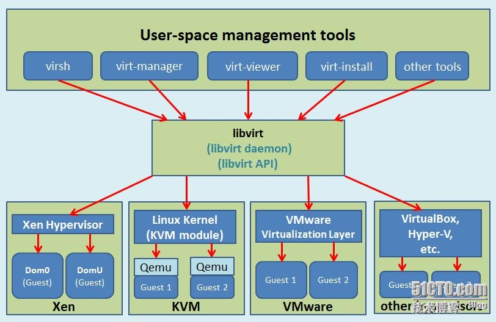

# OpenNebula

[intro](http://docs.opennebula.org/5.10/intro_release_notes/concepts_terminology/intro.html)

[kvm](https://yq.aliyun.com/articles/522902)

## KVM

### libvirt



- Node
- Hypervisor: VMM
- Domain: Guest OS, Virtual Machine

#### Preparation

- NTP
- hostname: FQDN
- Static resolve
- stop iptables and selinux

#### Software

- libvirt
- virt-manager

#### Images

- raw: default
- qcow2: recommended

##### raw

```bash
# qemu-img create -f raw /opt/lavenliu.raw 5G
Formatting'/opt/lavenliu.raw', fmt=raw size=5368709120

# qemu-img info /opt/lavenliu.raw
image: /opt/lavenliu.raw
file format: raw
virtual size: 5.0G (5368709120bytes)
disk size: 0# 没有占用硬盘空间，此时只是一个空洞文件
```

##### qcow2

```bash
# qemu-img create -f qcow2 /opt/taoqi.qcow2 5G
Formatting'/opt/taoqi.qcow2', fmt=qcow2 size=5368709120 encryption=
```

#### Installation

##### raw
```bash
# virt-install --virt-type kvm --name lavenliu --ram 512 \
--cdrom=/opt/CentOS-6.5-x86_64-bin-DVD1.iso \
--disk path=/opt/lavenliu.raw \
--network network=default \
--graphics vnc,listen=0.0.0.0 \
--noautoconsole --os-type=linux \
--os-variant=rhel6
 
Starting install...
Creating domain...              |    0 B     00:01     
Domain installation still in progress. You can reconnect to 
the console to complete the installation process.
```

##### qcow2

```bash
# virt-install --virt-type kvm --name taoqi --ram 512 \
--cdrom=/opt/CentOS-6.5-x86_64-bin-DVD1.iso \
--disk path=/opt/taoqi.qcow2,format=qcow2 \
--network network=default \
--graphics vnc,listen=0.0.0.0 \
--noautoconsole --os-type=linux \
--os-variant=rhel6 
 
Starting install...
Creating domain...      |    0 B     00:00     
Domain installation still in progress. You can reconnect to 
the console to complete the installation process.
```

### Management

#### Virsh

- list
- start
- reboot
- destroy
