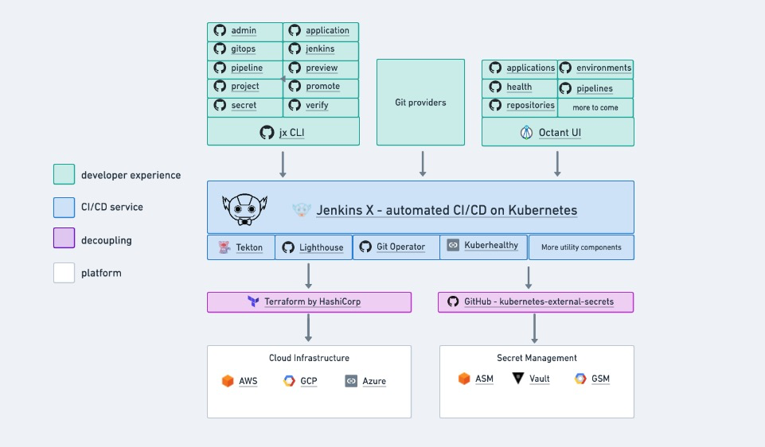

# Jenkins-X

[Jenkins-X](https://github.com/jenkins-x/)

[Architecture](https://whimsical.com/lines-2-SnJBgXG6jz9pqQewiDTNRt)

## Overview

Overview of the architecture, concepts and motivations for Jenkins X 3.x

### Microservices

Jenkins X uses the following microservices by namespace.

Note that if you have a working Jenkins X installation you can browse all the actual kubernetes resources used across each namespace via the config-root/namespace/$namespace/$chartName folder in your cluster git repository.

#### jx-git-operator

Contains the git operator from jenkins-x/git-operator microservice and the associated boot jobs.

#### jx

Contains the main development service of Jenkins X:

- **jx-build-controller** watches for `PipelinRun` resources and creates/updates the associated `PipelineActivity` resources used by `jx get build` log, octant and the pipelines visualizer
- **jx-pipeline-visualizer** visualises `PipelineActivity` resources and the associated build logs in a read only UI
- **jx-preview-gc-jobs** periodically garbage collects `Preview` resources and their associated preview environments created by `jx preview`
- **jxboot-helmfile-resources-gcactivities** periodically garbage collects old and completed `PipelineActivity` resources
- **jxboot-helmfile-resources-gcpods** periodically garbage collects completed `Pods`
- **jx-kh-check** supports additional `kuberhealthy` based health checks for Jenkins X specific resources

#### lighthouse

jenkins-x/lighthouse creates tekton pipelines and triggers ChatOps on Pull Requests. Its made up of the following components:

- **lighthouse-webhooks** converts webhooks from your git provider into `LighthouseJob` custom resources
- **lighthouse-tekton-controller** converts `LighthouseJob` custom resources into tekton `PipelineRun` resources (the tekton controller converts `PipelineRun` resources into kubernetes Pods)
- **lighthouse-foghorn** watches the execution of `PipelineRun` resource triggered by lighthouse and updates the pipeline status in git so that you see pipelines start, complete or fail on your git provider along with having links the pipelines visualizer on each context on a Pull Request.
- **lighthouse-keeper** looks for open Pull Requests with green pipelines and the necessary approve lables to be able to auto merge
- **lighthouse-gc-jobs** periodically garbage collects `LighthouseJob` resources and their associated resources(e.g. `PipelineRun` and `Pods`)

the following are optional extras:

- bucket repository a lightweight cloud native artifact, chart repository and maven proxy that can be configured to use cloud storage. It's a lightweight cloud native alternative to nexus
- chart museum an optional chart repository
- nexus if used as an artifact repository and maven proxy

#### kuberhealthy

#### nginx

#### secret-infra

#### tekton-pipeline