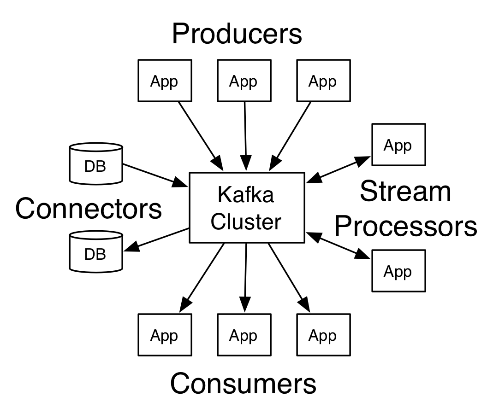

# Kafka

[kafka 入门介绍](https://www.orchome.com/5)

[kafka download](https://kafka.apache.org/downloads.html)

[quick start](https://kafka.apache.org/quickstart)

## 分布式流平台

- 发布和订阅消息(流)，类似一个消息队列或企业系统
- 以容错(故障转移)的方式存储消息(流)
- 在消息流发生时处理它们

### 主要应用

1. 构建实时的流数据管道，可靠的获取系统和应用程序之间的数据
2. 构建实时流的应用程序，对数据流进行转换或反应

### 基础概念

1. kafka作为一个集群运行在一个或多个服务器上
2. kafka集群储存的消息是以topic为类别记录的
3. 每个消息(也叫做记录record)，是由一个key, 一个value和时间戳构成

### 核心API

- 应用程序使用Producer API发布消息到1个或多个topic中
- 应用程序使用Consumer API来订阅一个或多个topic，并处理产生的消息
- 应用程序使用Streams API充当一个流处理器，从一个或多个topic消费输入流，并生产一个输出流到1个或多个输出topic，有效地将输入流转换到输出流
- Connector API可构建或运行可重用的生产者或消费者，将topic连接到现有的应用程序或数据系统。例如，连接到关系型数据库的connector可以捕获表的每个变更

Client和Server之间的通讯，是通过一条简单、高性能并且和开发语言无关的TCP协议。

### 核心概念

#### Topic
kafka将消息分门别类，每一类的消息称为一个topic

#### Producer
发布消息的对象称为主题的生产者

#### Consumer
订阅消息并处理发布的消息的对象称为主题的消费者

#### Broker
已发布的消息保存在一组服务器中，称之为Kafka集群。集群中的每一个服务器都是一个broker

### Topic和Log

对于每个topic，Kafka集群都会维护一个分区log，就像途中所示：

每一个分区都是一个顺序的、不可变的消息队列，并且可以持续的添加。分区中的消息都被分了一个序列号，称之为offset，在每个分区中此offset都是唯一的。

kafka集群保持所有的消息，知道它们过期(无论消息是否被消费)。实际上消费者所持有的仅有的元数据就是这个offset，也就是说offset由消费者来控制：正常情况当消费者消费的时候，偏移量也线性的增加。但是实际偏移量由消费者控制，消费者可以将偏移量重置为更早的位置，重新读取消息。一个消费者的操作不会影响其他消费者对此log的处理。

### 分布式

Log的分区被分布到集群中的多个服务器上。每个服务器处理它分到的分区。根据配置每个分区还可以复制到其他服务器作为备份容错。每个分区有一个leader，零或者多个follower。Leader处理此分区的所有读写请求，而follower被动的复制数据。如果leader宕机，其他的一个follower会被推举为新的leader。一台服务器可能同时是一个分区的leader，另一个分区的follower。这样可以平衡负载，避免所有的请求都只让一台或者几台服务器处理。

### Geo-Replication

Kafka MirrorMaker为集群提供`geo-replication`支持。借助 MirrorMaker，消息可以跨多个数据中心或云区域进行复制。

### 生产者

生产者往某个Topic上发消息。生产者也负责选择发布到Topic上的哪一个分区。最简单的方式从分区列表中轮流选择。也可以根据某种算法依照权重选择分区。开发者负责如何选择分区的算法。

### 消费者

通常来讲，消费模型分为两种，队列和发布-订阅式。

- 队列的处理方式是 一组消费者从服务器读取消息，一条消息只有其中一个消费者来处理
- 在发布-订阅模型中，消息被广播给所有的消费者，接收到的消费者都可以处理此消息。

Kafka为两种模型提供了单一的消费者抽象模型：ConsumerGroup。消费者用一个消费组名标记自己。一个发布在Topic上的消息被分发给此消费者组中的一个消费者。假如所有的消费者都在一个组中，那么这就变成了queue模型。加入所有的消费者在不同的组中，那么就完全变成了发布-订阅模式。

### Kafka Guarantee

- 生产者发送到一个特定的Topic的分区上，消息将会按照他们发送的顺序依次加入，也就是说，如果一个消息M1和M2使用相同的producer发送，M1发送，那么M1将比M2的offset低，并且优先出现在日志中
- 消费者收到的消息也是此顺序的
- 如果一个Topic配置了复制因子(replication factor)为N，那么可以允许N-1服务器宕机而不丢失任何已提交(commited)的消息。

### kafka有比传统的消息系统更强的顺序保证

### 存储系统

写入到kafka的数据将写到磁盘并复制到集群中保证容错性。并允许生产者等待消息应答，知道消息完全写入。

### 流处理

流处理中持续获取输入topic的数据，进行处理加工，然后写入输出topic。解决如处理无序数据、代码更改的在处理、执行状态计算等。