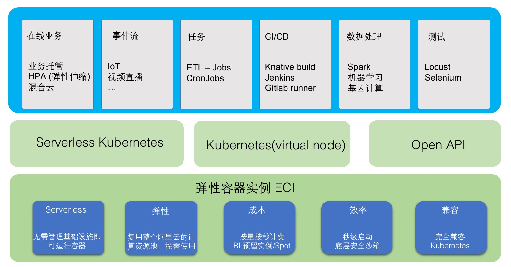

# ALiYun

## ECS

Elastic Computing Service

Iaas 虚拟化产品

可部署docker，但不支持二次虚拟化

## ECI

Elastic Container Instance 提供安全的Serverless容器运行服务。

ECI是免运维的Iaas层容器资源交付，通过使用ECI，在阿里云部署容器时，不需要购买和管理ECS，可以直接在阿里云上运行容器和Pod。

ECI底层使用基于Kata的安全沙箱容器，并进行深度整合优化，提供VM级别的安全和资源管理能力，同时提供比VM更快的启动速度和运行效率。

## ACS

## ACK

## VPC

## EDAS

[Aliyun EDAS](https://help.aliyun.com/document_detail/42934.html?spm=a2c4g.11186623.6.548.78263f86vLGIlD)

企业级分布式应用服务 EDAS (Enterprise Distributed Application Service) 是一个应用托管和微服务管理的 Paas 平台，提供应用开发、部署、监控、运维等全栈式解决方案，同时支持 Apache Dubbo、Spring Cloud等微服务运行环境。

