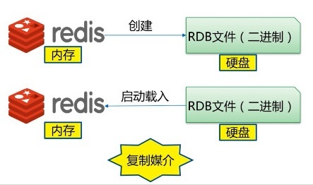

# Redis

[Redis 持久化](https://segmentfault.com/a/1190000016021217)

[redis sentinel](https://blog.csdn.net/sunbocong/article/details/85252071)

[redis sentinel + auth](https://blog.csdn.net/leader_an_yu_xiao/article/details/85000881)

[cluster](https://www.cnblogs.com/williamjie/p/11132211.html)

[redis cluster](https://www.sohu.com/a/200298129_466839)

[redis cluster slot](http://www.chinacion.cn/article/5382.html)

## 持久化方式

### 快照方式持久化

快照方式持久化就是在某时刻把所有数据进行完整备份

例如：Mysql的Dump方式，Redis的RDB方式

### 写日志方式持久化

写日志方式持久化就是把用户执行的所有写指令（增删改）备份到文件中，还原数据时只需要把备份的所有指令重新执行一遍即可。

例如：Mysql的Binlog、Redis的AOF、HBASE的HLog

## RDB



RDB持久化方式能够在指定的时间间隔能对你的数据进行快照存储。
在默认情况下，Redis将数据库快照保存在名字为 dump.rdb 的二进制文件中。
在 Redis 运行过程中，RDB程序将内存中的数据库快照保存到磁盘文件中，在Redis重启动时，RDB程序可以通过载入RDB文件来还原数据库的状态。

### 工作方式

当 Redis 需要保存 dump.rdb 文件时，服务器执行以下操作：

- Redis 调用fork
- 子进程将数据集写入到一个临时RDB文件中
- 当子进程完成对新RDB文件的写入时，Redis用新的RDB文件替换原来的RDB文件，并删除旧的RDB文件

这种工作方式使得 Redis 可以从写时复制机制中获益

### RDB的三种主要触发机制

#### save 命令

save 命令执行一个同步操作，以RDB文件的方式保存所有数据的快照。

```
127.0.0.1:6379> save
OK
```


由于 save 命令是同步命令，会占用Redis主进程。若Redis数据非常多时，save命令执行速度会非常慢，阻塞所有客户端的请求。

因此很少在生产环境直接使用SAVE命令，可以使用BGSAVE命令代替。如果在BGSAVE命令的保存数据的子进程发生错误时，用SAVE命令保存最新的数据是最后的手段。

#### bgsave

bgsave 命令执行一个异步操作，以RDB文件的方式保存所有数据的快照。

```
127.0.0.1:6379> bgsave
Background saving started
```

Redis使用Linux系统的fork() 生成一个子进程来将数据库数据保存到磁盘，主进程继续提供服务以供客户端调用。
如果操作成功，可以通过客户端命令LASTSAVE来检查操作结果。


#### 自动生成RDB

除了手动执行save和bgsave命令实现RDB持久化外，Redis还提供了自动生成RDB的方式。

可以通过配置文件对Redis进行设置，让它在“N秒内数据集至少有M个改动”这一条件被满足时，自动进行数据集保存操作。

比如说， 以下设置会让 Redis 在满足“ 60 秒内有至少有 1000 个键被改动”这一条件时， 自动进行数据集保存操作:
```
save 60 1000
```


#### RDB 通常配置
```
# RDB自动持久化规则
# 当 900 秒内有至少有 1 个键被改动时，自动进行数据集保存操作
save 900 1
# 当 300 秒内有至少有 10 个键被改动时，自动进行数据集保存操作
save 300 10
# 当 60 秒内有至少有 10000 个键被改动时，自动进行数据集保存操作
save 60 10000

# RDB持久化文件名
dbfilename dump-<port>.rdb

# 数据持久化文件存储目录
dir /var/lib/redis

# bgsave发生错误时是否停止写入，通常为yes
stop-writes-on-bgsave-error yes

# rdb文件是否使用压缩格式
rdbcompression yes

# 是否对rdb文件进行校验和检验，通常为yes
rdbchecksum yes
```

#### RDB的优点
- RDB是一个非常紧凑的文件


## Issue

[slot issue](https://mp.weixin.qq.com/s?__biz=MjM5NjkxMjA1MA==&mid=2247483772&idx=1&sn=51d93d22e1ed2efbff5596839d5b77df&chksm=a6e34fa19194c6b7e4775eea10bfb5632458d04706ed1620dc0432f6911cc6a306b86dee26c8&mpshare=1&scene=23&srcid=0705sl1vlnkvPkwBSm6fUQTb#rd)