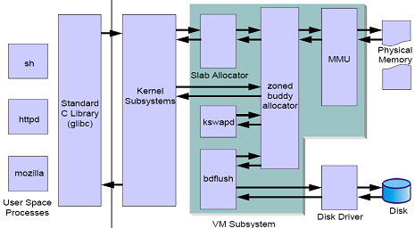
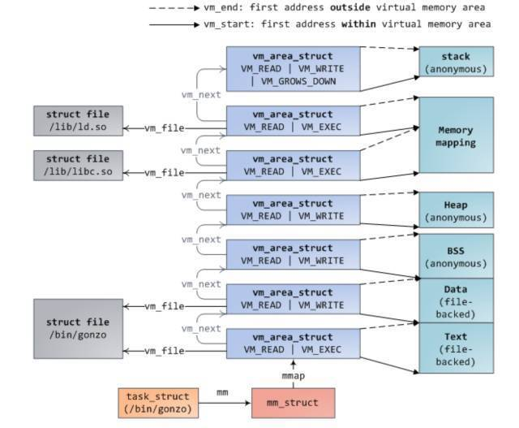

# Memory

[slab vs buddy](https://blog.csdn.net/u014645605/article/details/76617626)

[Linux系统调优2](https://yq.aliyun.com/articles/509658?spm=a2c4e.11153940.0.0.61904289RxXxtO#)

[buddy and slab](http://c.biancheng.net/view/1284.html)

[Linux内存管理之SLAB原理浅析](https://blog.csdn.net/rockrockwu/article/details/79976833)

[slab内存分配器](https://blog.csdn.net/liuhangtiant/article/details/81259293)

[Linux内存分配和回收](http://www.sohu.com/a/312093365_99952211)

[永久关闭swap](https://blog.csdn.net/odailidong/article/details/79656188)

## Linux Memory



- buddy
- slab

### Fragmentation

#### Internal Fragmentation
内部碎片是已经被分配出去(能明确指出属于哪个进程)却不能被利用的空间；内部碎片是处于(操作系统分配的用于装载某一进程的内存)区域内部的存储块。

因为所有的内存分配必须起始于可被4、8、16整除(视处理器体系结构而定)的地址或者因为MMU的分页机制的限制，决定内存分配算法仅能把预定大小的内存块分配给客户。假设当某个客户请求一个43字节的内存块时，因为没有适合大小的内存，所以它可能会获得44字节、48字节等稍大一点的字节，因此由所需大小四舍五入而产生的多余空间叫内部碎片。

#### External Fragmentation
外部碎片指的是还没有被分配出去(不属于任何进程)，但由于太小了无法分配给申请内存空间的新进程的内存空闲区域。外部碎片是处于任何两个已分配区域或页面之间的空闲存储块。这些存储块的总和可以满足当前申请的长度要求，但是由于它们的地址不连续或其他原因，使得当前系统无法满足当前申请。

### Allocator

#### Buddy
Buddy系统是为了解决外部碎片问题，它将内存按照2的幂级(order)大小排成链表队列，存放在free_area数组。

#### Slab
每当我们要分配内存的时候，使用malloc申请大小若干的字节内存，内核也必须经常分配内存。之前描述的buddy系统支持按页分配内存，但这个单位对于内核来说太大了。如果需要为一个10字符的字符串分配空间，分配一个4KB或更多的完整页，不仅仅浪费而且不可接受，所以内核需要将页拆分成更小的单位，以便可以容纳大量的小对象。

- Slab可以对小对象空间进行分配，而不需要分配整个页面给对象，这样可以节省空间
- 内核中对于频繁使用的小对象，slab会对此作缓存，避免了频繁的内存分配和回收，提高了速度

- slab_reclaimable
- slab_unreclaimble

### 进程内存分布



终端进程调用 exec 函数将可执行文件载入内存，此时代码段，数据段，bbs 段，stack 段都通过 mmap 函数映射到内存空间，堆则要根据是否有在堆上申请内存来决定是否映射

### OOM
当内存不足时，系统通过多个因素选择要kill掉的进程，如占用内存、运行时间、进程优先级、是否root用户等。select_bad_process 遍历所有进程，计算 oom_score 分数，选取分数最高的kill掉。

可以通过 /proc/<pid>/oom_adj来干预系统的OOM选择

- OOM_DISABLE (-17)
- OOM_ADJUST_MIN (-16)
- OOM_ADJUST_MAX (15)

**OverCommit_memory**

- 0
    - 默认值，启发式，申请内存不是很大时都通过
- 1
    - 永远允许内存申请
- 2
    - 有限定值

### 内存映射

- 文件映射
    - file-backed cache
- 匿名映射
    - anonymous cache

### 内存回收

#### 手动回收

/proc/sys/vm/drop_caches

- 1
    - free page cache
- 2
    - free dentries and inode
- 3
    - both 1 and 2

#### tmpfs

和sysfs/procfs/ramfs一样，基于内存的文件系统，但tmpfs会使用swap

#### 自动释放

- OOM
- writeback

**Write Back**

- file-backed page
    - dirty写回，非dirty直接收回
- anonymous page
    - swap out

swap 换进换出很占用IO，如果系统内存需求突然迅速增长，那么cpu将被IO占用，系统会卡死，导致不能对外提供服务，因此系统提供了一个参数，用于设置当进行内存回收时，执行回收cache和swap的：

**/proc/sys/vm/swappiness**

`The value in this file controls how aggressively the kernel will swap memory pages. Higher values increase aggressiveness, lower values decrease aggressivenss. The default value is 60.`

值越高，越可能用swap

swappiness参数设定了系统在什么时候使用swap空间

```
# cat /proc/sys/vm/swappiness
60
```

这个60表示物理内存使用率到60%的时候才开始使用swap

- swap=0表示最大限度的使用内存，然后才使用swap
- swap=100表示积极使用swap分区，并把内存上的数据及时地交换到swap上

通常来说：
swap分区的设置是内存的2倍(4G内存)或者比内存稍大(内存大于4G)；
另外，尽量调低swappiness的值，系统的性能越好

## Issues

1. Slab Unreclaim 内存释放
slab unreclaim 内存占据的内存，通常在几百兆，当系统内存不足时，不可释放

2. swap内存释放

现象：free不断变少

3. 关闭swap

swapoff -a

关闭后，carbon-relay-ng的virt和res使用量明显倒个