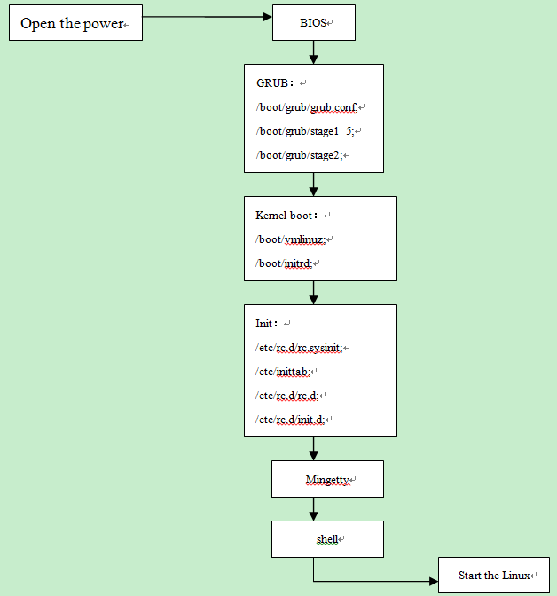

# Init

[SystemV Init](https://blog.csdn.net/yellowblue2/article/details/78745172)

[SysV](https://www.ibm.com/developerworks/cn/linux/1407_liuming_init1/index.html)

[Linux Startup](https://www.cnblogs.com/shishanyu/p/7966975.html)

[Linux启动](https://www.runoob.com/linux/linux-system-boot.html)

[Linux启动流程](https://blog.csdn.net/jiangsgyx/article/details/83883949)

[Systemd Init](https://linux.cn/article-8807-1.html)

## Linux 启动过程

- BIOS自检
- MBR
- Boot Loader
    - grub2
- start_kernel
    - 读取/boot目录下内核文件
    - 运行init程序
- init
    - runlevel in inittab
    - /etc/init.d/rcS，即/etc/init.d/rc S
    - 执行/etc/init${runlevel}.d/下启动脚本

## SystemV Init

