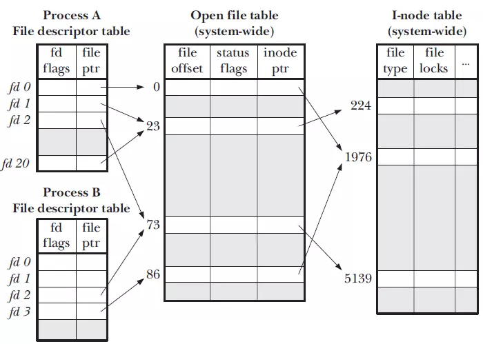
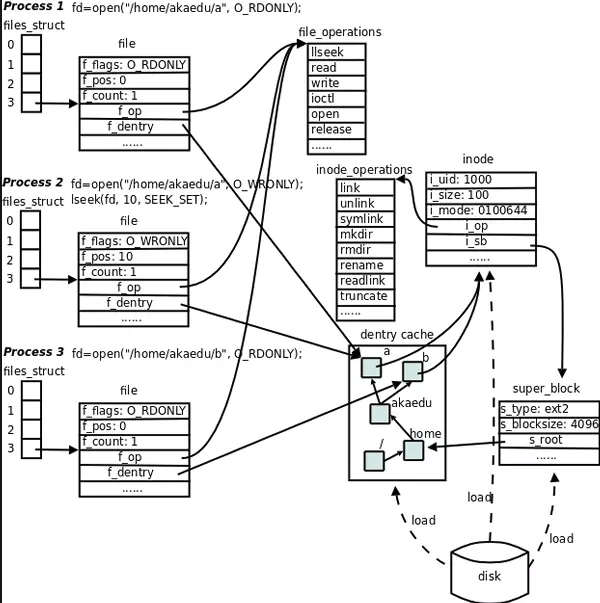
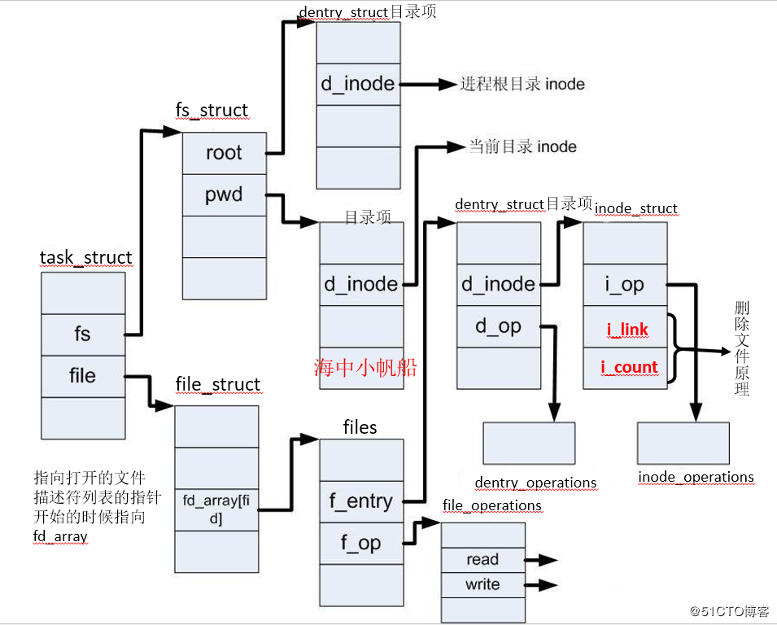

# File Descriptor

[Linux 文件描述符](https://www.jianshu.com/p/cded914786d5)

## Linux文件类型

- 普通文件
- 目录文件
- 块特殊文件
- 字符特殊文件
- FIFO
- 套接字
- 符号链接

## 文件描述符

文件描述符是内核为了高效管理已被打开的文件所创建的索引，是一个非负整数，用于指代被打开的文件，所有执行I/O操作的系统调用都通过文件描述符。

内核维护的3个数据结构：

- 进程级文件描述符(file descriptor table)
- 系统级打开文件表(open file table)
- 文件系统inode表(i-node table)



### 文件描述符表

系统为每个进程维护一份文件描述符表，该表的每一条目都记录了单个文件描述符的相关信息，包括：

- **控制标志 flags**，目前内核只定义了一个，即close-on-exec
- **打开文件描述体指针**

### 打开文件列表

内核对所有**打开的文件**维护一个**系统级别**的打开文件描述表(open file description table)。表中条目称为打开文件描述体(open file description)，存储了与一个打开的文件相关的信息，包括：

- **文件偏移量(current file offset)**，调用read()和write()更新，调用lseek()直接修改
- **访问模式(file status flags)**，由open()调用设置，例如：只读、只写或读写等
- **i-node对象指针(v-node ptr)**，指向一个inode元素，从而关联物理文件

### i-node表

就像进程用pid来描述和定位一样，在linux系统中，文件使用inode号来描述，inode存储了文件的很多元信息

每个文件系统会为存储于其上的所有文件(包括目录)维护一个i-node表，单个i-node包含以下信息：

- **文件类型**
- **文件的字节数**
- **文件拥有者的User ID**
- **文件的Group ID**
- **文件的读、写、执行权限**
- **文件的时间戳**
- **链接数**
- **文件数据block的位置**

i-node存储子磁盘设备上，内核在内存中维护了一个副本。

## 文件描述符限制

文件描述符是系统的一个重要资源，一般**最大打开文件数**会是系统内存的10%，称为系统级限制；为了不让某一个进程消耗掉所有的文件资源，会对单个进程最大打开文件数做默认值处理，称为用户级限制。

## Open




## File Struct

task_struct ----->  file_struct(fd)   -----> find opened file list -----> 被打开文件的信息(dentry)  ----->  文件本身信息(inode)  -----> 磁盘



## 文件描述符fd

文件描述符是linux内核为了高效管理已被打开的文件所创建的索引，所有的IO操作系统调用都是使用文件描述符

每打开一个文件都会创建文件描述符，并将文件指针指向这个文件描述符，文件描述符由非负整数表示，系统默认的3个文件描述符是0，1，2，即标准输入、标准输出和标准错误输出

此时打开一个文件即从3开始，写入到文件描述符表中。每个进程在PCB即进程控制块中都保存着一份文件描述符表。

- 系统级文件描述符限制
    - sysctl -a | grep fs.file-max
    - cat /proc/sys/fs/file-max
- 用户级文件描述符限制
    - ulimit -n ${pid}
    - cat /proc/sys/fs/nr_open

## Linux系统参数调优

### 系统级文件描述符限制

```
# 查看已打开
cat /proc/sys/fs/file-nr

100 0 100000
```

- /proc/sys/fs/file-max
    - vi /etc/sysctl.conf
    - fs.file-max = 100000
    - sysctl -p

### 用户级文件描述符限制

- ulimit -n
    - vi /etc/security/limits.conf