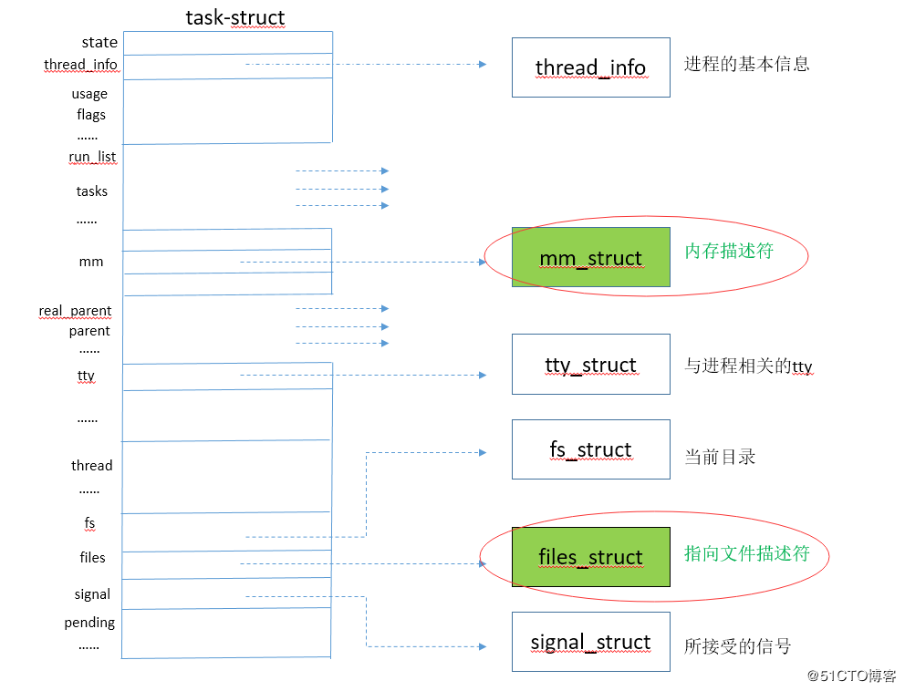

# Process

[Linux之文件描述符](https://blog.51cto.com/12107790/2321256?source=dra)

## 进程描述符



## 进程状态

```
switch (state) {
     case 'R':
       running++;
       break;
     case 'S':
       sleeping++;
       break;
     case 'D':
       blocked++;
       break;
     case 'Z':
       zombies++;
       break;
     case 'T':
       stopped++;
       break;
     case 'W':
       paging++;
       break;
     }
```