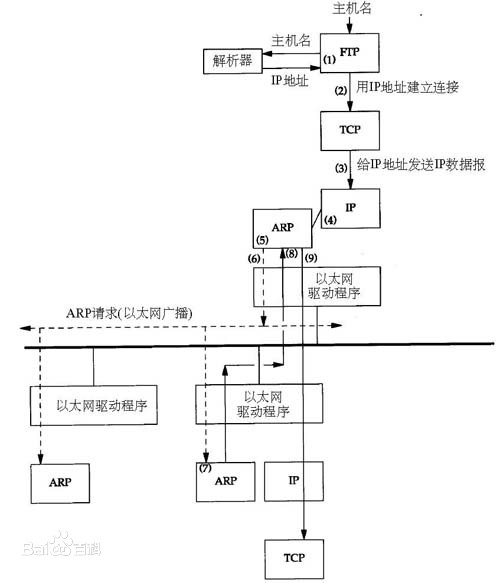

# Network

[Netstat](https://www.cnblogs.com/qianyuliang/p/10542713.html)

[Linux Kernel Network](https://blog.csdn.net/yudelian/article/details/89332638)

[tcp connect timeout](https://www.cnblogs.com/lanyangsh/p/10152734.html)

[tcp timewait](https://yq.aliyun.com/articles/581106)

[tcpdump抓包](https://www.jianshu.com/p/1371809155a2)

[timewait](https://www.cnblogs.com/dadonggg/p/8778318.html)


## ARP

地址解析协议，即ARP(Address Resolution Protocol)，是根据IP地址获取物理地址的一个TCP/IP协议。主机发送消息时将包含目标IP地址的ARP请求广播到局域网络上的所有主机，并接收返回消息，以确定目标的物理地址；收到返回消息后将该IP地址和物理地址存入本机ARP缓存中并保留一定时间，下次请求时直接查询ARP缓存以节约资源。

地址解析协议是建立在网络中各个主机互相信任的基础上的，局域网络上的主机可以自主发送ARP应答消息，其他主机收到应答报文时不会检测该报文的真实性就会将其记入本机ARP缓存；由此攻击者就可以向某一主机发送伪ARP应答报文，使其发送的信息无法到达预期的主机或到达错误的主机，这就构成了ARP欺骗。ARP命令可以用于查询本机ARP缓存中IP地址和MAC地址的对应关系、添加或删除静态对应关系等



为使广播量最小，ARP维护IP地址到MAC地址映射的缓存以便将来使用。ARP缓存包含动态和静态项目。动态项目随时间推移自动添加和删除。每个动态ARP缓存项的潜在生命周期是10分钟。新加到缓存中的项目带有时间戳，如果某个项目添加后两分钟内没有再使用，则此项目过期并从ARP缓存中删除；如果某个项目已在使用，则又收到2分钟的生命周期；如果某个项目始终在使用，则会另外收到2分钟的生命周期，一直到10分钟的最长生命周期。静态项目一直保存在缓存中，直到重新启动计算机。

## TCP

### Tcpdump

tcpdump -iany tcp port [port]

### Tcp 连接超时问题

近期出现容器部署服务中断的问题，具体表现为对远程机器执行restful请求时，概率性出现连接超时的问题。观察log可以发现tcp的连接超时时间在3s。代码中设置的tcp的连接超时为30s，不符合预期，然后检查内核参数发现，tcp连接相关的参数分别为：

```
net.ipv4.tcp_syn_retries = 1
net.ipv4.tcp_synack_retries = 3
net.ipv4.tcp_syncookies = 1
```

其中，tcp_syn_retries设置为1，代表tcp连接重连时，syn包的重发的次数为1，对应的总超时时间为3s

主机从发出数据包到第一次TCP重传开始，这段时间被称为retransmission timeout，即RTO。

### TIME_WAIT

