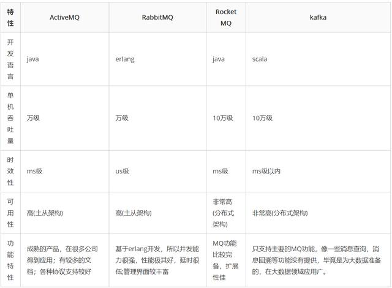

# MQ

[mq](https://zhuanlan.zhihu.com/p/60288391)

[从0到1设计消息队列](https://zhuanlan.zhihu.com/p/60288173)

[MQ 消息队列的12点核心原理总结](https://zhuanlan.zhihu.com/p/60289322)

## 使用场景

- 解耦
- 最终一致性
- 广播
- 削峰、流控

## Kafka、RocketMQ、RabbitMQ 比较

### Kafka

大数据领域
- 性能卓越，单机写入 TPS 约百万，吞吐量高
- ms 级时效性
- 可用性高，kafka 分布式，多副本，少数机器宕机不会丢数据且不会导致不可用
- 消费者采用 pull 方式获取消息，消息有序，通过控制能够保证所有消息被消费且仅被消费一次
- 第三方管理界面 kafka-manager
- 日志领域比较成熟
- 支持简单的 MQ 功能，在大数据领域的实时计算以及日志采集被大规模使用

- kafka 单机超过 64 个队列/分区，Load 会随队列数量而变高，发送消息的响应时间会变长
- 使用短轮询方式，实时性取决于轮训间隔时间
- 消费失败不支持重试
- 支持消息顺序，但是一台代理宕机后，就会产生消息乱序
- 社区更新较慢

### RabbitMQ

基于 AMQP

- 使用 erlang，性能较好，高并发
- 吞吐量万级别，MQ 功能比较完备
- 健壮、稳定、易用、跨平台、支持多语言
- 社区活跃度高

- erlang 开发难度高，不利于二次开发
- 吞吐量低一些，与实现机制相关
- 接口和协议复杂，维护成本高

### RocketMQ

设计参考 kafka

- 单机吞吐量高
- 可用性高
- 消息可靠性高
- MQ功能完善
- 支持 10亿级别消息堆积

- 客户端支持语言不多
- 社区活跃度低

## 消息队列设计

- 生产者
- 消费者
- Broker 消息队列服务端

### Broker 设计

- 消息的转储，在更合适的时间点投递，或者通过一系列手段辅助消息最终能送达消费机
- 规范一种范式和通用的模式，以满足解耦、最终一致性、错峰等需求
- 消息转发器，发送者把消息投递到 broker，broker 将消息转发到接收端

#### 通信协议

消息 Message：即消息的载体，消息发送者需要知道如何改造消息，消息接受者需要知道如何解析消息，他们需要按照一种统一的格式描述消息，这种统一的格式称之为消息协议。

传统的通信协议标准有 XMPP 和 AMQP 协议等，现在更多的消息队列容性能的角度出发使用自己设计实现的通信协议。

##### JMS

JMS(Java MessageService) 实际上是指 JMS API。JMS 是由 Sun 公司早期提出的消息标准，旨在为 Java 应用提供统一的消息操作，包括创建消息、发送消息、接收消息等。

JMS 提供了两种消息模型
- 点对点
- pub-sub 模型

当采用点对点模型时，消息将发送到一个队列，该队列的消息只能被一个消费者消费。

采用发布订阅模型时，消费可以被多个消费者消费。

在发布订阅模型中，生产者和消费者完全独立，不需要感知对方的存在

##### AMQP

AMQP 是 Advanced Message Queuing Protocol，即高级消息队列协议

AMQP 不是一个具体的消息队列实现，而是一个标准化的消息中间件协议。

目标是让不同语言，不同系统的应用互相通信，并提供一个简单统一的模型和编程接口。

AMQP 是一种协议，更准确的说是一种 binary wire-level protocol。 这是其和 JMS的本质差别，AMQP 不从 API层进行限定，而是直接定义网络交换的数据格式。

##### JMS vs AMQP vs kafka

JMS 只允许基于 JAVA 实现的消息平台的之间进行通信

AMQP 允许多种技术同时进行协议通信

Kafka 的 Producer、Broker 和 Consumer 之间采用的是一套自行设计的基于 TCP 层的协议

#### 存储类型

- 内存
- 本地文件系统
- 分布式文件系统
- nosql
- DB

内存存储适合允许消息丢失，消息堆积能力要求不高的场景（例如日志）

DB 是最简单的实现可靠存储的方案，适合可靠性要求很高，最终一致性的场景(例如交易消息)，对于不需要 100% 保证数据完整性的场景，要求性能和消息堆积的场景，hbase 也是一个很好的选择。

理论上，从速度来看，文件系统 > 分布式存储 > 数据库，而可靠性却截然相反

需要从支持的业务场景触发做出合理的选择，如果消息队列是用来支持支付/交易等对可靠性要求非常高，但对性能要求没那么高，而且没有时间精力专门做文件存储系统的研究，DB 是最好的选择。

对于不需要 100% 保证数据完整性的场景，要求性能和消息堆积的场景，hbase 也是一个很好的选择，典型的比如 kafka 的消息落地可以使用 hadoop

#### 消费关系处理

当消息队列初步具备转储消息的能力，下一个重要的事情就是解析发送接收关系，进行正确的消息投递。

市面上的消息队列定义了一堆让人晕头转向的名词，如 JMS 规范中的 Topic/Queue，kafka 里面的 Topic/Partition/ConsumerGroup，RabbitMQ 里面的 Exchange 等等。

抛开现象看本质，无外乎是单播和广播的区别。

为了实现广播功能，我们必须维护消费关系，通常消息队列本身不维护消费订阅关系，可以利用 zookeeper 等成熟的系统维护消费关系，在消费关系发生变化时下发通知。

#### 消息队列需要支持高级特性

- 消息的顺序
- 投递可靠性保证
- 消息持久化
- 支持不同消息类型
- 多实例集群功能
- 事务特性等

### MQ 消息队列的 12 点核心原理总结

- 消息生产者、消费者、队列
- Broker 设计
- 点对点消息队列模型
- 发布订阅消息模型 Topic
- 消息顺序性的保证
- 消息的 ACK 机制
- 最终一致性的设计思路
- 消息的事务支持
- 消息的持久化
    - 启用消息持久化后，消息队列宕机重启后，消息可以从持久化存储恢复，消息不丢失，可以继续消费处理
- 消息队列的高可用性
    - RabbitMQ 镜像集群模式
    - ActiveMQ LevelDB + zookeeper方式
    - Kafka Replication 机制
- 选型和应用场景

#### 最终一致性的设计思路

本地事务维护业务变化和通知消息，一起落地，然后 RPC 到达 broker，在 broker 成功落地后，RPC 返回成功，本地消息可以删除。否则本地消息一直靠定时任务轮询不断重发，这样就保证了消息可靠落地的 broker。

broker 往 consumer 发送消息的过程类似，一直发送消息，直到 consumer 发送消费成功确认。

我们先不理会重复消息的问题，通过两次消息落地加补偿，下游是一定可以收到消息的。然后依赖状态机版本号等方式做判重，更新自己的业务，就实现了最终一致性。

如果出现消费方式处理过慢消费不过来，要允许消费方主动 ack error，并可以与 broker 约定下次投递的时间。

对于 broker 投递到 consumer 的消息，由于不确定丢失是在业务处理过程中还是消息发送丢失的情况下，有必要记录下投递的 IP 地址。决定重发之前询问这个IP，消息处理成功了吗？如果询问无果，再重发。

事务：本地事务，本地落地，补偿发送。本地事务做的，是业务落地和消费落地的事务，而不是业务落地和 RPC 成功的事务。消息只要成功落地，很大程度上就没有丢失的风险。