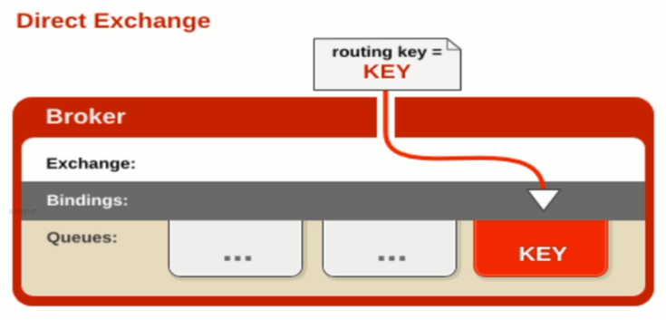
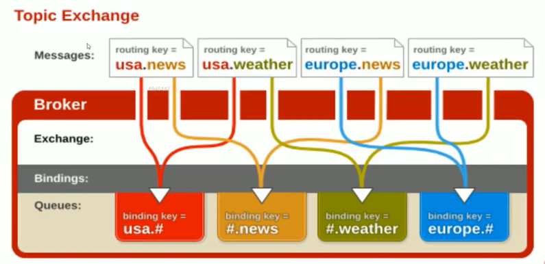
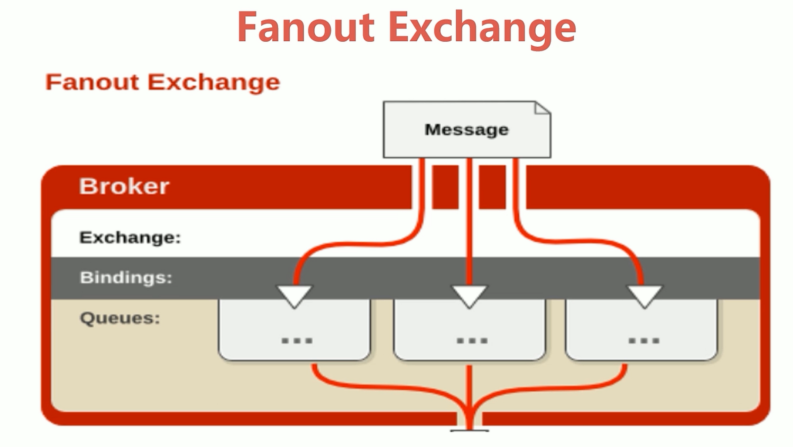

# RabbitMQ

[rabbit](https://www.cnblogs.com/sgh1023/p/11217017.html)

## 场景

- 异步处理
- 流量削峰
- 日志处理
- 应用解耦

## AMQP 和 RabbitMQ

AMQP 协议是具有现代特征的二进制协议，是一个提供统一消息服务的应用层标准高级消息队列协议，是应用层协议的一个开发标准，为面向消息的中间件设计。

AMQP
- Server 接收客户端的连接，实现 AMQP 实体服务
- Connection 连接：应用程序与 Server 的网络连接，TCP 连接
- Channel 信道：消息读写等操作在信道中进行。客户端可以建立多个信道，每个信道代表一个会话任务。
- Message 消息：应用程序和服务器之间传送的数据，消息可以非常简单，也可以很复杂；由 Properties 和 Body 组成。
- Virtual Host 虚拟主机：用于逻辑隔离。一个虚拟主机里面可以有若干个 Exchange 和 Queue，同一个虚拟主机里面不能有相同名称的 Exchange 和 Queue。
- Exchange 交换器：接收消息，按照路由规则将消息路由到一个或者多个队列。如果路由不到，或者返回给生产者，或者直接丢弃。 RabbitMQ 常用的交换器类型有 direct、topic、fanout、headers 四种。
- Binding 绑定：交换器和消息队列之间的虚拟连接，绑定中可以包含一个或者多个 RoutingKey。
- RoutingKey 路由键：生产者将消息发送给交换器的时候，会发送一个 RoutingKey，用来指定路由规则，这样交换器就知道把消息发送到哪个队列。路由键通常为一个 “.” 分割的字符串，例如"com.rabbitmq"
- Queue 消息队列：用来保存消息，供消费者消费

RabbitMQ 采用 TCP 连接复用的方式，不仅可以减少性能开销，同时也便于管理。

### AMQP 

AMQP 协议模型有三部分组成：生产者、消费者和服务端

生产者是投递消息的一方，首先连接到 Server，建立一个连接，开启一个信道；然后生产者声明交换器和队列，设置相关属性，并通过路由键将交换器和队列进行绑定。同理，消费者也需要建立连接，开启信道等操作，便于接收消息。

接着生产者就可以发送消息，发送到服务端的虚拟主机，虚拟主机中的交换器根据路由键选择路由规则，然后发送到不同的消息队列中，这样订阅了消息队列的消费者就可以获取到消息，进行消费。

最后还要关闭信道和连接。

### RabbitMQ

### 常用交换器

#### Direct Exchange

该类型的交换器将所有发送到该交换器的消息被转发到 RoutingKey 指定的队列中，也就是说路由到 BindingKey 和 RoutingKey 完全匹配的队列中

#### Topic Exchange

该类型的交换器将所有发送到 Topic Exchange 的消息被转发到所有 RoutingKey 中指定的 Topic 的队列上面。

Exchange 将 RoutingKey 和某 Topic 进行模糊匹配，其中 “” 用来匹配一个词，“#” 用于匹配一个或者多个词。例如 “com.#" 能匹配到 ”com.rabbitmq.oa“ 和 "com.rabbitmq"；而 "login." 只能匹配到 ”com.rabbitmq“

#### Fanout Exchange

该类型不处理路由键，会把所有发送到交换器的消息路由到所有绑定的队列中。优点是转发消息最快，性能最好。

#### Headers Exchange

该类型的交换器不依赖路由规则来路由消息，而是根据消息内容中的 headers 属性进行匹配。headers 类型交换器性能差，在实际中并不常用。