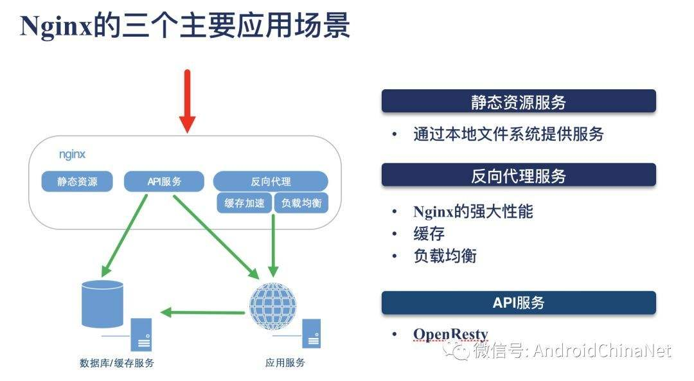
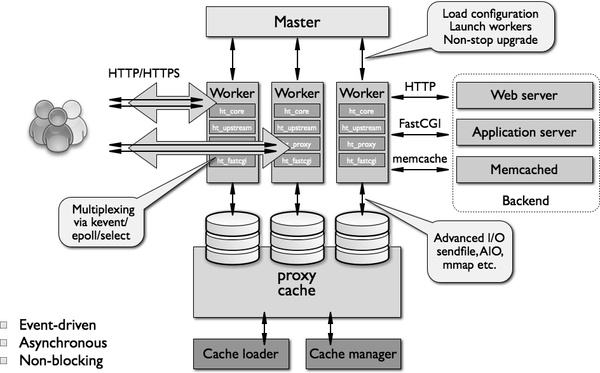
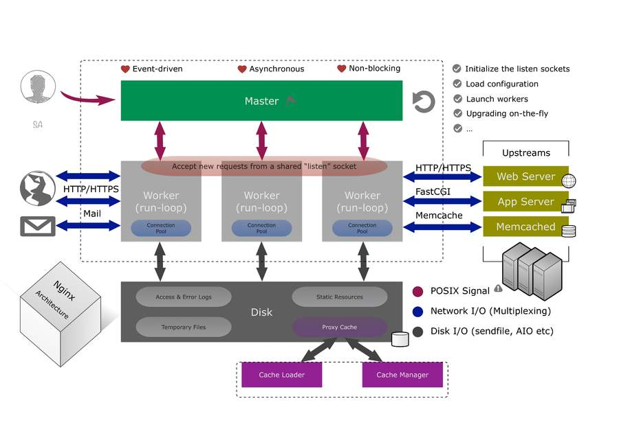
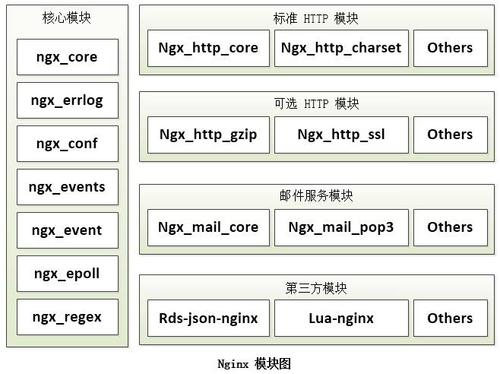
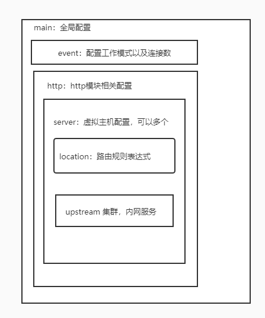
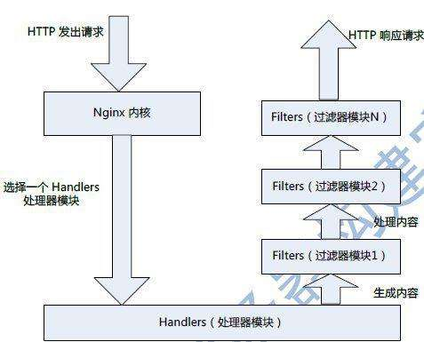
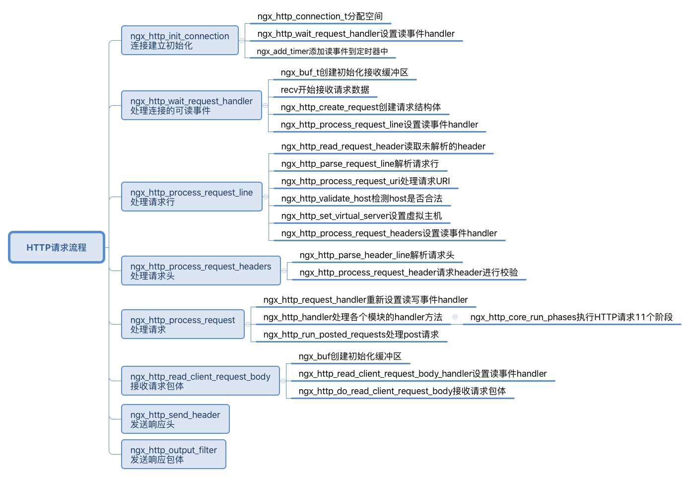
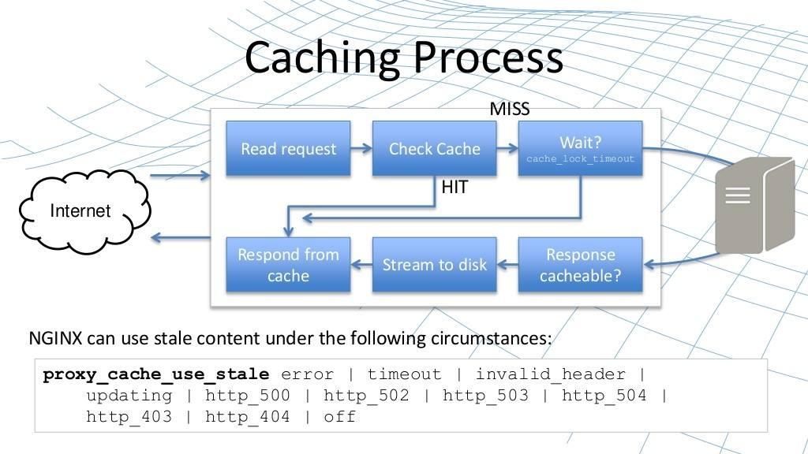
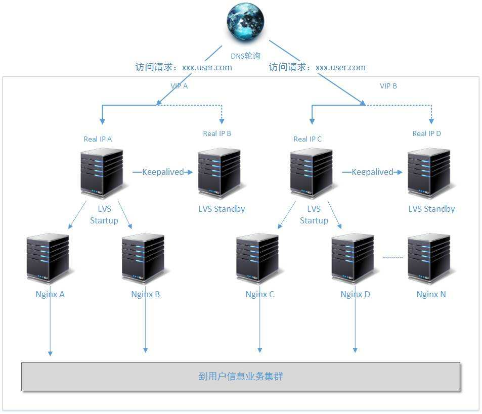

# Nginx

[高并发架构一般思路](https://www.cnblogs.com/gdsblog/p/7128497.html)

[nginx参考](http://tengine.taobao.org/book/chapter_02.html)

[nginx 1](https://blog.csdn.net/qq_29677867/article/details/90112120)

[nginx phase](https://www.centos.bz/2018/12/nginx%E8%AF%B7%E6%B1%82%E5%A4%84%E7%90%86%E6%B5%81%E7%A8%8B%E4%BD%A0%E4%BA%86%E8%A7%A3%E5%90%97%EF%BC%9F/)

[nginx一般介绍](https://www.centos.bz/2017/11/openresty%E6%9C%80%E4%BD%B3%E6%A1%88%E4%BE%8B-%E7%AC%AC1%E7%AF%87%EF%BC%9Anginx%E4%BB%8B%E7%BB%8D/)


## Nginx 应用


## Nginx 安装

### Download

```
wget -c https://nginx.org/download/nginx-1.16.1.tar.gz

# see http://nginx.org/en/docs/configure.html
./configure

make clean & make & make install
```

## Nginx 架构

### Nginx 进程模型
- 前台单进程
- 后台多进程
  - 单Master进程
  - 多Worker进程

### 多worker进程模型
<image src="nginx.svg"></image>





### 配置

#### location

语法规则

> location [=|~|~*|^~] /uri/ { … }

|模式|含义|
|:-:|:-:|
|location = /uri|=表示精确匹配，只有完全匹配上了才能生效|
|location ^~ /uri|^~ 开头对URL路径进行前缀匹配，并且优先级在正则之前|
|location ~ pattern|正则匹配，不区分大小写|
|location ~* pattern|正则匹配，区分大小写|
|location /uri|前缀匹配，优先级在正则之后|
|location /|通用匹配，前面的未匹配|

rewrite语法

- last – 基本上都用这个 Flag
- break - 中止 Rewirte，不再继续匹配
- redirect - 返回临时重定向的 HTTP 状态 302
- permanent – 返回永久重定向的 HTTP 状态 301

## Nginx模块化和handle



### nginx_conf 模块

Nginx 的配置文件是以block的形式组织的，一个block通常使用大括号"{}"表示。block分为几个层级，整个配置文件为main层级；main下层有event，http等层级，而http中会有server block；server block中可以包含location block。



- main 全局设置
- server 主机设置
- upstream 负载均衡，后端服务器
- location url匹配位置

location --> server --> main

#### main

- user
- worker processors
- error_log
- pid
- worker_rlimit_nofile
- event module
- http module
- server module
- location module

### nginx_http 模块

Nginx本身做的实际工作很少，当它接收到一个http请求后，它仅仅是通过查找配置文件将此次请求映射到一个location block，而此location中所配置的各个指令则会启动不同的模块去完成工作，因此模块可以看做Nginx真正的劳动工作者。通常一个location中的指令会涉及一个handler和多个filter模块。handler模块负责处理请求，完成响应内容的生成，而filter模块对响应内容进行处理。





#### 模块开发

1. 定义模块配置结构

需要一个结构用于存储从配置文件中读取相关参数，即模块配置信息结构。根据nginx模块开发规则，结构体命名规则为ngx_http_[module name]_[main|srv|loc]_t。其中main、srv和loc分别用于表示同一模块在三层block中的配置信息。

## Caching Process



## Nginx HA

