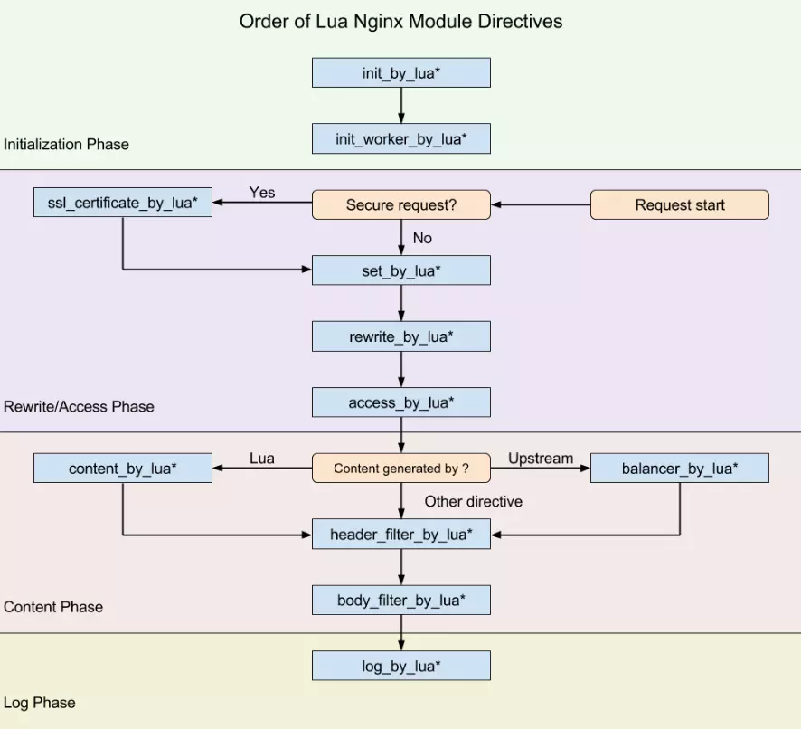

# OpenResty

[nginx](https://www.centos.bz/2017/11/openresty%E6%9C%80%E4%BD%B3%E6%A1%88%E4%BE%8B-%E7%AC%AC1%E7%AF%87%EF%BC%9Anginx%E4%BB%8B%E7%BB%8D/)

[openresty tutorials](https://openresty.org/download/agentzh-nginx-tutorials-zhcn.html)

[lua](https://www.centos.bz/2017/11/openresty%E6%9C%80%E4%BD%B3%E6%A1%88%E4%BE%8B-%E7%AC%AC2%E7%AF%87%EF%BC%9Alua%E5%85%A5%E9%97%A8/)

[openresty 现状和趋势](https://www.cnblogs.com/duanxz/p/10396160.html)

[nginx_lua](https://github.com/openresty/lua-nginx-module)

[lua_phase](https://www.jianshu.com/p/cb1f67c4a97c)

## nginx_lua

ngx_lua 是将Lua嵌入Nginx，让nginx执行Luau脚本，并且高并发、非阻塞的处理各种请求。Lua内建协程，可以很好的将异步回调换成顺序调用的形式。ngx_lua在lua中进行的IO操作都会委托给Nginx的事件模型，从而实现非阻塞调用。开发者可以采用串行的方式编写程序，nginx_lua会自动的在进行阻塞的IO操作中中断，保存上下文，然后将IO操作委托给Nginx事件处理机制，在IO操作完成后，ngx_lua会恢复上下文，程序继续执行，这些操作对用户程序都是透明的。

每个Nginx的worker进程持有一个Lua解释器或LuaJIT实例，被这个worker处理的所有请求共享这个实例。每个请求的context上下文会被Lua轻量级协成分隔，从而保证各个请求是独立的。

## Flow Chat

